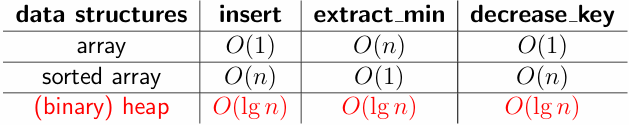
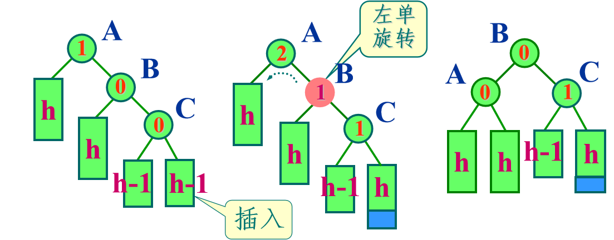
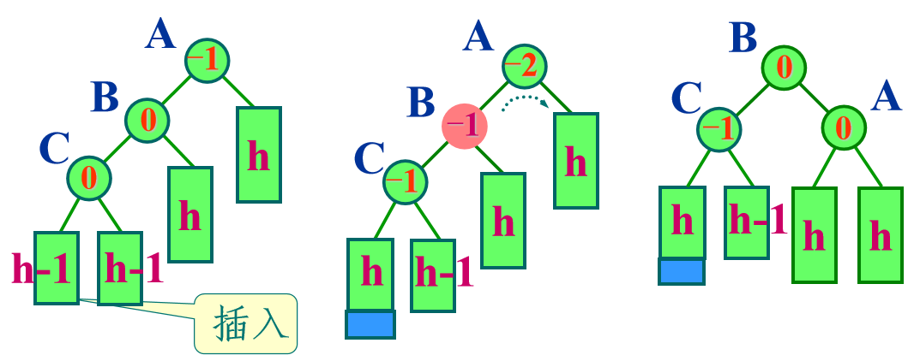
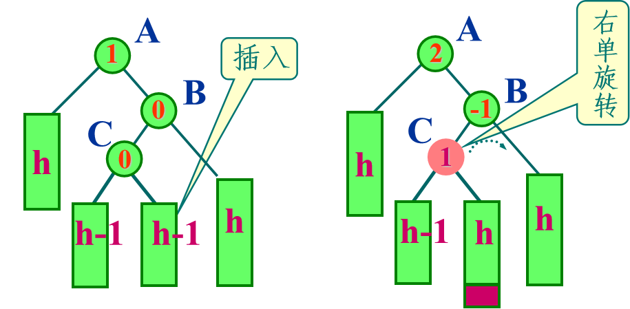

# Ch3. Data Structures

## Priority Queue && Heap

优先队列始终保证队列顶端的元素是权值最低的（使用元素的附带属性 `key_value` 显式指定权值，或者把元素本身的某个数值特征作为权值）

优先队列包含三种基础操作：插入，取走顶端元素，降低元素的权值



使用二叉堆是平均效率最高的

我们定义堆是一个树状结构，（小根堆）满足：

- 子节点的值一定不小于父结点的值

如果采用 1-index，用数组进行模拟，则对于节点 $i$：

- 父节点的位于 $\lfloor i/2 \rfloor$
- 左右子节点分别位于 $2i,2i+1$

### insert

先将元素插入末端，然后**向上**调整堆，使得堆性质依旧成立

```pascal title="insert"
heapify-up(i): 
    while i > 1 do
        j <- ⌊ i/2 ⌋
        if key[A[i]] < key[A[j]] then
            swap A[i] and A[j]
            i <- j
        else break
        
insert(v, key_value):
    s <- s + 1
    A[s] <- v
    key[v] <- key_value
    heapify-up(s)
```

### decrease_key

修改堆上指定的元素，然后**向上**调整堆，使得堆性质依旧成立

```pascal title="decrease_key"
decrease_key(v, key_value): 
    key[v] <- key_value
    heapify-up(p[v])
```

### extract_min

取出堆上第一个元素，然后**向下**调整堆，使得堆性质依旧成立

```pascal title="extract_min"
heapify-down(i): 
    while 2i <= s do
        if 2i = s or key[A[2i]] <= key[A[2i + 1]] then
            j <- 2i
        else
            j <- 2i + 1
        if key[A[j]] < key[A[i]] then
            swap A[i] and A[j]
            p[A[i]] <- i, p[A[j]] <- j
            i <- j
        else break
            
extract_min():
    ret <- A[1]
    A[1] <- A[s]               // 将最底端的元素临时放到堆顶
    s <- s − 1
    if s >= 1 then
        heapify_down(1)        // 如果不是孤立节点，则向下调整堆
     return ret
```

## Self-Balancing Binary-Search

如果一棵二叉树满足：左子节点 <= 父节点 <= 右子节点，则它是二叉搜索树

插入时，自顶向下寻找插入点

```pascal title="insert"
insert(v, u):                                // v 初始为 root
    if u.key < v.key then
        if v.left = nil then
            v.left <- u
        else
            insert(v.left, key)
    else
        if v.right = nil then
            v.right <- u
        else
            insert(v.right, key)
```

删除时，需要找到被删除节点的直接前驱节点（或者后继节点）代替原本的删除位置

```pascal title="delete"
delete(v):
    // 无左子节点，则右子节点直接替代
    if v.left = nil then
        remove v, return v.right
    else
        u <- v.left
        // 左子节点没有右子节点
        // 那么左子节点就是前驱节点，其右子节点指针指向 v 的右子节点指针实现替代
        if u.right = nil then
            u.right <- v.right, remove v, return u
        else
            // 否则需要一直找到直接前驱
            w <- u.right
            while w.right != nil do
                u <- w, w <- w.right
                
            u.right <- w.left, v.key <- w.key, remove w, return v
```

如果要进行排名查询，则需要借助 size 记录子树大小，然后进行搜索计算

```pascal title="rank"
// 查询元素的排名
rank(v, key):
    if v = nil then return 0                           // 空节点定义 size = 0
    if key < v.key then
        return rank(v.left, key)
    else
        return v.left.size + 1 + rank(v.right, key)    // 左子树和根节点排名都在它前面
        
// 查询对应排名的元素
selection(v, i)
    if i <= v.left.size then
        return selection(v.left,i)
    else if i = v.left.size + 1 then
        return v.key
    else
        return selection(v.right, i − (v.left.size + 1))
```

### AVL-Tree

一种自平衡二叉树，每个节点维护一个变量，记录其左右子树的大小差值，并且要确保差值绝对值不超过 1，否则需要进行平衡调整

AVL 一旦遇到不平衡就会进行调整，失衡的情况总共可以概括为四种，分为两类。我们假定 $A$ 为自底向上回溯的路径中第一个失衡的节点，路径向下分别为节点 $B$ $C$：

- 这三个节点在一条直线上

对 $A,B$ 进行单次的左旋 && 右旋操作即可，如何操作在之前已经说明，平衡因子的更新也比较简单

> 1- RR 情况



```c++
treeNode* rotateRR(treeNode* A) {
    treeNode* B = A->rightChild;
    A->rightChild = B->leftChild;
    B->leftChild = A;

    // 平衡因子更新
    if (B->bf == 0) {        // 这个情形会在删除操作中出现
        A->bf = 1;
        B->bf = -1;
    } else {                // 对于插入操作和大多数删除场景都是 B->bf == 1
        A->bf = 0;
        B->bf = 0;
    }
    // size 更新
    updateSize(A);
    updateSize(B);
    return B;
}
```

> 2- LL 情况



```c++
treeNode* rotateLL(treeNode* A) {
    treeNode* B = A->leftChild;
    A->leftChild = B->rightChild;
    B->rightChild = A;

    // 平衡因子更新
    if (B->bf == 0) {        // 这个情形会在之后提到的删除操作中出现
        A->bf = -1;
        B->bf = 1;
    } else {                 // 对于插入操作和大多数删除场景都是 B->bf == -1
        A->bf = 0;
        B->bf = 0;
    }

    // size 更新
    updateSize(A);
    updateSize(B);
    return B;
}
```

- 这三个节点不在一条直线上（折线）

也分两种情况：

> 3- LR 情况

此时需要操作三个节点 $A,B,C$，需要先对下层两个顶点进行一次左旋操作回到上一类状态，然后对上层两个顶点进行右旋操作

注意平衡因子的更新情况取决于 $C$ 的旧 bf 值，而不能像上一种情况一样直接设为 0


```c++
treeNode* rotateLR(treeNode* A) {
    treeNode* B = A->leftChild;
    treeNode* C = B->rightChild;

    // 左旋 B-C
    B->rightChild = C->leftChild;
    C->leftChild = B;

    // 右旋 A-C
    A->leftChild = C->rightChild;
    C->rightChild = A;

    // 根据新节点的插入情况更新平衡因子
    if (C->bf == 0) {
        // C 是插入的新节点
        A->bf = 0;
        B->bf = 0;
    } else if (C->bf == 1) {
        // 新节点插入在 C 的右子树
        A->bf = 0;
        B->bf = -1;
    } else {
        // 新节点插入在 C 的左子树
        A->bf = 1;
        B->bf = 0;
    }
    C->bf = 0;
    
    // 根节点 C 最后更新 size
    updateSize(A);
    updateSize(B);
    updateSize(C);
    
    return C;  // C 成为新的根
}
```

> 4- RL 情况

需要先对下层两个顶点进行一次右旋操作回到上一类状态，然后对上层两个顶点进行左旋操作

注意平衡因子的更新情况取决于 $C$ 的旧 bf 值




```c++
treeNode* rotateRL(treeNode* A) {
    treeNode* B = A->rightChild;
    treeNode* C = B->leftChild;

    B->leftChild = C->rightChild;
    C->rightChild = B;

    A->rightChild = C->leftChild;
    C->leftChild = A;

    if (C->bf == 0) {
        A->bf = 0;
        B->bf = 0;
    } else if (C->bf == 1) {
        A->bf = -1;
        B->bf = 0;
    } else {
        A->bf = 0;
        B->bf = 1;
    }
    C->bf = 0;
    
    // 根节点 C 最后更新 size
    updateSize(A);
    updateSize(B);
    updateSize(C);
    return C;
}
```

## Union-Find

一种底层采用树形数据结构，但是实质上为集合的数据结构，支持两种操作：

- `check(u, v)` 判断两个元素是否处于同一集合
- `merge(u, v)` 将两个元素所在集合合并为同一集合

在数据结构层面，我们实际进行的操作是：

- `root(v)` 查询 `v` 的根节点（`check(u, v)` 相当于 `root(u) == root(v)`）
- `merge(u, v)` 将两个元素所在树的根节点进行连接

我们只需要一个数组 `par[]` 记录每个元素的祖先节点：

首先是查询：

```pascal title="root"
root(v):
    if par[v] = nil then
        return v
    else
        // Path Compression
        par[v] <- root(par[v])        // 我们将沿路上的祖先节点的根节点也一并更新
    return par[v]
```

然后是合并：将 `u` 节点的根节点连接到 `v` 节点的根节点

```pascal title="merge"
merge(u, v):
    par[root(u)] <- root(v)
```

为了防止树不平衡，我们不会指定谁是新的根节点，而是借助树的大小 / 秩等进行启发式合并

以按大小合并为例：

我们需要额外记录一个 `size` 信息：每棵树的节点个数 / 集合的大小

```pascal title="merge"
merge(u, v):
    x <- root(u), y <- root(v)
    if x = y then
        return                                // 防止 size 倍增
    if size[x] < size[y] then
        par[x] = y, size[y] += size[x]        // 较大的子树 y 作为根节点
                                              // size[y] 相应增大
    else
        par[y] = x, size[x] += size[y]
```

当路径压缩 + 按大小 / 秩合并同时使用时，并查集的操作的时间复杂度为 $O(\alpha(n))$；否则，如果只使用最多一种，时间复杂度为 $O(\log n)$；完全不优化时间复杂度为 $O(n)$
