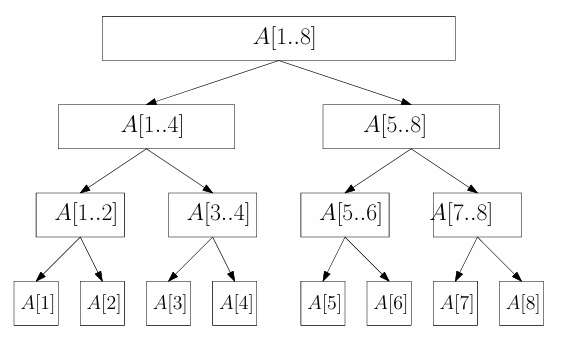
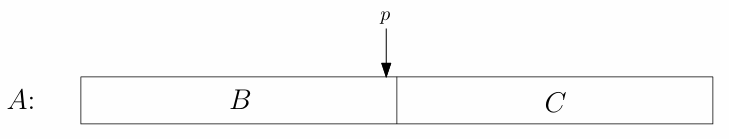
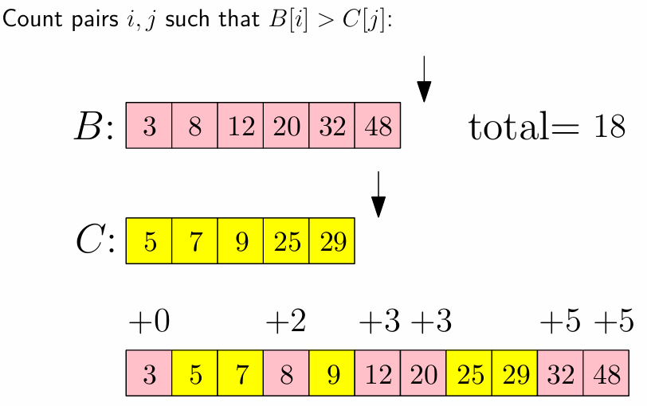
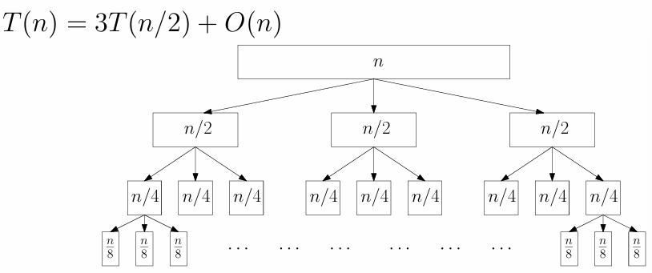
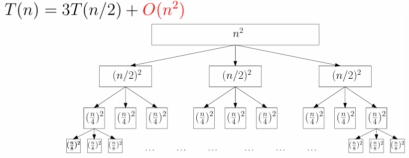
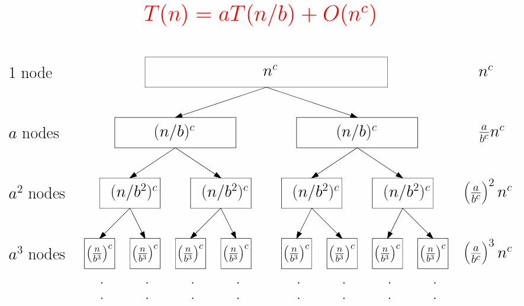
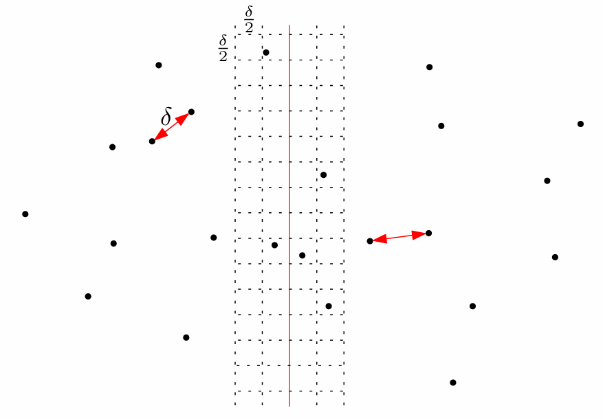
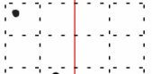

# Ch4. Divide-and-Conquer

分治算法即：将问题先递归分解为多个更小的实例（Divide），分别解决后（Conquer）重新合并（Combine）

## Merge Sort

不断二分数组直到只剩一个元素（此时可以以 $O(1)$ 复杂度完成排序）

向上合并子有序数组时可以用双指针法在 $O(n)$ 时间内完成



```pascal title="mergesort"
merge-sort(A, n):
    if n = 1 then
        return A
    else
        B <- merge-sort(A[1..⌊n/2⌋], ⌊n/2⌋)           // 分治 T(n/2)
        C <- merge-sort(A[⌊n/2⌋+1..n], ⌈n/2⌉)         // 分治 T(n/2)
        return merge(B, C, ⌊n/2⌋, ⌈n/2⌉)              // 双指针合并 O(n)
```

考虑排序 $n$ 个数字的时间复杂度为 $T(n)$，则：

$$
T(n) = 2T(n/2) + O(n) = O(n\log n)
$$

## Inversion

数组 $A$ 中，如果 $i<j$ 而 $A[i] > A[j]$，则记 $(i,j)$ 为逆序对

一个 $O(n^{2})$ 的方案是

```pascal title="count-inversions"
count-inversions(A, n):
    c <- 0
    for every i <- 1 to n−1 do
        for every j <- i+1 to n do
            if A[i] > A[j] then c <- c + 1
    return c
```

同样的，我们可以分治解决问题。注意到对数组排序的过程就是消除逆序对的过程，而在归并排序的过程中，逆序对的消除只出现在 merge 操作，即对两个有序数组进行有序合并



如果我们需要将 B 中的元素插入 C 中，那么这个元素左侧所有的 C 中的元素，都与它构成逆序对，比如：



因此我们可以改造归并排序的过程：

```pascal title="merge-and-count"
merge-and-count(B, C, n1, n2):
    count <- 0;
    A <- array of size n1 + n2; i <- 1; j <- 1
    while i <= n1 or j <= n2 do
        if j > n2 or (i <= n1 and B[i] <= C[j]) then
            A[i + j −1] <- B[i]; i <- i + 1
            count <- count + (j −1)
        else
            A[i + j −1] <- C[j]; j <- j + 1
    return (A,count)
```

同样的：

$$
T(n) = 2T(n/2) + O(n) = O(n\log n)
$$

## Solving Recurrences

考虑两种方法：递归树分析法与主定理法

### Recursion-Tree Method

我们考虑下面的递归树





总的运行时间可以理解为：

$$
\text{Total} = \sum_{i=0}^{\text{Index of last level}} \text{Running time at level }i
$$

对于 $T(n) = 3T(n/2) + O(n)$，我们有

$$
\text{Total} = \sum_{i=0}^{\log_{2} n} (\dfrac{3}{2})^{i} n = O(n^{\log_2 3})
$$

注意到等比数列的比值大于 1，实际上是最底层的时间复杂度占支配地位

对于 $T(n) = 3T(n/2) + O(n^{2})$，我们有

$$
\text{Total} = \sum_{i=0}^{\log_{2} n} (\dfrac{3}{4})^{i} n^{2} = O(n^2)
$$

注意到等比数列的比值小于 1，实际上是最顶层的时间复杂度占支配地位

对于 $T(n) = 2T(n/2) + O(n)$，我们有

$$
\text{Total} = \sum_{i=0}^{\log_{2} n}  n = O(n \log n)
$$

相当于等比数列的比值等于 1，实际上是每一层的时间复杂度占同等支配地位

### Master Theorem

我们可以对递归树的计算规律进行总结：



当 $c < \log_b a$ 时，最底层的时间复杂度占支配地位，时间复杂度 $O(n^{\log_b a})$

当 $c = \log_b a$ 时，每一层的时间复杂度占同等支配地位，时间复杂度 $O(n^{c}\log n)$

当 $c > \log_b a$ 时，最顶层的时间复杂度占支配地位，时间复杂度 $O(n^{c})$

这就是主定理的内容

## Quick Sort

快速排序也是一种分治算法，其分治策略为：选择一个 pivot（基准元素），将数组分为小于 pivot 和大于 pivot 的两部分，递归排序

相比归并排序，快速排序在“分”操作进行处理，归并排序在“并”操作进行处理

这里给出一种常见的原地分区算法，如果不考虑空间复杂度，单开一个数组是更方便的

```c
int partition(vector<int>& data, int l, int r) {
    // 比如选择中间元素作为pivot
    int pivot = data[(l + r) / 2];
    // 根据 do-while 语句设置边界
    int i = l - 1;
    int j = r + 1;

    // 每次找出一对 data[i] >= pivot >= data[j]
    // 对 data[i] 和 data[j] 进行交换
    while (true) {
        do {i++;} while (data[i] < pivot);
        do {j--;} while (data[j] > pivot);

        // 指针相遇或交叉
        // 后移动的 j 就是 pivot 的正确位置
        if (i >= j) return j;

        swap(data[i], data[j]);
    }
}
```

## Comparison-Based Sorting Algorithms

任何基于比较的排序算法在最坏情况下至少需要 $\mathsf{Ω} (n \log n)$ 次比较

考虑对 $n$ 个元素的排序，总共有 $n!$ 种排列方式。考虑排序时的决策树高度为 $h$（比较次数），满足 $2^{h} \geq n!$，因此 $h > \log (n!) = \Theta(n \log n)$

因此 $h = \mathsf{Ω} (n \log n)$

桶排序、基数排序等可以实现 $O(n)$ 的时间复杂度，因为它们不是基于比较的排序

## Selection i-th-number Problem

选出数组中第 $i$ 小的数字，可以基于快速排序的思路进行优化：因为我们只想选出单一数字，所以在快速排序“分”操作之后，只需要保留包含第 $i$ 小的那一半数组继续进一步递归

```pascal title="selection"
selection(A, n, i)：
	if n = 1 then return A
    x ← random element of A (pivot)
	AL ← elements in A that are less than x
	AR ← elements in A that are greater than x
	if i ≤ AL.size then
		return selection(AL, AL.size, i)
	else if i > n − AR.size then
		return selection(AR, AR.size, i − (n − AR.size))
	else
		return x
```

递归树实际上退化为一根链，即使是在最坏情况下，也能满足 $O(n)$ 的时间复杂度

## Polynomial Multiplication

我们分治 $p(x) = p_H(x)x^{n/2} + p_L(x)$，则

$$
pq = (p_Hx^{n/2} +p_L)(q_Hx^{n/2} +qL) \newline
=p_Hq_Hx^n + (p_Hq_L+p_Lq_H)x^{n/2} +p_Lq_L
$$

涉及四处子多项式乘法运算，$T(n) = 4T(n/2) + O(n)$

注意到 $p_Hq_L +p_Lq_H = (p_H +p_L)(q_H +q_L)−p_Hq_H −p_Lq_L$，可以减少一次乘法运算，使得 $T(n) = 3T(n/2) + O(n) = O(n^{\log_{2}3})$

其余的，关于 $O(n \log n)$ 的优化，参考其他 FFT 相关的笔记

## 2-D Closest Pair

给定二维平面上 $n$ 个点，找出最近平面点对

依旧考虑分治思路，每次将二维平面分为两等份，这使得我们在寻找更近点对时只需要考虑并操作时，一对横跨分界线的点对即可



我们假设在合并操作之前，左、右两半平面内找到的最短距离为 $\delta$，则不难发现，如果我们想找到更短的点对（且跨越分界线），只需要检查距离中线左右 $\delta$ 范围内的点

进一步地，我们划分 $\delta / 2$ 单位大小的网格，容易得到每个格子中最多存在一个点（否则 $\delta$ 定义矛盾）

在实际计算时，我们将中间条带中的点，按照 $y$ 坐标排序，对排序后的每一个点检查它之后的七个点（可以保证只有之后的最多 7 个点可能产生更短距离，如下图所示）



## Compute Fibonacci Numbers

最朴素的分治法为：

```pascal title="D&C"
Fib(n):
    if n = 0 return 0
    if n = 1 return 1
    return Fib(n − 1) + Fib(n − 2)
```

为了实现记忆化，我们引入动态规划

```pascal title="Dynamic Programming"
Fib(n):
	F[0] ← 0
	F[1] ← 1
	for i ← 2 to n do
		Fib[i] <- Fib[i − 1] + Fib[i − 2]
	return Fib[n]
```

如果引入矩阵乘法：

$$
\begin{aligned}\begin{pmatrix}F_n \newline F_{n-1}\end{pmatrix}=\begin{pmatrix}1 & 1 \newline1 &0 \end{pmatrix}\begin{pmatrix}F_{n-1} \newline F_{n-2}\end{pmatrix},\ n\geq 3
\newline
\begin{pmatrix}F_n \newline F_{n-1}\end{pmatrix}=\begin{pmatrix}1 & 1 \newline1 & 0\end{pmatrix}^{n-1}
\begin{pmatrix}F_{1} \newline F_{0}\end{pmatrix},\ n\geq 3\end{aligned}
$$

对于 $\begin{pmatrix}1 & 1 \newline1 & 0\end{pmatrix}^{n-1}$ 的计算，我们采用矩阵快速幂，然后进行一轮矩阵运算就可以得到单个 $F_n$ 的计算结果，时间复杂度下降到 $O(\log n)$
