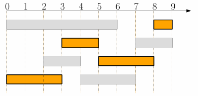
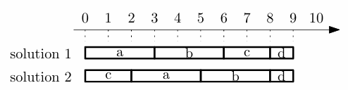
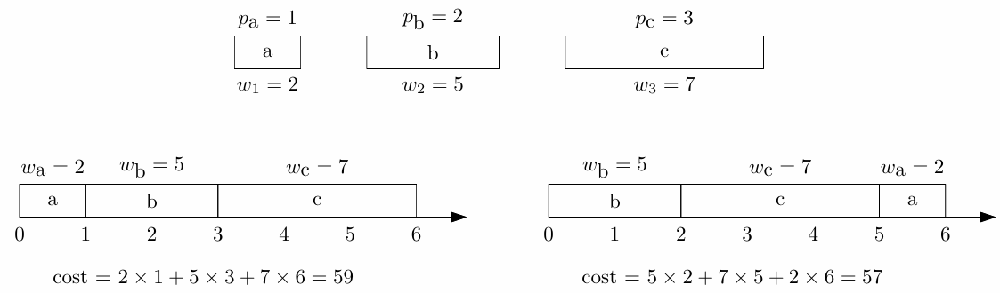
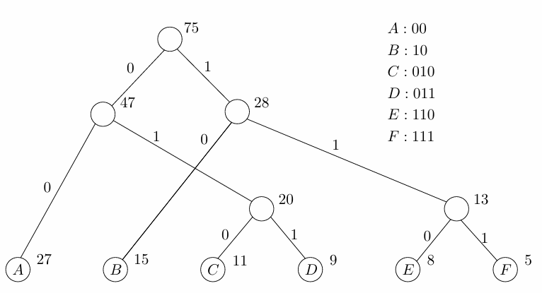

# Ch5. Greedy Algorithms

贪心算法通常基于一种固定策略，始终做出局部最优的选择，并且能够保证局部最优 = 全局最优

证明贪心算法正确的通用步骤：

- 证明策略是“安全的”（Safe）
- 证明当你完成这一步贪心选择后，剩下的问题是一个规模更小的同类型子问题

对于第一步的具体证明，我们使用交换论证法（Exchange Argument）

- 如果最优解 $S$ 不满足贪心策略，则可以通过交换项构造新的 $S'$ 为贪心解，并且 $S'$ 不差于 $S$，因此一定也能通过贪心得到最优解

## Interval Scheduling

区间调度问题：我们给定每个任务的起止时间，希望能在时间轴上安排尽可能多的任务，使得各个任务不重叠

最优策略是按照所有任务的**结束时间从早到晚**进行排序，然后按照顺序尝试分配任务

> 选择结束时间最早的工作一定是绝对安全的，即最优解一定包含最早结束的任务
>
> - 如果某个最优解不包含最早结束的任务，则把第一个任务换成这个任务也是有效的调度
>
> 解决最早结束的任务的选择之后，剩下的问题是一个规模更小的同类型子问题

## Minimizing Maximum Lateness

最小化最大延迟问题：我们给定每个任务的处理用时和截止时间。对于超过截止时间完成的任务，我们记这段超过的时间为延迟，希望最小化所有任务中最晚的延迟

最优策略是按照所有任务的**截止时间从早到晚**进行排序，然后按照顺序分配任务

> 优先做最容易超时的任务一定是绝对安全的，即最优解一定先做更早截止的任务
>
> - 如果某个最优解不先做更早截止的任务，则把实际选择的任务与更早截止的任务交换（交换为 EDF 序），结果会更好
> - 任意的任务调度都可以通过交换法得到 EDF 排列

## Weighted Completion Time

最小化加权完成时间总和问题：我们给定每个任务的处理用时 $p$ 和权重 $w$，对于在 $C$ 时刻完成的任务，其加权完成时间为 $C \times w$，希望最小化加权完成时间的和

最优策略是按照所有任务的 **$\mathbf{w_{j} / p_{j}}$ 的值从大到小**进行排序，然后按照顺序分配任务

> 我们称 $w_{j} / p_{j}$ 的比值为 Smith ratio
>
> 我们考虑在调度序列中两个相邻的任务： $j, j'$，这两个任务在开始之前的时刻为 $t$
>
> 交换前的代价和为：
>
> $$
> w_{j}(t+p_{j}) + w_{j'}(t + p_{j} + p_{j'})
> $$
>
> 如果交换这两个任务的顺序，则这两个任务的代价和为
>
> $$
> w_{j'}(t+p_{j'}) + w_{j}(t + p_{j} + p_{j'})
> $$
>
> 如果我们希望交换行为使得代价和降低，则：
>
> $$
> w_{j'}(t+p_{j'}) + w_{j}(t + p_{j} + p_{j'}) < w_{j}(t+p_{j}) + w_{j'}(t + p_{j} + p_{j'})
> $$
>
> 化简得到
>
> $$
> w_{j} p_{j'} < w_{j'}p_{j}
> $$
>
> 即 $w_{j}/p_{j} < w_{j'}/p_{j'}$
>
> 因此按照 $w_{j}/p_{j}$ 的比值从大到小调度任务，可以最小化加权代价和

## Offline Caching Problem

离线缓存问题：我们提前了解所有的请求序列，需要实现一个缓存替换策略，使得 Cache Miss 的发生次数最小化

最优策略是当缓存满且需要加载新页时，**剔除掉未来最久才会再次被用到**的那个页面（Belady's Algorithm, a.k.a. Farthest-in-Future Algorithm）

现实中的任何在线算法，缓存缺失次数都不会少于这个离线最优解

## Data Compression && Huffman Code

考虑压缩文本文件的内容，以 ASCII 文本为例。我们尝试用更短的编码代替 ASCII 编码，从而减小存储大小

比如一个文本文件中全部是 `A` `B` `C`，则可以令 `A= 0` `B=10` `C=11`，**在无歧义的情况**下压缩文档

我们希望给更经常出现的字符分配短编码，使得在编码集合相同的情况下，实际的文本压缩率提高。但问题在于直接分配变长编码可能会存在阅读歧义，因此我们使用前缀码，它满足：没有一个编码是另一个编码的前缀

进一步的，我们引入 Huffman Code，它是理论最优前缀码，其贪心策略为：

1. 计算每个字符出现的次数
2. 将每个字符看作一个叶子节点，权重为它的频率
3. 贪心合并：
    - 从所有节点中，选出频率最小的两个节点
    - 将它们合并成一个新的父节点
    - 新节点的频率 = 两个子节点频率之和
    - 将新节点放回候选池
4. 重复：直到只剩一个根节点

比如：

> 如果一个最优树没有先把频率最小的两个节点合并，我们可以通过交换位置，将那个最优树改造为包含了最小频率节点合并的树，并且不增加加权路径长度
>
> 依旧是交换法证明
