# Ch6. Dynamic Programming

动态规划是一种将原问题分解为重叠子问题（overlapping sub-problems），并利用子问题的解构建原问题解的算法

我们通常使用一个表格来存储子问题的解，以便于求解更大的问题时可以复用结果

最简单的例子为计算斐波那契数列，最朴素的分治法为：

```pascal title="D&C"
Fib(n):
    if n = 0 return 0
    if n = 1 return 1
    return Fib(n − 1) + Fib(n − 2)
```

而动态规划使用数组来存储子问题的解，求解更大的问题时复用结果：

```pascal title="Dynamic Programming"
Fib(n):
	F[0] <- 0
	F[1] <- 1
	for i <- 2 to n do
		// 存储子问题的解复用
		Fib[i] <- Fib[i − 1] + Fib[i − 2]
	return Fib[n]
```

## Weighted Interval Scheduling

带权区间调度问题：我们给定每个任务的起止时间与非负权值，希望能在时间轴上安排的任务，使得各个任务不重叠，并且这些任务的权值和最大

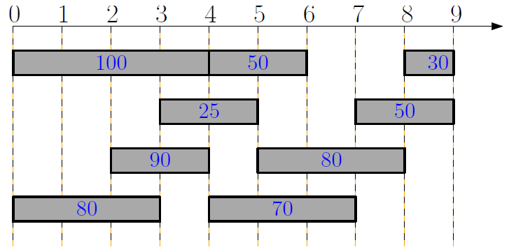

相比在贪心算法中提到的 Interval Scheduling 问题，我们发现存在“任务起止时间”与“权值”这两个没有相关性的目标，此时无法实现兼顾两个目标的贪心局部最优

具体地说，这个问题依旧具有最优子结构，但是没有贪心性质，即“存在一个最优解包含当前贪心选择的区间”这句话不一定成立

---

不妨定义状态 $opt[i]$ 为：只考虑前 $i$ 早完成的任务，最优解的总权重，初始为 $opt[0]=0$

接下来分析如何状态转移，由子问题得到 $opt[i]$ 的值：

- 如果解中不选择任务 $i$，则 $opt[i] := opt[i-1]$
- 如果解中选择了任务 $i$，则必须放弃所有的与 $i$ 冲突的作业，我们需要（预处理）找到比任务 $i$ 早，与任务 $i$ 相容且编号最大的任务的索引 $p(i)$，则 $opt[i] := opt[p_{i}] + w_{i}$

因此完整的状态方程为：

$$
opt[i] = \max(opt[i-1], opt[p_{i}] + w_{i})
$$

我们需要按照结束时间预排序 $n$ 个任务，预计算索引 $p(i)$，初始化 $opt[0] = 0$，然后从小到大计算 $opt[i]$ 的值，并将 $opt[n]$ 的值作为答案输出

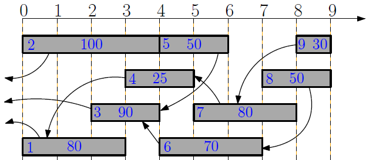

使用二分查找计算 $p[i]$ 的时间复杂度为 $O(n\lg n)$，计算 $opt[i]$ 的过程为 $O(n)$，因此总时间复杂度为 $O(n\lg n)$

进一步的，如果我们需要回溯选择，构建额外的数组记录选择，然后反向回溯出实际选择

```pascal title="Recover the Optimum Schedule"
sort jobs by non-decreasing order of finishing times
compute p1, p2, ... , pn
opt[0] <- 0
for i <- 1 to n do
	if opt[i − 1] >= vi + opt[pi] then
        opt[i] <- opt[i − 1]
        b[i] <- N		// choose
	else
		opt[i] <- vi + opt[pi]
		b[i] <- Y		// not choose
		
i <- n, S <- ∅
while i != 0 do
	if b[i] = N then
		i <- i − 1
	else
		S <- S ∪ {i}
		i <- pi
return S
```

## Segmented Least Squares

考虑最小二乘法，用一次函数 $L$ 拟合若干个点 $P$，记平方误差和

$$
\text{Error}(L, P) = \sum_{i=1}^{n} (y_{i} - ax_{i} - b)^{2}
$$

考虑到部分数据使用单一直线拟合会产生较大的 $Error$，于是考虑使用多条直线进行拟合。为了避免使用过多的直线导致过拟合，我们定义惩罚系数

$$
\text{Penalty} = k \times C
$$

其中 $C$ 为常数，$k$ 为参与拟合的一次函数个数

我们希望最小化成本：

$$
\sum_{i=1}^{k}\text{Error}(L_{i}, P) + \text{Penalty}
$$

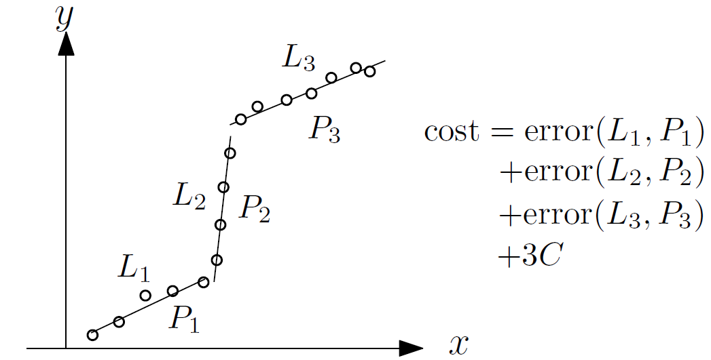

---

定义状态 $opt[i]$ 为只考虑前 $i$ 个点的最小成本，初始为 $opt[1]=1$

接下来分析如何状态转移，由子问题得到 $opt[i]$ 的值：

- 我们假定 $opt[i]$ 对应的最后一条直线从 $j$ 开始，记从 $j$ 到 $i$ 这几个点的平方误差和 $Error$ 为 $e_{ji}$
- 则 $opt[i] := opt[j-1] + e_{ji} + C$

我们希望最小化 $opt[i]$，因此完整的状态方程为：

$$
opt[i] = \min_{j:1\leq j \leq i}(opt[j-1] + e_{ji} + C)
$$

时间复杂度 $O(n^{2})$

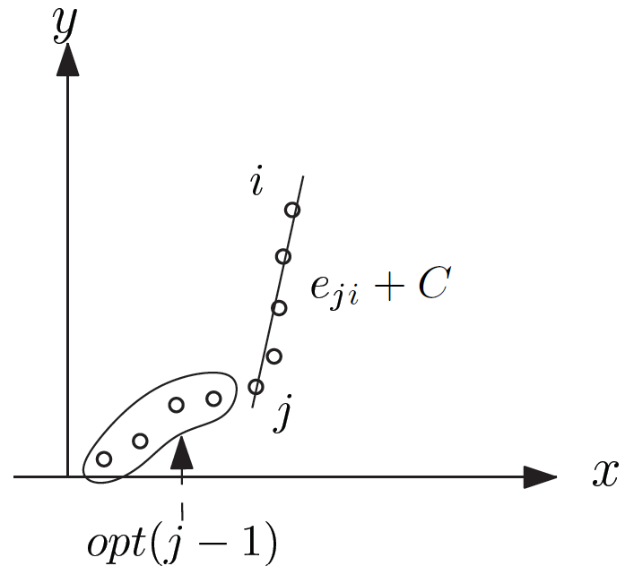

## Subset Sum Problem

子集和问题：给定一个总容量 $W >0$，以及 $n$ 个大小分别为 $w_{i} > 0$ 的物品，优化问题为找到一个物品子集 $S$：

$$
\max \sum_{i \in S} w_{i} \quad \text{s.t.} \sum_{i \in S} w_{i} \leq W
$$

依旧是因为约束有两个（最大化总和但存在上界）且互不相关，所以一轮扫描的贪心算法不能解决问题

---

定义状态 $opt[i][W']$ 为只考虑前 $i$ 个物品，且背包可用容量为 $W$ 时的最优解（因为 $W'$ 存在一个约束界，所以单纯的 $opt[i]$ 无法完整表示子问题的情况）。初始为 $opt[0][\cdot] = 0$

接下来分析如何状态转移，由子问题得到 $opt[i][]$ 的值：

- 如果不选择第 $i$ 个物品，则 $opt[i][W'] := opt[i-1][W']$
- 如果选择了第 $i$ 个物品，且当前的容量依旧满足约束 $w_{i} \leq W'$，则 $opt[i][W'] := opt[i-1][W'-w_{i}] + w_{i}$

我们希望最大化 $opt[i][W']$，因此完整的状态方程为：

$$
opt[i][W'] = \begin{cases}
0 & i = 0 \\
opt[i - 1][W'] & i > 0, w_i > W' \\
\max \begin{cases} opt[i - 1][W'] \\ opt[i - 1][W' - w_i] + w_i \end{cases} & i > 0, w_i \leq W'
\end{cases}
$$

```pascal title="Subset Sum Problem"
for w <- 0 to W do
    opt[0, w] <- 0
    
for i <- 1 to n do
    for w <- 0 to W do
        opt[i, w] <- opt[i - 1, w]
        if w_i <= w and opt[i - 1, w - w_i] + w_i >= opt[i, w] then
            opt[i, w] <- opt[i - 1, w - w_i] + w_i
return opt[n, W]
```

结合 `for i <- 1 to n do` `for w <- 0 to W do` 可知其时间复杂度为 $O(nW)$，是一个伪多项式复杂度（不可忽略输入 $W$ 的影响）

问题在于，这个实现的空间复杂度也是 $O(nW)$，并且有大量不必要的中间问题也被计算。因此我们改用记忆化搜索的思路：

```pascal title="Subset Sum Problem"
compute-opt(i, w)
    // 查表检查是否已经计算过
    if opt[i, w] != ⊥ then
        return opt[i, w]

    // 基础情况
    if i = 0 then
        r <- 0
        
    // 递归计算
    else
        // 不选第 i 个物品
        r <- compute-opt(i - 1, w)

        // 如果装得下，尝试选择第 i 个物品
        if w_i <= w then
            r_0 <- compute-opt(i - 1, w - w_i) + w_i
            if r_0 > r then
                r <- r_0

    // 存储结果
    opt[i, w] <- r

    return r
```

这里，我们将 `opt[i, w]` 从数组表示改为哈希表表示（因为大量中间状态不需要被计算），我们与其静态枚举所有的中间状态，不如动态进行可行状态的搜索。这样，只有递归树下的状态被计算，虽然最坏情况下的空间复杂度依旧为 $O(nW)$，但是期望值比这个小很多

> 第一种方法为自底向上的枚举法
>
> 第二种方法为自顶向下的记忆搜索（虽然从递归自内向外的角度来看，也是自底向上的）

### Knapsack Problem

如果给每个物品额外定义参数 $v_{i}$，优化问题为找到一个物品子集 $S$：

$$
\max \sum_{i \in S} v_{i} \quad \text{s.t.} \sum_{i \in S} w_{i} \leq W
$$

对应的状态转移方程几乎没有调整：

$$
opt[i][W'] = \begin{cases}
0 & i = 0 \\
opt[i - 1][W'] & i > 0, w_i > W' \\
\max \begin{cases} opt[i - 1][W'] \\ opt[i - 1][W' - w_i] + {\color{orange}v_i} \end{cases} & i > 0, w_i \leq W'
\end{cases}
$$

如果约束维度变多（比如添加尺寸约束 $Z$），则相应的添加 `opt` 的维度，写法和上面的状态方程差不多：

$$
opt[i][W'][Z'] =
\begin{cases}
0 & i = 0 \\
opt[i - 1][W'][Z'] & i > 0, w_i > W' \text{ or } z_i > Z' \\
\max \begin{cases}
opt[i - 1][W'][Z'] \\
opt[i - 1][W' - w_i][Z' - z_i] + v_i
\end{cases} & i > 0, w_i \leq W' \text{ and } z_i \leq Z'
\end{cases}
$$

## Longest Common Subsequence

最长公共子串问题：给出两个字符串 $A[1 .. n],B[1..m]$，求最长的公共子串

（如图：`bacdca` 与 `adbcda` 的 LCS 为 `adca`）

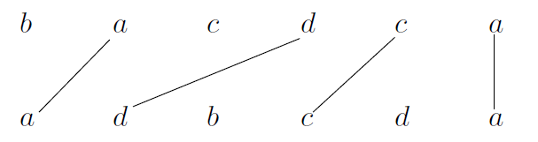

---

定义状态 $opt[i][j]$ 为只考虑 $A$ 的前 $i$ 个字符，$B$ 的前 $j$ 个字符下的 LCS 长度。初始为 $opt[0][\cdot] = opt[\cdot][0] = 0$

接下来分析如何状态转移，由子问题得到 $opt[i][j]$ 的值：

- 如果 $A[i] = B[j]$，那么显然 $opt[i][j] := opt[i-1][j-1]+1$
- 否则 $A[i] \ne B[j]$，这说明在尝试构建 LCS 时要么一定不含 $A[i]$，要么一定不含 $B[j]$，所以 $opt[i][j] := \max(opt[i-1][j], opt[i][j-1])$

我们希望最大化 $opt[i][j]$，因此完整的状态方程为：

$$
opt[i][j] =
\begin{cases}
opt[i - 1][j - 1] + 1 & \text{if } A[i] = B[j] \\
\max \begin{cases}
opt[i - 1][j] \\
opt[i][j - 1]
\end{cases} & \text{if } A[i] \neq B[j]
\end{cases}
$$

为了回溯构建出完整的 LCS 序列，构建额外的数组记录选择，然后反向回溯出实际选择

```pascal title="LCS"
for j <- 0 to m do
    opt[0][j] <- 0
for i <- 1 to n do
    opt[i][0] <- 0
    for j <- 1 to m do
        if A[i] = B[j] then
            opt[i][j] <- opt[i - 1][j - 1] + 1
            π[i][j] <- "↖"
        else if opt[i][j - 1] ≥ opt[i - 1][j] then
            opt[i][j] <- opt[i][j - 1]
            π[i][j] <- "←"
        else
            opt[i][j] <- opt[i - 1][j]
            π[i][j] <- "↑"
            
i <- n, j <- m, S <- ()
while i > 0 and j > 0 do
    if π[i][j] = "↖" then
        // 头插入，因为是反向回溯
        add A[i] to beginning of S, i <- i - 1, j <- j - 1
    else if π[i][j] = "↑" then
        i <- i - 1
    else
        j <- j - 1
return S
```

一个例子：

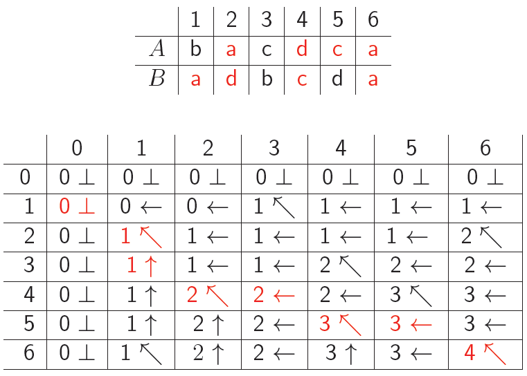

### Linear Space Algorithm

注意到对于 $opt[i][j]$，其值只依赖于 $opt[i-1][\cdot]$ 或 $opt[i][\cdot]$，因此我们可以进行滚动数组优化，简单来说就是对第一位取 $\bmod 2$ 的模

但代价是，我们丢失了中间状态，因此无法直接回溯还原具体的 LCS 序列。最优的还原时间为 $O(nm)$ 量级的

### Edit Distance

#### Insertions and Deletions

给定字符串 $A$，单次操作为：删除 / 插入 $A$ 的单个字母。问多少次操作可以将 $A$ 变成 $B$（我们记为最短编辑距离）

事实上最小操作次数即为

$$
\left(\text{len}(A) - \text{len}(LCS(A, B)) \right)+ \left(\text{len}(B) - \text{len}(LCS(A, B))\right)
$$

对应为“删除次数 + 插入次数”

#### Insertions, Deletions and Replace

在这个问题的基础上，添加替换操作（将 A 的一个字母换成 B 的字母）

一种思路是保留 LCS 的变体，注意到：一轮删除 + 插入操作代价为 2；一轮修改操作代价为 1；在完全匹配的情况下代价为 0。我们不妨把最小化操作转化成最大化奖励：一轮删除 + 插入操作奖励为 0；一轮修改操作奖励为 1；在完全匹配的情况下奖励为 2。容易得到最小化操作与最大化奖励是一一对应的

我们记在 $A[1..i]$ 和 $B[1..j]$ 之间能获得的最大总得分为 $opt[i][j]$，则

$$
opt[i, j] =
\begin{cases}
opt[i - 1, j - 1] + 2 & \text{if } A[i] = B[j] \\
\max \begin{cases}
opt[i - 1, j - 1] + 1 \\
opt[i - 1, j] \\
opt[i, j - 1]
\end{cases} & \text{if } A[i] \neq B[j]
\end{cases}
$$

最终的最少操作数为

$$
\text{len}(A) + \text{len}(A) - opt[n][m]
$$

---

事实上，可以直接借鉴 LCS 的状态转移思想：我们记 $opt[i][j]$ 为 $A[1..i]$ 和 $B[1..j]$ 下的最短编辑距离（即题目所求）：

- 如果 $A[i] = B[j]$，那么显然 $opt[i][j] := opt[i-1][j-1]$，不需要编辑
- 否则 $A[i] \ne B[j]$，这说明在尝试时要么一定需要删除 $A[i]$，要么一定需要添加 $B[j]$，要么一定需要替换 $A[i]$ 为 $B[j]$，对应的状态转移为 $opt[i][j] := \min(opt[i-1][j] + 1, opt[i][j-1] + 1, opt[i-1][j-1] + 1)$

对应的状态方程为

$$
opt[i, j] =
\begin{cases}
opt[i - 1, j - 1] & \text{if } A[i] = B[j] \\
\min \begin{cases}
opt[i - 1, j - 1] + 1 \\
opt[i - 1, j] + 1\\
opt[i, j - 1] + 1
\end{cases} & \text{if } A[i] \neq B[j]
\end{cases}
$$

$opt[n][m]$ 为最短编辑距离

### Longest Palindrome

对于最长回文子序列问题，一种思路是转化为“对原串 $A$ 和反转串 $A'$ 求 LCS”，另一种思路是区间 DP：记 $opt[i][j]$ 为子串 $A[i..j]$ 的最长回文子序列长度，最终答案为 $opt[1][n]$

接下来分析如何状态转移，由子问题得到 $opt[i][j]$ 的值：

- 如果 $A[i] = B[j]$，那么显然 $opt[i][j] := opt[i+1][j-1]+2$（向外扩张了两个元素）
- 否则 $A[i] \ne B[j]$，这说明在尝试构建 LPS 时要么需要舍弃 $A[i]$，要么需要舍弃 $B[j]$，所以 $opt[i][j] := \max(opt[i+1][j], opt[i][j-1])$

对应的状态方程为

$$
opt[i][j] = \begin{cases}
opt[i+1][j-1] + 2 & \text{if } A[i] = A[j] \\
\max(opt[i+1][j], opt[i][j-1]) & \text{if } A[i] \neq A[j]
\end{cases}
$$

考虑更新方式：因为大的回文子序列唯一依赖于小的回文子序列，所以我们必须按照子序列长度从小到大计算对应的 opt 值

两种方法的时间复杂度都是 $O(n^{2})$

---

如果是回文子串，那么记 $opt[i][j]$ 为子串 $A[i..j]$ 是否为回文子串的 bool 值

$$
opt[i][j] =
\begin{cases}
true & \text{if } i = j \\
(A[i] = A[j]) & \text{if } j = i + 1 \\
(A[i] = A[j]) \land opt[i+1][j-1] & \text{if } j > i + 1
\end{cases}
$$

然后在所有的 $opt[i][j] = 1$ 中得到最大的 $j-i+1$ 的值作为最长回文子串的长度

## Shortest Paths in DAG

回顾一下数据结构课程的内容，对于一个 DAG，我们假定顶点集 $V$ 是按照拓扑序排列的，求出从 $1$ 到每个 $i$ 的最短路 $f[i]$

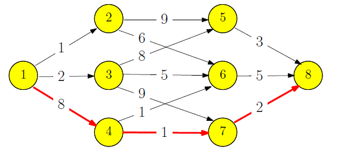

容易得到状态方程为

$$
f[i] =
\begin{cases}
0 & i = 1 \\
\displaystyle \min_{j: (j,i) \in E} \{ f(j) + w(j,i) \} & i = 2, 3, \dots, n
\end{cases}
$$


如果是最长路则为

$$
f[i] =
\begin{cases}
0 & i = 1 \\
\displaystyle \max_{j: (j,i) \in E} \{ f(j) + w(j,i) \} & i = 2, 3, \dots, n
\end{cases}
$$

## Matrix Chain Multiplication

考虑 $n$ 个矩阵 $A_{1}, \dots, A_{n}$，满足 $c_{i} = r_{i+1}$，这样矩阵可以链式相乘为 $A_{1}\cdots A_{n}$

已知 $r\times k$ 的矩阵与 $k\times c$ 的矩阵相乘，需要 $r\times k \times c$ 次标量乘法计算，得到 $r\times c$ 的新矩阵

求计算 $A_{1}\cdots A_{n}$ 的最少标量乘法次数，比如：

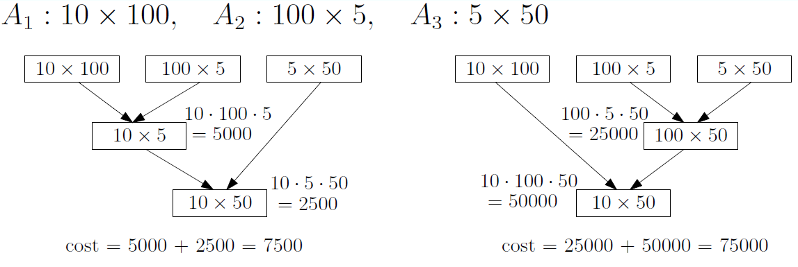

---

定义状态 $opt[i][j]$ 为 $A_{i}\cdots A_{j}$ 的最优计算结果。初始为 $opt[i][i] = 0$

接下来分析如何状态转移，由子问题得到 $opt[i][j]$ 的值：

- 我们只考虑最后一步矩阵乘法计算为：$(A_{1}\cdots A_{i})(A_{i+1}\cdots A_{n})$，这一步对应的标量乘法次数一定为 $r_1 \times c_i \times c_n$，总标量乘法次数还得加上 $A_{1}\cdots A_{i}$ 与 $A_{i+1}\cdots A_{n}$ 各自的标量乘法次数
- 相应的，对于子问题 $opt[i][j]$，我们也可以枚举所有的分界点，总结出最小值：$opt[i][j]=\max_{k:i\leq k < j}(opt[i][k] + opt[k+1][j] + r_{i}c_{k}c_{j})$

对应的状态方程为

$$
opt[i][j] = \begin{cases}
0 & \text{if } i=j \\
\displaystyle \max_{k:i\leq k < j}(opt[i][k] + opt[k+1][j] + r_{i}c_{k}c_{j}) & \text{if } i<j
\end{cases}
$$

考虑更新方式：因为大的矩阵链乘唯一依赖于小的矩阵链乘，所以我们必须按照子串长度从小到大计算对应的 opt 值

时间复杂度 $O(n^{3})$

```pascal title="Matrix Chain Multiplication"
let opt[i][i] <- 0 for every i = 1, 2, ..., n
for l <- 2 to n do
    for i <- 1 to n - l + 1 do
        j <- i + l - 1
        opt[i][j] <- INF
        for k <- i to j - 1 do
            if opt[i][k] + opt[k + 1][j] + r_i c_k c_j < opt[i][j] then
                opt[i][j] <- opt[i][k] + opt[k + 1][j] + r_i c_k c_j
return opt[1][n]
```

## Optimum Binary Search Tree

首先考虑最优编码树，通过贪心构建 Huffman 树可以保证为最优编码

现在添加额外的约束：对于给定的编码集合 $\{e_1, e_2, \cdots , e_n\}$，在构建二叉搜索树时要求元素的相对顺序不变（即对 BST 进行中序遍历的顺序依旧是 $\{e_1, e_2, \cdots , e_n\}$，以下图为例）。对于多约束的情况，贪心不能给出最优解

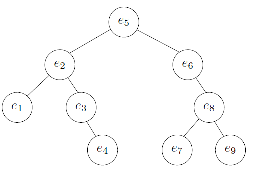

---

现在考虑 $e_k$ 为树的根节点，$e_{1}, \cdots, e_{k-1}$ 在左子树，$e_{k+1}, \cdots, e_{n}$ 在右子树

记 $d_{j}$ 为 $e_{j}$ 节点在树上的深度，$f_{j}$ 为 $e_j$ 节点的频率，而 $C, C_{L},C_{R}$ 分别为整棵树，左子树，右子树的总花费

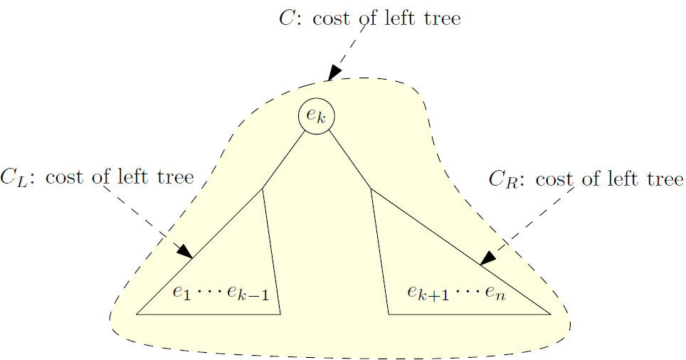

可以证明：

$$
C = \sum_{j=1}^{n} f_jd_j = C_{L} + C_{R} + \sum_{j=1}^{n} f_j
$$

（当左右子树连接到根节点后，在 $C_{L} + C_{R}$ 的基础上每个元素都多加了一层深度，所以要加上全体元素的频率，后者是个定值）

因此 $C \propto C_{L} + C_{R}$，如果我们想最小化总花费 $C$，则等价为最小化左右子树各自的花费，因此可以定义状态 $opt[i][j]$ 为 $e_{i}\cdots e_{j}$ 子集的最小花费，对应的状态转移方程为：

$$
opt[i][j] = \begin{cases}
0 & \text{if } i=j+1 \\
\displaystyle \min_{k:i\leq k \leq j}(opt[i][k-1] + opt[k+1][j] + \sum_{p=i}^{j} f_{p}) & \text{if } i\leq j
\end{cases}
$$

事实上，这和 Matrix Chain Multiplication 问题的做法是大致相同的，在对 $f_{p}$ 进行前缀和预计算的情况下，时间复杂度 $O(n^{3})$

---

此外，Knuth 优化指出，对于满足这种格式的转移方程：

$$
\min_{k:i\leq k \leq j}(opt[i][k-1] + opt[k+1][j] + w[i][j])
$$

我们记最优分割点 $K[i][j]$（也就是使上式取到最小值的 $k$），则满足单调性：

$$
K[i][j-1] \leq K[i][j] \leq K[i+1][j]
$$

此时我们不再枚举完整的 $k: i \leq k \leq j$，时间复杂度从 $O(n^{3})$ 下降到 $O(n^2)$

## DP on Trees

一些 NP-Hard 的常规图上问题对于树的情况存在多项式解法，关键在于：始终可以找出一个节点作为分隔点，当这个点被删除时，剩下的部分为多个独立子树

因此这类题目有通用策略：

- 任意选定一个节点作为根，形成层级关系
- 自底向上状态转移，最终汇总到各根节点
- 只关注当前节点 $u$ 及其子树的最优解

### Maximum Independent Set (MIS)

给定一棵树，我们希望找出最大独立集，满足集合中的所有顶点互不连接，且包含顶点个数最多

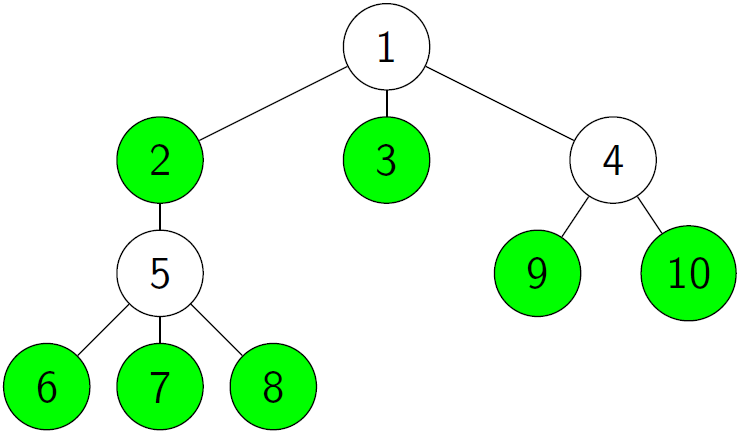

特别的，这个问题可以使用贪心算法得到正解，步骤为：

- 将当前的所有叶节点加入独立集
- 将这些叶节点的父节点（也包括自己）删除
- 直到所有节点被删除

我们只需要证明：一定存在一个最大独立集，包含了当前树的所有叶节点即可

### Maximum Weight Independent Set (MWIS)

现在考虑带点权的树，我们希望找出最大带权独立集，满足集合中的所有顶点互不连接，且包含点权和最大

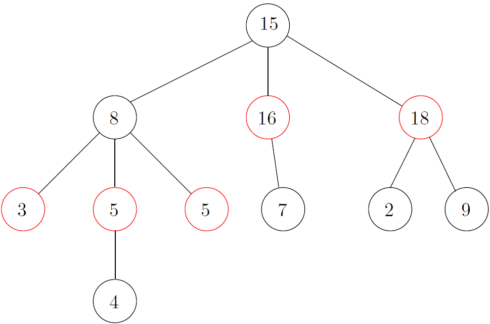

贪心算法此时不能给出贪心正确的解答，给出两种动态规划的思路

---

定义状态 $opt[u]$ 为 $root = u$ 的子树的最大权独立集的权值和

接下来分析如何状态转移，由子问题得到 $opt[u]$ 的值：

- 如果 $u$ 不在最大权独立集中，则 $opt[u]$ 直接由其全体子节点贡献，此时 $opt[u] := \sum_{v \in \text{child}(u)} opt[v]$
- 如果 $u$ 在最大权独立集中，则 $u$ 参与 $opt[u]$ 的计算，且 $u$ 的所有儿子节点不能被选中，而是考虑所有的孙子节点，此时 $opt[u] := w_u + \sum_{v \in \text{child}(u)} \sum_{g \in \text{child}(v)} opt[g]$

对应的状态方程为

$$
opt[u] = \max \left\{ \begin{aligned}
&\sum_{v \in \text{child}(u)} opt[v], \\
&w_u + \sum_{v \in \text{child}(u)} \sum_{g \in \text{child}(v)} opt[g]
\end{aligned} \right.
$$

---

注意到“遍历孙子节点”这一步会存在遍历的麻烦，我们将"是否选定 $u$"直接放进状态转移数组中，定义状态 $opt[u][\cdot]$ 为 $root = u$ 的子树的最大权独立集的权值和，其中：

- $opt[u][0]$ 表示 $u$ 不在 $T_u$ 的 MWIS 中
- $opt[u][1]$ 表示 $u$ 在 $T_u$ 的 MWIS 中

对应的状态方程为：

$$
opt[u][0] =
\displaystyle\sum_{v \in \text{child}(u)} \max(opt[v, 0], opt[v, 1]) \\
opt[u][1] =
w_u + \displaystyle\sum_{v \in \text{child}(u)} opt[v, 0]
$$

简单来说：如果 $u \not\in S$，则子节点可以在 $S$ 中也可以不在，取较大值；如果 $u \in S$，则子节点必须不在 $S$ 中

### Minimum Weight Vertex Cover (MWVC)

相对地，我们提出这样的问题：给定一棵树，我们希望找出最小权顶点覆盖集，满足任意一条树边都至少有一个顶点在集合中，且包含点权和最小

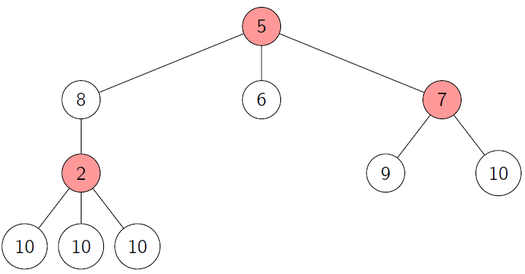

不难发现，如果 $S$ 是一个顶点覆盖集，那么 $T \backslash S$ 一定是一个独立集。因为我们对 MWIS 的结果取树上的反图，则得到的结果就是一个 MWVC

直接套用 MWIS 的树上 DP 即可

### Minimum Weighted Dominating Set (MWDS)

进一步的，给定一棵树，我们希望找出最小权支配集，满足任意一个不在支配集上的顶点，它的父节点或某个子节点在支配集中

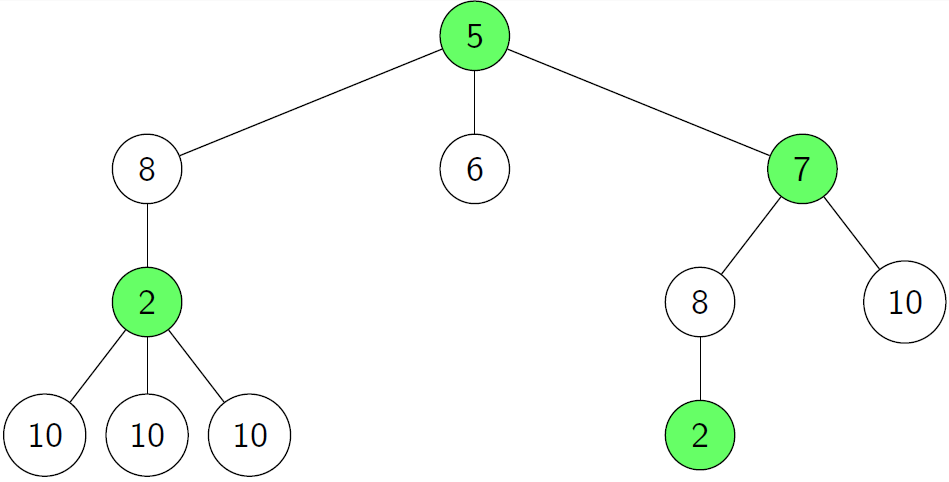

定义状态 $opt[u][\cdot]$ 为 $root = u$ 的子树的最小权支配集的权值和，对于任意的节点，可以总结为三种状态：

- $opt[u][0]$ 表示 $u$ 在 $T_u$ 的 MWDS 中
- $opt[u][1]$ 表示 $u$ 不在 $T_u$ 的 MWDS中，但是已经被某个子节点支配
- $opt[u][2]$ 表示 $u$ 不在 $T_u$ 的 MWDS中，其不需要被任何子节点支配（因此它一定能被父节点支配，即它的父节点是支配集中的）

对于所有的**叶节点**，初始化为 $opt[u][0] = w_{u}, opt[u][1] = \infty, opt[u][2] = 0$（正无穷说明不存在这一情况）

现在考虑其状态方程：

- $opt[u][0]$ 意味着子节点无论如何都是合法的，则

$$
opt[u][0] = w_u + \sum_{v \in \text{child}(u)} \min(opt[v][0], opt[v][1], opt[v][2])
$$

- $opt[u][2]$ 意味着子节点要么被加入 MWDS，要么被它的子节点支配，则

$$
opt[u][2] = \sum_{v \in \text{child}(u)} \min(opt[v][0], opt[v][1])
$$

- $opt[u][1]$ 意味着子节点中至少有一个在支配集中
    - 一方面，所有的子节点只能考虑 $opt[0]$ 或 $opt[1]$，因为父节点不支配它们
    - 另一方面，至少有一个子节点应该为 $opt[0]$，用来支配 $u$。此时为了计算某个子节点从状态 1 切换到状态 0 的代价，我们计算 $\max(0, \min_{v}(opt[v][0] - opt[v][1]))$ 的值
        - 如果右侧的某项减法结果存在负数，说明某个节点已经自然地选择了状态 0（额外项的计算结果为 0）
        - 否则所有子节点都倾向于状态 1，则需要选择一个代价最小的子节点将状态 1 切换到状态 0（额外项的计算结果为 $\min_{v}(opt[v][0] - opt[v][1])$）

$$
opt[u][1] =  \sum_{v \in \text{child}(u)} \left(\min(opt[v][0], opt[v][1]) \right) + \max(0, \min_{v}(opt[v][0] - opt[v][1]))
$$

最终取答案时，取 $min(opt[root][0], opt[root][1])$ 的值，因为根节点无法满足状态 $2$
