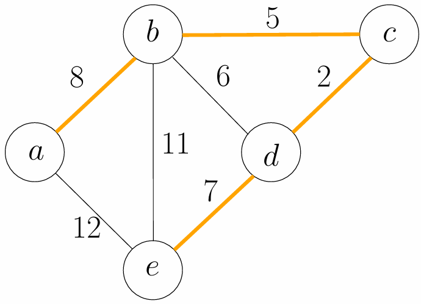
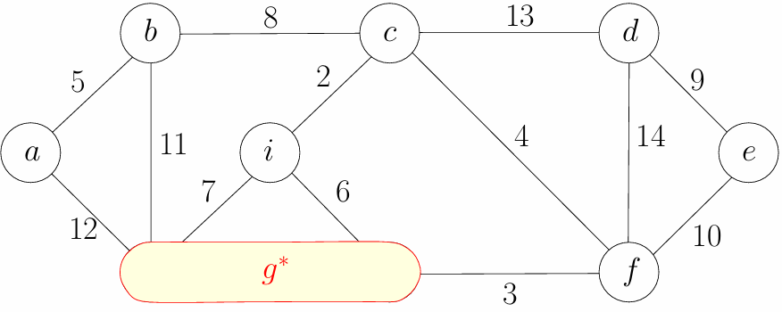
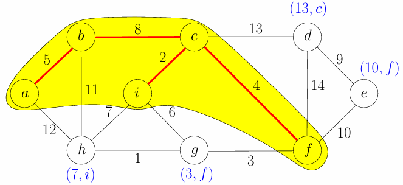
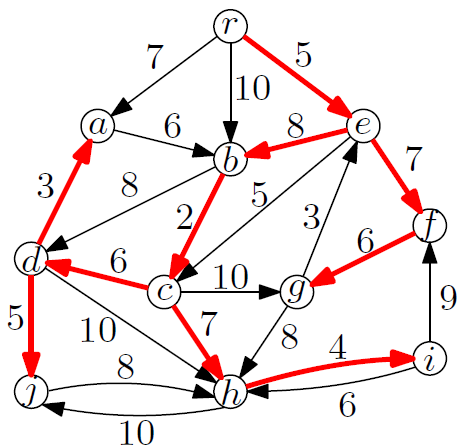

# Ch7. Graph Algorithms

一些依旧很熟悉的图论算法

## MST

给定一张带边权<u>无向图</u>，考虑生成树的性质，以下命题是等价的：

- $T$ 是 $G$ 的生成树
- $T$ 将图连通且不成环
- $T$ 是连通的且只有 $n-1$ 条边
- $T$ 是不成环的且只有 $n-1$ 条边
- $T$ 是最小连通的，这意味着任意删除一条边会使图不连通
- $T$ 是最大不成环的，这意味着任意添加一条边会使图成环
- $T$ 上任意两点存在唯一路径

现在需要求出其最小生成树，也即边权和最小的生成树



### Kruskal’s Algorithm

一种正确的贪心思路是：始终选择当前最小的边加入 MST，跳过会使得当前 MST 成环的边，直到选择了 $n-1$ 条边

- 我们首先证明：一定存在一个 MST，它包含整个图的最短边

假设这个图的最短边 $(u, v)$ 并不在当前的 MST 中，我们知道树上从 $u$ 到 $v$ 的路线是唯一的，则断开 $u\to v$ 路径的任意一条边，并将 $(u, v)$ 加入到 MST，得到的 MST 依旧连通（因为原 MST 上 $u\to v$ 的路径与 $(u,v)$ 是成环的），且边权和一定不会增大（因为 $(u,v)$ 是已知的最短边）

> 对应的，我们也可以证明：在图中任意寻找一个环，环上权重最大边一定不在任何一个 MST 中（不考虑并列的情况）

- 接下来我们证明，在选定当前最小边的情况下，剩余的问题依旧是一个求 MST 的问题

我们考虑缩点，将当前最短边 $(u, v)$ 的两个点缩点成一个点 $u^\ast$，则剩下的问题就是对这个新图求 MST

（即：对缩点后的图求得的 MST，加上 $(u,v)$ 就是对原图的 MST）

（特别的，如果形成了重边，则只保留最短边）



因此我们证明了贪心策略的正确性，即“在不成环的基础上始终选最短边加入 MST”能得到正确的 MST

如何判断成环性？对点集使用并查集

时间开销包含对边按照边权排序的 $O(m\log n)$，以及并查集开销 $O(m\alpha(n))$，总时间复杂度 $O(m\log n)$

---

在图中任意寻找一个环，环上权重的绝对最大边一定不在任何一个 MST 中，这意味着我们还可以反向进行贪心删除，据此给出 Reverse Kruskal’s Algorithm 算法：

- 对边按照边权进行降序排序
- 尝试删除当前边权最大边，如果破坏图的连通性，则重新保留这条边
- 当边数只剩下 $n-1$ 条时，最小生成树生成完毕

因为图的连通性检查比使用并查集维护当前 MST 成环性更加困难，因此这种方法通常不采用

### Prim’s Algorithm

现在考虑对点进行贪心处理：指定任意一个点作为 MST 的起始点，始终选择与当前 MST 集合相邻的点，且这个点与 MST 的连边权重最小

- 证明：一定存在一个 MST，对于顶点 $a$，与它相邻的权重最小的边在 MST 中

假设与 $a$ 相邻的最短边 $e^{\ast}$ 并不在当前的 MST 中，如果我们在 MST 中删除点 $a$，则整棵树会裂成若干个连通分量。记 $e^{\ast}$ 是连接删点后连通分量 $C$ 的边，$T$ 上原本连接到 $C$ 的边是 $e$。则将 MST 中的边 $e$ 替换为 $e^{\ast}$，MST 连通性不变，且边权和只可能更优

因为我们不断选择这样的边进行树的扩展，每次连通一个顶点，所以这个贪心策略对于构建整个 MST 树也是自然成立的

具体的，我们维护当前 MST 集合 $S$ 及其补集 $V \backslash S$，并记录 $d[v]$ 为：$S$ 外的所有点连接 $S$ 中任意一点的边权最短边的权重；记录 $\pi[v]$ 为：记录 $v$ 对应的边权最短边的另一端顶点（也就是说，两个数组动态维护每个点到 MST 集合的最短距离，以及最短距离对应的另一端的顶点）



每一次，我们取出最小 $d[u]$ 对应的顶点加入 MST，然后更新与它相邻的节点的 $d$ 和 $\pi$（使用优先队列维护）

时间开销包含 $O(n)\times$ 取最小元素 + $O(m) \times $ 修改边的 $d, \pi$ 数组：

- 对于常规二叉堆，时间复杂度为 $O((n+m)\log n)$
- 对于 Fibonacci 堆，时间复杂度为 $O(n\log n + m)$

### Evidence for `e` in MST or `e` not in MST

**假定所有的边权都不同**

我们给出两个判断一条边是否在 MST 中的充要条件：

- 割定理：对于图的任何一个割（将图的顶点集划分为不相交的两部分），权重最小的横跨割的边一定属于 MST
- 环定理：对于图中的任何一个环，环上权重最大的边一定不属于 MST

这一条件对所有 MST 上的边都符合，即：对于图中的**任意一条边**，它要么是某个割的最轻边（因此参与构成 MST），要么是某个环的最重边（因此不参与构成 MST）

进一步的，MST 的边集是唯一确定的

---

Kruskal 算法的本质是（逆向）使用环定理；Prim 算法的本质是（正向）使用割定理

## MCA

现在我们考虑有向图的类似问题：给定一个有向图 $G$ 与指定的根节点 $r$，要求构建一个“有向的生成树”，我们记为树形图。**额外的，树形图要求除了根以外，每个节点的入度只能为 1**，因此这个树又叫“有向入树”

现在我们需要求最小树形图（Minimum Cost Arborescence, MCA）



为了引入具体的解决算法，需要引入两个引理：

- 对于 $r$ 以外的所有节点 $v$，我们找到进入它的所有边 $e = (u,v)$ 中最小的权重 $l_v$，将所有入边 $e$ 的权重减去 $l_{v}$，即 $w(e) \leftarrow w(e) -l_v$，最终得到的新图和原图具有完全一致的 MCA 解

不难发现，不管最后选出的树形图 $T$ 长什么样，$T$ 中除了根节点外，每个节点都有且仅有一条入边。因此，原图总权重 - 新图总权重 = 所有节点 $l_v$ 之和。这是一个常数，所以优化原图等同于优化新图

- 如果某张图中存在一个 0 权重环，则必然存在一个 MCA 的最优解，它包含环上的除了一条边以外的所有边

可以考虑将 0 权重环缩成一个点，现在内部选择 $n-1$ 条边，再向外部进行连接

---

因此，我们给出朱-刘算法 (Chu-Liu/Edmonds Algorithm)，递归贪心的解决这个问题：

- 对于 $r$ 以外的所有节点 $v$，我们找到进入它的所有边 $e = (u,v)$ 中最小的权重 $l_v$，将所有入边 $e$ 的权重减去 $l_{v}$，即 $w(e) \leftarrow w(e) -l_v$
- 对于 $r$ 以外的所有节点 $v$，我们选择一条进入 $v$ 的，且权值为 0 的入边，加入集合 $F^{\ast}$（初始为空）
- 如果 $F^{\ast}$ 已经是以 $r$ 为根的有向入树，则返回 $F^{\ast}$ 为 MCA
- 否则把每个 0 权重环缩成一个点，得到新图递归上面的过程
- 最终离开递归还原，展开 0 权重环时，要保留环中的大部分边，但删除一条边打破环，具体的，删掉环中进入那个被外部边连接到的节点的原本入边

这个算法的时间复杂度是 $O(mn)$，通过设计数据结构维护每个节点的入边，最终可以优化到 $O(m\log \log n)$

## SSSP

单源最短路问题：给定一张带边权图（有向或无向），指定一个起点 $s$，给出从 $s$ 出发到其他各点的最短路

### Relax Operation

考虑 `dis(s->v)` 为从某个起点 `s` 到 `v` 的距离，假设我们在求 `dis(s->v)` 的最小值过程中，发现存在另一个节点 `u`，有 `dis(s->u) + dis(u->v) < dis(s->v)`，我们找到了一条从 `s` 到 `v` 更近的路线，此时我们更新 `dis(s->v) = dis(s->u) + dis(u->v)`，而原来的约束 `dis(v)_old` 不再是最紧的约束，因此得到了“松弛”

（一种很物理的想法：思考一张起点为 `s`，终点 `v` 的弹性绳网，拉住 `s`，`v` 往两侧拉伸，最短路对应的绳会紧绷住，而其他的绳都是相对松弛的。现在我找到了一条更短的路径，在添加“路径对应的绳”后，原来紧绷的绳也会松弛，这就是一次“松弛化”操作）

### BFS

如果所有的边权都为 $1$，那么 BFS 逐层扩展是最自然且最优的计算方案，时间复杂度为 $O(V+E)$

如果边权不都为 $1$，我们记边权上限为 $W$，则我们可以将每条权值为 $w$ 的边拆分为 $w$ 条权值为 $1$ 的边，最坏情况下所有边权均为 $W$，时间复杂度为 $O(V+EW)$

### Dijkstra

回忆 Prim 算法，我们对点按照最近最小边权进行贪心

同样的，我们给出 Dijkstra 算法：从源点出发，逐步扩展已确定最短路径的顶点集合，每次选择当前距离源点最近的未处理顶点，并松弛它的所有出边。

Dijkstra 算法按照距离递增的顺序确定所有节点的最短路径，换句话说，它每轮确定的最短路的长度是递增的。可以这样理解：Dijkstra 每次只确定最紧的路线作为一条最短路（也就是已经实现松弛操作最大化的路径）

```pascal title="Dijkstra"
S ← ∅, d(s) ← 0 and d[v] ← ∞ for every v ∈ V \ {s}
while S ≠ V do
	// 取当前距离原点最近的点 u，加入已处理集合
    u ← vertex in V \ S with the minimum d[u]
    add u to S
    // 对 u 的所有相邻点（不在已处理集合中），我们尝试进行“松弛”操作
    for each v ∈ V \ S such that (u, v) ∈ E do
    	// 如果从 s 到 v 的最短路可以通过 (u,v) 刷新，则进行松弛化
        if d[u] + w(u, v) < d[v] then
            d[v] ← d[u] + w(u, v)	// 更新最短路
            π[v] ← u				// 记录 v 的上一个顶点为 u
return (d, π)
```

我们使用优先队列来维护 $(v, d[v])$ 键值对

与 Prim 相同的，时间开销包含 $O(n)\times$ 取最小元素 + $O(m) \times $ 修改边的 $d, \pi$ 数组：

- 对于常规二叉堆，时间复杂度为 $O((n+m)\log n)$
- 对于 Fibonacci 堆，时间复杂度为 $O(n\log n + m)$

??? abstract "举例"

    
    
    考虑以 $a$ 为起点的单源最短路径，不难发现从 $a$ 能到达的最近的节点是 $c$
    
    |  b   |   c    |  d   |  e   |
    | :--: | :----: | :--: | :--: |
    |  6   | 5[MIN] |  7   | INF  |
    
    不难意识到，**因为没有负权，我们只要继续沿着路线走下去，经过路径的权值和只会变得更大（或不变）**，而我们目前能够到达的最近节点就是点 $c$，因此 $a\to c$ 的最短路就为 $5$，我们完成了 $a\to c$ 最短路的计算
    
    不妨从目前最近的 $c$ 出发，其能够到达的点为 $d$ 和 $e$，我们继续更新目前的路径：
    
    |   b    |        c        |  d   |  e   |
    | :----: | :-------------: | :--: | :--: |
    | 6[MIN] | 5[Start Vertex] |  6   |  15  |
    
    我们发现 $a\to b$ 和 $a\to d$ 的路径是最短的，我们任意取一个（$a\to b$），同理可得 $a\to b$ 的最短路就为 6（确定的结果）
    
    继续上述的操作：选择当前的最近节点，延伸路线，取最近的尚未确定最短路的节点，得到其最短路，循环。
    
    这里给出完整的流程表：
    
    |        b        |        c        |        d        |      e      |
    | :-------------: | :-------------: | :-------------: | :---------: |
    |        6        |     5[MIN]      |        7        |     INF     |
    |     6[MIN]      | 5[Start Vertex] |        6        |     15      |
    | 6[Start Vertex] |        /        |     6[MIN]      |      9      |
    |        /        |        /        | 7[Start Vertex] |   9[MIN]    |
    |        /        |        /        |        /        | 9[FINISHED] |
    
    我们发现，每次由最近节点进行延伸和松弛操作，都可以确认一个点的最短路径长度；经过 $n-1$ 次操作，我们就能得到单源最短路径（因此这个算法很稳定）

---

Dijkstra 要求**边权是非负的**，否则如果存在一个负权环，则算法会不断用这个负权环刷新最短路直到 $-\infty$，且算法不能主动感知这一情况的发生

那么，如果我们求的是简单最短路呢？这是 NP-Hard 问题

### Bellman-Ford

和 Dijkstra 一样，都是求单源最短路径的算法。其优势在于允许负权边且能检测负环

朴素 Bellman–Ford 的核心依旧是松弛操作：具体地说，由于 $n$ 个顶点的图任意两点之间的最短路一定不超过 $n-1$ 条边，因此对所有的边进行 $n-1$ 轮松弛操作，一定能得到单源最短路径，时间复杂度 $O(VE)$

这种算法的好处在于松弛次数固定，如果在进行了 $n-1$ 轮松弛后还能继续松弛，则说明图中存在负环

---

此外，注意到，如果每轮松弛操作只使用上一轮的 `dis[u]`，而不使用在本轮更新过的 `dis[u]`，则第 $i$ 轮松弛可以得到从原点出发，最多经过 $i$ 条边到达其他顶点的最短路

朴素 Bellman–Ford 算法对所有边进行 $n-1$ 次松弛，我们发现，在通常情况下，大多数的边都不可能被松弛却尝试了松弛，这其中的很多次松弛操作是浪费的

进一步的，只有当某个顶点的最短距离被松弛更新时，从该顶点出发的边才可能会对其他顶点产生影响。因此我们可以使用一个队列，存储那些待处理的顶点，这就是 SPFA (Shortest Path Faster Algorithm) 的思想

数学上可以证明：SPFA 对随机图的优化确实非常强大，其理想时间复杂度可以简单写作 $O(kE)$，但最坏时间复杂度依旧为 $O(VE)$

## APSP

全源最短路问题：给定一张带边权图（有向或无向），求出从所有起点 $s$ 出发到其他各点的最短路

### Floyd-Warshall

一种动态规划的算法

我们初始一个二元数组 `f[n][n]`：对于每对节点 `(x,y)`，记 `f[x][y]` 从 `x` 到 `y` 最短路径长度。

首先，没有图信息，我们初始化每个节点到自己的距离为 `0`，到其他节点的距离为 `INF`

```c++
const int INF = INT_MAX;
int f[n][n];
for(int x = 0; x < n; x++){
    for(int y = 0; y < n; y++){
        if(x == y) f[x][y] = 0;		// 自己到自己的路径长为 0
        else f[x][y] = INF;			// 否则不可达
    }
}
```

现在我们加入图的基础边信息，而 `f[x][y]` 更新为从 `x` 到 `y` **最多一步抵达**的最短路径长度：

```c++
for (int i = 0; i < m; i++) {
    int u, v, w;
    cin >> u >> v >> w;
    f[u][v] = min(f[u][v], w);	// 这里考虑到了重边，取最小边
    // 如果是无向图：f[v][u] = min(f[v][u], w);
}
```

此时我们只考虑了每个节点到达自己的情况，以及一步可达的情况，现在我们对每两个点进行“松弛”操作，不妨从节点 `0` 开始：

```c++
for (int x = 0; x < n; x++) {
    for (int y = 0; y < n; y++) {
        f[x][y] = min(f[x][y], f[x][0] + f[0][y]);
    }
}
```

上面的程序的意思是：对所有的 `(x,y)`，如果从 `x` 到 `y` 的路径可以通过节点 `0` 松弛化，那么我们就更新更短的路径。

进一步地，我们依次加入其他节点，从节点 `0` 到节点 `n-1` 依次松弛化，就有了：

```c++
for (int k = 0, k < n, k++){
    for (int x = 0; x < n; x++) {
        for (int y = 0; y < n; y++) {
            f[x][y] = min(f[x][y], f[x][k] + f[k][y]);
        }
    }
}
```

这就是 Floyd 算法的核心逻辑，可以在 $O(V^3)$ 的时间内得到全源最短路径，对应的空间复杂度 $O(V^2)$。但是注意到：Floyd 算法在遇到负环（环的权重和为负）时，其会不断在循环中降低权值，而不会主动发现负权环（和 Dijkstra 行为类似，不同于 Bellman-Ford）
