# Ch8. Network Flow

考虑一个有向图 $G=(V,E)$，其中存在一个没有入边的源点 $s$ 和一个没有出边的汇点 $t$

现在在图上存在一个虚拟的水流，从 $s$ 出发，汇集于 $t$，每条边 $e$ 存在一个容量值 $c_{e}$，它表示这条边的最大承载量，即经过这条边的水流量不能超过这个值

我们定义一个流函数 $f:E \to \mathbb{R}$，表示水流在每条边上的实际大小，需要满足两个约束：

- $0 \leq f \leq c_e$
- 除了源点与汇点，水流在任意点的流入量 = 流出量

如果这个 $f$ 满足了上述约束，则我们称之为一个（有效的） s-t 流

我们记整个网络的总流量为从源点 $s$ 离开的水流量，即为 $val(f)$，而最大流问题则是求从 $s$ 到 $t$ 能到达的最大 $val(f)$

## Ford-Fulkerson

我们想要解决最大流问题

首先考虑一种错误的朴素贪心思想：初始化所有边上的流量为 0，定义每条边的剩余流量为 $c_e - f(e)$，并进行初始更新

在剩余容量为正的边构成的有向图中（称之为残余图 $G_f$），找一条从源点 $s$ 到汇点 $t$ 的路径（称之为增广路径），在这条路上最大化流量（受限于路径上最小的剩余容量）

重复上述过程，直到找不到任何从 $s$ 到 $t$ 的、各边剩余容量都大于 0 的路径为止

但是这个贪心存在问题：因为贪心行为不可撤销，结果可能会陷入局部最优

??? quote "Example"

    比如下图的例子，朴素的贪心算法会选择 $s\to A \to B \to t$ 的一条增广路径，最终把最大流设置为 $1$
    
    事实上最大流为 $2$，由 $s \to A \to t$ 和 $s\to B \to t$ 共同决定
    
    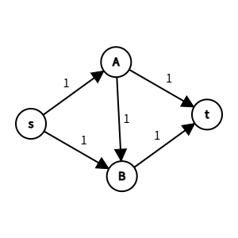

正确的算法需要引入反悔机制，这允许算法撤回之前的决策。我们引入 Ford-Fulkerson 算法，它只在以上算法的基础上添加了一个定义：

- 反向边：对应所有原正向边的反向路径，初始也设定为 0，在每次找到增广路径并增广后，<u>添加</u>其剩余流量等于这一次增广的流量（可以多次累加）

反向边的作用在于：它也可以参与增广路径的组成，且当利用到了反向边作为增广路径时，我们需要将反向边的反向边（即原边）增加对应的增广流量

换言之，正向边和反向边是一对功能相对、方向相反的边，正向边在剩余网络中代表未使用的容量，反向边在剩余网络中代表可以撤销的已用流量，我们称之为一对对偶边。在增广时，永远对路径上选中的那条边做 `-f`，同时对其对偶边做 `+f`

??? quote "Example"

    还是下图的例子，朴素的贪心算法会选择 $s\to A \to B \to t$ 的一条增广路径，最终把最大流设置为 $1$
    
    而 Ford-Fulkerson 算法会先选择 $s\to A \to B \to t$ 的一条增广路径，然后利用反向边 $B\to A$ 再次选择 $s\to B \to A \to t$ 的一条增广路径
    
    相当于撤回了第一步 $A\to B$ 的路径，得到的最大流 2 是正确的解
    
    （图二为进行第二轮增广前的图，其中包含反向边）
    
     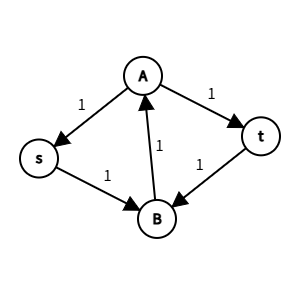

我们可以给出算法的大致流程：

- 初始化所有边流量为 $0$，然后构建初始的残余图 $G_f$
- 只要残余图 $G_f$ 中存在从 $s$ 到 $t$ 的路径（比如使用 DFS），就执行增广过程 Augment
    - 计算这条路径上的瓶颈容量 $b$，最大流的值 $+ b$
    - 对于正向边 $(u,v)$，$f(u,v) += b$；对于反向边 $(v,u)$，$f(v,u) -= b$
    - （这个正向边是相对于增广路径的正向，不是原图的正向）

算法每次迭代至少能增加 1 单位的流量，因此时间复杂度为 $O(m \times val(f^{\ast}))$，是伪多项式复杂度

### Correctness - Maximum Flow Minimum Cut Theorem

首先定义 s-t 割：我们将顶点集 $V$ 分为不相交两个部分 $(S, T)$，满足 $s \in S,t\in T$

将 s-t 割的容量 $c(S, T)$ 记为从 $S \to T$ 的边的容量和，不考虑反向边，比如图中的 s-t 割的容量为 $12 + 7 + 4 - 0 = 23$。最小割问题就是找出容量最小的 s-t 割

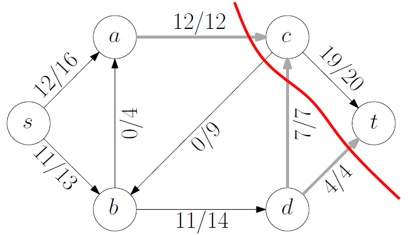

容易得到，对于任意流函数 $f$ 与任意 s-t 割 $(S, T)$，总流量的值为从 $S$ 流出的净流量

$$
\text{val}(f) = \sum_{u \in S, v \in T} f(u,v) - \sum_{u \in T, v \in S} f(u,v)
$$

因此 $\text{val}(f) \leq c(S, T)$，最大流量被割的容量所限制

现在，我们给出**最大流-最小割定理**，它包含三个等价命题：

- (1) $f$ 是最大流
- (2) $G_f$ 中不存在 $s\to t$ 的增广路径
- (3) 存在某个 s-t 割 $(S, T)$，使得 $\text{val}(f) = c(S,T)$

??? question "证明"

    - (1) -> (2)
    
    如果增广路径存在，则流量可以继续增加，那么从定义来看 $f$ 就不是最大流，因此逆否命题显然成立
    
    - (2) -> (3)
    
    考虑 $v \in T$，当 $G_f$ 中不存在 $s\to t$ 的增广路径时，我们可以构造这样的 s-t 割 $(S, T)$，其中能从 $s$ 出发并抵达的点属于 $S$，否则属于 $T$。容易得到 $s \in S, t \in T$
    
    对于每条从 $S\to T$ 的边 $(u,v)$：如果 $f(u,v) < c(u,v)$，则 $G_f$ 存在剩余容量，因此 $u\to v$ 可达，$v$ 应该在 $S$ 中而不是 $T$ 中，出现矛盾
    
    对于每条从 $T\to S$ 的边 $(v,u)$：如果 $f(v, u) > 0$，则 $G_f$ 中存在反向边 $(u,v)$，使得 $v$ 应该在 $S$ 中而不是 $T$ 中，出现矛盾
    
    因此 $f(u,v) = c(u,v), f(v,u) = 0$
    
    则
    
    $$
    \text{val}(f) = \sum_{u \in S, v \in T} f(u,v) - \sum_{u \in T, v \in S} f(u,v) = \sum_{u \in S, v \in T} c(u,v) = c(S,T)
    $$
    
    - (3) -> (1)
    
    考虑不等式 $\text{val}(f) \leq c(S, T)$，取等时则意味着 $f$ 是最大流

因此我们发现：求最大流问题等价为求最小割问题，一个网络中最大流的值等于最小割的容量

---

根据上面的等价命题，我们可以证明 Ford-Fulkerson 算法对于整数容量的正确性：

- Ford-Fulkerson 算法的每一步增广都至少增大 $1$ 的总流量，因此算法最终一定会终止（事实上，只要容量是有理数，那么算法一定会终止；除非容量是精确的无理数）
- 最终得到的残余图 $G_f$ 中，我们可以构造这样的 s-t 割 $(S, T)$，其中能从 $s$ 出发并抵达的点属于 $S$，否则属于 $T$。可以确定这就是一个最小割，对应的得到最大流

### Improvement

朴素的 Ford-Fulkerson 算法时间复杂度为 $O(m \times val(f^{\ast}))$，是伪多项式复杂度，受到最大流答案 $val(f^{\ast})$ 的约束很大

注意到朴素的 Ford-Fulkerson 算法在寻找增广路径时具有任意性，我们基于此给出两种优化：

- 每次选择最短的增广路径
- 每次选择瓶颈容量最大的增广路径

#### Shortest Augmenting Path Algorithm

这个算法（最初版本）的优化非常朴素：在寻找增广路径时，使用 BFS 搜索，确保找到的增广路径是最短的（边的个数最少），我们称之为 Edmonds-Karp 算法

我们给出两个引理：

- 在整个算法执行过程中，残余图 $G_f$ 中从 $s$ 到 $t$ 的最短路长度（边的个数）一定不会减少
    - 增广操作只会移除残余图中的正向边（使其满载），并可能添加反向边。反向边从高层级指向低层级，因此不会产生更短的新路径
- 在至多 $m$ 次最短路径增广之后，从 $s$ 到 $t$ 的最短路径长度一定严格增加
    - 每次增广至少会阻塞最短路径上的一条正向边（使其满载消失）。由于只有 $m$ 条边，最多 $m$ 次增广后，所有长度为 $k$ 的路径都将被阻塞，迫使最短路径长度增加到 $k+1$

因此最短路径长度基于 $1 \sim n-1$ 之间，增广的总次数为 $O(nm)$，而每次 BFS 找最短路的时间为 $O(m)$，因此这个改进算法的时间复杂度为 $O(nm^2)$

---

这个算法之后有更进一步的优化。虽然增广的总次数 $O(nm)$ 已经无法压缩，但是找最短路的过程可以进一步压缩

我们给出 Dinic 算法的改进思路：Dinic 算法并不在每次 BFS 时找到一条路就增广一次，而是会在 BFS 构建的层次图上，一次性地尽可能多地推送流量，也就是找多条增广路（这一步对应 DFS），直到该层次图无法再推送任何流量（即形成阻塞流），然后再重新 BFS 进入下一层

这一优化减少了 BFS 的总调用次数，从 $O(m)$ 降低到了 $O(n)$，因此新的时间复杂度为 $O(n^{2}m)$，这对于稠密图的优化非常有效

> 对于很多网络流问题，考虑单位容量网络，则 Dinic 算法有更紧的上界，比如 $O(\min(n^{2/3},\sqrt{m}) \times m)$，此处也不考虑

进一步的优化包含使用复杂度动态树数据结构，可以把单次增广时间的复杂度降至 $O(\log n)$，此处不做解释

#### Capacity-Scaling Algorithm

假设所有边的容量都是 $1 \sim C$ 之间的整数

设定 $\Delta$ 的初始值为最大的 $2^k \leq C$，每次只寻找瓶颈容量 $c \geq \Delta$ 的增广路径，如果找不到则 $\Delta$ 减半，直到 $\Delta = 1$

增广总次数 $O(2m\log C)$，每次寻路依旧为 $O(m)$，总时间复杂度 $O(m^2\log C)$，为弱多项式复杂度（受到数值大小的编码位数影响）

## Applications

经典的网络流模型有非常多显然与不显然的应用

如果题目没有额外说明，所有的容量，约束等值都是整数域上的

### Bipartite Matching Problem

称之为二分图最大匹配问题：

一个图是二分图，当且仅当可以二分点集为 $L,R$，保证所有的边的一对端点都分别在两个点集中，不存在只出现在某一个点集内的边

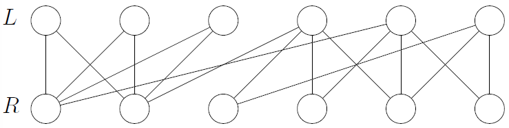

现在给定一张二分图，我们需要找到这样的边集（最大匹配），满足所有的点只被连接一次，且边的个数最大化

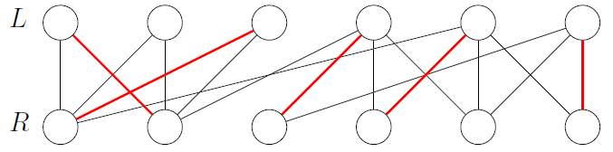

为了归约到最大流问题，我们转化原图：

- 人为添加一个源点 $s$ 与汇点 $t$，$s$ 向 $L$ 中所有点连一条容量为 $1$ 的有向边，$R$ 中所有点向 $t$ 连一条容量为 $1$ 的有向边
- 原始图中的无向边转化为 $L \to R$ 的容量为 $\infty$ 的有向边

然后在这张图中求最大流，得到的结果即最大匹配的大小。使用 Ford-Fulkerson 算法的时间复杂度为 $O(nm)$，因为最大流不超过 $n/2$

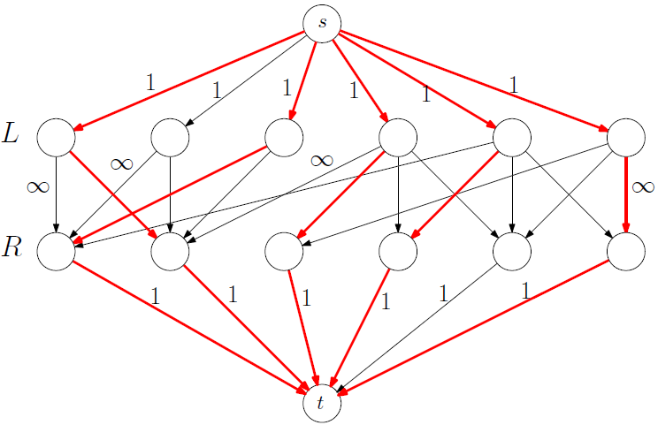

那么，如何证明原图最大匹配 $M$ 的大小 = 转化图最大流的值 $|S|$？

- 一方面，通过最大匹配 $M$ 的边，对应有向图中一定可以构造出对应流大小为 $|M|$ 的可行流，而最大流可能会更大，因此 $|M| \leq val(f^{\ast})$
    - 最大匹配一定对应某个可行流
- 另一方面，容易得到最大流算法得到的最大流一定是整数流，而对应连接 $L,R$ 的边的流量值 $f(e)$ 只能是 0 或 1。从源点流出的总流量与流入汇点的总流量都受限为容量 1，因此所有 $f(e) = 1$ 的边都不会共享顶点，对应原图是一个合法匹配，因此  $|M| \geq val(f^{\ast})$
    - 最大流一定对应某个合法匹配
- 因此 $|M| = val(f^{\ast})$

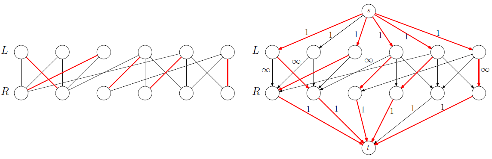

#### Perfect Matching

在寻找最大匹配的基础上，我们希望确认一个图是否存在“完美匹配”，即是否存在最大匹配，使用了所有的点？我们显然只考虑 $|L| = |R|$ 的情形

Hall 婚姻定理指出：在 $L$ 集合中任意选择子集 $X \subseteq L$，并将所有与 $X$ 中顶点相连的 $R$ 中顶点纳入为邻居集 $N(X)$。如果存在 $|N(X)| < |X|$，则完美匹配一定不存在

> 这个条件具有充分性和必要性，如果对于所有的 $X$，邻居集大小都比子集大，说明完美匹配一定存在

### s-t Edge Disjoint Paths Problem

一个新的问题：给定一个有向 / 无向连通图，并存在源点 $s$ 与汇点 $t$，我们需要找出从 $s$ 到 $t$ 的最大边不相交路径，满足所有的路径可以共用点，但是不能共用任意的边

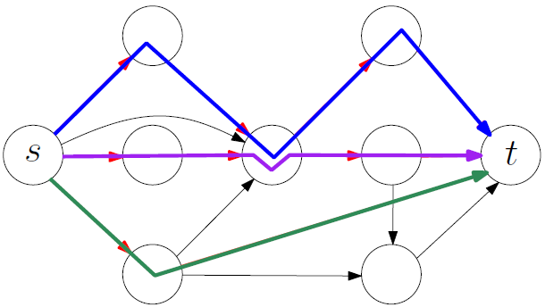

直接给出结论：从 $s$ 到 $t$ 的最大边不相交路径数量，等于 s-t 最小割的容量（考虑所有边容量都为 1，即切断 $s$ 和 $t$ 连接所需的最少边数）

> 如果想建立 $k$ 条互不相交的通道，需要从 $s$ 出发 $k$ 个单位的流量
>
> 如果存在一个由 $k$ 条边组成的最小割，那最多只能通过 $k$ 条不相交的路径
>
> Menger 定理指出，如果最小割是 $k$，你一定能找到 $k$ 条不相交路径（其实就是最大流-最小割定理对边容量全为 1 时的表述）
>
> 这对无向图也成立：完全断开 $s\to t$ 所需去掉的最少边的个数（最小割）等于最大不相交路径的个数
>
> 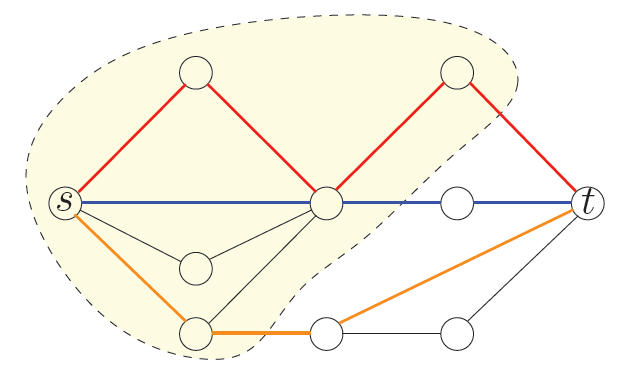

因此，我们定义每条边的容量为 $1$，计算最大流，其值等价为不相交路径个数，具体的：

- 最大流问题所有的边容量设置为 $1$，根据整性定理，求出的最大流在所有边上的流量值 $f(e) \in \lbrace 0,1 \rbrace$
- 在网络流计算完成后，我们每次找出路径上流量值全为 $1$ 的，从 $s$ 到 $t$ 的一条路径作为一条有效路径，记录，然后将路径上所有流量值全部设置为 $0$（这样接下来的路径就是互不相交的）
- 每一次循环找到的路径，就是一条合法的边不相交路径，直到无法找到任何路径为止

特别的，对于原图为无向图的情况，我们可以很自然的将一个无向边拆分为两条互反有向边，但是为了防止这条无向边被使用两次，如果计算网络流后，两条互反有向边都有流量，则将这两条边的流量直接设置为 0（循环流清零不改变净流量，同时还可以避免这条边被使用两次）

### Global Min-Cut Problem

给定一张无向连通图 $G$，要求删去尽可能少的边，使得 $G$ 不再连通

结合网络流问题的解决思路，有一个很暴力的方法：

- 将每一条无向边拆分为两条互反有向边，形成有向图
- 暴力枚举源点-汇点点对 $(s,t)$ 的位置，对于每一对 $(s,t)$ 都运行一次最大流算法，对所有的解取最小值

时间复杂度为 $\Theta(n^2)$ 次最大流的总时间开销

事实上，我们可以固定 $s$ 点，只改变 $t$ 点（因为只要固定 $s\in S$，则 $t\in T$ 中的任何一点，都会取得相同的 s-t 割），计算优化到 $\Theta(n)$ 次最大流的总时间开销

基于优先队列的 Stoer-Wagner 算法可以将时间复杂度压缩到 $O(nm+n^2 \log n)$，不过这门课不做讨论

### Circulation Problem

考虑循环流问题：一个有向图 $G = (V,E)$，边容量 $c_e$，而每个节点有一个供应量 $d_v$：

- $d_v > 0$ 表示这个节点提供 $d_v$ 单位的货物
- $d_v < 0$ 表示这个节点需要 $|d_v|$ 单位的货物

问题为：能否在不违反容量限制的情况下，从供应点运送到需求点，用数学语言描述为：

$$
\sum_{e \in \delta^{\text{out}}(v)} f(e) - \sum_{e \in \delta^{\text{in}}(v)} f(e) = d_v \quad \forall v \in V
\\
0 \leq f(e) \leq c_e \quad \forall e \in E
$$

> 考虑供需平衡，通常有 $\sum_{d_v > 0} d_v = \sum_{d_v < 0} -d_v$

---

我们假设所有的货物都来源于一个超级源点 $s$，所有 $d_v > 0$ 的节点都是从源点获取货物，然后对外提供；同理，定义一个超级汇点 $t$，所有 $d_v < 0$ 的节点需要的货物都是为了上交到汇点 $t$

我们考虑转化为最大流问题：

- 人为添加一个源点 $s$ 与汇点 $t$，对所有 $d_v > 0$ 的节点添加 $s\to v$ 的一条边，容量为 $d_v$；对所有 $d_v < 0$ 的节点添加 $v\to t$ 的一条边，容量为 $-d_v$
- 原图的边保持不变
- 现在的模型恰好是一个标准网络流模型，计算 s-t 最大流，如果最大流等于 $\sum_{d_v>0} d_v$，则说明存在可行的循环流

> 图中蓝色数字是 $d_v$，黑色数字是 $c_e$，红色数字是实际的流量 $f(e)$

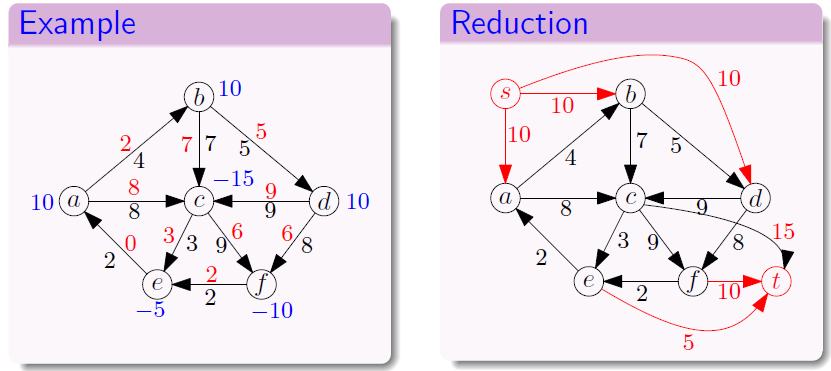

---

#### With Capacity Lower Bounds

原问题假定每条边只有上界容量限制而没有下界限制，现在考虑每条边 $e=(u,v)$ 存在下界流量：

$$
l_e \leq f(e) \leq c_e
$$

我们进行这样的转化，假设 $l_e$ 是已经固定通过的流量，那么 $u$ 失去了 $l_e$ 的货物，$v$ 得到了 $l_e$ 的货物：

- $d_u \leftarrow d_u - l_e$（能提供的货物量更少了）
- $d_v \leftarrow d_v + l_e$（需求的货物量的绝对值更小了）

相应的，边容量上下界减去 $l_e$，下界减小为 $0$，则回到了无下界限制的问题

!!! success "事实上，这个问题对应的就是之后的 Survey Design 等模型的后半部分流程：对于已经构造的循环流模型，添加超级源点、汇点进一步构成 s-t 流模型"

    某些模型初始情况下无法构成封闭的循环流（比如 Survey Design），这些模型的第一步就是先构建循环流模型，之后的步骤就与这个模型的处理流程一样

### Survey Design

我们重点描述这个问题，它的问题规约过程比较经典

考虑 $n$ 个顾客和 $k$ 个产品，当且仅当顾客 $i$ 购买过产品 $j$，这个顾客才可以对产品 $j$ 做一次问卷调查

限定每个顾客 $i$ 必须完成 $[c_{i},c'_{i}]$ 问卷，每个产品必须收集 $[p_j, p'_j]$ 份问卷

我们考虑顾客 $i$ 购买过产品 $j$ 对应图上的边 $(i,j)$，要求找到边集的子集合 $E'$，使得所有的顾客-产品约束都满足

---

不难发现这是个二分图问题（Customers 和 Surveys 为二分集合），我们不妨构建一个带容量上下界的流网络，将原问题规约为循环流问题

依旧是设定一个超级源点与汇点 $s,t$，对于顾客边 $(s,i)$，设定上下界为 $[c_i, c'_i]$，对于问卷边 $(j,t)$，设定上下界为 $[p_j,p'_j]$，而对于已有的边 $(i,j)$，它表示 $i$ 对 $j$ 贡献 $1$ 的问卷量，所以上下界 $\{0,1\}$

额外的，设定从 $t$ 到 $s$ 的边，定义为无上下界约束 $[0,\infty]$，这使得这一问题能转化为循环流问题

???+ question "为什么这个模型需要加这条循环边"

    **事实上，对于这两个问题，我们都在尝试构建相似的循环流模型**
    
    对于上一个供需流问题，不难发现它是供需守恒的，因此也不需要借助额外的流来平衡。换句话说，它是完全封闭在网络内部的，因此不需要加边就是一个循环流系统
    
    而这个问题的供需流没有守恒关系。换句话说，只有“顾客交问卷给某一产品”的单项流，并没有形成闭合。然而我们希望转化为循环流模型，所以认为加上一条无约束的边来闭合模型

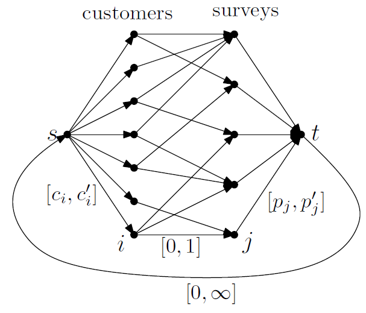

接下来的思路比较相近，因为边约束有下界，我们需要用相近的方法去除下界（上文已经解释）

然后为了最终转化为存在源点、汇点的经典网络流模型，我们需要再次引入超级源点，汇点 $S, T$，根据每个节点的正负性分配到 $S$ 或 $T$ 上（和上一个 Circulation Problem 的处理方式是完全一样的）

最终，我们得到经典的网络流模型，对其求最大流，如果最大流等于 $\sum_{d_v>0} d_v$，则说明存在可行的循环流，进而使原问题成立

> 总的来说，我们先使用一对源点和汇点构建循环流模型，并根据模型的封闭性判断是否需要添加回边，并考虑去除下界
>
> 如果手动添加了循环边，则需要在这之后继续引入新的源点与汇点，转化为标准 s-t 流，然后求最大流

??? abstract "一个很详细的 Example"

    考虑这样的例子，顾客 $C_1, C_2$，产品 $P_1, P_2$，其中顾客 $C_1$ 买过产品 $P_1,P_2$，顾客 $C_2$ 买过产品 $P_2$；顾客需要完成的问卷数 $C_1:[1,2],\; C_2:[0,1]$，产品需要收集的问卷数 $P_1:[1,1],\;P_2[1,2]$
    
    我们先使用一对源点和汇点构建模型
    
    ```mermaid
    graph LR
        S((S)) -->|"[1,2]"| C1((C₁))
        S -->|"[0,1]"| C2((C₂))
        C1 -->|"[0,1]"| P1((P₁))
        C1 -->|"[0,1]"| P2((P₂))
        C2 -->|"[0,1]"| P2
        P1 -->|"[1,1]"| T((T))
        P2 -->|"[1,2]"| T
    ```
    
    进一步的，发现模型并非封闭，需要添加回边构成循环流
    
    ```mermaid
    graph LR
        S((S)) -->|"[1,2]"| C1((C₁))
        S -->|"[0,1]"| C2((C₂))
        C1 -->|"[0,1]"| P1((P₁))
        C1 -->|"[0,1]"| P2((P₂))
        C2 -->|"[0,1]"| P2
        P1 -->|"[1,1]"| T((T))
        P2 -->|"[1,2]"| T
        T -->|"[0,∞]"| S
    ```
    
    接下来，<u>先根据下界标注每个节点的净需求</u> $b$，然后消除下界。和循环流问题一样，$b$ 为正值表示需要流出，负值表示需要流入
    
    （$P_1\to T$ 的边因为容量减小到 $0$，所以可以直接删去）
    
    ```mermaid
    graph LR
        S(("S<br/>b=-1")) -->|1| C1(("C₁<br/>b=+1"))
        S -->|1| C2(("C₂<br/>b=0"))
        C1 -->|1| P1(("P₁<br/>b=-1"))
        C1 -->|1| P2(("P₂<br/>b=-1"))
        C2 -->|1| P2
        P2 -->|1| T(("T<br/>b=+2"))
        T -->|∞| S
    ```
    
    最终，我们引入用于构建 s-t 流的超级源点、汇点（$S^\ast, T^\ast$），其中 $S^{\ast}$ 与所有的 $d > 0$ 的点相连，$T^{\ast}$ 与所有的 $d < 0$ 的点相连，边容量设定为 $|d|$（也包括第一对 $S, T$）
    
    ```mermaid
    graph LR
        Ss((S*)) -->|1| C1
        Ss -->|2| T
        S((S)) -->|1| Tt((T*))
        P1((P₁)) -->|1| Tt
        P2((P₂)) -->|1| Tt
    
        S -->|1| C1((C₁))
        S -->|1| C2((C₂))
        C1 -->|1| P1
        C1 -->|1| P2
        C2 -->|1| P2
        P2 -->|1| T((T))
        T -->|∞| S
    ```
    
    给出一个最大流方案（流量值 / 容量），其中最小割可以是 $\lbrace S^{\ast}\rbrace ,V\backslash \lbrace S^{\ast} \rbrace$
    
    最大流等于 $\sum_{d_v>0} d_v$，说明原问题有可行解
    
    ```mermaid
    graph LR
        Ss((S*)) -->|"1/1"| C1
        Ss -->|"2/2"| T
        S((S)) -->|"1/1"| Tt((T*))
        P1((P₁)) -->|"1/1"| Tt
        P2((P₂)) -->|"1/1"| Tt
        S -->|"1/1"| C1((C₁))
        S -->|"1/1"| C2((C₂))
        C1 -->|"1/1"| P1
        C1 -->|"1/1"| P2
        C2 -->|"1/1"| P2
        P2 -->|"1/1"| T((T))
        T -->|"3/∞"| S
    ```
    
    删除 $S^{\ast},T^{\ast}$，并恢复上下界，不难发现所有的边流量都在可行范围内
    
    ```mermaid
    graph LR
        S((S)) -->|"2<br/>[1,2]"| C1((C₁))
        S -->|"1<br/>[0,1]"| C2((C₂))
        C1 -->|"1<br/>[0,1]"| P1((P₁))
        C1 -->|"1<br/>[0,1]"| P2((P₂))
        C2 -->|"1<br/>[0,1]"| P2
        P1 -->|"1<br/>[1,1]"| T((T))
        P2 -->|"2<br/>[1,2]"| T
        T -->|"3<br/>[0,∞]"| S
    ```
    
    进一步的，删除 $S, T$，得到最终的可行结果
    
    ```mermaid
    graph LR
        C1((C₁)) ---|"1"| P1((P₁))
        C1 ---|"1"| P2((P₂))
        C2((C₂)) ---|"1"| P2
    ```
    
    这意味着当 $C_1, C_2$ 都对自己购买过的产品进行问卷调查时，可以满足所有的约束

### Airline Scheduling

考虑一个 DAG 图，每个顶点代表一个航班，边表示飞机可以在 $u\to v$ 飞行，我们希望最小化飞机个数来覆盖所有的航班

即：DAG 上的最小不相交路径覆盖问题，比如下图用两条路径就能覆盖所有顶点：

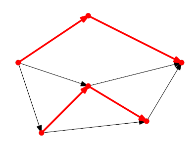

---

**第一种思路：循环流模型**

为了强制转化为网络流相关问题，我们约束“每个顶点必须至少被覆盖一次”，相当于对顶点等价为一条“容量为 1 的边”，那就不妨将每个顶点 $v$ 拆分一条上下界为 $[1,1]$ 的边 $(u,v)$

为了构成循环图模型，我们构造超级源点与汇点，源点与所有的 $u$ 连接，汇点被所有的 $v$ 连接，然后引入 $t\to s$ 的回边，容量设置为 $[0,k]$，其中 $k$ 就是最小覆盖路径数量（每条有效路径都会抵达 $t$，然后循环回 $s$，其流量自然为路径数的和）

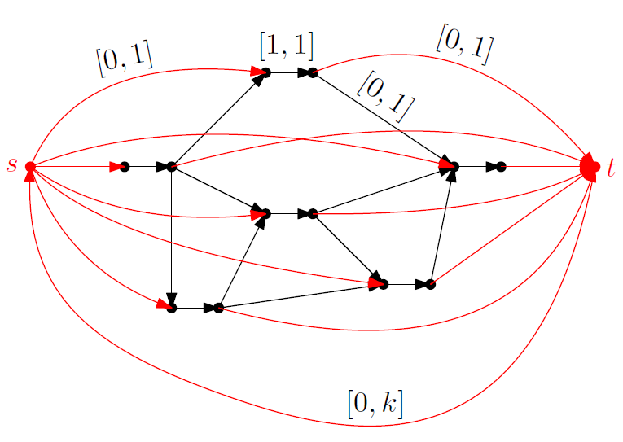

二分答案 $k$，对每个 $k$ 寻找可行流，就可以找出最小的 $k$

**第二种思路：二分图最大匹配**

相似的，我们将所有的顶点 $v$ 拆成两个顶点 $(v_{\text{out}},v_{\text{in}})$ 后，将所有的 $v_{\text{out}}$ 放入左部 $L$，将所有的 $v_{\text{in}}$ 放入右部 $R$，原图的边 $u\to v$ 保留为 $u_{\text{out}} \to v_{\text{in}}$（从一个点的出点出，到另一个点的入点进）

此时就得到了左右部分别有 $|V|$ 个点的二分图模型，我们套用二分图最大匹配的解法，得到若干条互不相交的路径

而事实上，我们将一个顶点拆成了两个顶点得到二部图，当我们重新将两个顶点还原为一个顶点时，我们对应的得到所有的覆盖路径，自然的，**路径数 = 顶点数 - 二分图最大匹配边数**

### Image Segmentation

给定一张无向图 $G$，对于每一个顶点 $v$，定义前景奖励 $a_v$ 与背景奖励 $b_v$，并且对于每一条边 $(u,v)$，定义切割惩罚 $c_{uv}$

我们希望对每个顶点进行二分类，如果分类到集合 $A$，则得到奖励 $a_v$；如果分类到集合 $B$，则得到奖励 $b_v$；此外，如果两个相邻的顶点（存在连边）被分到了不同的集合，则扣除切割惩罚 $c_{uv}$

目标是找出最优的切割方案，使得净奖励值最大

---

构造源点 $s$ 与汇点 $t$，然后：

- 对所有的顶点 $v$ 添加有向边 $(s,v)$，容量为 $a_v$
    - 如果求最小割时切掉这个边，说明 $v$ 属于集合 $B$，<u>放弃 $a_v$ 的奖励</u>
- 对所有的顶点 $v$ 添加有向边 $(v,t)$，容量为 $b_v$
    - 如果求最小割时切掉这个边，说明 $v$ 属于集合 $A$，<u>放弃 $b_v$ 的奖励</u>
- 对于原始的无向边 $(u,v)$，替换为<u>两条方向相反的有向弧</u>，容量均为 $c_{uv}$
    - 如果 $u,v$ 被切割了，那么割上的对应边手动减去 $c_{uv}$ 的惩罚值；否则不参与贡献

然后定义割 $(S,T)$ 为：$S = \lbrace s \rbrace \cup A ,\; T = \lbrace t \rbrace \cup B$，计算割的代价为：

$$
\text{Cut Value} = \sum_{v\in B} a_v + \sum_{v \in A} b_v + \sum_{cross} c_{uv}
$$

我们需要最小化以上损失，然后用总的奖励值（$\sum_v(a_v + b_v)$）去减割代价，就得到最大奖励值

因此，跑一遍最大流算法，就能得到最小的 Cut Value，进而用总的奖励值计算出最大的奖励值

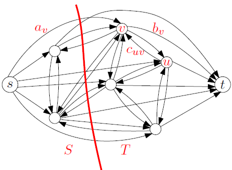

### Project Selection

考虑一个 DAG 图，节点 $v$ 表示一个项目，每个项目都有一个收益 $p_v$（可正可负），边 $(u,v)$ 表示依赖关系：如果想完成 $v$，则必须先完成 $u$

我们希望选出一个实施的项目子集合，满足所有的依赖都满足，且净收益最大

---

构造源点 $s$ 与汇点 $t$，然后：

- 对正收益节点 $v$，连边 $v,t$，容量为 $p_v$
    - 表示如果不选这个项目（成为割边），则损失 $p_v$
- 对负收益节点 $v$，连边 $s,v$，容量为 $|p_v|$
    - 表示如果选了这个项目（成为割边），则损失 $|p_v|$
- 对于原始的有向边 $(u,v)$，替换为容量无穷大的边
    - 这使得最小割一定不会处理这条边，保证项目依赖成立

通过最大流算法得到割 $(S,T)$，其中 $S$ 表示要选择的项目集合，$T$ 表示需要放弃的项目集合

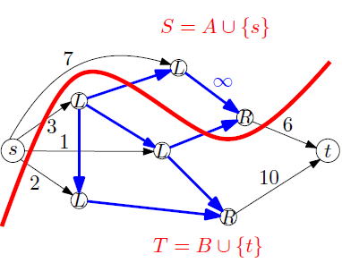

### Maximum Ind-Set Problem && Vertex-Cover

这两个问题都考虑无向图：

- 最大独立集问题 Maximum Independent Set Problem

在图中找出最多的点，满足点之间都没有边相连

- 顶点覆盖问题 Vertex-Cover

在图中找出最少的点，使得每一条边至少有一个端点是这些选中点之一

---

这两个问题都是 NP-Hard 的，但是在二分图上可以较好的求解

首先我们发现：如果 $S$ 是一个顶点覆盖，那么 $V \backslash S$ 就是一个独立集，因此我们有很重要的结论：

$$
\min(VC) = n - \max(IS)
$$

即：最大独立集的大小 + 最小顶点覆盖的大小 = $n$

进一步的，根据 König 定理，当 $G$ 为二分图时，我们有：

$$
\max(M) = \min(VC)
$$

即：二分图最大匹配的大小 = 二分图最小顶点覆盖的大小

因此，对于二分图，求最小顶点覆盖的大小和求最大独立集的大小，都可以转化为求最大匹配的大小，然后规约为网络流模型解答


