# Ch9. NP-Completeness

我们称一个算法是“Efficient”的，通常意味着他们的时间复杂度是多项式级别的：$O(n^{k}) \text{ for } k > 0$。反而，如果一个问题找不到多项式级别的算法，比如 $O(2^n),O(n!)$ 级别的，则意味着这些问题无法在合理的时间内解决，这些问题可能更倾向于去寻找近似解 or 特殊解

## Classical Hard Problems

这里给出三个典型的难问题

### Hamiltonian Cycle

给定一张图 $G$，问是否存在一条路径，经过每个点恰好一次后，能够回到起点。称这条路径为哈密顿回路

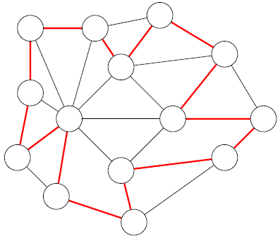

这个问题的朴素解法是枚举所有可能的点排列，然后进行检查，时间复杂度 $O(n!m) = 2^{O(n\lg n)}$，即使有更优的解法也只能实现 $2^{O(n)}$

这是一个 NP-Hard 问题，有时我们会使用启发式算法尝试求解

### Maximum Independent Set Problem

上一节提到的最大独立集问题，给定一张图 $G$，求出最大的子点集，满足集合中的点互不相邻

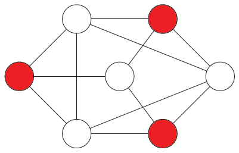

这个问题等价为在补图上找最大团，两者都是 NP-Hard 问题

这个问题甚至没有近似多项式解法，针对二分图、树等特殊图存在特殊的多项式解法

### Formula Satisfiability

我们又称之为 SAT 问题：给定一个布尔公式（由布尔变量、AND、OR、NOT 组成），判断是否存在一组对布尔变量的取值，使得整个公式的值为 True

定义一个布尔变量或者它的反（$x$ 或者 $\neg x$）为一个“文字”，如果一个布尔公式的每个子句最多只有 $k$ 个文字，则记为 k-SAT 问题

- 比如 $(x_1 \lor x_2) \land (\neg x_1 \lor x_2) \land (x_1 \lor \neg x_2)$ 是一个 2-SAT 问题
- 比如 $(\neg x_1 \lor x_2 \lor x_4) \lor (x_1 \lor \neg x_2 \lor x_3)$ 是一个 3-SAT 问题

结论是：一旦 $k \geq 3$，k-SAT 问题就是 NP Hard 的（1-SAT 和 2-SAT 都是 P 问题）

## P, NP and Co-NP

考虑一个问题，如果它的 Output 为求最值，则这个问题是一个优化问题；如果它的 Output 为真或假，则这个问题是一个决策问题

如果一个决策问题能被高效解决，那么利用二分查找等方法也可以高效解决对应的优化问题。因此分析问题时通常专注于研究决策问题

---

为了用纯数学的方式定义一个<u>决策问题</u>及其效率，我们用二进制来编码，并最终得到 $\{0,1\}^{\ast} \to \{0,1\}$ 的输入-输出映射

我们定义输入的大小 $|s|$ 为输入字符串的长度，通常我们使用二进制编码，比如对于输入 $5_{10} = 101_{2}$，那么长度 $|s| = 3$

> 事实上，如果一个算法在二进制编码下是多项式时间，那么在其他自然进制下，也应该是多项式时间（而不关心多项式时间具体的阶的大小）。所以这里使用十进制也可以

这个问题的理想解决为一个黑盒映射 $X:\{0,1\}^{\ast} \to \{0,1\}$，而我们的算法为白盒映射 $A$，我们希望 $A(s) = X(s)$ 始终成立，这就说明设计的算法正确

如果输入的长度为 $|s|$，而算法执行的步骤数不超过一个关于 $|s|$ 的多项式 $p$，那么我们称这个问题为 P 类问题，这样的问题我们认为是高效的

> 以上的内容只是为了明确“问题”与“效率”的边界

### Complexity Class

NP 问题指的是无法在多项式时间内求解，但是可以在多项式时间内用验证算法（验证器 Certifier）判定某个具体解（证书 Certificate）的问题

> 比如：对于哈密顿回路问题，我们记一条具体的回路为证书 Certificate，记验证算法（比如沿着这条路模拟一遍）为验证器 Certifier
>
> 验证器 Certifier 是多项式算法

证书存在规模条件，必须与输入规模差不多：

$$
|encoding(S)|≤p(|encoding(G)|)
$$

其中 $|encoding(S)|$ 是编码后的证书规模，$|encoding(G)|$ 是编码后的输入规模，$p$ 是一个多项式

> 否则，一个包含所有可能解的证书，其预计算过程已经超出了接受范围

---

Co-NP 问题指的是：如果它的补问题属于 NP，则原问题属于 Co-NP

> 简单来说，如果难决策问题的 Yes 输出对应“存在一个”，则它是 NP 问题；如果 Yes 输出对应“满足所有”，则它是 Co-NP 问题
>
> 比如：“一个图存在哈密顿环”的 Yes 输出是找出一个正确的解，是 NP 问题；“一个图不存在哈密顿环”的 Yes 输出是确保所有的解都是错误的，是 Co-NP 问题
>
> 直觉上，Co-NP 比对应的 NP 更难

另一个典型的例子是重言式（tautology）问题：给定一个布尔公式，判定这个公式是不是永真的。因为验证这个问题需要对所有的可能性进行验证，所以它是 Co-NP 的（如果验证这个公式不是永真的，那么找出一个例子即可，因此它的补问题是 NP）

---

P 类问题指的是那些可以在多项式时间内求解的问题

注意到这样的问题也一定能高效的验证，因此

$$
\text{P} \subseteq \text{NP} \cap \text{Co-NP}
$$

至于 P 是否等价为 NP，NP 是否等价为 Co-NP，目前处于尚未解决的问题。一种比较让人相信的可能性是：

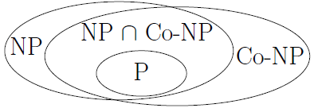

## Polynomial Time Reductions and NP-Completeness

对于一个较为未知的问题 $Y$，如果我们能找到一个已知难度的问题 $X$，能够让 $Y$ 的任何一个实例在多项式时间内归约到 $X$ 的某个实例，并且转化前后答案保持不变（即 $Y$ 的答案为 Yes 当且仅当对应的 $X$ 实例答案为 Yes），那么我们说 $Y$ 可以归约到 $X$，记为

$$
Y \leq_{P} X
$$

> 也即，我们可以通过调用多项式次数的、解决 $X$ 问题的黑盒算法，来设计出一个解决 $Y$ 问题的多项式时间算法

我们分析 $Y \leq_{P} X$ 这个归约结果：

- 如果 $X$ 是 P 问题，则 $Y$ 一定是 P 问题（证明正结果）
- 如果 $Y$ 是难问题，则 $X$ 一定是难问题（证明负结果）

一个比较显然的例子是，我们记哈密顿路径问题（HP）为未知问题 $Y$，记哈密顿回路问题（HC）为已知问题 $X$

我们假设要找 $s\to t$ 的路径，则添加一个新节点连接到 $s,t$，调用 HC 的黑盒算法判定是否存在哈密顿回路，如果存在，去掉刚刚加上的两条边，就对应了 HP

因此

$$
HP \leq_{P} HC
$$

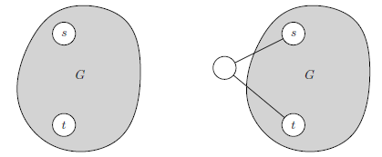

## NP-complete Problems

我们定义一个问题是 NP-complete 的，如果：

- $X$ 是 NP 问题
- 所有的 NP 问题都可以归约到 $X$

NP-complete 是最难的一批 NP 问题，如果未来能证明其中一个为 P 问题，则 $P = NP$ 就是成立的

???+ question "NP, NP-Hard, NP-complete"

    如果一个问题可以在多项式时间内对某个候选解进行验证，则它是 NP 问题
    
    如果一个问题能够做到，任何的 NP 问题都可以在多项式时间内归约到它，那么它是 NP-Hard 问题，意思是至少和任意的 NP 问题一样难（NP-Hard 问题不一定是 NP 问题，比如这个问题是非决策问题 / 不可决策问题）
    
    > 判定哈密顿回路是否存在是 NP，找最短的哈密顿回路是 NP-Hard 但不是 NP，因为这个问题没有“多项式内验证”的要素
    > 
    > 停机问题是 NP-Hard，因为它不可判定，所以也不是 NP
    
    进一步的，如果一个 NP 问题同时是 NP-Hard 的，则它是 NP-complete 问题

### Circuit-Sat

考虑一个有效的组合逻辑电路图，存在若干输入和一个输出，判定是否存在一组输入，使得输出为 1

这个问题是第一个被证明为 NP-complete 的问题：

- 给定一组输入赋值，我们只需逐门计算电路，验证输出是否为 1。验证步骤显然是多项式任务，因此这个问题是 NP 问题
- 接下来需要证明所有的问题都可以转换为 Circuit-Sat 问题：已知我们可以在计算机（本质是个布尔电路）上运行任意的有效算法，如果某个算法在 $T(n)$ 的步骤内完成，则展开每个时间周期的状态为时间序列，构建对应的组合逻辑电路（电路大小 $p(T(n))$ 满足多项式），就将原算法完成了归约
    - 进一步的说，假设 $v$ 是任意的 NP 问题，接受问题实例 $x$，存在多项式时间的验证算法 $V$，Certificate 为 $w$
    - 将验证算法 $V$ 转化为布尔电路 $C$，输入包括固定的问题实例 $x$ 和自由的证书 $w$

因此所有的问题（包括 NP 问题）都可以归约到 Circuit-Sat，这个问题是一个 NP-complete 问题

> 以哈密顿回路问题为例，给定的图为问题实例 $x$，一种候选解回路为 $w$，编码为二进制后作为验证器的输入，完成归约

### Reductions of NP-Complete Problems

一切归约的开端都是 Circuit-Sat 问题，进一步的，我们可以给出一个 NP-complete 树，树上的所有问题都可以相互归约

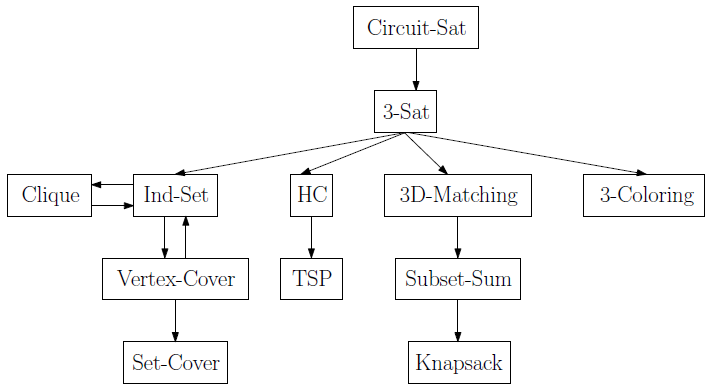

我们给出图中相邻问题的归约过程

 

- **Circuit-Sat ~ 3-SAT**

把任意逻辑电路转换为可满足性等价的合取范式（CNF），在引入中间变量的情况下，最后总是可以整理成每个子句恰好包含 3 个文字（变量或其取反）的形式

具体的，我们在保留所有原始输入变量的情况下，为电路的每一条连线也分配唯一的布尔变量，对电路中的每一个逻辑门，将其输入与输出之间的关系写成等式约束，将这些等式用 $\land$ 连接。最后将输出本身作为单文字子句并入公式

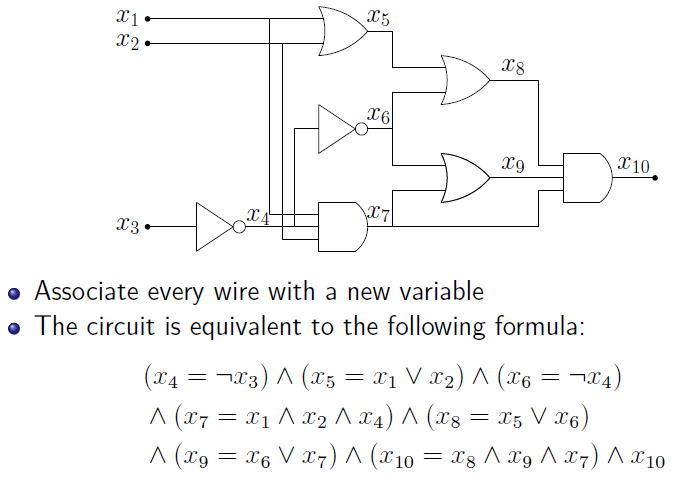

对于所有的子句，我们依次利用真值表拆分为 CNF

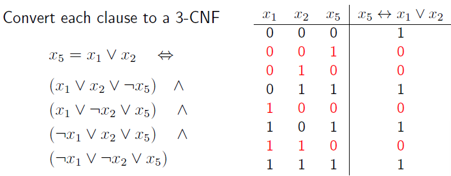

拆分后，对于长度不为 3 的 CNF，我们可以引入中间变量，将 CNF 填充为一个 / 分裂为多个 3-CNF

此时就完成了归约

 

- **3-SAT ~ Ind-Set**

每个子句看作一个圆形分组，分组内的三个顶点对应三个文字，这三个文字互相连边，表示在同一分组内只能选择一个顶点（体现独立集的约束）

此外，不同分组内的互斥文字 $x,\neg x$ 也要连边，防止同时选择

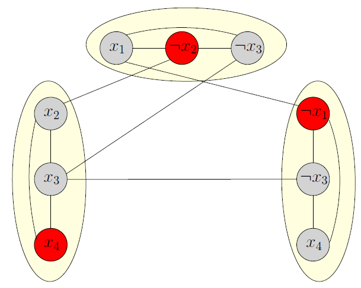

我们就上面的模型进行互相归约

- 考虑一个 3-SAT 任务，为了使输出为 1，我们希望每一个子句内至少有一个文字为 1，因此我们需要在每个圆形分组中选择唯一的文字（不选择则 3-SAT 输出不为 1，多选则不满足独立集）。不难发现，如果 3-SAT 有解，则选中的所有文字是互不相邻的，对应一个独立集
- 考虑一个独立集 $S$，构建三角形的圆形分组，每个分组对应一个 3-CNF 项。对于每一个变量 $x_i$，如果 $x_i$ 在 $S$ 中，赋值为 $x_i=1$；如果 $\neg x_i$ 在 $S$ 中，则赋值为 $x_i = 0$，否则任意赋值（不影响子句），可以确定这样的证明满足对应的 3-SAT 表达式

因此 3-SAT ~ Ind-Set 可满足性等价

 

- **Clique ~ Ind-Set**

Clique 即团问题，在无向图 $G$ 中找到最大的点子集 $S$，使得所有顶点互相连接

不难发现在 $G$ 的补图中，对应的点子集 $S$ 的顶点互不连接。因此团问题和最大独立集问题可以完全等价

 

- **Vertex-Cover ~ Ind-Set**

Vertex-Cover 即点覆盖问题，在无向图 $G$ 中找到最大的点子集 $S$，使得每一条边都至少与 $S$ 中的某一个顶点相连

不难发现对于剩下的那些点 $V \backslash S$，它们一定是互不相连的，因此剩下的点构成了独立集，即点覆盖问题和最大独立集问题可以完全等价

 

- **Set-Cover ~ Vertex-Cover**

Set-Cover 即集合覆盖问题：给定一个全集和若干子集，保证子集的并集为全集。找出最小的子集集合，其并集能否覆盖全集

考虑二分答案后转化为决策问题：能否找到不多于 $t$ 的子集可以覆盖全集

我们对所有的条件进行映射：

- 全集有 $m$ 个元素，对应无向图中的 $m$ 条边（被覆盖的全集 → 被覆盖的边）
- 有 $n$ 个子集，对应无向图中 $n$ 个顶点（用子集覆盖 →用点覆盖）
- 某个子集合 $S_v$ 中包含元素 $e$，对应顶点 $v$ 与边 $e$ 存在关联

> 一个更显然的归约是：将全集的元素和子集分别作为二分图的两部分点元素，某个子集合 $S_v$ 中包含元素 $e$ 说明存在连边

容易得到：点覆盖有解等价为集合覆盖有解。事实上，点覆盖问题是集合覆盖问题的一个特例。当每个元素恰好出现在两个集合中时，集合覆盖问题就退化成了点覆盖问题

 

- **3-SAT ≤ 3-Coloring**

考虑一个无向图，对每个顶点进行染色，总共有三种颜色可选，要求任意一条边的两个顶点颜色不相同，判断是否存在这样的染色方案

> 2-Coloring 问题等价为判定是一个图是否是二分图，后者可以通过判定奇数长度的环在多项式时间内解决，因此 2-Coloring 是 P 类问题

我们定义三种颜色为绿色（True），红色（False），棕色（Base），考虑无向图上的一个三角形，必然对应着三种颜色各一个

对原始的 3-SAT 公式中，每一个布尔变量 $x_i$ 都创建两个节点（$x_i,\neg x_i$），将所有的节点与 Base 节点相连

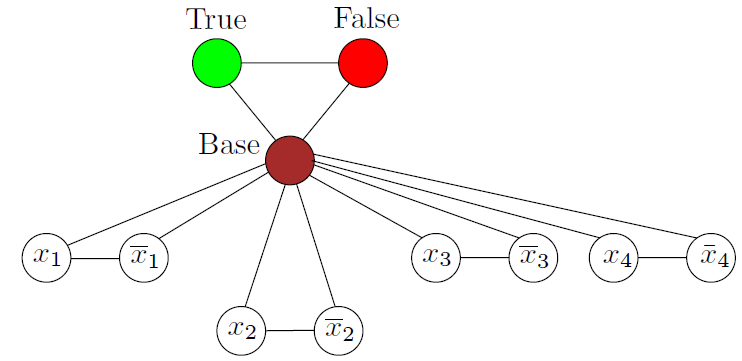

那么对于这些变量节点，它只能选择为 True 或 False，同时因为 $x_i,\neg x_i$ 也是互相连接的，所以不会出现同一个变量的赋值矛盾

!!! warning "看不懂，先跳过了"

 

- **Directed-HC ≤ HC**

尝试将有向图的哈密顿回路问题归约到无向图的版本，注意到，对于每条有向边 $u \to v$，我们可以对每个点进行拆点，得到 $u_{in} - u_{out} - v_{in} - v_{out}$ 的无向链，注意到没有 $v_{out} - u_{in}$ 的可行路径，因此上面的无向链等价为原来的有向边

将整个有向图拆点转换为无向图，即可归约到无向图 HC 问题

 

- **3-SAT ≤ Directed-HC**

对于一个 3-SAT 问题，我们提取每一个变量，分别构建一条双向长路径，并且定义：

- 当在这条路上从左往右走时，说明 $x_i = 1$
- 当在这条路上从右往左走时，说明 $x_i = 0$

并且使用 $s,t$ 两顶点进行串联，哈密顿回路从 $s$ 开始，经过所有的变量路径，最终到达 $t$，回到 $s$

以下图为例：$x_1 = 1,x_2 = 1,x_3 = 0,\cdots,x_n = 0$

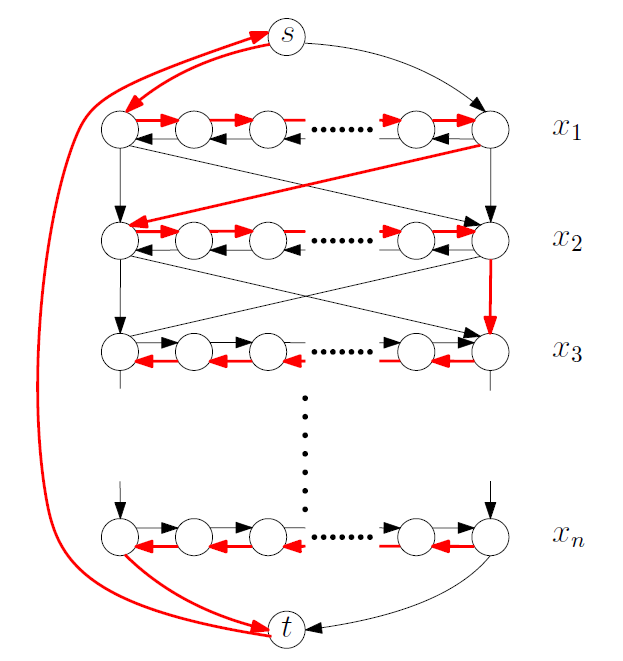

我们紧接着注意到，每个 $x_i$ 对应两种选择，那么上面的图恰有 $2^n$ 个不同的哈密顿环，并且每一个哈密顿环唯一对应一种变量赋值方案

对于每一个子句，我们可以像这样设计新的顶点，并且利用有向边进行约束：

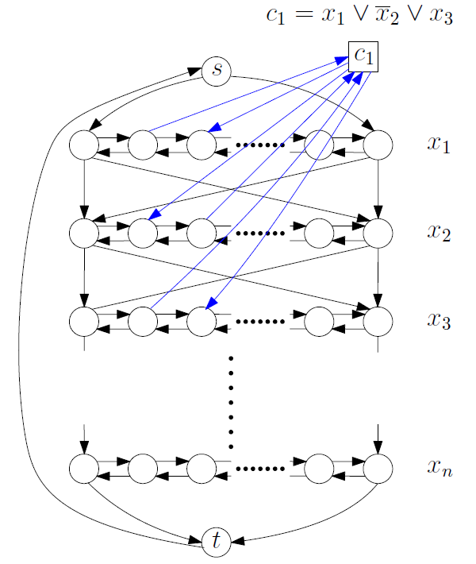

> 以上图为例，考虑 $x_1$，如果 $x_1 = 0$，则从 $x_1$ 的长路径路过 $c_1$ 时一定会形成一个子环（就不会是一个哈密顿环），那么我们就约束住了 $x_1 = 0$ 时无法到达 $c_1$
>
> （以下图，如果从右往左走，则路过 $S$ 前必须依次路过 $B$ 和 $A$，这样得到的路径不满足哈密顿回路）
>
> 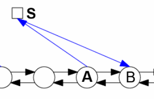
>
> $x_1 \lor \neg x_2 \lor x_3$ 指出，如果 $x_1 = 0,x_2 = 1,x_3 = 0$，则 $c_1$ 不可能会被访问，那么哈密顿回路就无法构建

对于多条子句，我们会在一条长路径上进行多个约束的设置（因此这个路径需要一定的程度来容纳子句约束，图中的不等号似乎符号反了）：

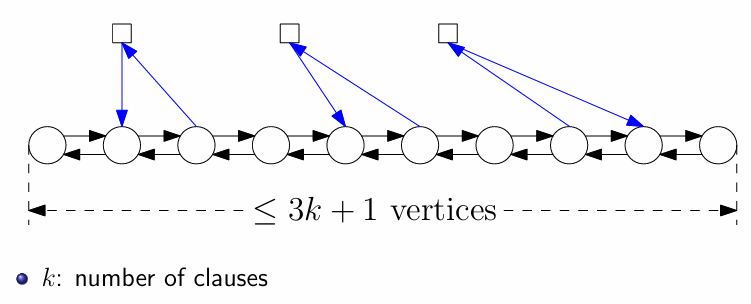

不难得到，在这个图上，判定哈密顿回路和判定是否存在 3-SAT 可行解是等价的

 

- **HC ≤ TSP**

决策模型下的旅行商问题为：输入为一个有向带权图，问是否存在一个回路，经过所有节点恰一次后回到原点，且总路径长度不超过 $D$

我们希望将 HC 问题归约到 TSP 上，我们构造顶点不变的完全图，定义原图存在的边的长度为 $1$，不在原图上的边的长度为 $2$（比 $1$ 大就行），然后在这个完全图上跑 TSP 模型，其中设定 $D = |V|$

这样，当且仅当原图 $G$ 有哈密顿回路，TSP 模型才能找到总路径长度不小于 $D$ 的回路

 

- **3-SAT ≤ 3D-Matching**

3D-Matching 问题是在二分图匹配基础上，再添加一个匹配集合

需要找到 $n$ 个互不相交的三元组覆盖所有元素

为了近似归约到二分图匹配问题的模型，我们不妨将第三个维度修正为颜色：

- 三元组 $(1, A, B)$ 变成了 $1 \to A$ 的一条颜色为 $a$ 的边

目标依旧是找到完美匹配，但是颜色使用不能重复，比如：（加粗的为选择的边）

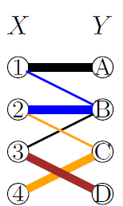

??? warning "看不下去了，只能赌不考"

 

- **3D-Matching ~ Subset-Sum**

回顾子集和问题：给定一个上界 $W$，总共 $n$ 个物品分别有权重 $w_i$，我们希望最大化权重和 $w_i$，但同时又不能超出上界。对于决策模型的版本，我们希望权重和恰好为 $W$

如何归约呢？我们从 3D-Matching 模型开始，列出二维表格，每行表示三元组，每列表示单个元素。如果三元组中存在某一个元素，在对应的列上记为 $1$，否则记为 $0$

接下来，我们要约定一个基数 $B$，至少要大于三元组的个数 $m$

对每个三元组构造一个 $3n$ 位的 $B$ 进制数，分别对应 $X, Y, Z$ 三个维度中的元素

转化为子集和问题，目标值 $W$ 设定为 $B$ 进制下所有位数都为全 $1$

于是我们得到下面的表格：

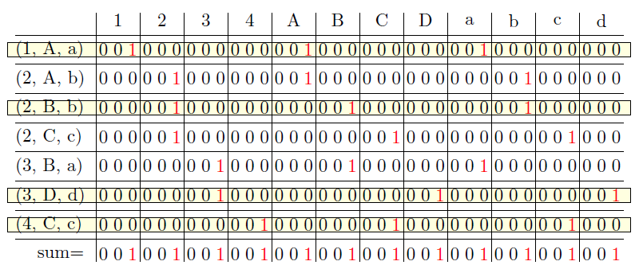

> **从 3D-Matching 模型的角度来看，我们在选择三元组时，保证每个元素只被选择了一次，是一个精确覆盖（体现在 Sum 各个位为 $1$）**
>
> **从子集和模型的角度来看，每一行看作一个长的 $B$ 进制数字，我们选择若干行（物品的权重）进行累加，得到的 Sum 值为 $B$ 进制下全一的数字，也就是我们约定的 $W$ 值**
>
> （为什么 $B$ 需要足够大？预防跨元素列的进位现象）
>
> 以上，这个问题完成了互相的规约

 

- **Subset-Sum ≤ Knapsack**

直接令背包容量 = 目标价值即可

## Dealing with NP-Hard Problems

我们无法证明 NP-complete 问题的“无条件”下界

以 3-SAT 问题为例，假设有 $n$ 个变量，目前的算法最快可以在 $O(c^n)$ 的时间内解决它（上界），甚至下界也只是 $\Omega(n)$ 级别（目前没有能用来证明运行时间下界的技术，也就是说，无法从数学上严谨地证明这个问题必须花那么多时间）

那么，对于一个 NP-Hard 问题，通常可以如何处理？

### Faster exponential time algorithms

我们尝试优化指数级复杂度 $O(c^n)$

比如对于 3-SAT 问题，暴力解法为 $O(2^n \cdot \text{poly}(n))$，目前的优化解法达到了 $O(1.3334^n \cdot \text{poly}(n))$

对于旅行商问题，暴力解法为 $O(n! \cdot \text{poly}(n))$，优化解法为 $O(2^n \cdot \text{poly}(n))$

在实践中，专门用于计算这种问题的 Solver 能够解答具体实践中变量数较多的问题

### Solving the problem for special cases

一些 NP-Hard 问题在某些特殊情形下有更优秀的多项式解法

比如最大独立集问题，对于一般的图是 NP-Hard 的，但是：

- 二分图：我们转化为最小点覆盖问题，再利用 Kőnig 定理转化为最大匹配问题，然后用匈牙利算法 / 网络流模型在多项式时间内求解，其中带优化的匈牙利算法的时间复杂度为 $O(m\sqrt{n})$
- 树：可以在树上进行动态规划，时间复杂度达到 $O(n)$

### Fixed Parameter Tractability

某些算法的时间复杂度可以写为 $f(k)\cdot n^c$，其中 $n$ 是问题规模，$k$ 是一个独立的参数

以点覆盖问题为例，如果我们判断的是存在大小为 $k$ 的点覆盖，那么 FPT 对应的时间复杂度为 $O(2^k\cdot kn)$，在假定 $k$ 比较小的情况下，算法的时间复杂度是可以看作多项式时间的

这和“伪多项式复杂度”不太一样，因为伪多项式复杂度其实是受输入规模影响的，而 FPT 是一个独立的结构参数

### Approximation Algorithms

我们不再追求找到最优解，而是希望在多项式时间内找到可以接受的较优解（划定一个近似比：算法输出解的质量与最优解质量之比）。目标是保持多项式时间的同时，尽可能减小近似比

点覆盖问题（vertex-cover）就存在 2-approximation 的近似算法：即输出解的大小不超过最优解的 $2$ 倍

---

下一章会列举出一些随机算法和近似算法
