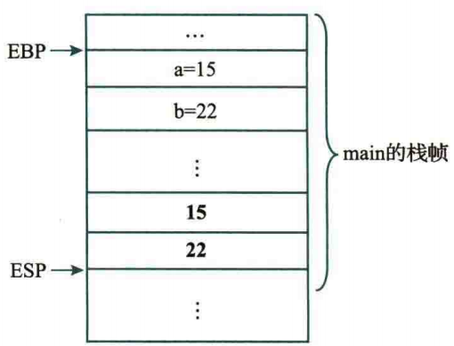
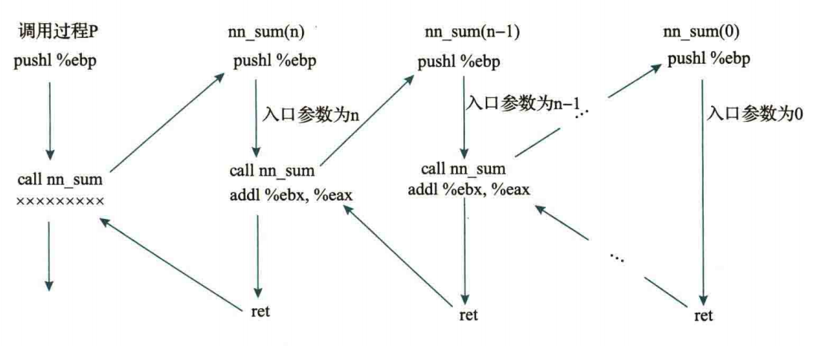
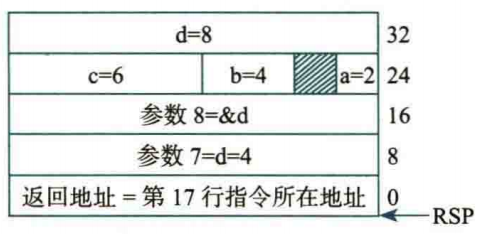

# Ch.4 程序的机器级表示

## 过程调用约定

我们假设过程 P 要调用过程 Q（可以理解为函数 P 调用函数 Q），为了能让 Q 顺利接收参数执行，同时不影响 P 的后续执行，需要进行约定：

> 准备阶段

① P 将入口参数放在 Q 能访问的地方

② P 提前保存一些内容，比如返回地址，然后将控制权交给 Q

③ Q 保存 P 的一些现场，然后位自己的非静态局部变量分配空间

> 执行阶段

④ 执行 Q 的函数体部分

> 结束阶段

⑤ Q 还原 P 的现场，释放临时使用的栈空间

⑥ Q 取出返回地址，将控制权交给 P

### IA-32 的过程调用

我们一步步进行讨论：

> ① P 将入口参数放在 Q 能访问的地方

IA-32 架构中，过程调用主要通过栈来传递参数，而参数是从右往左压栈的，比如：

```c++
int foo(...){
    // ...
    bar(a, b, c);
    // ...
}
```

那么对应的栈帧结构就是：

```
high addr                       
    |     |    c    |           
    |     |---------|           ↑
    |     |    b    |           | 注意：对参数的读取依旧是从低往高读的
    |     |---------|           |
    |     |    a    | 
    ↓     |---------|<=== ESP
 low addr
```

> ② P 提前保存一些内容，比如返回地址，然后将控制权交给 Q

返回地址依旧通过栈暂存

```
high addr
    |     |        c        |
    |     |-----------------|
    |     |        b        |
    |     |-----------------|
    |     |        a        |
    |     |-----------------|
    |     |  ret_addr of P  |
    ↓     |-----------------| <=== ESP
 low addr
```

之后 EIP 被修改为 Q 的初地址

> ③ Q 保存 P 的一些现场，然后为自己的非静态局部变量分配空间

比较常见地，我们会遇到下面的代码：

```gas
push %ebp			# 存储 P 的栈基地址
mov %esp, %ebp		# P 的 ESP 成为 Q 的 EBP
sub $N, %esp		# 为 Q 开辟一些栈空间以供后续使用，确保不影响 P 的内容
```

对应的栈空间现状是：

```
high addr
    |     |        c        |
    |     |-----------------|
    |     |        b        |
    |     |-----------------|
    |     |        a        |
    |     |-----------------|
    |     |  ret_addr of P  |                  P 的栈帧
    |     |-----------------|------------------ 
    |     |   old ebp of P  |                  Q 的栈帧
    |     |-----------------| <=== NEW EBP  
    |     |                 |
    |     |-----------------|
    |     |     ... ...     |
    |     |-----------------|
    |     |                 |
    ↓     |-----------------| <=== ESP
 low addr
```

我们记每个过程开辟的栈空间为**栈帧**，EBP 为当前所在栈帧的栈底，ESP 为栈顶

这里需要额外指出一点，GCC 为了保证 x86 架构中数据的严格对齐，其 ABI 规定每个函数的栈帧大小必须是 16 Bytes 的倍数，所以 `#!gas sub esp, N` 这里的 N 一定是 16 的倍数

> ④ 执行 Q 的函数体部分

Q 在自己的栈空间中进行操作

>⑤ Q 还原 P 的现场，释放临时使用的栈空间

```gas
mov %ebp, %esp			# Q 的 EBP 还原为 P 的 ESP 
# 或者写 add $N, %esp
pop ebp
```

现在的情况和 ③ 一样了

```
high addr
    |     |        c        |
    |     |-----------------|
    |     |        b        |
    |     |-----------------|
    |     |        a        |
    |     |-----------------|
    |     |  ret_addr of P  |
    |     |-----------------| <=== ESP (After pop)
    |     |   old ebp of P  | (这个值被弹出传送到了 EBP)
    |     |-----------------|
    |     |      unused     |
    |     |-----------------|
    |     |      unused     |
    |     |-----------------|
    |     |      unused     | 
    ↓     |-----------------|
 low addr
```

> ⑥ Q 取出返回地址，将控制权交给 P

弹栈取出返回地址，回到 P 的过程

```
high addr
    |     |        c        |
    |     |-----------------|
    |     |        b        |
    |     |-----------------|
    |     |        a        |
    |     |-----------------| <=== ESP
    ↓     |  ret_addr of P  | (这个值被弹出传送到了 EIP)
 low addr
```

最后根据 `cdecl` 约定，调用者 P 还要将为 Q 准备的入口参数清理掉：

```gas
add esp, $12			# a, b, c 的大小为 12 Bytes
```

<br>

### IA-32 寄存器约定

注意到：P 和 Q 共用一套通用寄存器，如果 Q 修改了 GPR 的值，那么会影响 P 之前对 GPR 的维护情况。因此我们在进行过程调用时，需要“保存一份副本”

保存 GPRs 的值既可以让 P 在转移控制权至 Q 之前完成，也可以在 Q 获取控制权之后立刻完成。据此我们将通用寄存器分为**调用者保存寄存器**和**被调用者保存寄存器**

调用者保存寄存器 (Caller-saved registers) 的内容由外层过程 P 进行维护，内层过程 Q 在拿到控制权后可以随意使用，ret 回到 P 后会进行恢复

被调用者保存寄存器 (Callee-saved registers) 的内容由内层过程 Q 进行维护，需要确保 Q 在开始与结束阶段分别保存和恢复这些寄存器的值

EAX ECX EDX 都是 Caller-saved；EBX ESI EDI EDP 都是 Callee-saved

??? question "为什么要这样设计呢？"

    首先，EAX 通常约定为存储函数调用的返回值，它必须是 caller
    
    对于 ECX EDX，它们通常是算术指令的首选/指定操作数，或者频繁使用的寄存器，都属于短期使用的寄存器，因此作为 caller 寄存器非常合适，内层过程 Q 不需要进行维护，更加方便
    
    相比之下，EBX、ESI、EDI、EBP 都是长期使用的内容（生命周期长），从另一个角度来说，错误覆盖掉 EBX、ESI、EDI、EBP 的影响一定是更严重的（相比之下，错误覆盖掉 ECX 这些短期使用的寄存器可能影响不大），因此需要被调用方 Q 进行保存
    
    借用 AI 生成的总结：
    
    - caller-saved 寄存器 → 适合存放“短命值”，比如表达式的中间结果
    - callee-saved 寄存器 → 适合存放“长命值”，比如跨函数调用仍需使用的变量

<br>

### 值传递 & 地址传递

我们知道，对于一个栈上存储的局部变量，当对应的栈空间被释放时，其生命周期也就结束了

举一例：

```c++
// in main(): swap1(a, b);
void swap1(int a, int b){
    a = a ^ b;
    b = a ^ b;
    a = a ^ b;
}

// in main(): swap2(&a, &b);
void swap2(int *a, int *b){
    *a = *a ^ *b;
    *b = *a ^ *b;
    *a = *a ^ *b;
}
```

容易得到 `swap1` 函数不能按照预期工作，从汇编角度考虑：

外层过程 main 将 `b`, `a` 的值存入栈上（哪怕它们在 main 的栈帧上已经存过一次了），在 swap1 获得控制权之后，将栈上的两个入口参数的值存入寄存器中，进行交换操作，然后写回**入口参数的 `a`, `b`**，返回 main，自始至终我们都没有改变 main 栈帧上那两个地址处的内容（改变的是下图粗体字的入口参数，而不是高地址的原始存储地址）



而 `swap2` 就可以正确实现，因为 `xor` 操作的操作数是对 `&a` 和 `&b` 取内存的值，取的就是 main 栈帧上 `a`, `b` 的地址

<br>

### 递归 & 栈溢出

过程调用涉及函数栈的分配，而对于递归这样的特殊函数，很容易形成更深的栈

（下图表示 P 过程调用递归函数 `nn_sum(n)` 的递归栈）



以上图为例，单个 `nn_sum` 函数栈帧（对齐后）为 16 Bytes，假定栈的大小为 2 MB，那么当递归深度 $n \approx 2^{17}$ 时，就会发生栈溢出 ([Stack Overflow](https://stackoverflow.com/))

<br>

### 非静态局部变量

非静态局部变量在函数调用时临时分配空间（栈上），函数返回时自动释放，每次调用相同函数都会重新分配空间

<br>

### x86-64 的过程调用

对于 IA-32 架构，由于寄存器数量不够，因此入口参数采用栈传递；而对于拥有 16 个通用寄存器的 x86-64，我们约定对前 6 个入口整型/指针参数采用寄存器存储，依次为：

> RDI、RSI、RDX、RCX、R8、R9（或者对应数据宽度的寄存器）

6 个之后的参数采用栈存储；返回参数指定为 RAX（或者对应数据宽度的寄存器）

同理，对于前 8 个浮点参数，我们依次通过 XMM0 ~ XMM7 传递，对应的浮点数返回值用 XMM0 传递。所有的 XMM 寄存器都是 Caller-saved

<br>

## 复杂内存分配与访问

均以 C 语言为例

### 对齐操作

考虑存储器按字节编址，如果每次访存只能读取 64 位（内存总线宽度为 64-Bit），即 8 Bytes，这说明第 `0` ~ 第 `7` Byte 的内容是一起读写的， 第 `8i` ~ 第 `8i + 7` Byte 的内容是一起读写的

如果某个 8 Bytes 的数据不按照 8 字节宽的对齐方式进行存储，那么读取一个 8 Bytes 的数据就可能需要两次访存，使得指令的执行效率降低

（另外，内存总线宽度和 CPU 位数不一定相等）

因此我们需要对内存中的内容进行一定的对齐操作

<br>

### 栈上对齐

x86-64 对应的 AMD64 System V ABI 规定：栈上的参数按 8 Bytes 对齐，没有对齐的部分采用留空处理

而 IA-32 的参数对齐策略非常不一样：IA-32 在进行 push 操作时，会将低于 4 Bytes 的数据扩展到 4 Bytes 再存入栈中，因此除了起始地址需要 4 Bytes 对齐外，其他的入口参数不需要进行复杂的对齐操作

---

但是在存储非静态局部变量（而不是入口参数）时，我们发现有时单个 8 Bytes 栈空间内存入了多个变量，比如图中的 RSP+24 处：



这是编译器栈空间优化的结果，这些变量（不是栈上的参数变量）对对齐的要求较小，因此编译器选择较为紧凑的排列方式

（比如将多个局部变量按照从大到小的顺序紧凑存入栈上，这是完全可以的，因为 **C 标准规范中没有规定必须按照特定的顺序为非静态局部变量进行存储分配**，这是未定义行为）

<br>

### 数组

数组连续存储，元素按序存放，占据空间相同

数组访问地址 = 基地址 + i * sizeof(元素类型)，比如 `(%rdx, %rcx, 4)` 表示对 `int a[%rcx]` 的访问

对于多位数组，C 语言采用行优先存储，本质上是 `mat[0][]` ~ `mat[n][]` 连续存储

对于栈上的数组，始终保证 `a[0]` → `a[n]` 对应的是从低地址到高地址。注意通常的汇编实现并不是通过显式压栈的方式存储非静态局部变量，而是先开辟一整块栈空间，然后以 EBP/RBP 为基址按顺序初始化：

```gas
func:
    pushq   %rbp
    movq    %rsp, %rbp
    subq    $48, %rsp           # 16 * 3
    
    # 如果有初始化，按顺序初始化数组元素
    movl    $10, -48(%rbp)      # a[0] = 10（低地址）
    movl    $20, -40(%rbp)      # a[1] = 20
    movl    $30, -32(%rbp)      # a[2] = 30
    movl    $40, -24(%rbp)      # a[3] = 40
    movl    $50, -16(%rbp)      # a[4] = 50
    movl    $60, -8(%rbp)       # a[5] = 60（高地址）
```

<br>

### 结构体

结构体在内存中一定是按照声明顺序依次存储的，但为了对齐需要进行一些填充来实现对齐

**对于 <u>x86-64</u> System V ABI**，结构体对齐满足下面的条件：

- 结构体**起始地址**对齐到其**最宽基本类型成员大小**的整数倍（也就是说会出现开头填充）。
- 每个成员放在**其类型大小整数倍**的偏移地址上（也就是说会出现中间填充）。
- 结构体总大小为其最宽成员大小的整数倍（也就是说会出现尾部填充）。

我们以 x86-64 为例，比如：

```c
struct example{
    char c;
    int i;
    double d;
    short s;
}
```

对应的空间是：

```title="内存规划示意图"
   -------------------------------->
     0   1   2   3   4   5   6   7
 8 | c |   |   |   | i | i | i | i |
16 | d | d | d | d | d | d | d | d |
24 | s | s |   |   |   |   |   |   |
```

- 首先存入 `c`，对齐要求 1 Byte
- 然后存入 `i`，对齐要求 4 Bytes，因此先填充 3 Bytes 再填入
- 接着存入 `d`，对齐要求 8 Bytes，因此紧接着 `i` 填入
- 最后存入 `s`，对齐要求 2 Bytes，因此紧挨着 `d` 填入
- 整个结构体需要按照 double 的 8 Bytes 对齐，因此最后填充 6 Bytes，结构体的总大小为 24 Bytes

访问结构体时，编译器在编译时已知每个成员的偏移量，因此采用基址 + 偏移的方式就可以访问结构体的元素

??? question "对于上面的例子，你会发现"

    如果我换一种声明方式：
    
    ```c
    struct example{
        double d;
        int i;
        short s;
        char c;
    }
    ```
    那么对应的结构体的内存会更加紧凑，最终得到占空间更小的结构体，这确实没错。
    
    刚刚我们提到，结构体在内存中一定是按照声明顺序依次存储的，编译器不会去优化这一行为（和栈上存储变量不同，后者允许编译器进行栈空间优化），因此**优化结构体布局是程序员应该做的事情（？）**

IA-32 和 x86-64 的对齐规定有一定的不同，体现在两个方面：
    
1. 相对于 IA-32，x86-64 的 `long` 从 4 Bytes 增大到 8 Bytes，指针大小从 4 Bytes 增大到 8 Bytes。因此在对齐方面需求不同
2. IA-32 在对齐方面更加宽松（超过 4 Bytes 的数据也按照 4 Bytes 对齐，也就是说最大对齐要求为 4 Bytes），而 x86-64 的结构体成员严格按照自身的数据大小对齐
    
!!! abstract ""
    
    根据往年卷的题目来看，IA-32 和 x86-64 的规定都会考，甚至还是结构体套联合体 + 数组 + 指针 + ... 这种逆天题目

<br>

### 联合体

联合体的所有成员共享同一段内存，大小为**最大成员的大小**，并按照最宽成员对齐。访问不同成员时，机器级代码使用相同的起始地址，但可能使用不同的数据宽度和寄存器。

注意机器级代码并不区分联合体内存中存储的数据是什么类型，本质上都是 0/1 序列，因此如果对一个 `union {float f; int i}` 初始化为单精度浮点数 `f`，然后访问 `i`，实际上是将 IEEE 754 浮点数的 32 位值强行以 int 值的形式访问，而不是取整操作
