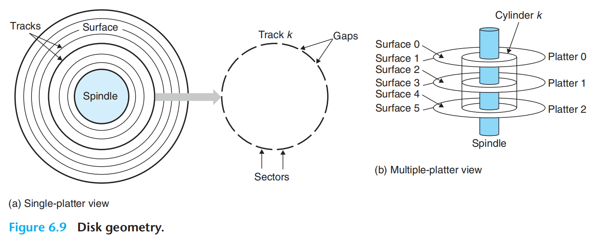
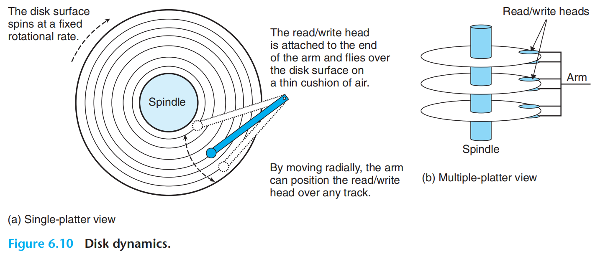
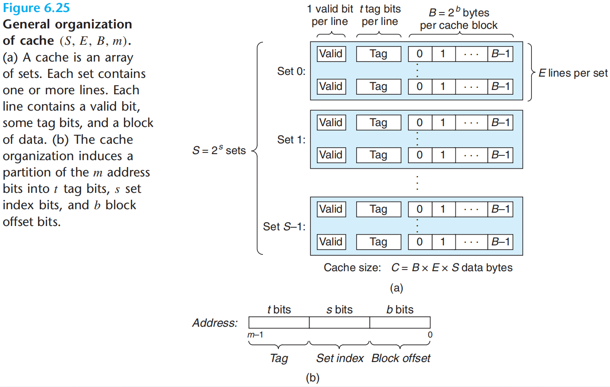
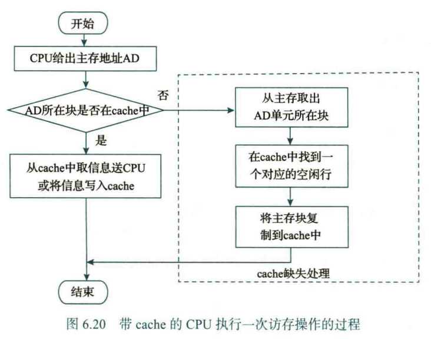
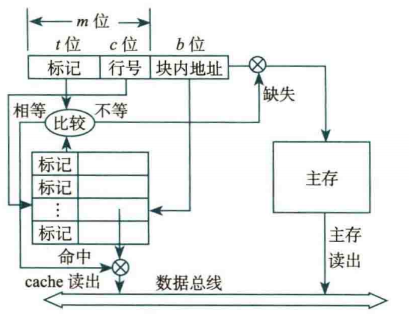

# Ch.6 存储器层次结构

!!! note "有很多图"

## 存储器分类

根据信息的可更改性，我们将存储器分为读写存储器和只读存储器

根据断电后数据是否丢失，我们将存储器分为易失性和非易失性

我们常见的存储器有 RAM（随机存取存储器）和 ROM（只读存储器）

RAM 和 ROM 都**通过对地址译码来访问存储单元**，因为每个地址译码时间相同，所以在不考虑芯片内部缓冲的前提下，访问任意单元的时间均相同

RAM 和 ROM 的区别：

| RAM      | ROM      |
| -------- | -------- |
| 可读可写 | 只读不写 |
| 易失性   | 非易失性 |

RAM 分为两种：静态 RAM（SRAM）和动态 RAM（DRAM）：

| 静态 RAM（SRAM）                 | 动态 RAM（DRAM）                                   |
| -------------------------------- | -------------------------------------------------- |
| 只需要通电，就可以保持触发器状态 | 通电后需要定期刷新内容，否则电荷流失会导致数据丢失 |
| 速度块                           | 速度慢                                             |
| 功耗高                           | 功耗低                                             |
| 单位容量成本高                   | 单位容量成本低                                     |

因此 SRAM 经常用于 CPU Cache，DRAM 经常用于主存（内存条）

<br>

## 主存结构

大致介绍主存储器 Main Memory 的构成


总线是连接各个部件的共享传输介质，系统总线由控制线、数据线、地址线构成

控制线用于传递 “读” “写” 等指令信息

数据线是 CPU 与主存之间传输数据的并行线路，

数据线有 64 位，说明字节编址下，每次**最多可以存取 8 个主存单元**，也就是 8 个连续地址的存储值

地址线是 CPU 向主存发送地址信息的并行线路，

地址线有 36 位，最大寻址范围为 $0 \sim 2^{36}-1$，最大寻址空间 $2^{36}$ Bytes = 64 GB

<br>

## CPU 访存的流程

1- 如果 CPU 发出的访存地址是虚拟地址，需要通过内存管理单元 MMU 中的 TLB 和页表进行查询，得到物理地址（主存中的硬件级地址）

2- 用物理地址查询 Cache，如果 Cache Hit，那么访问 Cache 即可，否则

3- 通过系统总线向 DRAM 控制器发送访问请求（其中控制线发送具体的操作请求）

4- DRAM 控制器收到访存请求事务后，将访存请求转换为与 DRAM 芯片通信的存储器总线请求（包含 DRAM 芯片命令和 DRAM 芯片内部地址，可能包括写入数据）

5- 地址译码器将 DRAM 芯片内部地址进行具体的译码，选中对应的行、列，进行读/写操作。

6- DRAM 控制器向 Cache 返回系统总线请求事务的回复，以及读操作的数据

7- Cache 进行可能的更新，对于读操作向 CPU 返回读出的数据

<br>

## 内存条

主存芯片通过存储器总线与主存控制器连接，对应实际操作中将内存条插入内存条插槽。内存条的本质是若干 DRAM 芯片的集合，而整个主存由多个内存条组成


为了满足存储器的位数和容量要求，我们需要对 DRAM 芯片进行 “串联” 和 “并联”：

- 位扩展（“并联”）：用字长短的 DRAM 芯片构成大字长存储器时，需要进行位扩展
    - 位扩展时，我们将所有芯片的地址线并联在一起。并联的芯片指向同一个地址位置，只是指向了地址的不同位。比如 1bit 扩展到 8 bits，每个芯片的 1 位数据线分别作为最终 8 位数据总线的其中一位

??? quote "位扩展图例"

    

- 字扩展（“串联”）：对芯片容量的扩充

    - 字扩展后，地址空间变大了，因此我们需要额外的地址线来指定需要选择哪一片芯片工作（不考虑同时进行位扩展），我们称这一信号为片选信号

    - 举个例子：用 16K × 8 位 芯片扩充为 64K × 8 位，需要 16 根地址线（$2^{16} = 64  $ K）。其中低 14 位用于对单个芯片的内部进行访问，而高 2 位产生 $2^2$ 种片选信号，指定选择哪一个芯片

- 位扩展和字扩展可以同时进行，通常先位扩展再字扩展

<br>

## DRAM 芯片结构


对于一个 $2^n \times b$ 位的 DRAM 芯片，其包含 $2^n$ 个存储单元，每个单元包含 $b$ 位的信息（可以称这些单元为“块”）

将 $2^n$ 个单元 分成 $r$ 行 $c$ 列的矩阵，保证 $r \leq c$ 且 $r$ 与 $c$ 接近（减少地址线的使用，提高性价比）

容易得到行地址的位数为 $x = \lceil \log_2 r \rceil$，列地址的位数为 $y = \lceil \log_2 c \rceil$。DRAM 的芯片地址引脚采用复用的方式，这意味着行地址和列地址是分别从地址线传送的（因此地址线的宽度为 $\max\lbrace x,y\rbrace$）：

每一块 DRAM 芯片有一个行缓冲（大小为一行），用来缓存当前选中行的每一列数据。在利用行列地址获取数据时，首先需要根据片选信号确认选中这块芯片，然后在行选通信号 RAS 有效时，地址线传送行地址，这一行的数据都被送到行缓冲；接下来在列选通信号 CAS 有效时，将行缓冲中对应列的内容处理


行缓冲每次缓存一整行的数据，也是局部性原理的体现，在 Internal row buffer Hit 的情况下，也可以达到一定的加速访存效果

??? tip "以上的 DRAM 是不包含位平面 (bank) 结构的构造，ICS 也不考虑"

    现代 DRAM 会在行列基础上添加 bank，以提高并行性、隐藏延迟、提高吞吐率、降低单次操作功耗
    
    
    
    但是课后习题是会出现 bank 的？

<br>

## 磁盘

??? quote "物理组成示意图"

    

一个磁盘由很多堆叠的盘片组成，盘片的两面都可以存储信息，记为盘面。为了定位内容，我们对每个盘面进行标号

盘面上的信息由磁头刻写，体现为紧密排列的同心圆。我们记这些同心圆为磁道，而不同盘面同一半径的磁道组成的圆柱面为柱面。为了定位内容，我们对每个柱面进行标号

规定磁道上划分的等长弧段为扇区，扇区是读写的最小单位。同理，我们对于磁道上的扇区也进行编号

定位磁盘上的数据，通过柱面号，盘面号，扇区号三维信息进行唯一确定，这三个信息即磁盘地址，我们记为 $(C, H, S)$



### 磁盘驱动器的操作

首先我们给出从 CPU 到磁盘驱动器的数据通路

> CPU <---> 磁盘控制器 <---> 磁盘驱动器

CPU 不存储三维的磁盘地址（因为磁盘地址对于不同的磁盘有不同构造，导致程序移植性差），而是将三维地址映射到一系列连续的逻辑块（就像三维数组实际以一维数组存储一样），我们称这个一维的逻辑块地址为逻辑块号

CPU 发送逻辑块号，通过磁盘控制器的转换，得到 $(C, H, S)$ 的磁盘地址，传送给磁盘驱动器。

接下来的磁盘驱动器的操作分为三步：

- 寻道：根据 $(C, H)$ 的信息，将磁头移动到指定的磁道上，选择相应的读写磁头
- 旋转等待：扇区计数器初始化为 0，每经过一个扇区自增，直到计数器的值达到 $S$，此时磁头抵达了 $(C, H, S)$
- 读写：启动读写控制电路



### 磁盘性能

有一些性能指标用于描述一个磁盘存储器：

> 记录密度

密度分为两个方面：

- 道密度：盘面的单位半径内能够容纳的磁道数（同心圆密度）
- 位密度：磁道圆周单位长度能够记录的二进制位数（具体影响比较复杂）

然后定义面密度 = 道密度 × 位密度，用面密度来直观衡量磁盘存储器的记录密度

> 存储容量

磁盘实际数据容量  = 盘面数 × 柱面数 × 每个磁道的扇区数 × 每个扇区的字节数

早期扇区大小通常为 512B，现代扇区大小通常为 4096B

对于使用了逻辑块寻址的磁盘，容量 = 逻辑块个数 × 每个扇区的字节数

> 数据传输速率

磁盘驱动器在到达“读写”步骤时，单位时间读写存储介质的二进制信息量，又称为内部 / 持续传输速率

相对的，CPU 的外设控制接口读写外存储器缓存的速度是外部 / 接口传输速率（比如 USB PCIe）

> 平均存取时间

响应时间 = 排队延迟 + 控制器时间 + <u>寻道时间 + 旋转等待时间 + 数据传输时间</u>

存取时间 = 寻道时间 + 旋转等待时间 + 数据传输时间

（磁头移动到指定磁道的时间 + 指定扇区旋转到磁头下方的时间 + 传输一个扇区的时间）

（旋转等待时间通常平均为磁头旋转半圈的用时，即 $\dfrac{60\text{ s}}{\text{转速}} \div 2$）

## cache

cache 是一种小容量的高速缓冲存储器，由快速的 SRAM 存储元组成，直接集成在 CPU 芯片中。cache 是介于 CPU 和主存之间的特殊存储层次（可以参考那张金字塔图）

### 局部性原理

简单分为两种：

- 时间局部性：一个内存区间在第一次被访问后，短时间内可能会被再次访问
- 空间局部性：一个内存区间在第一次被访问后，其周围的内存区间接下来可能会被访问

!!! example "An example"

    下面这个例子中，`i` 和 `n` 有较好的时间局部性，`arr` 有较好的空间局部性：
    
    ```c
    for(int i = 0; i < n; i++){
        cin >> arr[i];
    }
    ```
    
    如果我们将上面的变量提前保存到 cache 中，不难发现数组读入的速率会加快很多

根据局部性原理来构建计算机的存储系统，这也称为存储层次结构。速度越快的存储越靠近处理器，但成本也越高。cache 的工作原理极大地体现了局部性原理的运用

<br>

### cache 槽构成

为了方便 cache 和主存交换信息，一般将 cache 和主存空间划分为大小相等的区域。cache 和主存之间交换数据的基本单元在主存中称为块（block），而在Cache中则称为行（line）或槽（slot）

对于每个 cache 槽，我们划分这样的结构：

```c
#define BLOCK_SIZE (64)			// 因为 64-bit = 8 Byte 通常也是一个主存块的大小

typedef struct {
	uint8_t data[BLOCK_SIZE];	// 数据位：实际存储数据的数据块
	uint32_t tag;				// 标记位：标识主存块（对应了哪一块主存）
	bool valid;					// 有效位：数据是否有效
} cacheSlot;
```

如果考虑组的划分（比如采用组相联映射），那么 cache 的大致结构如下图所示



<br>

### cache 访存



如图所示，CPU 优先从 cache 中尝试找到缓存数据，如果找到了，就访问对应槽的内容，我们称之为 cache hit；否则没有在 cache 中找到，我们从主存中找到对应的块，然后根据局部性原理，将 AD 所在的块存入 cache 的空闲槽（如果没有空闲槽，那么根据某种策略进行覆盖）

cache 槽的 tag 字段用于识别 “指定的主存块和该 cache 槽是否是对应的”

???+ question "如何具体地从 CPU 地址映射到 cache 块？"

    在 cache 的实现中，我们进行操作的是物理地址（硬件角度）而不是虚拟地址（程序角度），在 cache 设计时，物理地址被分为三个部分：
    
    ```c
    [31:13] [12:6] [5:0]
    TAG     SET    OFFSET
    ```
    
    - `set` 部分，其确定了应该在 cache 的哪个组中进行查找，位长度由 cache 的组数决定。这里 cache 被分为 $2^7$ 个组，因此需要 $7$ 位
    
    - `tag` 部分，这部分内容会和实际 data 一并存入 cache 中，用于在 `set` 确认组后准确定位
    
    - `offset` 部分，用于在找到对应的槽后，利用偏移值找到具体需要使用的数据，位长度由 cache 块大小决定。这里每个块大小为 $2^6 \text{ Byte}$，因此需要 $6$ 位
    
    （`tag` 是地址减去 `set` 和 `offset` 的部分剩下的部分，其长度没有硬性规定）
    
    **如何从物理地址定位到 cache 的内容？先根据 `set` 定位 `cache[set]`，再结合 `tag` 定位到 `cache[set][way]`，最后利用 `offset` 定位到 `cache[set][way].data[offset]`**
    
    这里有一张对应的图示：
    
    

<br>

### cache 的策略选择

在交换数据时，我们会遇到下述四种情形，并且分别有不同的策略组：

> 主存中的块与 cache 中的槽如何对应？

▲ 直接映射：将 cache 槽直接与主存块进行一定的对应，每个块用的槽是通过取模操作指定的：

$$
cache \text{ 行号} = \text{ 主存块号} \bmod cache \text{ 行数}
$$

因此直接映射又叫做模映射，类比简易哈希表，优点是查找快；缺点是易冲突，缓存命中率可能不高

▲ 全相联映射：cache 槽可以被任意主存块映射，“是坑就占”，采用标记字段判断槽中的数据是否存在

优点是冲突小，缓存命中率较高；缺点是硬件实现复杂，查找速度慢（每个标记字段都要确认）

▲ 组相联映射是上述的结合：cache 被分成若干组，每组有若干个槽。主存中的块与 cache 组有特定的对应关系，但是 cache 组内可以随意映射

主流选择是组相联映射，上文中 “如何具体地从 CPU 地址映射到 cache 块” 的回答也是基于此的

<br>

> cache full 时，采用什么逻辑替换旧的 cache？（替换算法）

▲ 先进先出算法 FIFO：总是替换最早进入 cache 的主存块

容易实现，但是不能正确反映访问局部性，因为最先进入的主存块也可能是经常访问的

▲ 最近最少用算法 LRU：总是替换**近期**最少使用的主存块

正确反映访问局部性，但是不容易实现

▲ 最不经常用算法 LFU：总是替换访问次数最少的主存块

和上一种算法差不多

▲ 随机替换算法：字面意思，性能还不错，实现简单

<br>

> cache 的写策略是什么？

换种方式表述：当 CPU 写数据时，数据可能同时存在于 cache 和主存中。更新 cache 的时候，主存是否更新，以及何时更新，就是写策略

▲ 通写法：CPU 写数据时，同时写 cache 和主存。

缺点是对主存的写操作较慢

通写法通常会搭配非写分配：当写缺失时，只写主存，不使用 cache（也就是说只有读操作才会触发 cache 的新主存块加入）

▲ 回写法：CPU 写数据时，只写 cache 不写主存

缺点是需要额外维护 cache 槽的脏位，在向 cache 槽写入新的主存块时，脏位置 0；在 CPU 写入 cache 行时，该位置零

回写法通常会搭配写分配：当写缺失时，先从主存把块调入 cache，再写 cache

<br>

（多级 cache 略，我赌考试不考）

<br>

### cache 和程序性能

计算机性能最直接的度量方式是 CPU 时间。执行一个程序所用的 CPU 时间等于 CPU 执行时间和等待主存访问时间之和。当 cache 缺失时，需要等待主存访问，对于顺序流水线 CPU 来说，此时 CPU 处于阻塞状态。因此 CPU 时间的计算公式如下：

$$
CPU \text{ 时间} = (CPU \text{ 执行时钟周期数} + cache \text{ 缺失引起阻塞的时钟周期数}) \times \text{时钟周期}
$$

若写回阻塞、写缓冲阻塞忽略不计，则综合考虑读和写操作后得到如下公式：

$$
cache \text{ 缺失引起阻塞的时钟周期数} = \text{程序中访存次数}×\text{缺失率}×\text{缺失损失}
$$

CPU 性能越高，对 cache 的性能要求也最高