# Ch.8 进程与异常控制流

## 进程

程序是代码 + 数据的集合，是静态的。当程序被加载运行时，这一过程是动态的。我们称程序的一次运行过程为进程。具体来说，进程是一个程序给定某个数据集合作为输入的一次运行活动，是操作系统对处理器中程序运行过程的一种抽象，因而进程具有动态的含义。

计算机系统中常见的“任务”往往指的是进程，每个进程通过进程描述符进行描述，所有进程通过任务列表来描述（本质是一个存储了进程描述符的双向循环链表）

### 逻辑控制流

对于一个启动执行的程序，其代码段中每条指令的 PC 值都是确定的，对于给定的输入，进程的一串 PC 序列也是确定的，我们称之为进程的逻辑控制流

现在考虑单核 CPU，其在同一时间内只能“完成一件事”。当多个进程在某一时间段同时运行时，CPU 会让这些进程轮流进行，也就是说，CPU 的物理控制流是由多个逻辑控制流交织组成的

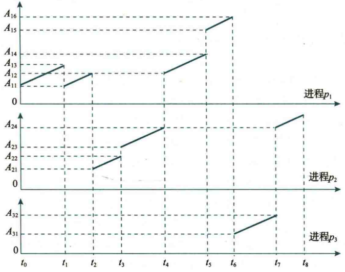

以上图为例，只要多个逻辑控制流在时间上交错或重叠，就会采用**并发**的方式进行交织处理。相对应的，对于多（核）处理器，操作系统能够让多个进程在同一时间内执行，我们称之为**并行**

我们定义连续执行同一个进程的时间段为时间片（参考上图中的每一个处于同一进程的 $t_n\sim t_{n+1}$ 时间段，比如 $t_0 \sim t_2$）

<br>

### 上下文切换

!!! quote "只考虑进程上下文"

既然 CPU 采用并发的方式同时处理多条任务，就需要设置相对应的上下文机制，比如说，不同进程对寄存器的使用需要分别进行保存，否则会造成寄存器调用混乱。我们引入上下文切换的过程

首先需要介绍上下文：一个进程在 CPU 上运行时所依赖的所有状态信息（代码、数据、环节）的总和。当我们进行多线程并发执行时，不同进程依靠各自的上下文就可以以不被打扰的方式完整执行

上下文可以（不按照教材的划分方式）简单包含三个部分：

- CPU 上下文：包括通用寄存器、EIP、EFLAGS 等内容
- 内存管理上下文：包含 CR3（页表基地址），段寄存器等描述进程虚拟空间的上下文
- 内核态资源上下文：操作系统管理的与进程有关的所有资源，比如打开了什么文件

??? quote "教材的进程上下文划分"

    

上下文切换是操作系统保存当前进程的状态，并恢复另一个进程状态的过程，目的是实现并发效果。下图表示的就是通过 shell 运行 hello 程序时，hello 程序和 shell 程序的系统上下文切换

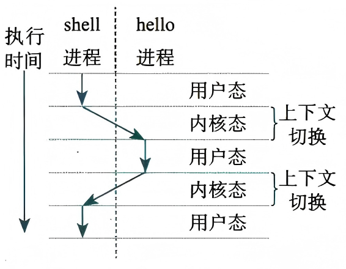

在一个进程的完整生命周期中，运行时消耗的时间可以分为用户时间和系统时间，分别代表在用户态执行代码的时间和在系统态执行代码的时间，加和在一起为实际时间 / 挂钟时间。

> 比如之后我们会提到 `printf` 函数调用，`printf` 调用系统函数 `write` 期间属于用户时间，而从 `write` 函数执行 `int $0x80`，切换到内核态执行 `syscall` 等指令开始，这部分时间属于系统时间
>
> 可以使用 `time ./program` 指令获取这三种时间（图中演示的是朴素实现的求斐波那契数列的第 10w 项并取模，这是一个用户时间远大于系统时间的计算密集型程序）
>
> 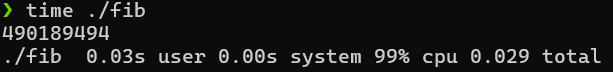

<br>

## 异常与中断

系统中有多个进程并发执行时，操作系统内核通过某种算法策略决定在何时进行进程的切换，这被称为处理器调度。一个进程在正常执行的过程中，其逻辑控制流会因为处理器调度打断

不仅如此，还有一些其他时间会导致逻辑流被打断，比如发送 Ctrl+C，出现无法继续执行的意外事件，等等。这些特殊事件统称为异常 / 中断。上下文切换和异常 / 中断都会造成异常控制流

我们细分 Intel 体系结构中，异常与中断的定义：

- 异常是处理器执行一条指令时，由处理器在其内部检测到的，与正在执行的指令相关的同步事件。

    - 异常包括三种类型：硬故障中断、程序性异常、陷阱，前者表示硬连线路出错，中者表示一系列“程序不应发生”的异常事件，后者是一种预先安排的事件
- 中断是一种由 I/O 设备触发的、与当前正在该执行的指令无关的典型异步事件

    - 比如用户按下 Ctrl+C 中断程序

> 为了强调特殊事件的来源，我们又称异常为内部异常，中断为外部中断

对异常和中断的处理过程是大致相同的，其大致的异常控制流如图所示

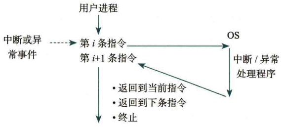

CPU 在执行完第 $i$ 条指令时检测到异常，或者在执行完第 $i$ 条指令后收到中断，就会停下当前用户进程，转到相应的异常 / 中断处理程序去执行。具体的操作如图

<br>

### 异常

让 AI 给出一个省流版总结：

??? warning "在 CSAPP 中，异常和中断统一为异常，中断是异常的一个分类"

    考虑到异步发生的中断和其他三种不一样，因此教材分离出了中断

| 类型      | 中文名称 | 触发时机                                       | 是否可恢复  | 异常返回后程序执行位置                                       | 举例                                       |
| :-------- | :------- | :--------------------------------------------- | :---------- | :----------------------------------------------------------- | :----------------------------------------- |
| **Fault** | 故障     | 异常发生时，CPU 检测到错误，指令还未完全执行完 | ❓可能可恢复 | 异常处理后返回到**原指令**重新执行<br />也有可能中止相应的程序 | 缺页异常<br />整数除 0、段错误、非法操作码 |
| **Trap**  | 陷阱     | 指令执行**结束后**主动触发                     | ✅ 可恢复    | 异常处理后返回到**下一条指令**                               | 系统调用、断点、单步调试                   |
| **Abort** | 终止     | 严重错误导致 CPU 无法确定故障点                | ❌ 不可恢复  | 程序通常被强制终止                                           | 双重错误、机器检查错误<br />*电脑蓝屏*     |

附带一些大致的分类介绍：

- 故障可能恢复，也可能会终止程序

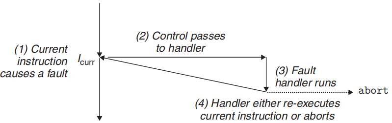

??? example "Examples"

    缺页故障往往可以恢复，一个例子：
    
    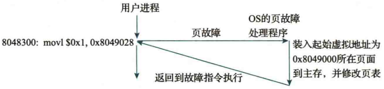
    
    在 Linux 中，不可恢复的访存故障（如地址越界和访问越权）都称为段故障（11 号 SIGSEGV 信号）
    
    段故障不能恢复，一个例子：
    
    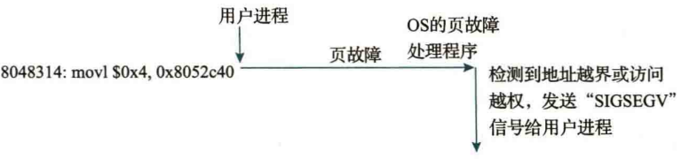
    
    ??? quote "这是 ICS Lab&PA 头号杀手，你敢和它对视十秒吗"
    
        

---

- 陷阱指令是预先安排的异常，称为编程异常。其一个重要作用是在用户层和内核层之间提供一个接口（系统调用），另一个作用是设置单步执行和断点，用于调试。

通常将 `INT n` 指令称为软中断指令，对应的异常为软中断

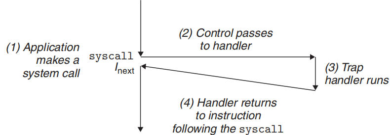

---

- 终止意味着出现了 CPU 无法处理的严重问题，只能选择中止当前程序，更严重的会导致 “死机”

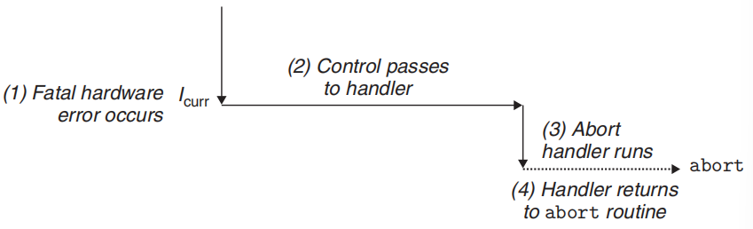

<br>

### 中断

中断请求是由 CPU 外部的 I/O 设备需要 CPU 进行某种处理时发出的一种请求信号，I/O 设备通过特定的中断请求信号线向CPU提出中断申请。

CPU在执行指令的过程中，每执行完一条指令都会检查中断请求引脚，如果中断请求引脚信号有效，则进入中断响应周期。通常，在中断响应周期中，CPU 先将当前 PC 值（称为断点）和当前的机器状态保存到栈或特定的寄存器中，并切换至关中断状态，然后跳转到统一中断服务程序执行。中断响应过程由硬件完成，具体的中断处理工作由 CPU 执行统一的中断服务程序完成，包括读取中断类型号，并根据中断类型号跳转到具体的中断服务程序执行。中断处理完成后，再回到被打断程序的断点处继续执行。

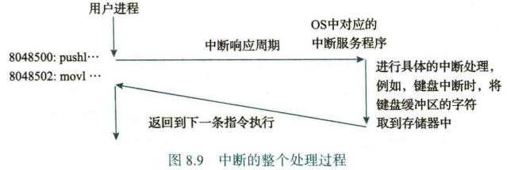

中断分为可屏蔽中断和不可屏蔽中断，前者可能不会被 CPU 响应，后者一定会被响应（不响应会出大问题的那种）

<br>

###  响应

异常和中断的处理逻辑，从基本原理上来说大致相同：

> 保护断点（返回地址）和程序状态

断点指的是当前指令 / 下一条指令的地址

程序状态字保存程序的运行状态，存放在程序状态字寄存器 PSWR 中，比如 IA-32 的 PSWR 就是 EFLAGS。

对于支持嵌套处理的处理器，断点和程序状态字存储在栈上，否则存入特定的寄存器中

> 关中断（仅中断，不包括异常）

中断使能位指示当前是否接受新的（可屏蔽）中断响应，对于 IA-32，中断使能位为 `EFLAGS.IF`。当 `IF = 0` 时表示关中断，当 `IF = 1` 时表示开中断

为了避免在处理已有中断时被新的中断打扰，我们需要在接手当前中断后关中断，来”专心完成这一件事“

> 识别异常 / 中断并跳转处理程序

内部异常：CPU将异常类型记录在特定寄存器中，供操作系统查询。

外部中断：由中断控制器根据设备请求和优先级识别中断类型号，并传给CPU。

对中断/异常类型的识别也分两种模式：

- 软件识别：通过查询原因寄存器判断异常类型，再跳转处理程序
- **硬件识别**：每个异常 / 中断有唯一类型号，对应中断向量表中的入口地址，CPU据此直接跳转。

IA-32/x86-64 Linux 就采用硬件识别

<br>

## IA-32/x86-64 Linux 的异常/中断机制

IA-32/x86-64 对中断 / 异常类型的识别采用硬件方式。每个异常/中断有唯一类型号（称为中断类型号），其中前 32 个中断类型为处理器保留值，后面的类型可以由操作系统定义。

指令 `INT n` 可以使 CPU 自动跳转到中断类型号 $n$ 对应的处理程序执行

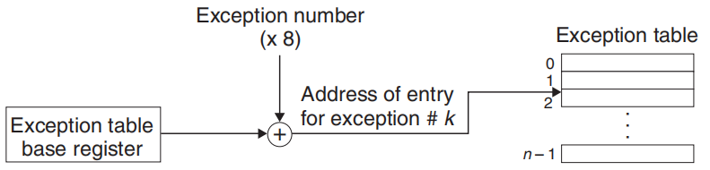

类似于段机制，异常/中断机制在实模式和保护模式下是不一样的：

??? success "建议结合段式虚拟存储管理机制食用，两者挺像的"

### 实模式

??? quote "实模式没有分页机制，地址空间 1 MB，主要采用段机制"

实地址模式下，异常 / 中断处理程序的入口地址由高 16 位段地址和低 16 位偏移地址组成，称为中断向量。我们使用中断向量表 IVT 来存储每种类型的入口地址

IVT 固定在物理地址 `0x0000 ~ 0x03FF`，共 256 个表项，每项 4 Bytes（段地址 & 偏移地址）

当异常 / 中断发生时，我们需要保存现场：保护断点（返回地址）和程序状态，关中断，然后根据中断号 `n` 计算处理程序的入口地址：

1. 将中断号乘上中断向量的大小 4 Byte，得到 index
2. 读取段地址和偏移地址，然后拼接成物理地址：`paddr = ((uint32_t)cs << 4) + ip`（这件事你在段式虚拟存储器的实模式下已经干过了

实模式下的运用还是很有必要的，一个系统在开机时，默认在实地址下工作，通过 BIOS 程序进行初始化（包括中断向量表和响应中断服务程序的建立），提供基本 I/O 系统的调用。在一切初始化完成后，我们才会进入保护模式，使用接下来的内容：

### 保护模式

我们引入一个（听上去非常熟悉的）中断描述符表 IDT，用来存放各个”门描述符“，总共 256 个

??? question "如何找到中断描述符表？"

    中断描述符表的首地址存储在特殊寄存器 `IDTR` 中，储存了下列的信息：
    
    ```c title="32-bit"
    typedef struct {
        uint16_t limit;  // IDT 大小 - 1，最大 0xFFFF（即 64KB）
        uint32_t base;   // IDT 基地址（线性地址，32 位模式下）
    } IDTR32;
    ```
    
    指令集中，`lidt` 指令负责从内存加载 IDTR 的内容

门描述符分为中断门描述符、陷阱门描述符、任务门描述符

> 其中陷阱门描述符对故障都使用，任务门描述符只在双重故障发生时使用

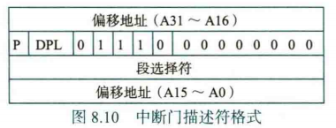

P = Present，Linux 总会置为 1

DPL 表示访问本段内容的最低特权等级（0 是权限最高的内核态，3 是任何进程都允许访问的态），和 CPL 比较

DPL 后面两位开始的 ”`1110`“ 指示门描述符的类型：

| TYPE   | type   |
| ------ | ------ |
| `1110` | 中断门 |
| `1111` | 陷阱门 |
| `0101` | 任务门 |

段选择符用来从全局描述符表 GDT 中找到对应的段描述符，取出基地址，偏移地址进一步给出偏移量，得到入口程序的线性地址（至于之后的内容，那是分页机制的内容）

因为异常 / 中断处理程序属于内核代码段，因此所有中断门和陷阱门的段选择符都指向 GDT 中的内核代码段描述符（还是这张图）


之前我们也提到了，Linux 在扁平化段机制之后，门描述符的段选择符的功能几乎是用不上了。

!!! quote "任务门描述符只包含 TSS 段选择符，指向 GDT 的 TSS 段描述符，此处略"

<br>

### 异常与中断的处理

（我们只考虑保护模式下的步骤）

异常与中断的处理是硬件（CPU）和软件（操作系统）协同完成的复杂处理：

> 以下是 CPU 需要完成的事情

1. 确定类型号，根据 IDTR 找到对应的 IDT 表项 IDTi，获取异常/中断的类型信息
2. 根据 IDTi 中的段选择符，从 GDT 中取出对应的段描述符，得到异常 / 中断处理程序所在的代码段基址，以及段 DPL
3. 将当前代码段的特权级 CPL 和 DPL 比较，**当 CPL < DPL 时触发 13 号异常。因为异常 / 中断处理程序属于内核代码段，而触发异常 / 中断的<u>可能</u>属于用户代码段，所以 CPL ≥ DPL 反而是大概率发生的**
    - 对于陷阱（编程异常），我们为了防止恶意进入内核，会比较 IDTi 门描述符的 DPL，**当 CPL > DPL 时触发 13 号异常**
4. 对于用户代码段触发的异常 / 中断（CPL = 3, DPL = 0），我们需要从用户态切换到内核态：
    - 读 TR 寄存器来访问当前进程的 TSS 段，将 TSS 段中保存的内核段的段选择符和栈指针分别装入寄存器 SS 和 ESP ，然后在内核栈中保存原来用户栈的 SS 和 ESP
    - 如果发生的是故障，我们还需要将发生故障指令的逻辑地址存入 CS 和 EIP，确保可以返回
5. 接下来我们开始布置 TrapFrame：在当前的栈中依次保存 EFLAGS，CS，EIP，对于中断门还要清零 IF 表示关中断，如果存在硬件出错码也要保存到内核栈
6. 将 IDTi 的段选择符装入 CS，偏移地址装入 EIP，进入异常 / 中断处理程序
7. 完成处理后，通过 `iret` 指令回到原进程，首先需要弹栈恢复状态
    - 如果之前是用户态 → 内核态，现在我们要回到用户态：弹出 SS ESP，检测 DS ES FS GS 段寄存器内容若其中有某个寄存器的段选择符指向一个段描述符，且其 DPL 小于 CPL，则将该段寄存器清零。


> 以下是操作系统需要完成的事情

首先，操作系统需要对 IDT 初始化，我们知道总共有三种门描述符，而 Linux 在此格式基础上构造了 5 种实际的门描述符，以满足不同特权空间内的使用需求

- 中断门：DPL = 0
- 系统中断门：DPL = 3，对应的是 `int 3` 指令，用于打断点。DPL = 3 使得用户态下可使用相应内核服务
- 陷阱门：DPL = 0
- 系统门：DPL = 3，属于陷阱异常，对应 `into` `bound` `int $0x80` 三个程序。DPL = 3 使得用户态下可使用相应内核服务
- 任务门：DPL = 0，对应双重故障（8 号中断）

Linux 会对 GDT GDTR IDT IDTR 都进行初始化设置

---

CPU 引导进入异常 / 中断处理程序后，由操作系统确定程序的处理逻辑

**对于异常处理**，我们进行以下三步操作：

1. CPU 只保存了 EFLAGS，CS，EIP，而操作系统定义的程序需要在内核栈中保存所有通用寄存器的内容
2. 进行具体的处理操作

??? quote "一张表"

    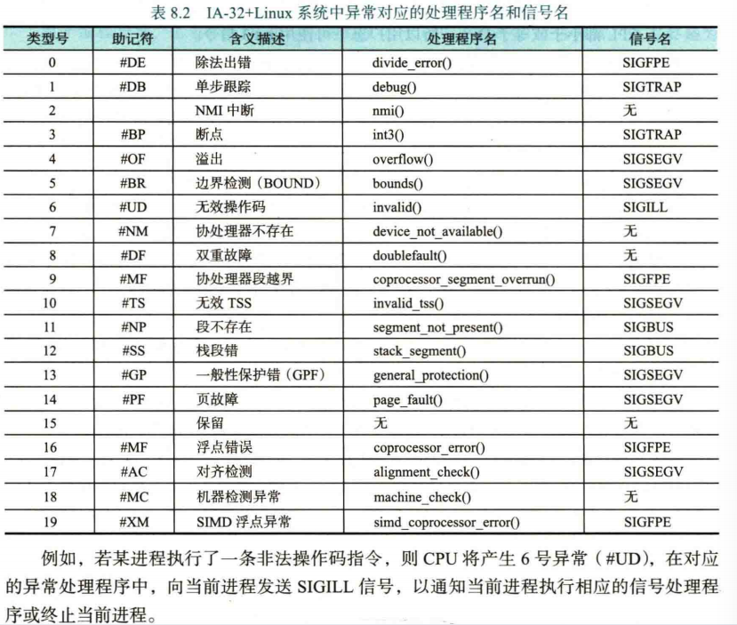

3. 恢复通用寄存器内容，通过 `iret` 切换到用户态

**对于中断处理**，分为 I/O 中断，时钟中断，处理器中断，会在下一章介绍

<br>

### 系统调用的细化处理

系统调用属于异常→陷阱，因为我懒了，所以我直接使用了 NEMU 实验报告的思考题，NEMU 是基于 x86 的，但是省略了一些内容，需要结合上述的处理过程解决

（还是看书吧）

> 详细描述从测试用例中的 `int $0x80` 开始一直到 `HIT_GOOD_TRAP` 为止的详细的系统行为（完整描述控制的转移过程，即相关函数的调用和关键参数传递过程），可以通过文字或画图的方式来完成

针对于 NEMU CPU，读取指令通过 `exec(uint32_t n)` 进行，调用 opcode 表中对应的函数：

```c
make_instr_func(int_) {
    // 获取中断号
    uint8_t intr_no = instr_fetch(eip + 1, 1);
    // 响应自陷
    raise_sw_intr(intr_no);
    return 0;
}
```

在得到中断号 `0x80` 后，调用软件自陷对应的函数 `raise_sw_intr(0x80)`（相比非自陷指令，其需要额外将 EIP 设置为下一条指令的地址，方便回到用户态后继续执行剩余的指令），然后调用 `raise_intr(0x80)`

```c
void raise_intr(uint8_t intr_no)
{
#ifdef IA32_INTR
    
    // step 1: 将 EFLAGS CS EIP 入栈保存上下文（开始构造 TrapFrame，代码略）
    // step 2: 关中断（代码略）
    // step 3: 得到异常或中断号，查询`IDT`，提取出处理程序的入口地址并跳转
    uint32_t addr = (gate.offset_31_16 << 16) | gate.offset_15_0;
    cpu.segReg[SREG_CS].val = gate.selector;
    load_sreg(SREG_CS);
    cpu.eip = addr;		// 这里修改了跳转地址为中断向量表中对应的地址
#endif
}

void raise_sw_intr(uint8_t intr_no)
{
	// return address is the next instruction
	cpu.eip += 2;
	raise_intr(intr_no);
}
```

接下来 NEMU 进入内核态，这里 NEMU 简化了这一实现，**对于真实的 IA-32，我们从用户态切换到内核态需要额外处理，用 MSR 寄存器存放内核代码段的 CS、EIP、ESP**

在 `do_irq.S` 中，我们为每一个中断号定义了一个入口，其中 **`int $0x80` 调用系统服务对应的是 `versys` 入口**：

```assembly
#----|-----entry------|-errorcode-|-----id-----|---handler---|
.globl vec0;    vec0:   pushl $0;  pushl    $0; jmp asm_do_irq
.globl vec1;    vec1:   pushl $0;  pushl    $1; jmp asm_do_irq
# 省略一部分
.globl vec13;   vec13:             pushl   $13; jmp asm_do_irq
.globl vec14;   vec14:             pushl   $14; jmp asm_do_irq

.globl vecsys; vecsys:  pushl $0;  pushl $0x80; jmp asm_do_irq

.globl irq0;     irq0:  pushl $0;  pushl $1000; jmp asm_do_irq
.globl irq1;     irq1:  pushl $0;  pushl $1001; jmp asm_do_irq
.globl irq2;     irq2:  pushl $0;  pushl $1002; jmp asm_do_irq
.globl irq14;   irq14:  pushl $0;  pushl $1014; jmp asm_do_irq
.globl irq_empty;
			irq_empty:	pushl $0;  pushl   $-1; jmp asm_do_irq
```

将所需的参数（`errorcode` `id`）入栈，然后调用 `asm_do_irq` 函数

```asm
asm_do_irq:
	pushal			# 保存 GPRs
	pushl %esp		# 把当前栈指针压入栈，作为参数传递给 irq_hangdle()
					# 当前的栈顶保存了较为完整的现场，即 TrapFrame 地址
	call irq_handle
# --------------------------------------------------------------------------------
	addl $4, %esp
	popal
	addl $8, %esp
	iret
```

接下来到达 `irq_handle` 函数，其中有这样的内容：

```c
void irq_handle(TrapFrame *tf)
{
	int irq = tf->irq;
	// ... ...
	else if (irq == 0x80)
	{
		do_syscall(tf);
	}
    // ... ...
}
```

根据中断号 `0x80`，执行系统调用 `do_syscall`，在 `do_syscall` 中根据中断号跳转到对应的系统服务，调用相关的系统服务。在 Linux 中，系统调用处理程序 `system_call` 是系统调用的统一入口

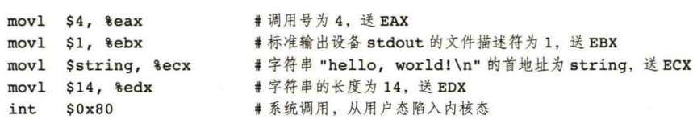

| 系统调用号 syscall ID | `EAX` |
| --------------------- | ----- |
| 第 1 参数             | `EBX` |
| 第 2 参数             | `ECX` |
| 第 3 参数             | `EDX` |
| 第 4 参数             | `ESI` |
| 第 5 参数             | `EDI` |

```c
void do_syscall(TrapFrame *tf){
	switch (tf->eax){				// TrapFrame 中存储的 EAX
	case 0: cli(); add_irq_handle(tf->ebx, (void *)tf->ecx); sti(); break;
	case SYS_brk: sys_brk(tf); break;
	case SYS_open: sys_open(tf); break;
	case SYS_read: sys_read(tf); break;
	case SYS_write: sys_write(tf); break;
	case SYS_lseek: sys_lseek(tf); break;
	case SYS_close: sys_close(tf); break;
	default:
		panic("Unhandled system call: id = %d", tf->eax);
	}
}
```

在完成了内核函数 `sys_write()` 的调用后，打印出了 `Hello, world!` 的内容，然后把返回值写回 `tf->eax`，回到 `asm_do_irq` 退栈弹出之前保存的通用寄存器的值（但是 ESP 丢掉了），调用 `iret` 指令 pop 出 `raise_intr` 储存的 EIP CS EFLAGS，最后回到用户空间，继续执行之后的指令，直到触发 `HIT GOOD TRAP`

这里顺便给出调用内核函数前的栈结构：

|   栈 高地址   |         入栈时机         |
| :-----------: | :----------------------: |
|    EFLAGS     |        raise_intr        |
|      CS       |        raise_intr        |
|      EIP      |        raise_intr        |
| error_code: 0 |          vecsys          |
|   id : 0x80   |          vecsys          |
|      EAX      |    asm_do_irq: pushal    |
|      ECX      |    asm_do_irq: pushal    |
|      EDX      |    asm_do_irq: pushal    |
|      EBX      |    asm_do_irq: pushal    |
|  ESP（旧值）  |    asm_do_irq: pushal    |
|      EBP      |    asm_do_irq: pushal    |
|      ESI      |    asm_do_irq: pushal    |
|      EDI      |    asm_do_irq: pushal    |
|  ESP（新值）  | *ESP 指针现在指向的地址* |
| **栈 低地址** |                          |

上表中的系统栈内容（EFLAGS ~ EDI 的部分）就表示 TrapFrame 的内容

```c
typedef struct TrapFrame
{
	uint32_t edi, esi, ebp, xxx, ebx, edx, ecx, eax; // GPRs
	int32_t  irq;									 // #irq
	uint32_t error_code;							 // error code
	uint32_t eip, cs, eflags;						 // execution state saved by hardware
} TrapFrame;
```
