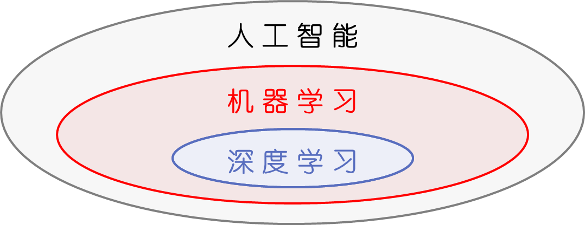
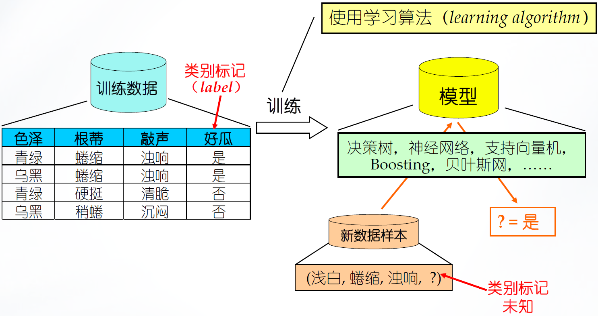
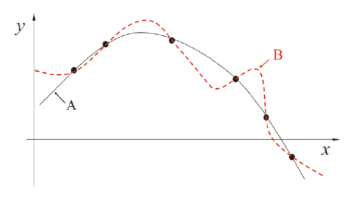

# Lecture 1：绪论

## 概念说明

首先一些入门性的概念说明

---

- 机器学习是人工智能的一个特定领域，而深度学习是机器学习的一个具体技术

---

- 人工智能技术应用三要素包括算法、算力、数据
    - 数据方面已有数据库、数据管理领域考虑
    - 算力方面已有高性能计算、集成电路等领域考虑
    - 而算法方面也需要专门的领域

---

- 人工智能和人工智能交叉不同
    - 对人工智能的内核级学习，和在其他领域中交叉使用人工智能，学习的内容是不一样的

---

- 智能科学和人工智能也不同
    - 智能科学强调“智能”（如何体现“智能”），而人工智能强调“人工”（如何实现“智能”）

---

- 强人工智能 vs 弱人工智能
    - 强人工智能需要具有自主意识，往往全面达到、超过人类智能水平
    - 弱人工智能不需要自主意识，可以在某一领域超过人类智能水平
    - 只有自主意识才是区分性的特征

---

- 机器学习的经典定义是：利用经验改善系统自身的性能

一个典型的机器学习过程如下

事实上，机器学习可以理解为一种“有效的数据分析”，当已知样本的特征信息、样本信息（比如数量）足够充分时，机器能够对未知样本的特征进行预测

## 基本术语

让 LLM 进行总结

> 这段文本是周志华《机器学习》（“西瓜书”）第1章的经典内容，系统介绍了机器学习的基本术语。核心知识点概括如下：
>
> **基本定义**
>
> - **数据集**：记录的集合。
> - **示例/样本**：关于一个事件或对象的描述（如一个西瓜）。
> - **属性/特征**：反映对象某方面表现的事项（如色泽、根蒂）。
> - **属性值**：属性上的取值（如青绿、乌黑）。
> - **属性空间/样本空间/输入空间**：属性张成的空间。
> - **特征向量**：示例在空间中的坐标向量。
>
> **数学表示**
>
> - 数据集：$ D = \{x_1, x_2, \ldots, x_m\} $
> - 样本：$ x_i = (x_{i1}, x_{i2}, \ldots, x_{id}) \in \mathcal{X} $
> - 维数：$ d $
> - 标记：$ y_i $
> - 样例：$ (x_i, y_i) $，其中 $ y_i \in \mathcal{Y} $
>
> **学习过程**
>
> - **学习/训练**：从数据中学得模型的过程。
> - **训练数据、训练样本、训练集**
> - **假设**：学得的模型（关于潜在规律的假设）。
> - **真相/真实**：潜在的客观规律。
> - **学习器**：学习算法在给定数据和参数空间上的实例化。
>
> **学习任务分类**
>
> | 类型   | 预测目标         | 标记取值                    | 示例          |
> | ------ | ---------------- | --------------------------- | ------------- |
> | **分类** | **离散值**       | **有限类别**                | 好瓜/坏瓜     |
> | 二分类 | 两个类别         | $\{ -1, +1 \}$ 或 $\{0,1\}$ | 正类/反类     |
> | 多分类 | 多个类别         | $ \mathcal{Y}$                          |    |
> | **回归** | **连续值**       | **$ \mathbb{R} $**          | 成熟度 ≈ 0.95 |
> | 聚类   | 无标记（簇划分） | 无编号                  | 浅色瓜/深色瓜 |
>
> **监督与无监督学习**
>
> - **监督学习**：使用有标记的训练数据（分类、回归）。
> - **无监督学习**：使用无标记的训练数据（聚类）。
>
> **模型评估核心概念**
>
> - **泛化能力**：模型适用于新样本的能力。
> - **测试**：使用模型进行预测的过程。
> - **测试样本**：被预测的样本。
> - **独立同分布（i.i.d.）**：假设全体样本服从分布 $ \mathcal{D} $，每个样本独立采样自该分布。
>
> 这些术语构成了机器学习描述和讨论的基础语言框架。

## PAC 模型

PAC（Probably Approximately Correct，概率近似正确）学习模型是计算学习理论中最重要的理论模型：

$$
P(|f(\mathbf{x}) - y| \leq \epsilon) \geq 1 - \delta
$$

其中：

- $f(\mathbf{x})$ 是训练的模型 $f$ 对输入 $\mathbf{x}$ 做出的预测
- $y$ 是 $\mathbf{x}$ 对应的客观正确的实际标签
- $\epsilon$ 是容差值，表示预测值与真实值的绝对误差不能超过 $\epsilon$
- $\delta$ 是失败概率，表示允许模型有 $\delta$ 的概率不满足上述容差要求
    - $1-\delta$ 是置信度
- $P$ 为概率

整个表达式的含义是：**模型预测与真实值的误差不超过 $ϵ$ 的概率，至少为 $1−δ$**

这个数学模型使得学习模型可以被定量衡量

## 假设空间 && 版本空间

假设空间（Hypothesis Space）是学习算法理论上所有可能输出的模型组成的集合

版本空间（Version Space）是假设空间中所有能够在训练集上满足要求的假设组成的子集

版本空间 ⊆ 假设空间

???+ example "举一个例子"

    现在给定三个训练数据 $(1, 1), (2, 2), (3, 3)$
    
    目的是训练出一个能穿过这些点的多项式函数
    
    则假设空间就是所有多项式函数
    
    版本空间就是所有穿过这三个点的多项式函数
    
    > 注意到版本空间可能是有穷或无穷的。比如如果限定多项式为一次多项式，则版本空间的大小可能为 0，也可能为 1（此处非常幸运为 1）；如果限定多项式为二次多项式，则版本空间的大小一定为 1；如果限定多项式为三次多项式，则版本空间大小一定为无穷
    >
    > 这里的“多项式次数”可以理解为模型的灵活度（自由度 vs 约束）

## 归纳偏好

归纳偏好指的是机器学习算法在学习过程中对某种类型假设的偏好

> 图：存在多条曲线与有限样本训练集一致

任何一个有效的机器学习算法必有其偏好，而学习算法的归纳偏好是否与问题本身匹配，大多数时候直接决定了算法能否取得好的性能

从奥卡姆剃刀原则来看，如果多个假设与观察一致，则选择最简单的那个。因此我们会自然认为 A 比 B 更优秀

事实上，根据训练样本和测试样本的不同，A 和 B 都可能是更好的模型。我们引入 NFL 定理

### NFL 定理

NFL 定理的全称是 No Free Lunch 定理（没有免费的午餐）

**一个算法 $\mathcal{L_{a}}$ 若在某些问题上比另一个算法 $\mathcal{L_{b}}$ 好，必存在另一些问题，使得 $\mathcal{L_{b}}$ 比 $\mathcal{L_{a}}$ 好**

> 证明略去

那么就无法评判出不同算法的优劣性了？并不是

NFL 定理的重要前提是，所有问题出现的机会相同、或所有问题同等重要

而实际情形并非如此；我们通常只关注自己正在试图解决的问题，这使得我们想要的 “最优算法” 往往也是具体情境下的
