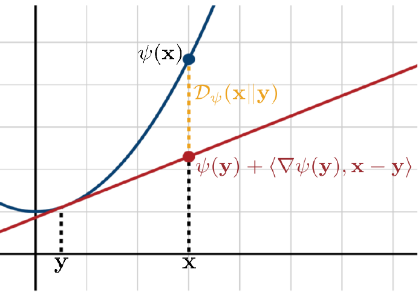

# Lecture ?：数学基础-1

一些机器学习需要用到的前置数学知识

**这里是微积分、线性代数、概率论、信息论基础部分**

为什么要完整记录这部分内容？因为原课件是英文的我看不懂，以下内容相当于翻译了

## 符号定义

- $[n]$：从 $1$ 到 $n$ 的正整数集合 $\lbrace1, \cdots, n\rbrace$
- $\mathbf{x}, \mathbf{y}, \mathbf{v}$：向量 vector
- $A, B$：矩阵 matrix
- $\mathcal{X}, \mathcal{Y}, \mathcal{K}$：域 domain
- $d, m, n$：维度 dimension
- $I$：单位矩阵 identity matrix
- $X, Y$：随机变量 random variable
- $p, q$：概率分布 probability distribution

## 微积分

???+ success "Definition：连续函数"

    函数 $ f : \mathbb{R}^n \to \mathbb{R}^m $ 在 $ x \in \text{dom } f $ 处连续，如果对于所有 $ \epsilon > 0 $，存在一个 $ \delta > 0 $，使得对于任意 $ y \in \text{dom } f $，有
    
    $$
    \lVert y - x \rVert_2 \leq \delta \quad \implies \quad \lVert f(y) - f(x) \rVert_2 \leq \epsilon.
    $$
    
    其中 $\lVert \cdot \rVert_{2}$ 被称为欧几里得范数（Euclidean norm），几何上表示“两点间距离”。很快会提到其他范数

### 一阶概念：梯度与导数

如果 $f:\mathbb{R} \to \mathbb{R}$，那么梯度（Gradient）和导数（Derivatives）等价

如果 $f:\mathbb{R}^d \to \mathbb{R}$，即输入是 $d$ 维向量，则定义梯度：

???+ success "Definition：梯度"

    设 $ f : \mathcal{X} \subseteq \mathbb{R}^d \to \mathbb{R} $ 是一个一阶可导函数。令 $\mathbf{x} = [x_1, \cdots, x_d]^{\top} \in \mathcal{X}$。那么，$ f $ 在 $ \mathbf{x} $ 处的梯度是一个 $ \mathbb{R}^d $ 中的**列向量**，记作 $ \nabla f(\mathbf{x}) $，其定义为
    
    $$
    \nabla f(\mathbf{x}) = 
    \begin{bmatrix}
    \frac{\partial f}{\partial x_1}(\mathbf{x}) \newline
    \vdots \newline
    \frac{\partial f}{\partial x_d}(\mathbf{x})
    \end{bmatrix}
    $$
    
    Example: $f(x) = \lVert\mathbf{x}\rVert_{2}^{2} \triangleq \sum_{i=1}^{d} x_{i}^{2}$，则
    
    $$
    \nabla f(x) =
    \begin{bmatrix}
    2x_{1} \newline
    \vdots \newline
    2x_{n}
    \end{bmatrix}
    = 2\mathbf{x}
    $$

而导数为梯度的转置（行向量）。这门课关注的是梯度

### 二阶概念：Hessian 矩阵

???+ success "Definition：Hessian 矩阵"

    设 $ f : \mathcal{X} \subseteq \mathbb{R}^d \to \mathbb{R} $ 是一个二阶可导函数。令 $\mathbf{x} = [x_1, \cdots, x_d]^{\top} \in \mathcal{X}$。那么，$ f $ 在 $ \mathbf{x} $ 处的 Hessian 矩阵是一个 $ \mathbb{R}^{d \times d} $ 中的方阵，记作 $ \nabla ^{2} f(\mathbf{x}) $，其定义为  
    
    $$
    \nabla^{2} f(\mathbf{x}) = 
    \begin{bmatrix}
    \frac{\partial ^{2} f}{\partial x_{i}, x_{j}}(\mathbf{x})
    \end{bmatrix}
    _{1 \le i, j \le d}
    $$
    
    Example: 信息论中的负熵函数 $f(x) = -\sum_{i=1}^{d} x_{i} \ln x_{i},\; x_{i} > 0$，则
    
    $$
    \nabla^{2} f(x) = \text{diag} \left( -\dfrac{1}{x_{1}}, \cdots, -\dfrac{1}{x_{d}} \right)
    $$

对于二阶偏导数连续的函数（称为 $C^2$ 函数），得到的 Hessian 矩阵是对称矩阵

### 链式法则

???+ success "Rule：链式法则"

    对于 $h(x) = f \circ g (x)$，有：
    
    $$
    \begin{align}
    h'(x) &= f'(g(x)) \cdot g'(x) \newline
    h''(x) &= f''(g(x)) (g'(x))^{2} + f'(g(x)) g''(x)
    \end{align}
    $$
    
    对于 $n$ 阶可导函数 $h_{n}(x) = f_{n} \circ f_{n-1} \circ \cdots \circ f_{1} (x)$，有：
    
    $$
    \dfrac{\text{d}h_{n}}{\text{d}x} = \dfrac{\text{d}h_{n}}{\text{d}h_{n-1}} \cdot \dfrac{\text{d}h_{n-1}}{\text{d}h_{n-2}} \cdots \dfrac{\text{d}h_{1}}{\text{d}x}
    $$

链式法则解释了如何对复合函数求导，在机器学习中的一个应用是实现反向传播算法（Backpropagation）

### 《The Matrix Cookbook》

一本关于矩阵运算、矩阵微积分以及相关统计分布的公式速查手册，[电子版可以看这里](https://www.math.uwaterloo.ca/~hwolkowi/matrixcookbook.pdf)

## 线性代数

最基础的矩阵运算和性质这里从略

### （半）正定矩阵

???+ success "Definition：（半）正定矩阵"

    对于一个实对称方阵 $A \in \mathbb{R}^{d\times d}$：
    
    - 如果取任意 $d$ 维**非零**向量 $\mathbf{x} \ne 0$，都有 $\mathbf{x}^{T}A\mathbf{x} > 0$，则 $A$ 是正定矩阵（Positive Definite Matrix），记为 $A \succ 0$
    - 如果取任意 $d$ 维向量 $\mathbf{x} \in \mathbf{R}^{d}$，都有 $\mathbf{x}^{T}A\mathbf{x} \ge 0$，则 $A$ 是半正定矩阵（Positive Semi-Definite Matrix），记为 $A \succeq 0$

如果一个函数的 Hessian 矩阵是半正定矩阵，则该函数为凸函数（很快说明）

### 秩

对于一个矩阵 $A \in \mathbb{R}^{m \times n}$，将每一列视为一个 $m$ 维向量，这 $n$ 个向量可以组成一个线性空间，称为列空间 $\text{Col}(A)$，它是 $\mathbb{R}^{m}$ 的一个子空间，这个子空间的实际维度就是秩（Rank）

从线性独立的角度理解，矩阵的秩就是最大线性无关列的数量，即：在 $n$ 个 $m$ 维向量中，去除可被其他向量线性表示的重复向量后，得到的向量集合的大小

??? quote "从历史悠久的线代笔记上抄下来的常用秩不等式，感觉对这门课没什么大用"

    💠 对于$n$阶方阵 $A,B$，$AB=O$，则 $r(A)+r(B) \leqslant n$
    
    证明：$Ax=θ$，方程的基础解系所含向量的个数是 $n-r(A)$，而矩阵 $B$ 的各个列向量就对应了 $x$，故 $B$ 的列秩 $r(B)\leqslant n - r(A)$（$B$ 的列向量组的秩不可能超过方程基础解系的个数）
    
    （下面的右侧不等式是其更一般的结论）
    
    💠  $\min\lbrace r(A),r(B)\rbrace \geqslant r(AB) \geqslant r(A)+r(B) - n$（矩阵乘法 $AB$ 存在，$n$ 是 $A$ 的列 / $B$ 的行数）
    
    先证左侧不等式：
    
    易知 $Ax=0$ 的解一定是 $ABx=0$ 的解，$ABx=0$ 的解向量个数 $\geqslant$ $Ax=0$ 的解向量个数
    
    $n-r(AB) \geqslant n-r(A)$，即 $r(AB) \leqslant r(A)$
    
    同理 $r(AB) \leqslant r(B)$，故 $r(AB) \leqslant \min\lbrace r(A),r(B)\rbrace$
    
    再证右侧不等式：
    
    $r(A) + r(B) = r \begin{pmatrix}B  & O\\O &A\end{pmatrix} \leqslant r\begin{pmatrix}B  & E\\O &A\end{pmatrix} =r\begin{pmatrix}B  & E\\-AB &O\end{pmatrix} \leqslant r(AB) + r(E)$
    
    （行变换有 $\begin{pmatrix}E  & O\\-A &E\end{pmatrix} \begin{pmatrix}B  & E\\O &A\end{pmatrix} =\begin{pmatrix}B  & E\\-AB &O\end{pmatrix}$）
    
    （$r\begin{pmatrix}B  & E\\-AB &O\end{pmatrix} \leqslant r(AB) + r(E)$ 可以从列向量的相关性证明）
    
    （$r(A) + r(B) = r \begin{pmatrix}B  & O\\O &A\end{pmatrix}\leqslant r\begin{pmatrix}B  & E\\O &A\end{pmatrix}$ 本身就是个很好的不等式）
    
    💠 对于 $n$ 阶方阵 $A$ ，有 $r(A^{\ast})=\begin{cases} n,\,  & r(A)=n \\ 1,\,  & r(A)=n-1 \\ 0,\,  & r(A) \leqslant n-2 \end{cases}$
    
    证明：易知 $|A^{\ast}|=||A|A^{-1}|=|A|^n|A^{-1}|=|A|^{n-1}$
    
    $r(A)=n$ 时，$|A| ≠0$，所以 $|A^{\ast}|=|A|^{n-1}≠0$，因此 $A^{\ast}$ 满秩，$r(A^{\ast})=n$
    
    $r(A)=n-1$ 时，$AA^{\ast}=|A|E=0$
    
    由上一个结论可得：$r(A)+r(A^{\ast}) \leqslant n$，故 r$(A^{\ast}) \leqslant n - r(A) = 1$
    
    又因为 $A$ 不是零矩阵（秩不为 $0$），故 $A^{\ast}$ 也不是零矩阵，$r(A^{\ast}) \geqslant 1$
    
    故$r(A^{\ast}) = 1$
    
    $r(A) \leqslant n-2$ 时，$A$ 的 $(n-1)$ 阶子式的值也全部为 $0$，这意味着$A$ 的代数余子式 $A_{ij} = 0$
    
    因此 $A^{\ast}$ 的所有项全部为 $0$，$A^{\ast}$ 是零矩阵，$r(A^{\ast}) = 0$
    
    💠 $r(A±B) \leqslant r(A)+r(B)$
    
    （考虑 $A$ 与 $B$ 的列空间可能有重合，直接得出不等关系）
    
    💠$\max\lbrace r(A),r(B)\rbrace \leqslant r(A\quad B)\leqslant r(A)+r(B)$
    
    （依旧是考虑 $A$ 与 $B$ 的列空间可能有重合，直接得出不等关系）
    
    💠 $r(A)=r(PAQ)$，其中 $P、Q$ 满秩
    
    （初等变换不改变矩阵的秩）
    
    💠 $r(A)=r(AA^T)=r(A^TA)$（其中 $A$ 是实矩阵）
    
    （证明 $Ax=0$ 与 $A^TAx=0$ 与 $AA^Tx=0$ 同解即可）
    
    💠$r(A)=r\begin{pmatrix}A &AB\end{pmatrix} = r\begin{pmatrix}A \\B A\end{pmatrix}$
    
    （左乘矩阵进行行变换，对列向量的线性相关性没有任何影响，有 $r(A)= r\begin{pmatrix}A \\B A\end{pmatrix}$）
    
    （右乘矩阵进行列变换，对行向量的线性相关性没有任何影响，有 $r(A)=r\begin{pmatrix}A &AB\end{pmatrix}$）
    
    （考虑线性方程组的基础解系也可以解决问题）

### 特征值 && 奇异值

特征值（Eigenvalue）描述<u>方阵</u>在不变方向上的伸缩系数

???+ success "Definition：特征值"

    对于方阵 $A \in \mathbb{R}^{d\times d}$，如果存在非零向量 $\mathbf{v}$ 和一个标量 $\lambda$，使得：
    
    $$
    A \mathbf{v} = \lambda \mathbf{v}
    $$
    
    则 $\lambda$ 是 $A$ 的特征值，$\mathbf{v}$ 是对应的特征向量

$A \mathbf{v} = \lambda \mathbf{v}$ 可以理解为：矩阵对 $\mathbf{v}$ 的方向上的作用只改变长度不改变方向，放缩倍数为 $\lambda$

---

对于非方阵，$A \mathbf{v} = \lambda \mathbf{v}$ 在维度上不匹配，因此我们利用正交计算，给出奇异值的定义。奇异值（Singular Value）描述任意矩阵在最佳正交方向上的伸缩系数

???+ success "Definition：奇异值"

    对于矩阵 $A \in \mathbb{R}^{m\times n}$，定义奇异值 $\sigma$ 为 $A^{T}A$ 的特征值的算术平方根
    
    $$
    \sigma_{i} = \sqrt{\lambda_{A^{T}A}}
    $$
    
    我们记 $A$ 的秩为 $r$，则奇异值通常从大到小排列：$\sigma_1 \geq \sigma_2 \geq \cdots \geq \sigma_r \geq 0$

$A^{T}A$ 一定是半正定矩阵，因此 $A^{T}A$ 的特征值一定非负，能够取算术平方根

### 正规矩阵

???+ success "Definition：正规矩阵（Normal Matrix）"

    对于一个矩阵 $A \in \mathbb{R}^{d\times d}$，如果满足：
    
    $$
    A^{T}A = AA^{T}
    $$
    
    则 $A$ 是正规矩阵

实对称矩阵、正交矩阵、对角矩阵、酉矩阵（复数域正交矩阵）都是正规矩阵

正规矩阵满足特征值的绝对值 = 对应的奇异值

### 内积 && 向量范数

内积（Inner Product）是一个输入为两个向量，输出为一个标量的函数。

分为向量内积和矩阵内积，其中对于向量空间下的内积，采用点积的计算方式；对于矩阵空间下的内积，采用”将矩阵拉长为长向量进行点积计算“的处理方式，称为 Frobenius 内积，本质上都是对向量的计算

???+ success "Definition：内积"

    对于向量 $\mathbf{x}, \mathbf{y} \in \mathbb{R}^d$，定义内积运算：
    
    $$
    \left \langle \mathbf{x}, \mathbf{y} \right \rangle = \mathbf{x}^{T} \mathbf{y} = \sum_{i=1}^{d} x_i y_i
    $$
    
    另一种写法是 $\left \langle \mathbf{x}, \mathbf{y} \right \rangle = \lVert x \rVert \lVert y \rVert \cos \theta$，其中 $\theta$ 是向量角
    
    对于矩阵 $A, B \in \mathbb{R}^{m \times n}$，定义内积运算：
    
    $$
    \left \langle A, B \right \rangle = \text{Tr}\left( A^{T}B \right) = \sum_{i=1}^{m} \sum_{j=1}^{n} A_{ij} B_{ij}
    $$

向量内积反映两个向量的对齐程度：考虑 $\left \langle \mathbf{x}, \mathbf{y} \right \rangle = \lVert x \rVert \lVert y \rVert \cos \theta$ 这种写法，内积的大小与向量长度成正比，和 $\theta$ 成反比

同理，Frobenius 内积的计算结果衡量两个矩阵的相似性，常用于矩阵优化和分解问题中

---

给定一种内积运算，可以诱导出对应的范数（Norm）计算。给出<u>向量</u>的 $p$-范数的定义：

???+ success "Definition：向量范数"

    对于向量 $\mathbf{x}$，我们定义：
    
    $$
    \lVert \mathbf{x} \rVert_{p} = (|x_1|^{p} + |x_2|^{p} + \cdots + |x_d|^{p})^{1/p}
    $$
    
    为向量的 $p$-范数，其中：
    
    - $ℓ_1$-范数 $\lVert \mathbf{x} \rVert_{1} = |x_1| + |x_2| + \cdots + |x_d|$，又称之为曼哈顿范数，表示向量各分量绝对值的和
    - $ℓ_2$-范数 $\lVert \mathbf{x} \rVert_{2} = \sqrt{x_1^2 + x_2^2 + \cdots + x_d^2}$，又称之为欧几里得范数，表示向量长度
    - $ℓ_{\infty}$-范数 $\lVert \mathbf{x} \rVert_{\infty} = \max\lbrace|x_1|, |x_2|, \cdots , |x_d|\rbrace$，又称之为无穷范数，表示向量在所有维度中的最大偏差

范数具有正定性（不为零），可以表示一个向量的“大小”；内积可以表示两个向量的几何对齐程度。每种内积运算都可诱导出对应的范数（一个向量和自己进行内积运算后取根号 $\sqrt{\langle \mathbf{x}, \mathbf{x} \rangle}$ 就是对应的范数计算 $\lVert \mathbf{x} \rVert$），但并不是每种范数都来自于一个内积

额外的，给定**半正定**矩阵 $A \in \mathbb{R}^{d\times d}$，我们定义 $\lVert x \rVert_{A} = \sqrt{x^{T} A x}$ 为二次范数（Quadratic norm），也称为马氏距离。更广义的矩阵范数会在之后提到

### 对偶范数

???+ success "Definition：对偶范数（Dual Norm）"

    给定一种 $\mathbb{R}^{d}$ 上的向量范数 $\lVert \cdot \rVert$，我们定义对应的对偶范数 $\lVert \cdot \rVert_{\ast}$：
    
    $$
    \lVert \mathbf{y} \rVert_{\ast} = \max_{\lVert \mathbf{x} \rVert \leq 1} \langle \mathbf{y}, \mathbf{x} \rangle \left( a.k.a. \text{ sup} \lbrace \mathbf{y}^{T}\mathbf{x} | \lVert \mathbf{x} \rVert \leq 1\rbrace \right)
    $$

对偶范数 $\lVert \mathbf{y} \rVert_{\ast}$ 的值表示为：向量 $\mathbf{y}$ 和单位球内任意向量 $\mathbf{x}$ 做内积计算 $\mathbf{y}^{T}\mathbf{x}$ 时，最大的计算结果

???+ success "Proposition：$ℓ_p\text{-norm}$ 的对偶范数 $ℓ_q\text{-norm}$ 满足 $\dfrac{1}{p} + \dfrac{1}{q} = 1$"

    根据 Hölder 不等式，对于任意向量 $\mathbf{x}, \mathbf{y} \in \mathbb{R}^{d}$，指定 $\dfrac{1}{p} + \dfrac{1}{q} = 1$，有
    
    $$
    |\mathbf{y}^{T}\mathbf{x}| \le \lVert \mathbf{x} \rVert_{p} \cdot \lVert \mathbf{y} \rVert_{q}
    $$
    
    令 $x_{i} = \text{sgn}(y_i) \dfrac{|y_i|^{q-1}}{\lVert \mathbf{y} \rVert _{q}^{q-1}}$，满足 $\lVert \mathbf{x} \rVert_{p} = 1$，$\mathbf{y}^{T}\mathbf{x} = \lVert \mathbf{y} \rVert_{q}$，此时不等式取等，上界可以达到
    
    以上：$ℓ_p\text{-norm}$ 的对偶范数 $ℓ_q\text{-norm}$ 满足 $\dfrac{1}{p} + \dfrac{1}{q} = 1$
    
    （注：$\text{sgn}(y_{i})$ 符号函数根据 $y_{i}$ 的正负性取值 $1, -1, 0$，确保 $x_i$ 与 $y_i$ 符号一致，内积计算最大化；分母 $\lVert \mathbf{y} \rVert _{q}^{q-1}$ 是为了归一化，确保 $\lVert \mathbf{x} \rVert_{p} = 1$）

举例：$ℓ_2\text{-norm}$ 和 $ℓ_2\text{-norm}$ 自身互为对偶范数；$ℓ_1\text{-norm}$ 和 $ℓ_\infty\text{-norm}$ 自身互为对偶范数；特别的，二次范数 $\lVert \cdot \rVert_{A}$ 的对偶范数是 $\lVert \cdot \rVert_{A^{-1}}$

### 范数等价性定理

???+ success "Lemma：在有限维度 $\mathbb{R}^d$ 上，有范数等价性定理"

    $\lVert \cdot \rVert_{a}$ 和 $\lVert \cdot \rVert_{b}$ 是 $\mathbb{R}^{d}$ 上的两个范数，对于任意 $\mathbf{x} \in \mathbb{R}^{d}$，存在常数 $\alpha, \beta$，使得：
    
    $$
    \alpha \lVert x \rVert_{a} \leq \lVert x \rVert_{b} \leq \beta \lVert x \rVert_{a}
    $$
    
    $\alpha, \beta$ 的值取决于范数的选择，并依赖于具体的维度值 $d$，比如：
    
    $$
    \dfrac{1}{d} \lVert x \rVert_{1} \leq \lVert x \rVert_{\infty} \leq \lVert x \rVert_{1} \newline
    \lVert x \rVert_{\infty} \leq \lVert x \rVert_{2} \leq \sqrt{d} \lVert x \rVert_{\infty}
    $$

### 矩阵范数

矩阵范数有三种不同的定义

#### 算子范数

把矩阵当做一个变换

???+ success "Definition：矩阵算子范数（Matrix Operator Norm）"

    给定矩阵 $A\in \mathbb{R}^{m \times n}$，记矩阵算子范数为 $\lVert \cdot \rVert_{\text{op}, p}$，有：
    
    $$
    \lVert A \rVert_{\text{op}, p} \triangleq \max \left \lbrace \frac{ \lVert A \mathbf{x} \rVert_p}{\lVert \mathbf{x}\rVert_{p}}  \mathbf{x} \in \mathbb{R}^d, \mathbf{x} \neq 0 \right \rbrace
    $$

矩阵算子范数衡量矩阵对向量的最大化放大能力，比如：

- 列和范数：$\displaystyle \lVert A \rVert_{\text{op}, 1} = \max_{j \in [n]} \sum_{i=1}^{m} |A_{ij}|$
- 行和范数：$\displaystyle \lVert A \rVert_{\text{op}, \infty} = \max_{i \in [m]} \sum_{j=1}^{n} |A_{ij}|$
  
- 谱范数：$\displaystyle \lVert A \rVert_{\text{op}, 2} = \sqrt{\lambda_{\max} (A^{T}A)} = \max_{i \in [r]}|\sigma_{i}|$，其中 $\sigma_{i}$ 是 $A$ 从大到小第 $i$ 个奇异值，$r$ 是 $A$ 的秩
  

#### 分量范数

把矩阵当做一个长向量，其定义基于向量范数

???+ success "Definition：矩阵分量范数（Matrix Entrywise Norm）"

    给定矩阵 $A\in \mathbb{R}^{m \times n}$，记矩阵分量范数为 $\lVert \cdot \rVert_{\text{en}, p}$，有：
    
    $$
    \lVert A \rVert_{\text{en}, p} \triangleq \left( \sum_{i=1}^{m} \sum_{j=1}^{n} |A_{ij}^{p}|\right)^{1/p}
    $$

矩阵分量范数衡量矩阵本身的“大小”，比如：

- $\displaystyle \lVert A \rVert_{\text{en}, 1} = \sum_{i=1}^{m} \sum_{j=1}^{n} |A_{ij}|$
- $\displaystyle \lVert A \rVert_{\text{en}, \infty} = \max_{i \in [m]} \max_{j \in [n]}  |A_{ij}|$
  
- $\displaystyle \lVert A \rVert_{\text{en}, 2} = \sqrt{\sum_{i=1}^{m} \sum_{j=1}^{n} A_{ij}^{2}}$，又记为 Frobenius 范数 $\lVert A \rVert_{F}$
  

#### Schatten 范数

基于奇异值的范数定义

???+ success "Definition：矩阵 Schatten 范数（Matrix Schatten Norm）"

    给定矩阵 $A\in \mathbb{R}^{m \times n}$，$\sigma_{i}$ 是 $A$ 从大到小第 $i$ 个奇异值，$r$ 是 $A$ 的秩。记矩阵 Schatten 范数为 $\lVert \cdot \rVert_{\text{Sc}, p}$，有：
    
    $$
    \lVert A \rVert_{\text{Sc}, p} \triangleq \left( \sum_{i=1}^{r}  \sigma_{i}^{p}\right)^{1/p}
    $$
    
    特别的，$p = \infty$ 时，有 
    
    $$
    \lVert A \rVert_{\text{Sc}, \infty} \triangleq \max_{i \in [r]} |\sigma_{i}|
    $$

### 特征值分解

???+ success "Definition：特征值分解（Eigenvalue Decomposition, EVD）"

    对于方阵 $A \in \mathbb{R}^{d\times d}$，如果能找到一组线性无关的特征向量，那么可以将 $A$ 分解为：
    
    $$
    A = Q Λ Q^{-1}
    $$
    
    其中 $Q=(\mathbf{v_1}, \cdots, \mathbf{v_d})$ 是 $d\times d$ 的矩阵，其列向量集合为 $A$ 的所有特征向量
    
    $Λ=\text{diag} ({\lambda_1}, \cdots, {\lambda_d})$ 是 $d\times d$ 的对角矩阵，其对角线元素是 $Q$ 对应位置特征向量的特征值

一些常用的方阵运算可以通过特征值进行表达：

- $A$ 的行列式等于所有特征值的乘积
    - $\text{det}(A) = \displaystyle \prod_{i=1}^{d} \lambda_{i}$
- $A$ 的迹（Trace）等于所有特征值的和
    - $\text{Tr}(A) = \displaystyle \sum_{i=1}^{d} \lambda_{i}$
- 对于正规矩阵 $A$，可以表示为特征值+特征向量的线性组合
    - $A = \displaystyle \sum_{i=1}^{d} \lambda_{i} v_{i}v_{i}^{T}$
- 对于正规矩阵 $A$，其谱范数为特征值的最大绝对值（因为正规矩阵的特征值绝对值 = 奇异值）
    - $\displaystyle \lVert A \rVert_{\text{op}, 2} = \max_{i \in [r]}|\lambda_{i}|$

- 对于正规矩阵 $A$，其 Frobenius 范数为所有特征值的平方和的平方根（因为正规矩阵的特征值绝对值 = 奇异值）
    - $\lVert A \rVert_{F} = \displaystyle \sqrt{\sum_{i=1}^{d} \lambda_{i}^2}$

### 奇异值分解

???+ success "Definition：奇异值分解（Singular Decomposition, SVD）"

    对于矩阵 $A \in \mathbb{R}^{m\times n}$，其秩为 $r$，则可以进行如下分解
    
    $$
    A = U \Sigma V^{T}
    $$
    
    其中 $U \in \mathbb{R}^{m \times r}$ 的列向量是 $A$ 的左奇异向量
    
    $V \in \mathbb{R}^{n \times r}$ 的列向量是 $A$ 的右奇异向量
    
    $U$ 和 $V$ 都是正交矩阵（复数域上为酉矩阵）
    
    $\Sigma = \text{diag} ({\sigma_1}, \cdots, {\sigma_r})$ 的元素是 $A$ 的非负奇异值，通常降序排列

同理我们有比特征值分解更广泛的结论：

- $A$ 可以表示为奇异值+左右奇异向量的线性组合
    - $A = \displaystyle \sum_{i=1}^{r} \sigma_{i} u_{i}v_{i}^{T}$
- $A$ 的谱范数为奇异值的最大值
    - $\displaystyle \lVert A \rVert_{\text{op}, 2} = \max_{i \in [r]}\sigma_{i}$
- $A$ 的 Frobenius 范数为所有奇异值的平方和的平方根
    - $\lVert A \rVert_{F} = \displaystyle \sqrt{\sum_{i=1}^{r} \sigma_{i}^2}$

## 概率论

### 集中不等式

集中不等式（Concentration Inequalities）主要解决这样的问题：一个随机变量取值有多大可能性偏离其平均值。集中不等式不同于大数定律、中心极限定理这些大样本量的近似，是对优先样本的精确概率界限

???+ success "Theorem：马尔可夫不等式（Markov's Inequality）"

    对于非负随机变量 $X$ 和任意 $t > 0$，如果 $E(X) < \infty$，则有：
    
    $$
    P(X \geq t) \leq \dfrac{E(X)}{t}
    $$
    
    或者令 $t := tE(x)$ 换个写法也可以

一个非负随机变量取很大的值的概率，不会超过其均值除以这个很大的值的概率

???+ success "Theorem：切比雪夫不等式（Chebyshev's Inequality）"

    对于随机变量 $X$ 和任意 $t > 0$，如果 $E(X), D(X) < \infty$，则有：
    
    $$
    P(X - E(X)\geq t) \leq \dfrac{D(X)}{t^2}
    $$

随机变量偏离均值的概率受其方差的控制

???+ success "Theorem：霍夫丁不等式（Hoeffding's Inequality）"

    对于独立同分布（i.i.d.）随机变量 $X_{1}, \cdots, X_{n}$，并且每个 $X_{i}$ 都有各自的上下界 $[a_i, b_i]$，则令 $S = \sum X_{i}$，对任意 $t > 0$ 有：
    
    $$
    P(|S - E(S)| \geq t) \leq 2 \cdot \text{exp} \left( -\dfrac{2t^2}{\sum_{i=1}^{n} (b_i-a_{i})^{2}} \right)
    $$

独立同分布有界随机变量的和，其偏离均值的概率以 $e^{-ct^2}$ 的速度快速衰减

## 信息论

### 熵

熵（Entropy）度量“不确定性”，给出定义：

???+ success "Definition：熵"

    对于离散随机变量 $X$，概率质量函数 $p(x) = P(X = x)$，其熵值 $H(X)$ 为：
    
    $$
    H(X) = - \sum _{x\in X} p(x) \log(p(x))
    $$
    
    通常 $\log$ 指代 $\log_2$，因为信息量的单位为 bit

这个式子指出：如果一个事件发生的概率为 $p(x)$，那么编码该事件的最优长度大约为 $\log_2{\dfrac{1}{p(x)}}$ bit，也就是式中的 $- \log_{2} p(x)$。累加后，熵 $H(X)$ 表示了编码随机变量 $X$ 期望的最小 bit 数

在数据压缩的过程中，熵给出了无损信息压缩的极限

### KL 散度 / 相对熵

KL 散度（Kullback-Leibler Divergence），也叫做相对熵（Relative Entropy），衡量了两个概率分布之间的差异

???+ success "Definition：KL 散度"

    对于两种分布 $p, q$，记所有可能事件的集合为 $X$，有
    
    $$
    KL(p || q) = \sum_{x\in X} p(x) \log\left( \dfrac{p(x)}{q(x)} \right)
    $$
    
    特别的，我们定义 $0 \log 0 = 0 \log \dfrac{0}{0} = 0$，当 $a>0$ 时有 $a \log \dfrac{a}{0} = +\infty$

KL 散度不是对称的，即 $KL(p || q) \ne KL(q || p)$；当 $p = q$ 时，$KL(p || q) = KL(q || p) = 0$

KL 散度一定是非负的，并且满足 Pinsker 不等式：$KL(p||q) \geq \dfrac{1}{2}\lVert p - q \rVert^{2}_{1}$

### Bregman 散度

Bregman 散度（Bregman Divergence）通过凸函数来刻画两个点之间的差异

???+ success "Definition：Bregman 散度"

    记 $\psi$ 是一个凸且可微的函数，定义在凸集 $\mathcal{K}$ 上，取凸集上两个点 $x, y$，则
    
    $$
    D_{\psi} (x || y) = \psi(x) - \psi(y) - \langle \nabla \psi (y), x-y \rangle
    $$

??? abstract "更直观的图像表示"

    

$\psi$ 函数可以自行选择：

<table border="1">
  <tr>
    <th>选择的 $\psi(x)$</th>
    <th>Bregman 散度 $D_{\psi}(x||y)$</th>
  </tr>
  <tr>
    <td>$\lVert x \rVert_{2}^{2}$</td>
    <td>$\lVert x - y \rVert_{2}^{2}$</td>
  </tr>
  <tr>
    <td>$\sum_{i} x_{i} \log x_i$</td>
    <td>$KL(x || y)$</td>
  </tr>
</table>

结合图像能看出，Bregman 散度测量了一个函数与其线性近似之间的差异
