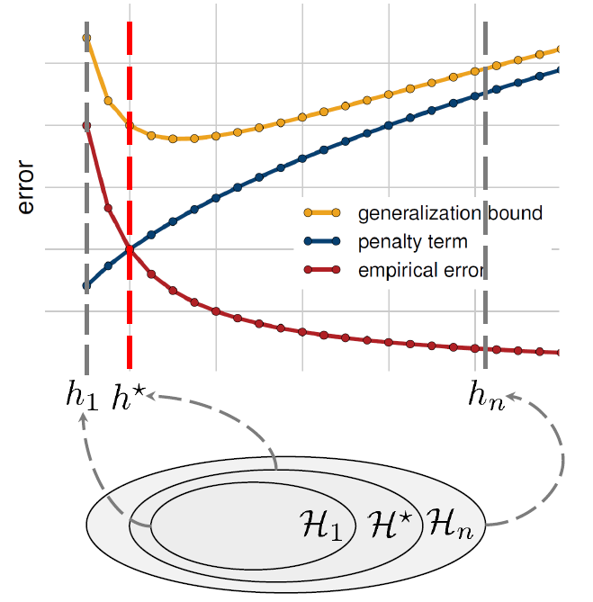
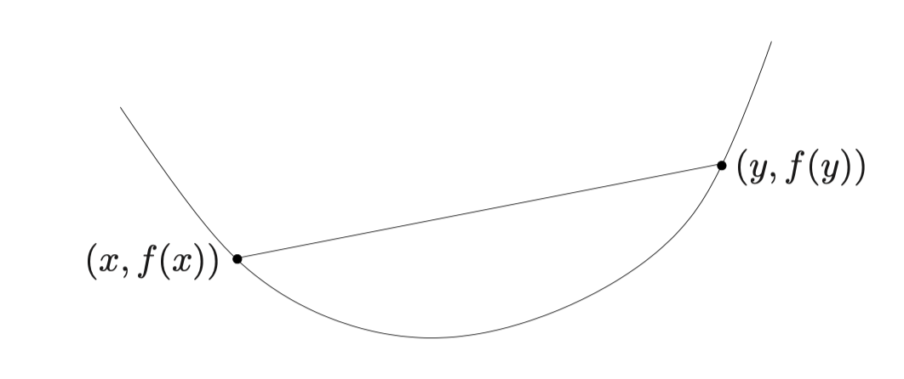
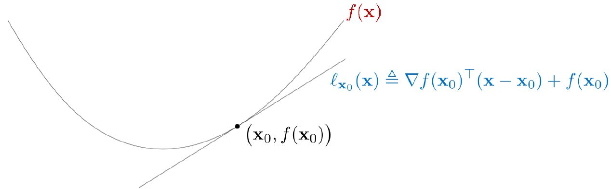

# Lecture ?：数学基础-2

一些机器学习需要用到的前置数学知识

**这里是凸优化基础部分**

为什么要完整记录这部分内容？因为原课件是英文的我看不懂，以下内容相当于翻译了

## 样本集

在机器学习中，我们通常要处理的数据是由一对输入和标签组成的样本集。取样本集中的某一个元素：

$$
(\mathbf{x_i}, y_i)
$$

输入 $\mathbf{x}_{i}$ 是一个向量，存储了样本的各种特征 / 属性

标签 $y_i$ 是模型的目标（模型预测的期望值）

## 风险最小化

监督学习的根本目标是风险最小化（Risk Minimization）

我们想从假设空间 $\mathcal{H}$ 中找到最佳模型 $h$，使得它在整个数据分布下的预期损失（expected loss）最小：

$$
\min_{h \in \mathcal{H}} \mathbb{E}_{(\mathbf{x}, y) \sim \mathcal{D}} [f(h(\mathbf{x}), y)]
$$

其中 $(\mathbf{x}, y) \sim \mathcal{D}$ 表示训练样本 $(\mathbf{x}, y)$ 来自于未知的真实分布 $\mathcal{D}$；$f(h(\mathbf{x}), y)$ 为损失函数，表示使用模型 $h$ 对输入 $x$ 进行预测，和真实标签 $y$ 比较产生的损失

这一风险为期望风险，又称上面的式子为泛化误差

### 经验风险最小化

在实际应用中，我们通常无法获得数据的真实分布 $\mathcal{D}$，这也意味着我们不能直接计算风险。因此在模型训练过程中，通常使用近似化方法计算风险：经验风险最小化（Empirical Risk Minimization, ERM）：

$$
\min_{h \in \mathcal{H}} \dfrac{1}{m} \sum_{i=1}^{m} f(h(\mathbf{x_{i}}), y_{i})
$$

其中 $(\mathbf{x_i}, y_i)$ 表示样本集中的第 $i$ 个样本，样本总数为 $m$。对于 ERM 近似，由于不依赖数据的真实分布，而是通过从分布中随机抽取的样本来近似估算风险，认为每个样本独立同分布

经验风险最小化也可以看作是对样本的平均近似，因为它通过计算从样本中获得的平均损失来近似真实的风险

#### 结构化经验风险最小化

为了避免模型过于复杂导致过拟合，我们继续引入正则化项：

$$
\min_{h \in \mathcal{H}} \dfrac{1}{m} \sum_{i=1}^{m} f(h(\mathbf{x_{i}}), y_{i}) + \lambda R(h)
$$

其中 $\lambda$ 是一个超参数（模型训练之前设定的参数），控制正则化的强度；$R(h)$ 是正则化项，限制模型复杂度来避免过拟合

我们引入下面的图像：

其中：

- 横轴是模型复杂度，纵轴是误差值
    - $h_1$ 对应最简单模型，欠拟合，训练误差高
    - $h_{n}$ 对应最复杂模型，过拟合，泛化能力差
    - $h^{*}$ 对应最优模型，达到平衡
- 红色曲线是经验误差，随模型复杂度增加不断下降（因为复杂模型拟合能力强）
- 蓝色曲线是正则化（惩罚）项，随模型复杂度增加上升（放置过拟合）
- 黄色曲线是泛化误差界限（理论上模型在未知数据上的误差），呈 U 型曲线，其最低点大致符合最优泛化能力的模型

## 一般优化问题

我们引入最小化的语言来表示一般优化问题（General Optimization Problem）：

$$
\min f(\mathbf{x}) \quad \text{s.t. } \mathbf{x}\in \mathcal{X}
$$

其中：

- 优化变量 $\mathbf{x} \in \mathbb{R}^{d}$ 是待调整的变量，$d$ 为变量个数
- 目标函数 $f: \mathbb{R}^{d} \to \mathbb{R}$ 的值需要最小化
- 可行域 $\mathcal{X} \in \mathbb{R}^{d}$ 对 $\mathbf{x}$ 进行一定约束

如果目标函数为凸函数，可行域为凸集，那么问题会有更好的解决方式，据此引入**凸优化**

## 凸优化

### 凸集

???+ success "Definition：凸集（Convex Set）"

    一个集合是凸集，当且仅当任取集合上两点构成线段，线段上所有点也都在集合内：
    
    $$
    \forall \alpha \in [0, 1], \; \alpha \mathbf{x} + (1-\alpha) \mathbf{y} \in \mathcal{X}
    $$

线段、射线、线性子空间都是凸集，另外还有两种比较重要的凸集：

???+ success "Definition：欧几里得球（Euclidean Ball）"

    定义欧几里得球为：
    $\mathbb{B}(\mathbf{x}_c, r) = \lbrace \mathbf{x}_c + r \mathbf{u} \mid \lVert \mathbf{u} \rVert_{2} \leq 1 \rbrace$
    
    语言描述为：从球心 $\mathbf{x}_c$ 出发，加上任意长度不超过 $r$ 的向量 $\mathbf{u}$，得到的所有点都在球内

???+ success "Definition：椭球（Ellipsoid）"

    定义椭球为：
    $\mathcal{E}(\mathbf{x}_c, A) = \lbrace \mathbf{x}_c + A \mathbf{u} \mid \lVert \mathbf{u} \rVert_{2} \leq 1 \rbrace$
    
    语言描述为：从球心 $\mathbf{x}_c$ 出发，将单位球内向量 $\mathbf{u}$ 通过<u>对称正定</u>矩阵 $A$ 映射，平移到 $\mathbf{x}_c$，得到的向量集合
    
    椭球就是球的仿射变换

### 凸函数

???+ success "Definition：凸函数（Convex Function）"

    一个函数 $f:\mathcal{X} \to \mathbb{R}$ 是凸的，当且仅当取任意函数上任意两点 $\mathbf{x}, \mathbf{y} \in \mathcal{X}$，有：
    
    $$
    \forall \alpha \in [0, 1], \; f(\alpha \mathbf{x} + (1-\alpha) \mathbf{y}  ) \leq \alpha f(\mathbf{x}) + (1-\alpha) f(\mathbf{y})
    $$
    
    如果 $f$ 一阶可微，则还有等价的一阶条件：
    
    $$
    f(\mathbf{x}) + \langle \nabla f(\mathbf{x}), \mathbf{y} - \mathbf{x} \rangle \leq f(\mathbf{y})
    $$
    
    如果 $f$ 二阶可微，则还有等价的二阶条件：
    
    $$
    \nabla ^{2} f(\mathbf{x}) \succeq 0
    $$
    
    （即 Hessian 矩阵是半正定的）

其几何图像非常直观：

一阶条件的图像如下（再去看看 Bregman 散度的定义？）

常见的凸函数有：

- $e^{ax}, a\in \mathbb{R}$
- $x^{a}, a \not\in (0 , 1)$
- $|x|^{a}, a>1$
- $-\log x$
- $x \log x$（负信息熵）
- 范数
- $\max$ 函数
- $\log (\sum _{i}e^{x_i})$

## Fermat 最优性条件

对于<u>无约束</u>优化问题，我们给出 Fermat 最优性条件

???+ success "Theorem：可微函数的 Fermat 最优性条件"

    对于无约束优化问题：
    
    $$
    \min_{x\in \mathbb{R}^{d}} f(x)
    $$
    
    如果 $x^{\ast}$ 是局部最优解，且 $f$ 在 $x^{\ast}$ 处可微，则：
    
    $$
    \nabla f(x^{\ast}) = 0
    $$
    
    如果 $f$ 是凸函数，则 $x^{\ast}$ 是全局最优解的充要条件即 $\nabla f(x^{\ast}) = 0$

从几何意义上来说，$x^{\ast}$ 的切平面是水平的，并且整个函数都在切平面上方

---

注意到 $f(x) = |x|$ 之类的函数在某些取值上不可微，但是对上面的结论依旧近似成立，于是我们引出凸函数情景下的 Fermat 最优性条件

首先为了处理不可微的凸函数的梯度，引入次梯度

???+ success "Definition：次梯度"

    定义凸函数 $f$ 在点 $x^{\ast}$ 处的次梯度为
    
    $$
    \partial f(x^{\ast}) = \lbrace g \in \mathbb{R}^{d} \mid f(x) \geq f(x^{\ast}) + g^{\top} (x-x^{\ast}), \forall x \in \mathbb{R}^{d}\rbrace
    $$
    
    换句话说：
    
    $$
    g \in \partial f(x^{\ast}) \equiv f(x) \geq f(x^{\ast}) + g^{\top} (x-x^{\ast}), \forall x \in \mathbb{R}^{d}
    $$

次梯度是向量的集合，表示所有支撑超平面的法向量的集合

???+ success "Theorem：全体凸函数的 Fermat 最优性条件"

    令 $f: \mathbb{R}^{d} \to (-\infty, \infty]$ 是一个凸函数（可以不光滑），函数至少有一个点函数值有限，依旧是无约束优化问题：
    
    $$
    \min_{x\in \mathbb{R}^{d}} f(x)
    $$
    
    如果 $x^{\ast}$ 是全局最优解，且 $f$ 在 $x^{\ast}$ 处可微，则充要条件为：
    
    $$
    \mathbf{0} \in \partial f(x^{\ast})
    $$

## 一阶最优性条件

<u>约束集为凸集</u>优化问题可以这样表示：

$$
\begin{aligned}
\min \quad & f(x) + \delta_{\mathcal{X}} (\mathbf{x})\newline
\text{s.t.} \quad & \mathbf{x} \in \mathbb{R}^{d}
\end{aligned}
$$

其中：

$$
\delta_{\mathcal{X}}(\mathbf{x}) =
\begin{cases}
0, & \mathbf{x} \in \mathcal{X}, \newline
\infty, & \mathbf{x} \notin \mathcal{X}.
\end{cases}
$$

为指示函数（barrier / indicator function），显式表示集合的约束

我们给出一阶最优性条件

（这里直接给出凸函数下的最优性条件，而不再介绍常规可微函数的条件写法）

???+ success "Theorem：一阶最优性条件"

    对于 $f$ 为可微凸函数，约束集 $\mathcal{X}$ 为凸集的优化问题：
    
    $$
    \min_{x\in \mathcal{X}} f(x)
    $$
    
    如果 $x^{\ast}$ 是全局最优解，则充要条件是存在 $g \in \partial f(x^{\ast})$，满足变分不等式：
    
    $$
    \langle \mathbf{g}, \mathbf{x}-\mathbf{x}^{\ast} \rangle \geq 0, \quad \forall \mathbf{x} \in \mathcal{X}
    $$
    
    几何意义为：从 $x^{\ast}$ 沿任何方向出发，函数值都不会下降

## Lagrange 乘子法

 Lagrange 乘子（Lagrange Multipliers）将等式约束优化问题转化为无约束优化问题，通过引入“乘子”来体现约束的影响

$$
\begin{aligned}
\min \quad & f(x) \newline
\text{s.t.} \quad & h_j(x) = 0, \quad j = 1, \dots, n
\end{aligned}
$$

在无约束情况下，最优点 $x^{\ast}$ 处满足 $\nabla f(x^{\ast}) = 0$

而引入了约束曲面 $h(x) = 0$ 之后，在最优解 $x^{\ast}$ 处， $f$ 的梯度需要与所有约束的梯度张成的空间正交（否则沿曲面运动可以进一步缩小 $f$），也就是说，存在 Lagrange 乘子 $\mathbf{\lambda}= \left( \lambda^{\ast}_{1},  \cdots , \lambda^{\ast}_{n} \right)^{\top}$：

$$
\nabla f(x^{\ast}) + \sum_{j=1}^{n}\lambda_{j} \nabla h_{j}(x^{\ast}) = 0
$$

因此我们给出 Lagrange 乘子法的一阶必要条件：

???+ success "Definition：Lagrange 乘子法的一阶必要条件"

    如果 $x^{\ast}$ 是局部最优解，且满足约束规格（比如 $\{\nabla h_j(x^{\ast})\}_{j=1}^p$ 线性独立），则一定存在 Lagrange 乘子 $\lambda^{\ast} = \left( \lambda^{\ast}_{1}, \cdots , \lambda^{\ast}_{n} \right)^{\top}$，使得
    
    $$
    \nabla_x \mathcal{L}(x^{\ast}, \lambda^{\ast}) = 0 \quad \Leftrightarrow \quad \nabla f(x^{\ast}) + \sum_{j=1}^n \lambda_j^{\ast} \nabla h_j(x^{\ast}) = 0
    \newline
    h_{j}(x^{\ast}) = 0
    $$

这组方程被称为 Lagrange 方程组

## KKT 条件

KKT 条件是 Lagrange 乘子法在不等式约束下的推广，现在考虑等式约束 + 不等式约束的优化问题：

$$
\begin{aligned}
\min \quad & f(x) \newline
\text{s.t.} \quad & g_i(x) \leq 0, \quad i = 1, \dots, m \newline
& h_j(x) = 0, \quad j = 1, \dots, n
\end{aligned}
$$

???+ success "Definition：KKT 条件"

    假设 $\mathbf{x}^{\ast}$ 是问题的局部最优解，且满足约束规格（比如 $\{\nabla h_j(x^{\ast})\}_{j=1}^m$ 线性独立），则一定存在 Lagrange 乘子 $\mu_i \ge 0$ 和 $\lambda_j$，使得
    
    - 稳定性条件：
       
       $$
       \nabla f(x^{\ast}) + \sum_{i=1}^m \mu_i \nabla g_i(x^{\ast}) + \sum_{j=1}^n \lambda_j \nabla h_j(x^{\ast}) = 0
       $$
    
    - 原始可行性：
       
       $$
       g_i(x^{\ast}) \le 0, \quad h_j(x^{\ast}) = 0
       $$
    
    - 对偶可行性：
       
       $$
       \mu_i \ge 0
       $$
    
    - 互补松弛条件：
       
       $$
       \mu_i g_i(x^{\ast}) = 0, \quad \forall i
       $$

KKT 条件对于一般的优化问题是**必要条件**，也就是说给定局部左右解和满足约束规格，可以得到四个条件，但是不具有充分性

### 扩展后的 Lagrange 乘子法

考虑等式约束 + 不等式约束的优化问题：

$$
\begin{aligned}
\min \quad & f(x) \newline
\text{s.t.} \quad & g_i(x) \leq 0, \quad i = 1, \dots, m \newline
& h_j(x) = 0, \quad j = 1, \dots, n
\end{aligned}
$$

在引入 KKT 条件后，我们可以给出包含不等式约束的 Lagrange 函数：

$$
\mathcal{L}(x, \lambda, ν) = f(x) + \sum_{i=1}^{m} \lambda_{i}g_{i}(x) + \sum_{j=1}^{n} ν_{j}h_{j}(x)
$$

其中 $\lambda_{i} \geq 0$ 对应不等式约束的 Lagrange 乘子；$ν_{j} \in \R$ 对应等式约束的 Lagrange 乘子

## Lagrange 对偶函数

定义 Lagrange 函数的对偶函数：

???+ success "Definition：对偶函数"

    给出 Lagrange 函数 $\mathcal{L}(x, \lambda, ν)$，其中 $x \in \mathcal{X}$
    
    定义对偶函数
    
    $$
    g(\lambda, ν) = \text{inf}_{x\in \mathcal{X}} \mathcal{L}(x, \lambda, ν)
    $$
    
    无论原问题是否是凸函数，对偶问题 $g(\lambda, ν)$ 一定是凹函数。也就是说，对偶行函数给出了原问题最优值的一个下界 infimum

为了得到这个最优下界，定义 Lagrange 对偶问题：

$$
\begin{aligned}
\max_{\lambda, ν} \quad & g(\lambda, ν) \newline
\text{s.t.} \quad &\lambda \succeq 0
\end{aligned}
$$

我们定义原问题的最优值为 $p^{\ast}$，对偶问题的最优值记为 $d^{\ast}$

如果 $d^{\ast} \leq p^{\ast}$，则弱对偶成立；如果 $d^{\ast} = p^{\ast}$，则强对偶成立

## Slater 条件

现在来到凸优化问题，给出 Slater 条件

???+ success "Definition：Slater 条件"

    我们规定：
    
    - $f, g_{i}$ 都是凸函数
    - $h_{j}$ 是仿射函数，即 $h_j(x) = 0$ 相当于 $a_j^\top x = b_j$
    
    即：
    
    $$
    \begin{aligned}
    \min \quad & f(x) \newline
    \text{s.t.} \quad & g_i(x) \leq 0, \quad i = 1, \dots, m \newline
    & a_j^\top x = b_j, \quad j = 1, \dots, n
    \end{aligned}
    $$
    
    对于上述问题，如果存在一个点 $x$，使得所有不等式约束即使去除等号也成立（$g_i(x) < 0, \quad i = 1, \dots, m$），并且所有的等式约束也成立，则称这个点为 Slater 点，该凸优化问题为满足 Slater 条件的问题

如果一个凸优化问题满足 Slater 条件，那么：

- 问题是**强对偶**的
- 对应的 KKT 条件的**充分性**也成立（满足四个条件可以确认 $x^{\ast}$ 是全局最优解）

### Understanding KKT Conditions

- 如果一个问题满足 Slater 条件，那么任何最优解 $x^{\ast}$ 都必须满足 KKT 条件（充要性成立）
    - 这提供了对最优解的检验
- 大多数凸优化算法并不是直接求解原问题，而是在迭代过程中逐步逼近 KKT 条件
    - 最终目标是让 $\nabla_{x}\mathcal{L} \approx 0$，$\lambda_{i}g_{i} \approx 0$，$g_{i}(x) \leq 0$，这些都是近似的 KKT 条件

## Why 凸优化

为什么凸优化问题如此重要？

- 凸优化问题的局部最优解也是全局最优解
- 一般优化问题大多数都是 Hard 的，通常甚至是 NP-Hard 的；而凸优化问题可以更快求解
  

根据第一性原理，基于三个基本假设，能够推出函数 $f$ 必须是凸的：

- $\nabla f(x^{\ast}) = 0$，则 $x^{\ast}$ 是全局最优
- 如果 $f_{1},f_{2}$ 在函数类中，则 $\alpha f_{1} + \beta f_{2}$ 也在函数类中（$\alpha, \beta \geq 0$）
- 线性函数属于函数类 $f(x) = ax + b$

??? question "证明"

    取任意 $f$ 和任意固定点 $x_0$，构造：
    
    $$
    \phi(x) = f(x) - f'(x_0)x
    $$

    由假设 2 和 3，$\phi$ 也在函数类中
    
    求导得 $\phi'(x) = f'(x) - f'(x_0)$，所以 $\phi'(x_0) = 0$
    
    由假设 1，$x_0$ 是 $\phi$ 的全局最优点：
    
    $$
    \phi(x) \geq \phi(x_0) \quad \forall x
    $$
    
    代入得：
    
    $$
    f(x) - f'(x_0)x \geq f(x_0) - f'(x_0)x_0
    $$
    
    整理得：
    
    $$
    f(x) \geq f(x_0) + f'(x_0)(x - x_0)
    $$
    
    这是凸函数的一阶形式定义

事实上，很多非凸问题的解决方案，设计上也是源于凸优化问题的
