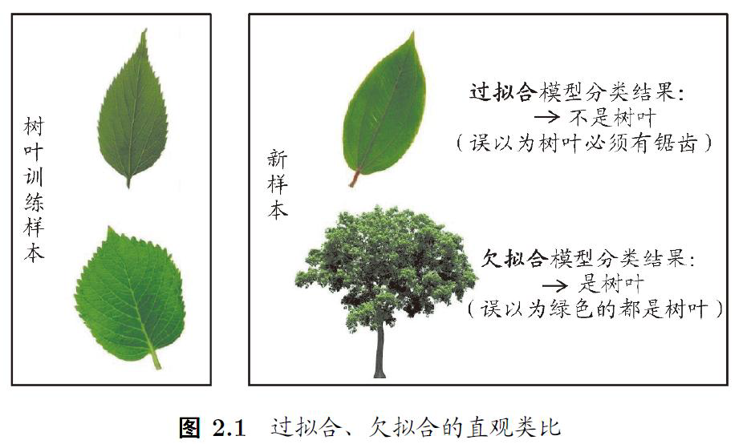
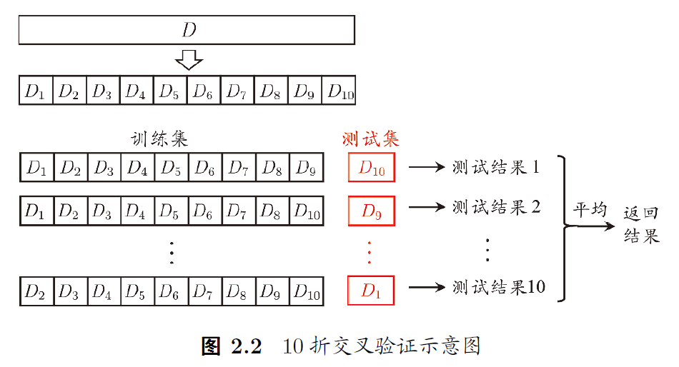
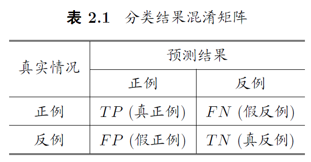
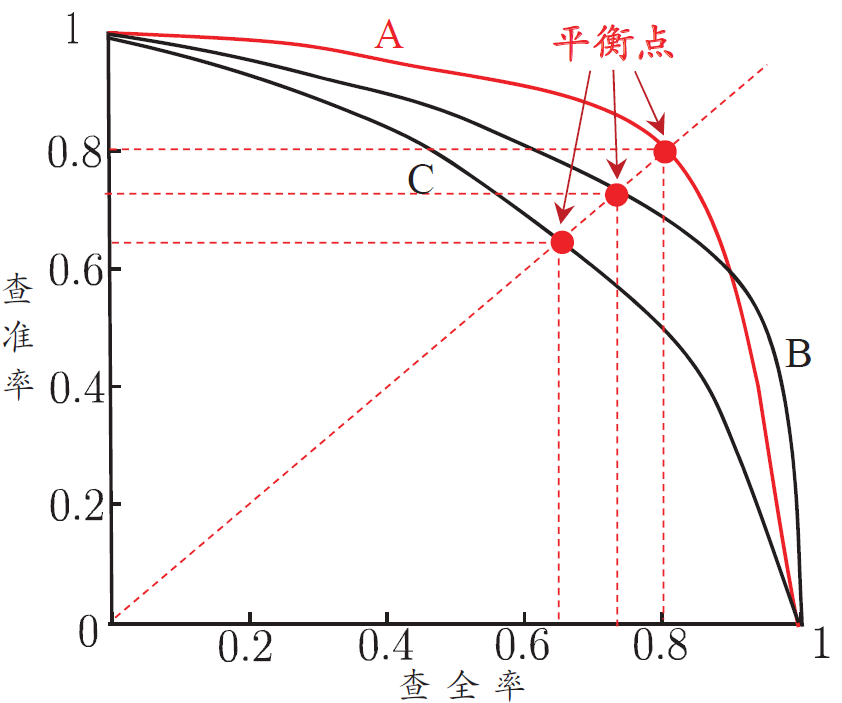
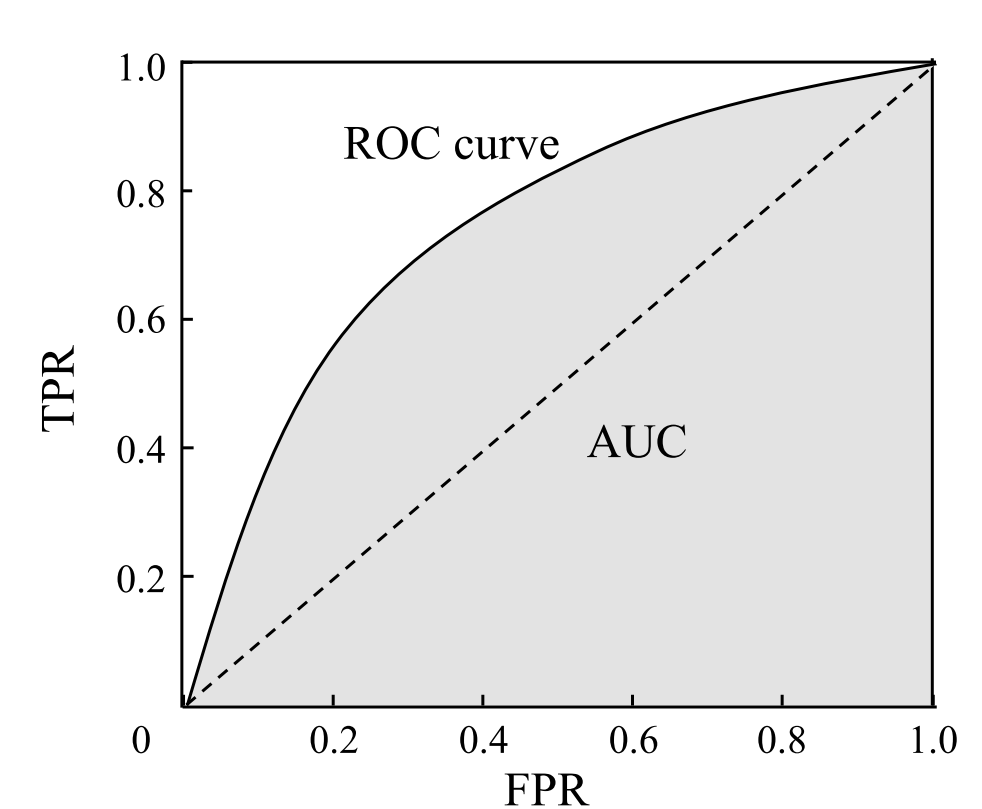
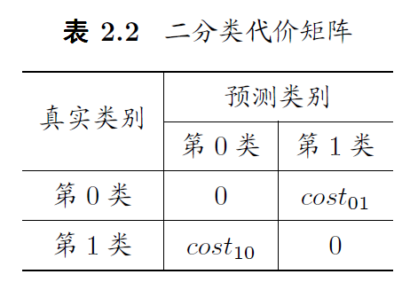
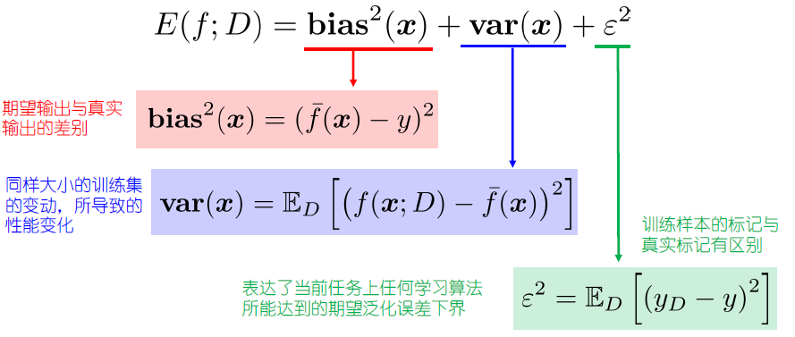
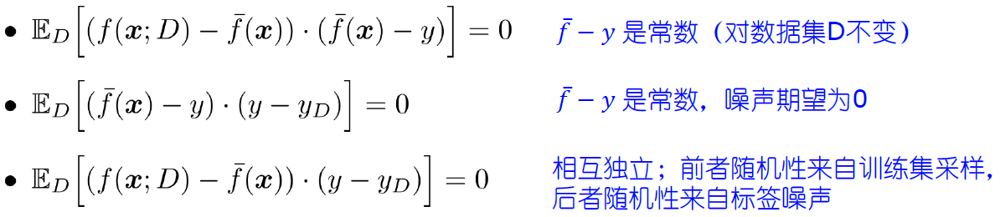
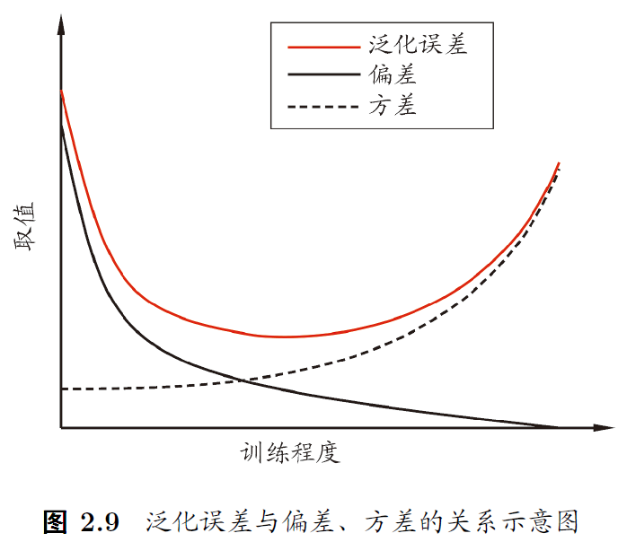

# Lecture 2：模型评估与选择

前情提要：

监督学习的根本目标是风险最小化（Risk Minimization）

我们想从假设空间 $\mathcal{H}$ 中找到最佳模型 $h$，使得它在整个数据分布下的预期损失（expected loss）最小：

给出泛化误差的表达式

$$
R(f) = \mathbb{E}_{(\mathbf{x}, y) \sim \mathcal{D}} [ℓ(f(h(\mathbf{x}), y))]
$$

其中 $(\mathbf{x}, y) \sim \mathcal{D}$ 表示训练样本 $(\mathbf{x}, y)$ 来自于未知的真实分布 $\mathcal{D}$；$f(h(\mathbf{x}), y)$ 为损失函数，表示使用模型 $h$ 对输入 $x$ 进行预测，和真实标签 $y$ 比较产生的损失；$ℓ$ 是损失函数

---

在实际应用中，我们通常无法获得数据的真实分布 $\mathcal{D}$，这也意味着我们不能直接计算风险。因此在模型训练过程中，通常使用近似化方法计算风险：经验风险最小化（Empirical Risk Minimization, ERM）

给出经验误差的表达式

$$
\hat{R} (f) = \dfrac{1}{m} \sum_{i = 1}^{m} ℓ(f(h(\mathbf{x_{i}}), y_{i}))
$$

其中 $(\mathbf{x_i}, y_i)$ 表示样本集中的第 $i$ 个样本，样本总数为 $m$。对于 ERM 近似，由于不依赖数据的真实分布，而是通过从分布中随机抽取的样本来近似估算风险，认为每个样本独立同分布

经验风险最小化也可以看作是对样本的平均近似，因为它通过计算从样本中获得的平均损失来近似真实的风险

## 过拟合 && 欠拟合

我们当然希望泛化误差越小越好，但是我们并不希望经验误差也是越小越好，否则会出现“过拟合”现象

一个模型如果学习能力过于强大，以至于把训练样本中一些不太一般的特性都学到了，将这些特性当作了所有潜在样本都具有的性质，此时模型的泛化能力就会下降。我们称之为过拟合

与之相对的是“欠拟合”，欠拟合可以通过提升学习能力进行克服，而过拟合是无法避免的（只要你相信 $P \ne NP$）

## 数据划分

训练样本时需要调整参数，其中我们记算法的参数为超参数，由人工进行设定；相对的，模型本身的参数由学习过程决定

我们将全部样本划分为训练集、验证集、测试集

- 训练集调整模型本身的参数
- 验证集用于调整超参数，进行模型选择
- 测试集用于一次性评估泛化能力（不用于任何调整）

## 评估方法

模型选择的第一步是获得测试结果，而测试模型至少需要训练集 + 测试集。如何在确保训练集与测试集互斥的情况下，获得符合条件的测试集？

### 留出法（hold-out）

将数据集 $D$ 划分为两个互斥的子集，其中一个为训练集 $S$，另一个为测试集 $T$

如果从采样的角度来看待数据集的划分过程，则保留类别比例的采样方式通常称为“分层采样”

为了提高训练准确性，通常需要多次随机重复划分，并且选择合适大小的测试集（$\dfrac{1}{5} \sim \dfrac{1}{3}$）

### k-折交叉验证法（cross validation）

将数据集 $D$ 划分为 $k$ 个互斥的子集

进行 $p$ 次交叉验证，每次从 $k$ 个互斥集合中取出 $1$ 个作为测试集，其他的 $k-1$ 个作为训练集。将测试结果进行平均，则得到返回结果

以下为 $p = k = 10$ 的交叉验证

总样本数为 $m$。若 $k = m$，则得到“留一法”（因为每个互斥子集的元素都只有一个）

### 自助法（bootstrap）

对数据集 $D$（总样本数为 $m$）进行 $m$ 次有放回采样，则每个样本不会被抽到的概率为 $\left( 1-\dfrac{1}{m} \right)^{m}$，在样本数足够多的情况下：

$$
\lim_{m\to \infty}\left( 1-\dfrac{1}{m} \right)^{m} = \dfrac{1}{e} \approx 36.8\%
$$

理想情况下，有一部分样本会被重复抽取，我们用作训练集；同时会有大约 $36.8\%$ 的样本不会被抽取，称后者为包外样本，我们用作测试集

## 性能度量

性能度量（performance measure）是衡量模型泛化能力的评价标准，反映了任务需求

使用不同的性能度量往往会导致不同的评判结果

### 均方误差

在预测问题中，给定样例集 $[(\mathbf{x}_{m}, y_{m})]$，对于回归任务，通常用均方误差

$$
E(f; D) = \dfrac{1}{m} \sum_{i = 1}^{m} \left(f(\mathbf{x_{i}}), y_{i} \right)^{2}
$$

更广义的，对于数据分布 $\mathcal{D}$ 和概率密度函数 $p$，有

$$
E(f; D) = \int_{\mathbf{x} \sim \mathcal{D}}  \left(f(\mathbf{x_{i}}), y_{i} \right)^{2} p(\mathbf{x}) \text{d} \mathbf{x}
$$

### 错误率

记 $\mathbb{I}$ 为指示函数

> 指示函数 $\mathbb{I}$ 的定义
>
> $$
> \mathbb{I}(P) =
> \begin{cases}
> 1 & \text{if } P \text{ is true} \newline
> 0 & \text{if } P \text{ is false}
> \end{cases}
> $$

$$
E(f; D) = \dfrac{1}{m} \sum_{i = 1}^{m} \mathbb{I}(f(\mathbf{x_{i}}) \ne y_{i})
$$

### 精度

$$
\text{acc}(f; D) = 1- E(f; D) = \dfrac{1}{m} \sum_{i = 1}^{m} \mathbb{I}(f(\mathbf{x_{i}}) = y_{i})
$$

### 查准率 && 查全率

给出下面的矩阵

定义查准率：$P = \dfrac{TP}{TP+FP}$；查全率：$R = \dfrac{TP}{TP+FN}$

查准率与查全率通常是矛盾的，我们以 $P$ 为纵轴，$R$ 为横轴，作图得到 $\text{P-R}$ 图

其中平衡点（Break-Even Point, BEP）记为查准率 = 查全率时的取值，可以基于 BEP 比较判断哪个模型更优

---

BEP 有时候差点意思，我们用调和平均进行估计。定义 $F1$ 度量满足

$$
\dfrac{1}{F1} = \dfrac{1}{2} \cdot \left(\dfrac{1}{P} + \dfrac{1}{R}  \right)
$$

化简为

$$
F1 = \dfrac{2\times P\times R}{P+R} = \dfrac{2\times TP}{m + TP - TN}
$$

其中 $m$ 是样例总数

如果对查准率/查全率有不同偏好，则引入比例因子

$$
\dfrac{1}{F_\beta} = \dfrac{1}{1+\beta^{2}} \cdot \left(\dfrac{1}{P} + \dfrac{\beta^{2}}{R}  \right)
$$

$\beta > 1$ 时，查全率 $R$ 的影响更大；$\beta < 1$ 时，查准率 $P$ 的影响更大

---

如果我能得到多次训练/测试的结果，或者多分类的两两混淆矩阵等，总之我们希望在 $n$ 个二分类混淆矩阵上综合考察查准率 $P$ 与查全率 $Q$

我们给出两种平均方式：第一种是对每个矩阵的 $(P_{i}, Q_{i})$ 取平均，记为 macro 平均；第二章是对每个矩阵的元素 $(\overline{TP}, \overline{FP}, \overline{TN}, \overline{FN})_{i}$ 取平均，记为 micro 平均

$$
\begin{aligned}
\text{macro-P} &= \dfrac{1}{n} \sum_{i = 1}^n P_{i} \newline
\text{macro-R} &= \dfrac{1}{n} \sum_{i = 1}^n R_{i} \newline
\text{macro-F1} &= \dfrac{2 \times \text{macro-P} \times \text{macro-R}}{\text{macro-P} + \text{macro-R}} \newline \newline
\text{micro-P} &= \frac{\overline{TP}}{\overline{TP} + \overline{FP}} \newline
\text{micro-R} &= \frac{\overline{TP}}{\overline{TP} + \overline{FN}} \newline
\text{micro-F1} &= \frac{2 \times \text{micro-P} \times \text{micro-R}}{\text{micro-P} + \text{micro-R}} \newline
\end{aligned}
$$

### ROC && AUC

以神经网络为例，我们希望将模型输出的概率值 $p\in [0.0, 1.0]$，按照一个特定的分配阈值 $p_{0}$，将 $p \geq p_{0}$ 记为 Positive，将 $p < p_{0}$ 记为 Negative

不同的场景需要不同的 $p_{0}$，比如垃圾邮件检测追求查准率，因此 $p_{0}$ 的值应该更高；疾病筛查追求查全率，因此 $p_{0}$ 的值应该更低

为了评价二分类模型的性能，我们引入 ROC 图。与 P-R 曲线相似，我们根据学习器的预测结果对阳历排序，按此顺序逐个把样本作为整理进行预测。定义纵轴为“真正例率”（True Positive Rate, TPR），横轴为“假正例率”（False Positive Rate, FPR）

$$
TPR = \dfrac{TP}{TP + FN} = \dfrac{TP}{m^{+}} \newline
FPR = \dfrac{FP}{TN + FP} = \dfrac{FP}{m^{-}} \newline
$$

显示 ROC 曲线的图为 ROC 图，ROC 曲线下方的面积为 AUC

如果一个学习器的 ROC 曲线被另一个学习器的曲线完全包住，则可以断言后者性能更优；否则通过比较 AUC 的大小，可以大致判断性能优劣

注意到数据点有限，我们借助微分的思路，把曲线下面积分解成多个梯形，求和得到近似值：

$$
AUC = \frac{1}{2} \sum_{i=1}^{m-1} (x_{i+1} - x_i) \cdot (y_{i+1} + y_i)
$$

形式化来看，AUC 本质上衡量的是模型对正例和反例的排序能力。给定 $m^{+}$ 个正例和 $m^{-}$ 个反例，令 $D^{+}$ 分别表示正、反例集合，定义排序损失：

$$
\ell_{\text{rank}} = \frac{1}{m^+ m^-} \sum_{x^+ \in D^+} \sum_{x^- \in D^-} \left( \mathbb{I}(f(x^+) < f(x^-)) + \frac{1}{2} \mathbb{I}(f(x^+) = f(x^-)) \right)
$$

容易得到 $AUC = 1 - \ell_{\text{rank}}$

> 可以进一步推导出
>
> $$
> \text{AUC} = P(f(x^+) > f(x^-)) + \dfrac{1}{2}P(f(x^+) = f(x^-))
> $$

### 代价敏感

注意到不同类型错误对应的代价可能非常大（比如医院误诊），我们为了权衡不同类型错误所造成的不同损失，为每种错误赋予非均等代价

比如二分类代价矩阵，指出不同的错误预测（非对角线元素）对应的代价值

我们假定第 0 类为正例，第 1 类为反例，定义代价敏感错误率

$$
\begin{aligned}
E(f; D; \text{cost}) = \frac{1}{m} \bigg( & \sum_{x_i \in D^{+}} \mathbb{I}(f(x_i) \neq y_i) \times \text{cost}_{01} \newline
& + \sum_{x_i \in D^{-}} \mathbb{I}(f(x_i) \neq y_i) \times \text{cost}_{10} \bigg)
\end{aligned}
$$

以上，我们不再简单统计错误次数，而是给不同错误类型加权，计算总代价

> 代价曲线略

### 回归任务

对于数据 $(\mathbf{X}_{i}, y_{i})$，其中 $y_{i} \in \R$，模型预测输出 $\hat{y_{i}} \in \R$

平均绝对误差（Mean Absolute Error, MAE）

$$
\text{MAE} = \dfrac{1}{n} \sum_{i=1}^{n} |y_{i} - \hat{y}_{i}|
$$

平均平方误差（Mean Squared Error, MSE）

$$
\text{MSE} = \dfrac{1}{n} \sum_{i=1}^{n} (y_{i} - \hat{y}_{i})^{2}
$$

## 比较检验

单个模型的评估结果不适用于直接拿来与其他模型进行优劣比较。因为单个模型的测试性能与泛化性能会有差异，受到测试集与随机化的影响

因此为了判断一个模型是否确实优于另一个模型，我们需要统计假设检验，进行两 / 多学习器比较

> 具体的比较检验方式略

### 偏差-方差分解

如何考虑机器学习时，“误差”涉及的多个因素？

首先形式化引入定义：

- 训练集 $D$
- 训练样本的特征为 $\mathbf{x}$，真实标记为 $y$；由于噪声，数据集中的实际标记为 $y_{D}$。约定噪声期望 $\mathbb{E}_{D}[y_{D} - y] = 0$
- 算法的预测输出 $f(\mathbf{x};D)$
- 算法的期望输出 $\bar{f}(\mathbf{x}) = \mathbb{E}_{D}[f(\mathbf{x};D)]$

泛化误差定义为：

$$
E(f;D) = \mathbb{E}_{D}\left[ (f(\mathbf{x};D) - y_{D})^{2}\right]
$$

为了解释模型泛化误差来源，分析算法在不同训练集上表现的差异，我们引入偏差-方差分解。<u>对于回归问题</u>，泛化误差可通过“偏差-方差分解”拆解为：

简单理解就是：模型的偏差 + 模型的不确定性（方差） + 不可避免噪声，得到最终的泛化误差

> 可以通过加减项：
>
> $$
> f(\mathbf{x};D) - y_{D} = (f(\mathbf{x};D) - \bar{f}(\mathbf{x})) + (\bar{f}(\mathbf{x}) - y) + (y-y_{D})
> $$
>
> 对上式平方，证明期望下所有交叉项为 0：
>
> 

一般而言，偏差与方差存在冲突，当训练不足时，偏差占主导；当训练充足时，方差占主导

