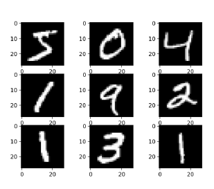
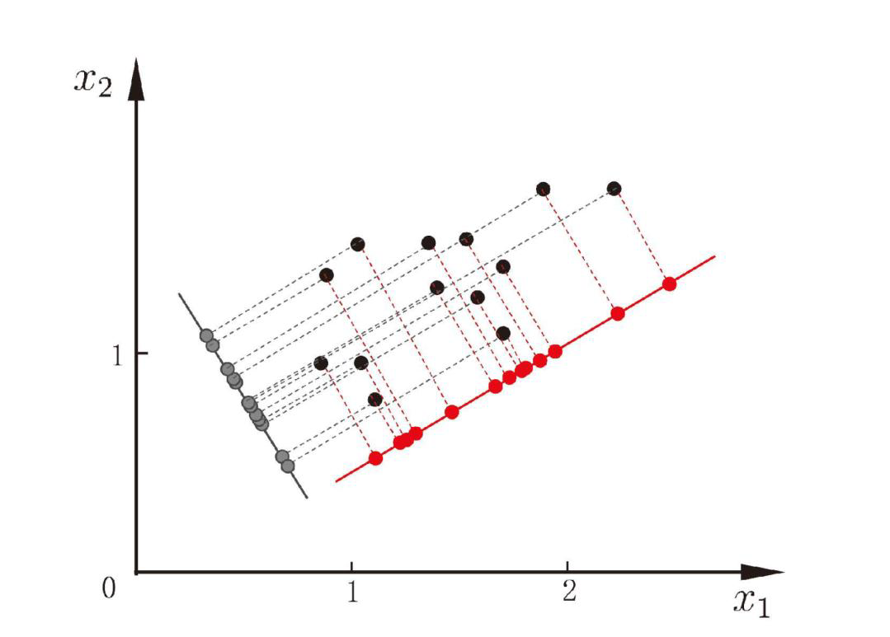
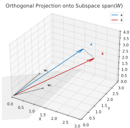

# Lecture 3-extra：降维：主成分分析

对于维度非常庞大的对象，对完整的维度进行计算是不现实的；而有些学习算法依赖于“密采样”的假设。如果一个对象的每个维度都是必需关键的，那么降维操作必然会丢失掉对象的关键信息

事实上，很多对象具有低维度的内在结构（intrinsic dimension），换言之，我们只需要少数关键维度的信息，就可以大致复现出对象的特征。

> 以 MNIST dataset 为例，原始结构为 28 × 28 pixels = 784 个维度的对象，但如果只是为了区分出 0 ~ 9 的手写数字，通常不需要非常详细的原始对象

## 主成分分析 PCA

给定一些高维属性空间中的样本点，如何使用一个低维的超平面对所有样本进行“恰当”的表达？

比如，我们在二维的数据集上，尝试寻找一条一维直线，使得满足：

- 最大可分性：样本点在这个超平面的投影都尽可能分开
    - 从压缩的角度来看，我们希望**投影点的方差最大化**，使得样本点的差距能够体现
- 最近重构性：样本点到这个超平面的距离都尽可能接近
    - 从还原的角度来看，我们希望造成的**信息损失最小**，即重构后的点与原始点之间的距离最近

> 对于一个样本点 $\mathbf{x}_i$ 和它在超平面上的投影点 $\mathbf{\hat{x}}_i$，以及数据真实的中心点 $\mathbf{\bar{x}}$，这三个点构成一个直角三角形。存在如下向量关系：
>
> $$
> \underbrace{\mathbf{x}_i - \mathbf{\bar{x}}}_{\text{到中心的距离}} = \underbrace{\mathbf{\hat{x}}_i - \mathbf{\bar{x}}}_{\text{投影到中心的距离}} + \underbrace{\mathbf{x}_i - \mathbf{\hat{x}}_i}_{\text{点到投影点的距离}}
> $$
>
> 因为 $(\mathbf{\hat{x}}_i - \mathbf{\bar{x}})$ 在超平面内，而 $(\mathbf{x}_i - \mathbf{\hat{x}}_i)$ 垂直于超平面，所以这是一个直角三角形的斜边和两条直角边。
>
> 因此，对于**所有样本点**，勾股定理意味着：
>
> $$
> \sum \text{原始方差} = \sum \text{投影方差} + \sum \text{重构误差}
> $$
>
> 对于任意选取的超平面，**原始方差是固定不变的**
>
> 因此最大可分性与最近重构性方向的优化是数学上等价的优化，会在之后的数学推导中再次指出这一点

### 数学推导

依旧给出一些符号定义

- 给定数据集：$\mathbf{x}_1, \mathbf{x}_2, \cdots, \mathbf{x}_m \in \mathbb{R}^d$（$d$ 维原始空间，$m$ 个样本）
- 数据矩阵：$X = [\mathbf{x}_1, \mathbf{x}_2, \cdots, \mathbf{x}_m] \in \mathbb{R}^{d \times m}$
- 投影平面：由正交基 $W = [\mathbf{w}_1, \mathbf{w}_2, \cdots, \mathbf{w}_s] \in \mathbb{R}^{d \times s}$ 张成
- 中心化假设：

$$
\sum_{i=1}^m \mathbf{x}_i = \mathbf{0}
$$

（因为中心化行为不会影响投影方向，所以这里只是为了简便化计算。如果原始数据未中心化，可先计算均值 $\bar{\mathbf{x}} = \frac{1}{m}\sum_i \mathbf{x}_i$，并替换 $\mathbf{x}_i \leftarrow \mathbf{x}_i - \bar{\mathbf{x}}$）

我们已知协方差矩阵的矩阵表示为

$$
S = \frac{1}{m} X X^\top \in \mathbb{R}^{d \times d}
$$

#### 最大可分性

我们希望投影样本的方差最大，记投影后的坐标为：

$$
\mathbf{z}_{i} = W^{T} \mathbf{x}_i \in \R ^{s}
$$

因为中心化后

$$
\sum_{i=1}^m \mathbf{z}_i = \mathbf{0}
$$

所以

$$
\text{Var}(\{\mathbf{z}_i\}) = \frac{1}{m} \sum_{i=1}^m \|\mathbf{z}_i - \bar{\mathbf{z}}\|_2^2 = \frac{1}{m} \sum_{i=1}^m \|\mathbf{z}_i\|_2^2
$$

继续计算

$$
\frac{1}{m} \sum_{i=1}^m \|\mathbf{z}_i\|_2^2 = \frac{1}{m} \sum_{i=1}^m \mathbf{z}_i^{T}\mathbf{z}_i = \frac{1}{m} \sum_{i=1}^m \mathbf{x}_i^{T}WW^{T}\mathbf{x}_i
$$

注意到 $\mathbf{x}_i^{T}WW^{T}\mathbf{x}_i$ 是一个标量，标量满足它的值等于它的迹，而迹满足循环置换性质，因此：

$$
\frac{1}{m} \sum_{i=1}^m \mathbf{x}_i^{T}WW^{T}\mathbf{x}_i = \frac{1}{m} \operatorname{tr}\left(W^{T}\sum_{i=1}^m \left(\mathbf{x}_{i}\mathbf{x}_i^{T}\right)W \right) = \operatorname{tr}(W^{T}SW)
$$

因此最大可分性的最优化问题为：

$$
\begin{aligned}
\max_{W \in \mathbb{R}^{d \times s}} \quad & \operatorname{tr} \left( W^\top S W \right) \\
\text{s.t.} \quad & W^\top W = I_s
\end{aligned}
$$

#### 最近重构性

我们希望重构误差最小，记正交投影后的坐标为：

$$
\mathbf{z}_{i} = W^{T} \mathbf{x}_i \in \R ^{s}
$$

我们记重建后的样本

$$
\hat{\mathbf{x}}_i = W \mathbf{z}_i = W W^\top \mathbf{x}_i
$$

>我们记 $P = WW^{T}$ 为正交投影算子，将任意向量投影到 $W$ 的列张成的子空间上
>
>因为 $W^{T}W = I$，所以 $P$ 具有幂等性，对称性等性质
>
>

我们要最小化：

$$
\mathcal{E}(W) = \sum_{i=1}^m \|\mathbf{x}_i - W W^\top \mathbf{x}_i\|_2^2 = \| X - W W^\top X \|_F^2
$$

我们已知

$$
\| A \|_{F}^{2} = \operatorname{tr}(A^{T}A)
$$

因此代入 $\| X - W W^\top X \|_F^2$ 并进行化简，最终得到：

$$
\mathcal{E}(W) = \operatorname{tr}(X^{T}X) - \operatorname{tr}(W^{T}XX^{T}W)
$$

我们要最小化 $\mathcal{E}(W)$，即最大化 $\operatorname{tr}(W^{T}XX^{T}W)$，即

$$
\begin{aligned}
\max_{W \in \mathbb{R}^{d \times s}} \quad & \operatorname{tr} \left( W^\top S W \right) \\
\text{s.t.} \quad & W^\top W = I_s
\end{aligned}
$$

因此**最大可分性与最近重构性的最优化问题等价**

### 求解

由之前的推导可知，我们要求解的问题是：

$$
\begin{aligned}
\max_{W \in \mathbb{R}^{d \times s}} \quad & \operatorname{tr} \left( W^\top S W \right) \\
\text{s.t.} \quad & W^\top W = I_s
\end{aligned}
$$

我们采用两个方法固定这个问题：

#### 拉格朗日乘子法

对于这个问题：

$$
\begin{aligned}
\min_{W \in \mathbb{R}^{d \times s}} \quad & - \operatorname{tr} \left( W^\top S W \right) \\
\text{s.t.} \quad & W^\top W = I_s
\end{aligned}
$$

构造拉格朗日函数：

$$
\mathcal{L}(W) = - \operatorname{tr}(W^\top C W) + \operatorname{tr}\left( \Lambda (W^\top W - I) \right)
$$

其中 $\Lambda$ 是对称拉格朗日乘子矩阵。对 $W$ 求导，令梯度为 $0$，得：

$$
\frac{\partial \mathcal{L}}{\partial W} = -2C W + 2W \Lambda = 0 \quad \to \quad C W = W \Lambda
$$

$W$ 的列是 $C$ 的特征向量，而 $\Lambda$ 的对角元是相应特征值

$\Lambda$ 应取最大的 $s$ 个特征值，该问题的最优解是由协方差矩阵 $XX^\top$ 的前 $s$ 个最大特征值对应的特征向量组成的投影矩阵 $W^{\ast} = [\mathbf{w}_1, \mathbf{w}_2, \cdots, \mathbf{s}] \in \R ^{d\times s}$

#### 瑞利商

我们知道，对于单个向量 $\mathbf{w}$ 的瑞利商：

$$
R(\mathbf{w}) = \dfrac{\mathbf{w}^{T}S\mathbf{w}}{\mathbf{w}^{T} \mathbf{w}}
$$

它的最大值是矩阵 $S$ 的最大特征值，对应的最优 $\mathbf{w}$ 是对应的归一化特征向量

对于目标函数 $\operatorname{tr} \left( W^\top S W \right)$，我们也可以写为 $\sum_{i=1}^{n} \mathbf{w}_i^{T}S\mathbf{w}_i$，注意到 $W^{T}W = I$，因此我们相当于最大化：

$$
\sum_{i=1}^{n} \dfrac{\mathbf{w}_i^{T}S\mathbf{w}_i}{\mathbf{w}_i^{T}\mathbf{w}_i}
$$

因此最优化问题等价为：

$$
\max_{\mathbf{w}_1, \ldots, \mathbf{w}_s} \quad \sum_{i=1}^{s} R(\mathbf{w}_i) \quad \text{s.t.} \quad \mathbf{w}_i^\top \mathbf{w}_j = \delta_{ij}
$$

> 其中 $\delta_{ij}$ 为 Kronecker delta，当且仅当 $i=j$ 时取 $1$，否则取 $0$
>
> 一个比较好用的小函数

考虑到正交性的限制，我们不能线性无关地对每一个维度单独取最大值。我们采取贪心思路，逐步最大化 $R(\mathbf{w}_1), R(\mathbf{w}_2), \cdots, R(\mathbf{w}_s)$ 的值：

- 根据瑞利商的性质，$R(\mathbf{w}_{1})_{\max} = \lambda_{1}$
- 接下来，对于每一步贪心，我们需要在已选特征向量的正交补空间中最大化瑞利商
    - 根据 Courant-Fischer 极小极大定理（Min-Max Theorem），这个解就为未选择的特征向量中的特征值中的最大值
    - 参考《计算方法》 ch7 的笔记
- 因此整个瑞利商和的最大值由前 $s$ 个最大特征值决定，即：

$$
\max_{W^\top W = I_s} \operatorname{tr}(W^\top S W) = \lambda_1 + \lambda_2 + \cdots + \lambda_s
$$

### 数值计算优化

传统的求解方法中，需要对协方差矩阵 $XX^{T}$ 进行特征值分解

我们注意到，直接对原始数据矩阵做 SVD 分解是更优的策略：

$$
X = U \Sigma V^{T} \quad \to \quad XX^{T} = U \Sigma^{2}U^{T}
$$

特征值对应 $\Sigma^{2}$ 的内容，特征向量对应 $U$

这一优化方案避免直接计算 $XX^{T}$，同时避免病态矩阵的处理。因此对于常见的数值计算场合，我们用对 $X$ 的奇异值分解代替对 $XX^{T}$ 的特征值分解

