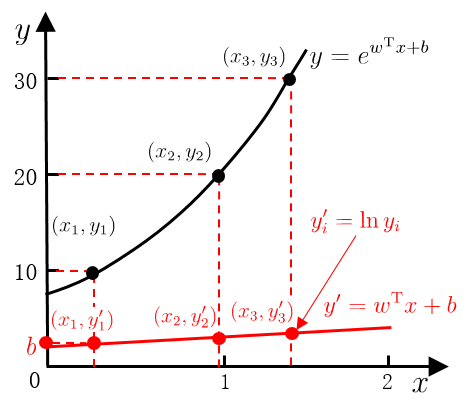
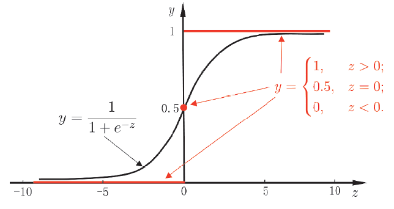
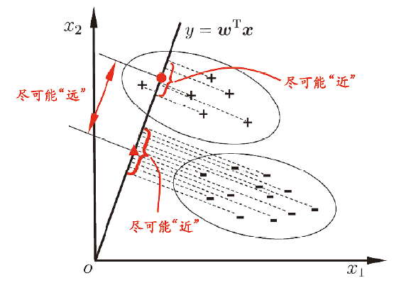
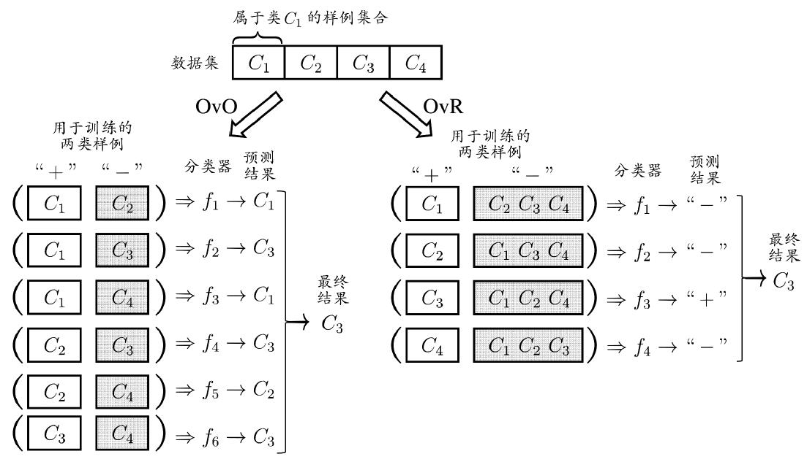
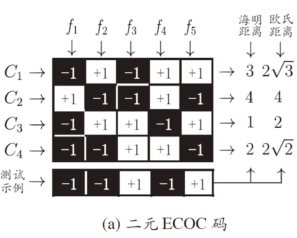
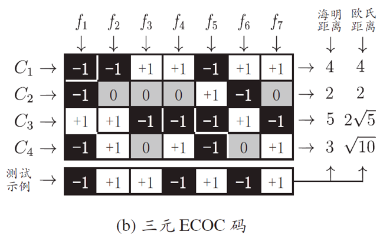

# Lecture 3：线性模型

线性模型（Linear model）试图去学习这样的函数：一个通过属性的线性组合来进行预测的函数：
$$
f(\mathbf{x}) = w_{1}x_{1} + \cdots + w_{d}x_{d} +b
$$
写成向量形式就是 $f(\mathbf{x}) = \mathbf{w}^{T}\mathbf{x}+b$

线性模型要找到一组参数 $\mathbf{w}$ 和 $b$，使得模型对每个训练样本 $\mathbf{x}_i$ 的预测值 $f(\mathbf{x}_i)$ 与样本的真实标记 $ y_i $ 渐进相等
$$
f(x_{i}) = wx_{i} + b, \text{that } f(x_{i}) \simeq y_{i}
$$

## 线性回归

给定数据集 $D = \lbrace (\mathbf{x}_{i}, y_{i}) \rbrace_{i=1}^{m}$，其中 $\mathbf{x}_{i} = (x_{i1},\cdots, x_{id})$，线性回归试图学得一个线性模型，来尽可能准确地预测实值输出标记

**首先，为了简化讨论，我们先定义输入属性唯一，并且忽略关于属性的下标：$\mathbf{x}_{i} = (x_{i})$**

这时 $D = \lbrace (x_{i}, y_{i}) \rbrace_{i=1}^{m}$，相当于是二维平面上的 $m$ 个点对

??? tip "离散数据的预处理"

    在对离散属性预处理时：
    
    - **若属性具有“序”（有序离散属性，例如“高”“中”“低”）**：
      可以将其直接映射为连续数值（如 3,2,1），因为数值大小能够反映原来的顺序关系。这种处理称为连续化
    
    - **若属性没有“序”（无序离散属性，例如“红”“绿”“蓝”）**：
      不能简单赋值为连续数值，否则会人为引入不存在的顺序（比如认为“红”<“绿”<“蓝”），导致模型学习到错误的关系
      正确做法是将该属性转化为一个 **$k$ 维向量**（$k$ 为属性的可能取值个数），通常采用独热编码（one-hot encoding）：每个取值对应一个维度，该维度为 1，其余为 0。例如颜色属性有 3 种取值，则“红”编码为 (1,0,0)，“绿”为 (0,1,0)，“蓝”为 (0,0,1)

之前我们说过，均方误差是回归任务中最常用的性能度量，即：

$$
\begin{align*}
(w^{\ast}, b^{\ast}) &= \arg \min_{(w,b)} \sum_{i=1}^{m} \left( f(x_i) - y_i \right)^2 \newline
&= \arg \min_{(w,b)} \sum_{i=1}^{m} \left( y_i - w x_i - b \right)^2
\end{align*}
$$

基于均方误差最小化来进行模型求解的过程为“最小二乘法”，而求解 $w, b$ 使  $E_{w, b} = \sum_{i=1}^{m} \left( y_i - w x_i - b \right)^2$ 的过程，称为线性回归模型的最小二乘参数估计

对于 $D = \lbrace (x_{i}, y_{i}) \rbrace_{i=1}^{m}$ 的一维情境，我们直接求导得到：
$$
\frac{\partial E_{(w,b)}}{\partial w} = 2\left( w \sum_{i=1}^{m} x_i^2 - \sum_{i=1}^{m} (y_i - b) x_i \right) \newline
\frac{\partial E_{(w,b)}}{\partial b} = 2\left( m b - \sum_{i=1}^{m} (y_i - w x_i) \right)
$$
计算得到闭式解：

> 一个方程或问题的闭式解，是指可以用有限的、常见的基本运算（如加、减、乘、除、乘方、开方）和标准函数（如指数、对数、三角函数等）组合成一个表达式，从而精确地表示出解

$$
w = \frac{\displaystyle \sum_{i=1}^{m} y_i (x_i - \bar{x}) }{\displaystyle \sum_{i=1}^{m} x_i^2 - \frac{1}{m} \left( \sum_{i=1}^{m} x_i \right)^2}, \qquad b =\dfrac{1}{m} \sum_{i=1}^{m} (y_{i}-wx_{i})
$$

---

接下来不简化讨论，给定数据集 $D = \lbrace (\mathbf{x}_{i}, y_{i}) \rbrace_{i=1}^{m}$，其中 $\mathbf{x}_{i} = (x_{i1},\cdots, x_{id})$，我们计算多元线性回归。我们把 $\mathbf{w},b$ 吸收为向量形式 $\hat{\mathbf{w}} = (\mathbf{w};b)$，计算：
$$
\mathbf{\hat{w}}^{\ast} = \arg \min_{\hat{w}} \lVert \mathbf{y} - \mathbf{X} \mathbf{\hat{w}}\rVert_{2}
$$
其中

$$
\mathbf{X} = 
\begin{pmatrix}
x_{11} & x_{12} & \cdots & x_{1d} & 1 \newline
x_{21} & x_{22} & \cdots & x_{2d} & 1 \newline
\vdots & \vdots & \ddots & \vdots & \vdots \newline
x_{m1} & x_{m2} & \cdots & x_{md} & 1
\end{pmatrix}
=
\begin{pmatrix}
\mathbf{x}_1^\mathrm{T} & 1 \newline
\mathbf{x}_2^\mathrm{T} & 1 \newline
\vdots & \vdots \newline
\mathbf{x}_m^\mathrm{T} & 1
\end{pmatrix}
\qquad \mathbf{y} = (y_1; y_2; \dots; y_m)
$$

> 换个符号表示，把 $\mathbf{X}$ 看作 $A$，把 $\mathbf{y}$ 看作 $b$，把 $\mathbf{\hat{w}}$ 看作 $x$，那么我们就是在求 $Ax = b$ 的最佳平方逼近解
>
> 《计算方法》课程中里有更详细的讲解

几何法、微分法、变分法都可以证明得到这样一个方程：
$$
\mathbf{X}^{T}\mathbf{X}\mathbf{\hat{w}}^{\ast} = \mathbf{X}^{T}\mathbf{y}
$$
我们称之为法线方程。如果 $\mathbf{X}^{T}\mathbf{X}$ 是满秩矩阵或正定矩阵，则可以解出唯一解 $\mathbf{\hat{w}}^{\ast} = (\mathbf{X}^{T}\mathbf{X})^{-1}\mathbf{X}^{T}\mathbf{y}$，可是更多情况下 $\mathbf{X}^{T}\mathbf{X}$ 不满秩，使得 $\mathbf{\hat{w}}$ 的解不唯一。处理方法将在之后的正则化部分介绍

### 对数线性回归

对于线性回归模型 $y = \mathbf{w}^{T}\mathbf{x}+b$，我们修改为 $\ln y = \mathbf{w}^{T}\mathbf{x}+b$，则得到对数线性回归

> 甚至，对于 $y = g^{-1}\left(\mathbf{w}^{T}\mathbf{x}+b\right)$，我们考虑 $g$ 为不同的单调可微函数，能够得到不同的广义线性模型
>
> 对于对数线性回归，$g(\cdot) = \ln (\cdot)$

## 对数几率回归

我们考虑二分类任务，线性回归模型 $z = \mathbf{w}^{T}\mathbf{x}+b$，而期望输出为 $y \in \lbrace 0,1 \rbrace$

单位阶跃函数（下图的红色函数）比较理想，但是这个函数性质不佳（不连续，不能直接作为 $g^{-1}(\cdot)$ 使用）。因此我们希望找到一个连续函数替代品：对数几率函数（Logistic function）
$$
\sigma{(x)} = \dfrac{1}{1+e^{-z}}
$$

> logistic / logit 这个单词和 logic 没有任何关系

给出图像，发现对数几率函数是一种 Sigmoid 函数（形状类似为 S 的函数）

这个函数有很多优美的性质，包括但不限于：

- $\sigma{(x)}$ 是 $C^{\infty}$ 的
- $\sigma'(x) = \sigma(x) \cdot \left( 1-\sigma (x)\right)$

此时我们带入线性回归模型，得到
$$
y = \dfrac{1}{1+e^{-(\mathbf{w}^{T}\mathbf{x}+b)}} \quad \Rightarrow \quad \ln \dfrac{y}{1-y} = \mathbf{w}^{T}\mathbf{x}+b
$$
将 $y$ 视为正例 Positive = 1 可能性，则 $1-y$ 为反例 Negative = 0 可能性，将比值 $\dfrac{y}{1-y}$ 称为“几率”（odds），将 $\ln \dfrac{y}{1-y}$ 称为对数几率（log odds; logit）

我们称这个模型为对数几率回归（Logit regression），注意到这个模型的本质是分类学习方法，而不是回归学习

> 可以用极大似然估计的方法求解对率回归的解

## 线性判别分析

继续从回归问题过渡到分类问题：

以二维样例为例，使用**线性判别分析 (Linear Discriminant Analysis, LDA)** 进行分类操作，将样例投影到一条直线（低维空间）上，投影后，不同类别的样本尽可能分开，同时同一个类别的样本尽可能紧凑

我们称这种操作为一种“监督降维”技术

我们给定数据集 $D = \lbrace (\mathbf{x}_{i}, y_{i}) \rbrace_{i=1}^{m}$

- 记第 $i$ 类示例的集合 $X_{i}$
    - 得到的均值向量 $\boldsymbol{\mu_{i}}$（各个维度的均值组成的向量）
    - 协方差矩阵 $\boldsymbol\Sigma_{i}$（各个特征维度自身的方差以及两两之间相关程度的矩阵）
        - 回顾：如果 $EX, EY, E(XY)$ 存在，则 $\text{cov}(X,Y) = E[(X-EX)(Y-EY)] = E(XY) - EX\cdot EY$ 为随机变量 $X,Y$ 的协方差
        - 协方差越小，则说明数据点越紧凑

**先考虑两类样本的情形**：

- 两类样本的中心在直线 $y = \mathbf{w}^{T}\mathbf{x}$ 上的投影为 $\mathbf{w}^{T} \boldsymbol\mu_{0}$ 和 $\mathbf{w}^{T} \boldsymbol\mu_{1}$
- 两类样本的协方差为 $\mathbf{w}^{T} \boldsymbol{\Sigma}_{0} \mathbf{w}$ 和 $\mathbf{w}^{T} \boldsymbol{\Sigma}_{1}\mathbf{w}$

我们希望同类样例的投影点尽可

2能近，则意味着协方差 $\mathbf{w}^{T} \boldsymbol{\Sigma}_{0} \mathbf{w} + \mathbf{w}^{T} \boldsymbol{\Sigma}_{1} \mathbf{w}$ 要尽可能小

我们希望异类样例的投影点尽可能远，则意味着平方距离 $\lVert \mathbf{w}^{T} \boldsymbol\mu_{0} - \mathbf{w}^{T} \boldsymbol\mu_{1} \rVert_{2}^{2}$ 要尽可能大

因此我们需要最大化
$$
J = \frac{\left\| \mathbf{w}^T \boldsymbol{\mu}_0 - \mathbf{w}^T \boldsymbol{\mu}_1 \right\|_2^2}
{\mathbf{w}^T \boldsymbol{\Sigma}_0 \mathbf{w} + \mathbf{w}^T \boldsymbol{\Sigma}_1 \mathbf{w}} = \frac{\mathbf{w}^T (\boldsymbol{\mu}_0 - \boldsymbol{\mu}_1) (\boldsymbol{\mu}_0 - \boldsymbol{\mu}_1)^T \mathbf{w}}
{\mathbf{w}^T (\boldsymbol{\Sigma}_0 + \boldsymbol{\Sigma}_1) \mathbf{w}}
$$
的值

我们记类内散度矩阵 $\mathbf{S}_{w} = \boldsymbol\Sigma_{0}+\boldsymbol\Sigma_{1}$，类间散度矩阵 $\mathbf{S}_{b} =  (\boldsymbol{\mu}_0 - \boldsymbol{\mu}_1) (\boldsymbol{\mu}_0 - \boldsymbol{\mu}_1)^T$，则
$$
J(\mathbf{w}) = \frac{\mathbf{w}^T \mathbf{S}_b \mathbf{w}}{\mathbf{w}^T \mathbf{S}_w\mathbf{w}}
$$
它满足广义瑞利商 (generalized Rayleigh quotient) 的格式

不难发现，LDA 的解可以只考虑方向而忽略长度，因为成倍缩放 $\mathbf{w}$ 的值，不会改变 $J$ 的大小，因此我们可以人为添加一个约束（$\mathbf{w}^T \mathbf{S}_w \mathbf{w} = 1$）来固定长度，构造出这样的最优化问题：
$$
\min_\mathbf{w} (-\mathbf{w}^T \mathbf{S}_b \mathbf{w})
\quad \text{s.t.} \quad \mathbf{w}^T \mathbf{S}_w \mathbf{w} = 1
$$
使用熟悉的拉格朗日乘子法：
$$
L(\mathbf{w}, \lambda) = -\mathbf{w}^T \mathbf{S}_b \mathbf{w} + \lambda(\mathbf{w}^T \mathbf{S}_w \mathbf{w} - 1)
$$
向量求导
$$
\frac{\partial L}{\partial \mathbf{w}} = -2 \mathbf{S}_b \mathbf{w} + 2\lambda \mathbf{S}_w \mathbf{w} = 0
$$
得到
$$
\mathbf{S}_b \mathbf{w} = \lambda \mathbf{S}_w \mathbf{w}
$$
代入 $\mathbf{S}_{b} =  (\boldsymbol{\mu}_0 - \boldsymbol{\mu}_1) (\boldsymbol{\mu}_0 - \boldsymbol{\mu}_1)^T$，得 $\mathbf{S}_{b} =  (\boldsymbol{\mu}_0 - \boldsymbol{\mu}_1) (\boldsymbol{\mu}_0 - \boldsymbol{\mu}_1)^T \mathbf{w} = \lambda \mathbf{S}_w \mathbf{w}$

注意到 $(\boldsymbol{\mu}_0 - \boldsymbol{\mu}_1)^T \mathbf{w}$ 是标量，$\lambda$ 也是标量，因此我们直接让 $(\boldsymbol{\mu}_0 - \boldsymbol{\mu}_1)^T \mathbf{w} = \lambda$，得到
$$
\mathbf{w} = \mathbf{S}_{w}^{-1} (\boldsymbol{\mu}_0 - \boldsymbol{\mu}_1)
$$

> 为什么可以令 $(\boldsymbol{\mu}_0 - \boldsymbol{\mu}_1)^T \mathbf{w} = \lambda$？注意到我们并不关心 $\mathbf{w}$ 的值，只关心 $\mathbf{w}$ 的大小

---

现在推广到多个类，我们记：

- 全局散度矩阵

$$
\mathbf{S}_t = \mathbf{S}_b + \mathbf{S}_w = \sum_{i=1}^{m} (\mathbf{x}_i - \boldsymbol{\mu})(\mathbf{x}_i - \boldsymbol{\mu})^T
$$

- 类内散度矩阵

$$
\mathbf{S}_w = \sum_{i=1}^{N} \mathbf{S}_{w_i} \qquad 
\mathbf{S}_{w_i} = \sum_{\mathbf{x} \in X_i} (\mathbf{x} - \boldsymbol{\mu}_i)(\mathbf{x} - \boldsymbol{\mu}_i)^T
$$

- 类间散度矩阵

$$
\mathbf{S}_b = \mathbf{S}_t - \mathbf{S}_w = \sum_{i=1}^{N} m_i (\boldsymbol{\mu}_i - \boldsymbol{\mu})(\boldsymbol{\mu}_i - \boldsymbol{\mu})^T
$$

依旧采用广义瑞利商的形式，$\mathbf{W} \in \R^{d\times (N-1)}$：
$$
\max_{\mathbf{W}} = \frac{\text{tr}(\mathbf{W}^T \mathbf{S}_b \mathbf{W})}{\text{tr}(\mathbf{W}^T \mathbf{S}_w\mathbf{W})}
$$
> 单个方向的锐瑞利商要推广到矩阵形式，用迹来衡量总的散度

同理解得
$$
\mathbf{S}_b \mathbf{W} = \lambda \mathbf{S}_w \mathbf{W}
$$
因此，$\mathbf{W}$ 的闭式解 $[\mathbf{w}_{1}, \cdots, \mathbf{w}_{d'}]$ 是 $\mathbf{S}_w^{-1}\mathbf{S}_b$ 的 $d'$ 个最大的非零<u>广义特征值</u>对应的特征向量组成的矩阵

> 普通特征值问题：
> $$
> \mathbf{A} \mathbf{w} = \lambda \mathbf{w}
> $$
> 即：矩阵 $\mathbf{A}$ 作用在向量 $\mathbf{w}$ 上，相当于对 $\mathbf{w}$ 进行缩放（缩放因子为 $\lambda$）
>
> 广义特征值问题：
> $$
> \mathbf{A} \mathbf{w} = \lambda \mathbf{B} \mathbf{w}
> $$
> 其中 $\mathbf{A}$ 和 $\mathbf{B}$ 都是矩阵（通常是对称矩阵，且 $\mathbf{B}$ 是正定的）
>
> 这里的 $\lambda$ 称为广义特征值（generalized eigenvalue），$\mathbf{w}$ 称为广义特征向量（generalized eigenvector）

若将 $\mathbf{W} \in \R^{d\times (N-1)}$ 视为一个投影矩阵，则多分类 LDA 将样本投影到 $N-1$ 维空间，$N-1$ 通常远小于数据原有的属性数。因此可以通过这个投影来减小样本点的维数，期间还使用了类别信息。因此 LDA 也常被视为一种监督降维技术

## 多分类学习

我们有一些常用的二分类学习方法，但是更多情况下学习任务是多分类的。基于一些基本策略，我们利用二分类学习器来解决多分类问题

考虑 $N$ 个类别 $C_{1}, \cdots, C_{n}$，多分类学习的基本思路是“拆解法”，即将多分类任务拆解为若干个二分类任务求解（为拆出的每个二分类任务训练一个分类器，对预测结果进行集成）

下图表示最常见的几个拆解方法：

- 一对一（One vs. One, OvO），将 $N$ 个类别两两分类，得到 $\dfrac{N(N-1)}{2}$ 个分类器
    - 训练时间短，但是分类器的存储与测试开销大
- 一对其余（One vs. Rest, OvR），每次只将一个类的样例作为正例，得到 $N$ 个分类器
    - 训练时间长，但是分类器的存储与测试开销小
- 多对多（Many vs. Many, MvM），将若干类作为正类，若干类作为反类
    - OvO 和 OvR 可以看作 MvM 的特例

下图简要介绍了 OvO 和 OvR 的分类方式

MvM 的正、反例构造需要有特殊的设计，不能随意选取。我们可以采用一种常用的 MvM 技术：纠错输出码（Error Correcting Output Codes, ECOC）

### 纠错输出码

将编码思想引入类别拆分，并引入一定的容错性：

- 编码：对 $N$ 个类别做 $M$ 次<u>划分</u>，形成 $M$ 个二分类训练集，得到 $M$ 个分类器
- 解码：$M$ 个分类器对测试样本进行预测，组成一个预测编码，将这个预测编码与每个类别的给自的编码进行比较，返回其中距离最小的类别作为最终预测结果

如何进行划分？通过编码矩阵决定，下图为二元码和三元码的示意图

> 二元码 (a) 中，$f_{2}$ 将 $C_{1}, C_{3}$ 作为正例，$C_{2}, C_{4}$ 作为反例
>
> 三元码 (b) 中，$f_{4}$ 将 $C_{1}, C_{4}$ 作为正例，$C_{3}$ 作为反例，$C_{2}$ 作为不参与计算的停用例（二元码没有停用例）

将待测样本放入这 $M$ 个二分类器中，计算汉明距离 or 欧氏距离，返回其中距离最小的类别作为最终预测结果

> 汉明距离返回不相等的值的个数，欧氏距离按照 $\sqrt{\sum(a-b)^{2}}$ 的方式计算。都用于衡量误差
>
> 对于二分类（+1，-1）的离散编码，使用汉明码通常更优
>
> 多个学习器意味着存在编码冗余，因此有一定的容错能力
>
> 这个《计算方法》也讲了

对同一个学习任务，在一定的限度内，ECOC 编码越长，纠错能力越强，但代价是，分类器数量增多，各种开销都会增大

此外，我们希望找出一种优秀的编码方式，使得任意两个类别之间的编码距离更远。这是一个 NP-Hard 问题，但是对于机器学习问题来说，我们不需要追求最优编码（最优编码不一定能导出最优模型）

## 类别不平衡

不同类别的样本比例相差很大时，模型会对多数类产生偏好，导致预测结果不公平。比如一个训练集有 998 个反例和 2 个正例，那么训练出一个永远预测为反例的学习器就可以达到 99.8% 的精度，但是这没有意义

我们假定正例很少，反例很多，通过线性分类器（$y = \boldsymbol{w}^{T}\mathbf{x} + b$）对样本分类时，我们通过一个阈值（比如 0.5）来判断这个 $y$ 属于正例还是反例。对于 $y > 0.5$ 这个阈值，我们可以用几率等价写为：
$$
\text{if} \dfrac{y}{1-y} > 1, \text{ then } y \text{ is postive}
$$
学习器此时会潜在认为：正、反例的可能性是相同的。此时，如果设置正反例比例悬殊的训练集（比如反例数量远远大于正例），那么即使模型随意猜测反例，错误率也会更低

因此这个 $0.5$ 的阈值需要改为真实样本的比例 $\dfrac{m^{+}}{m^{-}}$

### 再缩放

我们希望满足：若 $\dfrac{y'}{1-y'} > 1$，则代表实际上 $\dfrac{y}{1-y} > \dfrac{m^{+}}{m^{-}}$，因此有这样的缩放
$$
\frac{y'}{1-y'} = \frac{y}{1-y} \times \dfrac{m^-}{m^+}
$$
“再缩放”虽然简单，但现实中很难准确知道真实样本比例。因此实际上有三种落地方案：

- 欠采样（Undersampling）从多数类里随机扔掉一些样本，让正反例数量接近
- 过采样（Oversampling）把少数类的部分样本复制复用，让正反例数量接近
- 阈值移动（Threshold-moving）在训练好模型后，把预测时的阈值从 0.5 改为真实比例（也就是上面的内容）

再缩放是上一节提到的，代价敏感学习的基础

> 比如二分类代价矩阵，指出不同的错误预测（非对角线元素）对应的代价值 $\text{cost}$
>
> 我们假定第 0 类为正例，第 1 类为反例，定义代价敏感错误率
>
> $$
> \begin{aligned}
> E(f; D; \text{cost}) = \frac{1}{m} \bigg( & \sum_{x_i \in D^{+}} \mathbb{I}(f(x_i) \neq y_i) \times \text{cost}_{01} \newline
> & + \sum_{x_i \in D^{-}} \mathbb{I}(f(x_i) \neq y_i) \times \text{cost}_{10} \bigg)
> \end{aligned}
> $$
>
> 相当于把 $\dfrac{m^-}{m^+}$ 替换成 $\dfrac{\text{cost}^+}{\text{cost}^-}$
