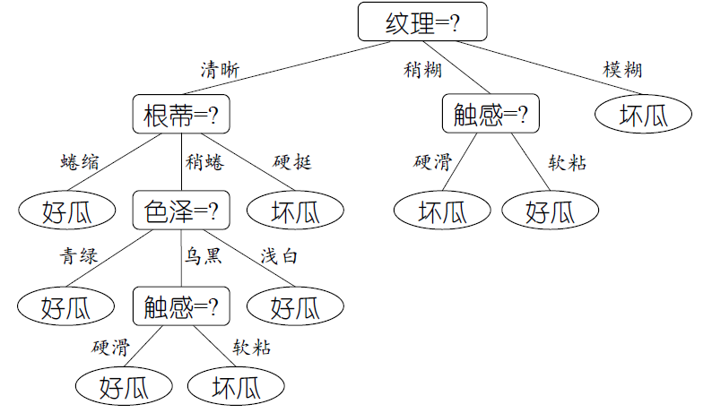
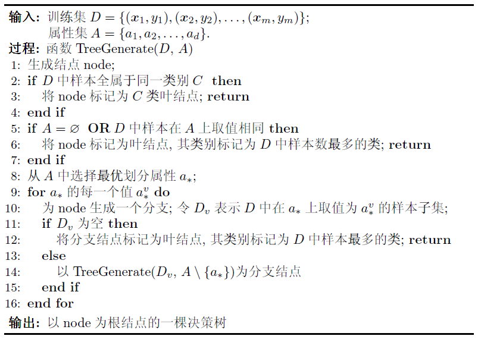
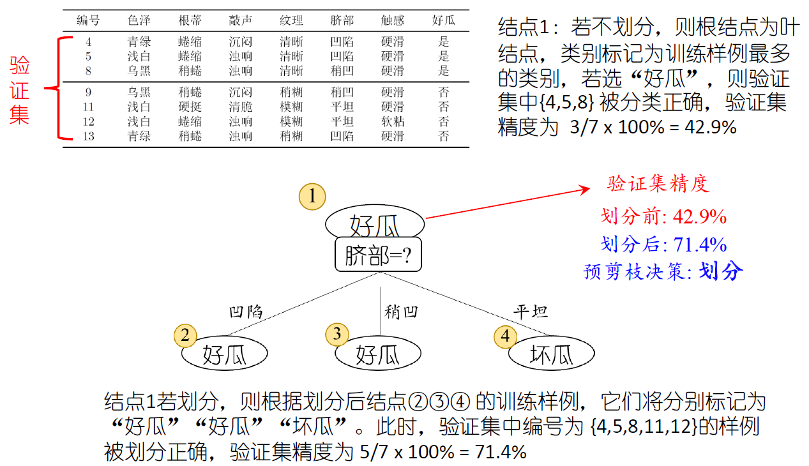
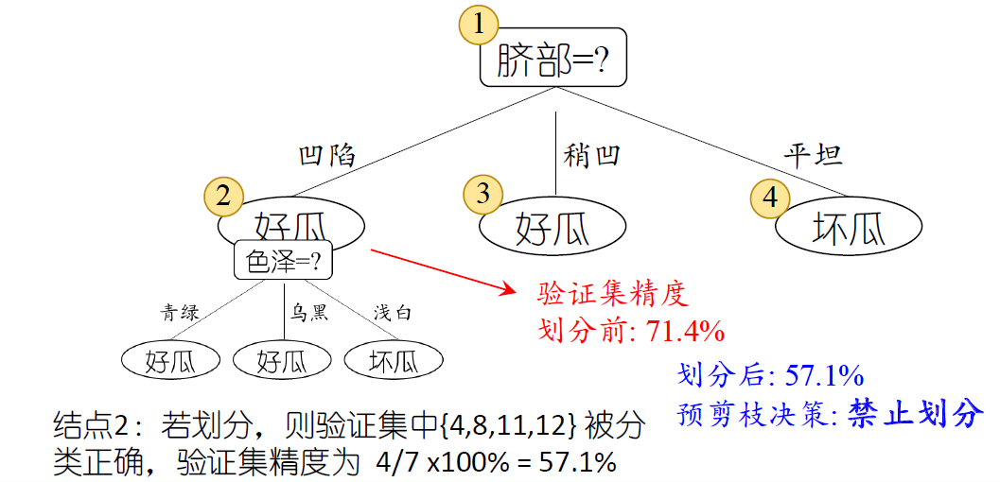
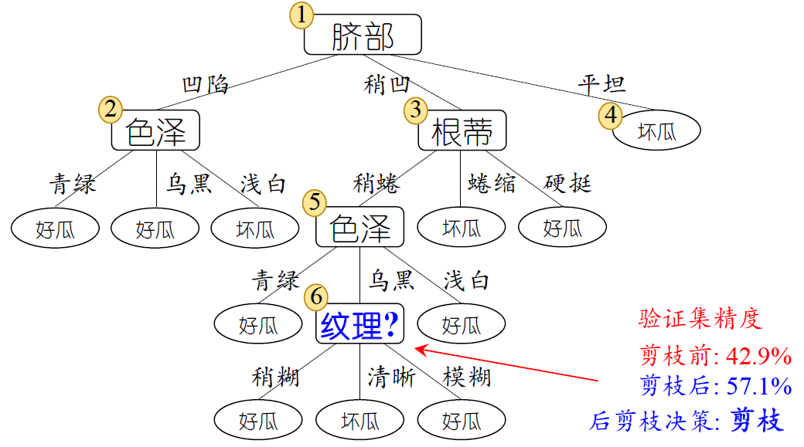
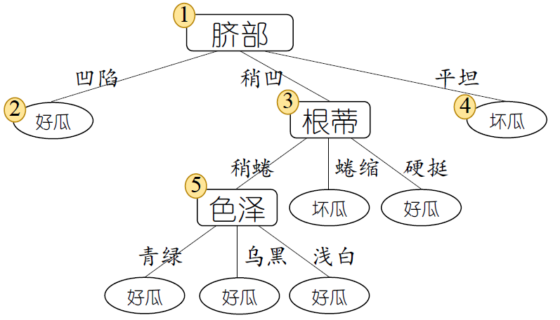
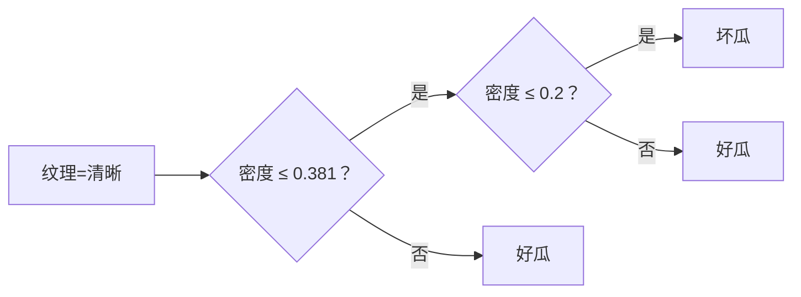
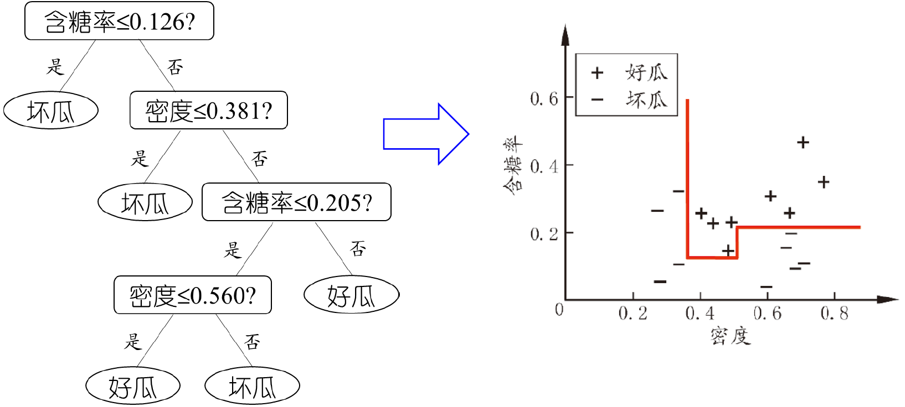
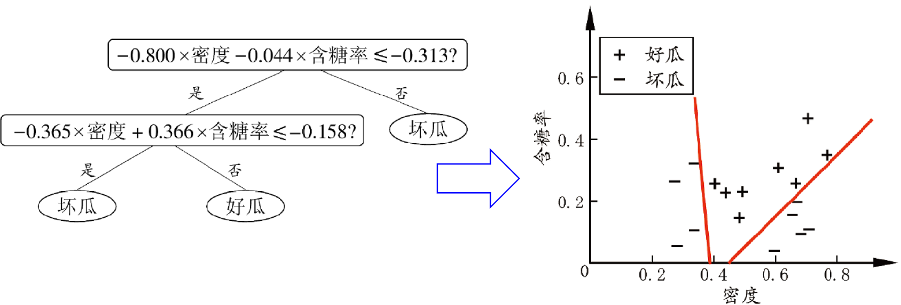

# Lecture 4：决策树

决策树基于树的结构进行决策：

- 每个“内部结点”对应于某个属性上的测试（test）
- 每个“分支”对应于该测试的一种可能结果（即该属性的某个取值）
- 每个“叶结点”对应于一个预测结果

我们希望用简洁的 if 判断，有效分类性质不同的数据，比如经典挑西瓜问题：

基于决策树的机器学习分为两个过程

- **学习**：根据训练数据，选择最优划分属性，递归构建树
- **预测**：从根结点开始，根据属性测试逐层下降，直到叶结点

## 划分选择

构建决策树的策略是分治（Divide-and-Conquer），是一个自根节点至叶结点的递归过程。我们在每个中间节点中寻找一个用于划分（split）的属性：

> 省流：在当前（子）数据集上
>
> 1. 判断是否可以直接成为叶子（无需 / 无法划分）
> 2. 如果不能，就选出一个“最优属性”，根据这个最优属性进行子集划分
> 3. 对每个子集继续递归建树

递归建树的终止条件包括：

- 当前结点包含的样本全属于同一类别，无需划分（Line 2）
- 当前属性集为空，或是所有样本在所有属性上取值相同，无法划分（Line 5）
- 当前结点包含的样本集合为空，不能划分（Line 11）

### 最优属性选择

Line 9 中选择最优划分属性，目的是使得节点的纯度更高。对于**离散属性**，我们给出一些常见的决策树算法

#### 信息增益（ID3）

一种经典的决策树算法为 ID3 算法，使用信息增益作为划分准则

我们假定当前样本集合为 $D$，总共有 $|\mathcal{Y}|$ 类样本，其中第 $k$ 类样本占比 $p_{k}$，定义样本集合的**信息熵**（Information Entropy）：

$$
\text{Ent}(D) = - \sum_{k=1}^{|\mathcal{Y}|} p_{k} \log_{2} p_{k}
$$

并约定 $p = 0$ 时 $p \log_{2} p = 0$

> 对于二分类样本（正/反例），$|\mathcal{Y}| = 2$

不难发现，熵值越大，数据越混乱；熵值越小，数据纯度越高。熵值最小为 $0$，最大为 $\log_{2} |\mathcal{Y}|$

在此基础上，我们考虑某个离散属性 $a$ 的取值集合 $\{a^{1}, \cdots, a^{V}\}$，记 $D^{v}$ 为 $D$ 中在 $a$ 上取值为 $a^{v}$ 的样本集合

在信息熵的基础上，我们想要计算当前划分对信息熵所造成的变化，因此引入**信息增益**（Information Gain）：

$$
\text{Gain}(D, a) = \text{Ent}(D) - \sum_{v=1}^{V} \dfrac{|D^{v}|}{|D|} \text{Ent}(D^{v})
$$

> 可以理解为：
>
> **划分前整个数据集的混乱度 - 划分后各个子数据集的混乱度的加权平均**

在进行最优划分时，我们**选择信息增益最大的离散属性**，作为划分属性进行划分

#### 增益率（C4.5）

注意到 ID3 算法倾向于选择取值数目更多的属性，对于某些特殊的属性，模型会产生严重的过拟合现象：比如，假设某一个离散属性为“序号”，每个样本的序号唯一，那么“序号”一定会在决策树的构建中作为最优划分属性，而这一划分行为没有泛化价值，导致过拟合

因此我们引入增益率（Gain Ratio）：

$$
\text{Gain\_ratio}(D, a) = \dfrac{\text{Gain}(D, a)}{\text{IV}(a)}
$$

其中分母 $\text{IV}(a)$ 定义为（类似于信息熵）：

$$
\text{IV}(a) = - \sum_{v=1}^{V} \dfrac{|D^{v}|}{|D|} \log_{2} \dfrac{|D^{v}|}{|D|}
$$

我们发现：属性 $a$ 的可能取值数目越多，$\text{IV}(a)$ 的值通常也越大，这就导致像“序号”这种取值集合非常大的属性的 $\text{Gain\_ratio}$ 相对更低，避免被选中为最优划分属性

> 一种在 ID3 基础上，针对 $a$ 取值自身混乱度的惩罚机制

在进行最优划分时，我们**选择增益率最大的离散属性**，作为划分属性进行划分

!!! abstract ""

    但是，如果我们直接选择增益率最大的属性作为最优划分属性，那么又有可能针对选取取值集合非常小的属性。因此我们会采用启发式搜索：先搜索信息增益高于平均水平的属性，再从中选取增益率最高的属性

#### 基尼指数（CART）

为了衡量数据集 $D$ 的纯度，我们还可以使用基尼指数：

$$
\text{Gini}(D) = \sum_{k=1}^{|\mathcal{Y}|} \sum_{k' \ne k} p_{k}p_{k'} = 1 - \sum_{k = 1}^{|\mathcal{Y}|} p_{k}^2
$$

其反映了：从 $D$ 中随机抽取两个样例，其类别标记不一致的概率

对于每个属性 $a$，我们定义基尼指数：

$$
\text{Gini\_index}(D, a) = \sum_{v=1}^{V} \dfrac{|D^{v}|}{|D|} \text{Gini}(D^{v})
$$

> 划分后各个子数据集的基尼指数的加权平均

在进行最优划分时，我们**选择基尼指数最小的离散属性**，作为划分属性进行划分

## 剪枝

划分选择的各种准则虽然对决策树的尺寸有较大影响，但对泛化性能的影响很有限。进一步地，我们发现剪枝行为对泛化性能的影响更为显著

在划分选择的过程中，为了尽可能正确分类训练样本，有可能造成分支过多，造成过拟合。我们可以通过主动去掉一些分治来降低过拟合的风险：

- 预剪枝（pre-pruning）：提前终止某些分支的生长
- 后剪枝（post-pruning）：生成一棵完全树，再自底向上剪枝

接下来，我们假设训练过程中使用“留出法”

### 预剪枝

我们通过训练集构建决策树，**在每次进行划分时，我们计算本次划分是否会使得验证集的分类精度变高**，如果划分后精度反而变低，那么我们直接剪枝

比如：

### 后剪枝

我们先通过训练集构建完整决策树，然后自底向上用相似的方法进行剪枝判断（减去这个分支后是否会使得验证集的分类精度变高）

比如：

### 比较

时间开销：

- 预剪枝：测试时间开销降低，训练时间开销降低（并不需要构建完整的决策树）
- 后剪枝：测试时间开销降低，训练时间开销**增加**（因为依旧构建了完整决策树）

过/欠拟合风险：

- 预剪枝：过拟合风险降低，欠拟合风险**增加**（过早停止分支可能会导致欠拟合）
- 后剪枝：过拟合风险降低，欠拟合风险基本不变（在完整决策树的基础上剪枝丢失信息更少）

因此，后剪枝的泛化性能通常优于预剪枝

## 连续属性离散化

如果某一个属性的值是连续的（比如 `float`），我们在构建决策树时，希望临时的将其当作一个离散属性看待

通常使用二分法进行离散化：假设训练集中该连续属性有 $n$ 个不同的取值，那么我们进行升序排序，然后取**相邻两个值的中间点**作为候选划分点（总共 $n-1$ 个），这些候选划分点分别是一个离散属性值

每一个候选划分点都会参与决策树的划分，同一个连续属性的不同候选划分点都可能会作为某一次的划分属性，其生成的分支数通常是 2

比如（这是一个下等的例子，事实上只需要密度 <= 0.2 的分支，但是这体现了“同一个连续属性的不同候选划分点都可能会作为某一次的划分属性”）：

对于一个单变量的决策树（每个非叶节点只考虑一个划分属性），我们通过对连续属性的决策树构建，可以绘制一个轴平行的分类面，它将正反例有效的区分：

如果每个非叶节点考虑多个划分属性，我们构建多变量决策树，可以绘制更加复杂的分类面

## 缺失值

如果一个样本在某个属性上没有值，直接丢弃它会导致样本数的减少，其他属性值的信息浪费等。

以信息增益的计算为例，我们假定对于属性 $a$，有 $w$ 比重的样本缺少相关数据，则：

- 计算信息增益 / 增益率 / 基尼属性时，我们完全忽略属性缺失的样本（体现在分母 $D$ 不包含这些样本的个数）
- 在计算完成后，我们将计算结果进行折扣计算，即乘以 $w$，用于最终的划分比较（属性缺失的样本比例越大，惩罚越重）
- 在对属性缺失的样本进行子树的划分时，我们采用概率分配法，不丢弃缺失样本，而是**携带权重片段同时进入所有分支**
    - 比如，划分属性 $a$ 的各个值的占比为 $w_{1}, \cdots, w_{n}$，则缺失属性的样本携带 $w_{i}$ 的加权结果进入第 $i$ 个分支，这个样本以不同的权重参与多个分支的计算

在这种情况下，我们记正常的样本权重为 $W = 1$，在进行后续的计算时，**我们计算权重比例，而不是样本个数比例**

> 直接理解成样本的个数可以不是整数也可以
