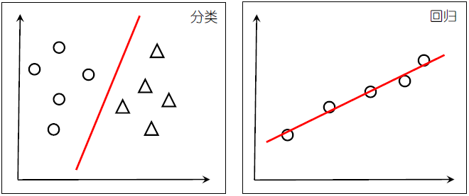
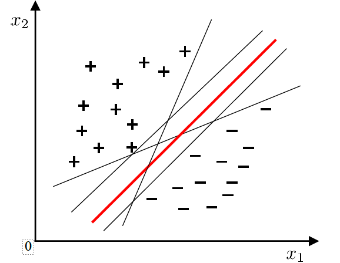
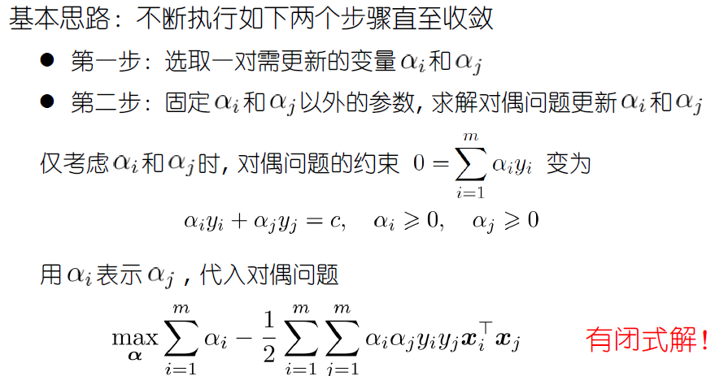
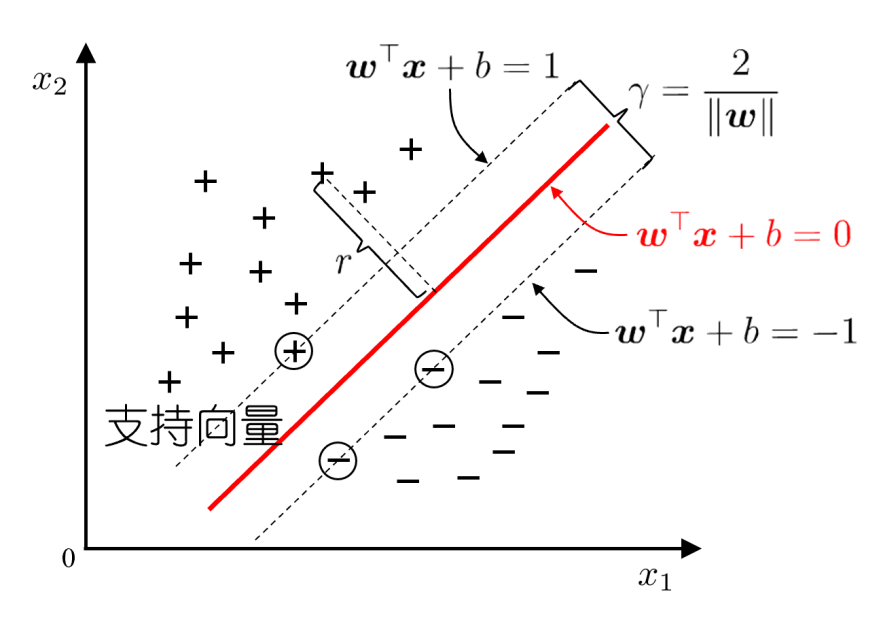
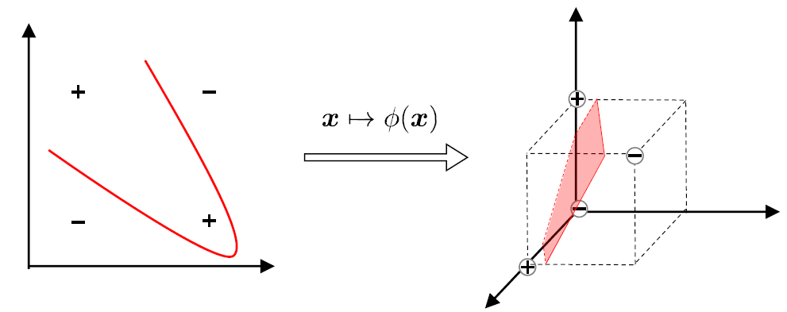
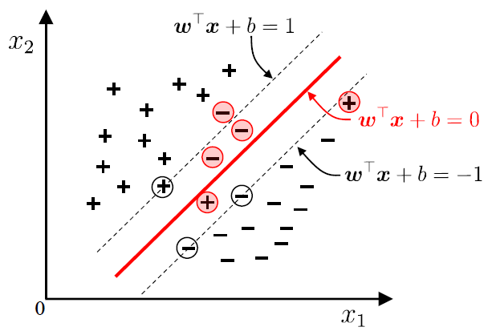
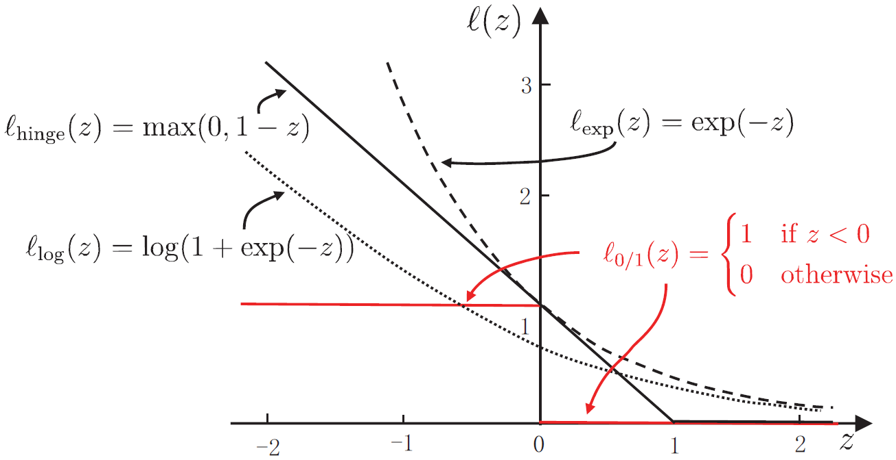

# Lecture 5：支持向量机

## 硬间隔支持向量机

依旧是考虑分类问题，我们希望在样本空间中寻找一个超平面 , 将不同类别的样本分开

将训练样本分开的超平面可能有很多，我们希望找出一个最优的超平面，它的稳健性、泛化能力应该是最优的。直觉下，“正中间”的这个超平面划分（比如下图红线），**它使得全体样本到超平面的最小距离最大化**

现在我们形式化问题：

- 一个**线性可分**的样本集 $\{\mathbf{x}_{i}, y_{i}\}_{i=1}^{m}$，其中 $y_i$ 是二分类标签 $\{-1, +1\}$
- 线性超平面为 $\mathbf{w}^{T}\mathbf{x} + b = 0$，对应的线性分类器为 $x \mapsto \text{sign}(\mathbf{w}^{T}\mathbf{x} + b)$
- 点 $\mathbf{x}_{i}$ 到超平面的距离为 $r(\mathbf{x}_{i}) = \dfrac{|\mathbf{w}^{T}\mathbf{x}_{i} + b|}{\|\mathbf{w}\|}$
- 我们的原始任务是：

$$
\begin{aligned}
\max_{\mathbf{w}, b} \min_{i \in [m]} \quad &\dfrac{|\mathbf{w}^{T}\mathbf{x}_{i} + b|}{\|\mathbf{w}\|}
\\
\text{s.t.} \quad & y_{i}(\mathbf{w}^{T}\mathbf{x}_{i} + b) \geq 0, i \in [m]
\end{aligned}
$$

（这里的约束 $y_{i}(\mathbf{w}^{T}\mathbf{x}_{i} + b) \geq 0, i \in [m]$ 的意义是，确保满足线性分类器 $x \mapsto \text{sign}(\mathbf{w}^{T}\mathbf{x} + b)$，即把超平面以上的样本作为正例而不是反例。去除约束可能会进行完全相反的分类，也就是 $x \mapsto -\text{sign}(\mathbf{w}^{T}\mathbf{x} + b)$）

### 化简

这个最优化任务并不适合直接求解，我们需要继续优化。首先我们进行符号简化，去除绝对值：

$$
\begin{aligned}
\max_{\mathbf{w}, b} \min_{i \in [m]} \quad &\dfrac{y_{i}(\mathbf{w}^{T}\mathbf{x}_{i} + b)}{\|\mathbf{w}\|}
\end{aligned}
$$

注意到分式 $\dfrac{y_{i}(\mathbf{w}^{T}\mathbf{x}_{i} + b)}{\|\mathbf{w}\|}$ 对 $(\mathbf{w}, b)$ 的倍率是一样的，也即，将 $(\mathbf{w}, b)$ 缩放相同的任意倍数 $\lambda > 0$，将 $(\lambda \mathbf{w}, \lambda b)$ 代入到分式中，不改变计算结果

因此，一定存在一个特定的 $\lambda$，使得 $\displaystyle \min_{i \in [m]} y_{i}(\mathbf{w}^{T}\mathbf{x}_{i} + b) = 1$ 成立，因此我们不妨把 $(\mathbf{w}, b)$ 恰好缩放到这个条件成立的情况，使得 $\min_{i \in [m]}$ 可以自动约去，即：

$$
\begin{aligned}
\max_{\mathbf{w}, b} \min_{i \in [m]} \; \dfrac{y_{i}(\mathbf{w}^{T}\mathbf{x}_{i} + b)}{\|\mathbf{w}\|}
\Leftrightarrow \;
\max_{\mathbf{w}} \; \dfrac{1}{\|\mathbf{w}\|}
\end{aligned}
$$

对应的新的约束条件是 $y_{i}(\mathbf{w}^{T}\mathbf{x}_{i} + b) \geq 1, i \in [m]$，因此消去了内层的 $\min_{i \in [m]}$

因此我们直接将问题化简为了：

$$
\begin{aligned}
\min_{\mathbf{w}} \quad & \|\mathbf{w}\|
\\
\text{s.t.} \quad & y_{i}(\mathbf{w}^{T}\mathbf{x}_{i} + b) \geq 1, i \in [m]
\end{aligned}
$$

可以证明，它和原始的问题是完全等价的，两者在几何上寻找的是完全相同的超平面

进一步的，为了让这个优化问题变成一个凸二次规划（Convex QP）的标准形式，并且让求导后的结果更加简洁，我们可以稍微变形：

$$
\begin{aligned}
\min_{\mathbf{w}} \quad & \dfrac{1}{2}\|\mathbf{w}\|^{2}
\\
\text{s.t.} \quad & y_{i}(\mathbf{w}^{T}\mathbf{x}_{i} + b) \geq 1, i \in [m]
\end{aligned}
$$

最终的化简结果是最好解决的一种凸优化问题（凸二次规划问题）

### 求解

如果我们直接求解原问题，会遇到一些问题：

- 参数 $\mathbf{w}, b$ 与特征维度 $d$ 正相关，当 $d$ 很大时，求解非常困难
- 原始问题的表达式依赖于 $\mathbf{x}_{i}$ 本身，导致只能处理线性可分的样本

因此我们希望解**对偶问题**，而不是原问题。我们先给出求出对偶问题的过程，然后指出其好处

首先是引入非负因子 $\alpha_{i}$，写出 Lagrange 函数

$$
\mathcal{L}(\mathbf{w}, b, \boldsymbol{\alpha}) = \dfrac{1}{2}\|\mathbf{w}\|^{2} + \sum_{i=1}^{m} \alpha_{i} (1-y_{i}(\mathbf{w}^{T}\mathbf{x}_{i} + b))
$$

Lagrange 对偶函数为

$$
g(\boldsymbol{\alpha}) = \operatorname*{inf}_{\mathbf{w}, b} \mathcal{L}(\mathbf{w}, b, \boldsymbol{\alpha})
$$

分别在 $\mathbf{w}$ 和 $b$ 上求极小值，对 $\mathbf{w}$ 和 $b$ 求偏导取 $0$，得：

$$
\begin{align*}
\frac{\partial \mathcal{L}}{\partial \mathbf{w}} &= \mathbf{w} - \sum_{i=1}^{n} \alpha_i y_i \mathbf{x}_i = 0 & \implies \quad \mathbf{w} &= \sum_{i=1}^{m} \alpha_i y_i \mathbf{x}_i \\
\frac{\partial \mathcal{L}}{\partial b} &= -\sum_{i=1}^{n} \alpha_i y_i = 0 & \implies \quad 0 &= \sum_{i=1}^{m} \alpha_i y_i
\end{align*}
$$

我们将这两个式子代入到 $\mathcal{L}(\mathbf{w}, b, \boldsymbol{\alpha})$，得：

$$
\begin{aligned}
\mathcal{L} = -\frac{1}{2} \sum_{i=1}^m \sum_{j=1}^m \alpha_i \alpha_j y_i y_j \mathbf{x}_i^T \mathbf{x}_j + \sum_{i=1}^m \alpha_i
\end{aligned}
$$

结合 KKT 条件，我们得到对偶问题：

$$
\begin{aligned}
\min_{\boldsymbol{\alpha}} \quad & \frac{1}{2} \sum_{i=1}^m \sum_{j=1}^m \alpha_i \alpha_j y_i y_j \mathbf{x}_i^T \mathbf{x}_j - \sum_{i=1}^m \alpha_i \\
\text{s.t.} \quad & \sum_{i=1}^m \alpha_i y_i = 0, \\
& \alpha_i \ge 0, \quad i = 1, \dots, m
\end{aligned}
$$

这是一个只关于 $\boldsymbol\alpha$ 的二次规划问题，变量数等于样本数 $m$

可用 SMO 等算法高效求解。假设求出的最优解为 $\boldsymbol{\alpha}^{\ast} = (\alpha_{1}^{\ast}, \cdots, \alpha_{m}^{\ast})$

此时我们找到了所有的 $\alpha_{i}^{\ast}$，但是对应的 $b$ 还没有找出

因为目标函数和约束都是凸的，且 Slater 条件成立，因此强对偶成立，KKT 条件是全局最优解的充要条件

对于这个优化问题，

$$
\begin{aligned}
\min_{\mathbf{w},b} \quad & \dfrac{1}{2}\|\mathbf{w}\|^{2}
\end{aligned}
$$

约束条件为 $m$ 个不等式约束

$$
g_i(\mathbf{w}, b) = 1 - y_{i}(\mathbf{w}^{T}\mathbf{x}_{i} + b) \leq 0, i \in [m]
$$

KKT 条件中有一条互补松弛性：

$$
\alpha_i\bigl(1 - y_i(\mathbf{w}^{T}\mathbf{x}_i + b)\bigr) = 0, \quad i\in [m]
$$

互补松弛性说明，对于每一个样本 $i$：

- 若 $\alpha_i > 0$，则必有

$$
1 - y_i(\mathbf{w}^{T}\mathbf{x}_i + b) = 0 \quad\Longrightarrow\quad y_i(\mathbf{w}^{T}\mathbf{x}_i + b) = 1
$$

**样本正好落在间隔边界上，我们记这样的样本为支持向量**

??? abstract "更形象地，支持向量恰好处在图中的边缘线上，这些支持向量即“样本正好落在间隔边界上”"

    
    
    支持向量机（Support Vector Machine, SVM）因此而得名

- 若 $\alpha_i = 0$，则约束可能严格成立

$$
1 - y_i(\mathbf{w}^{T}\mathbf{x}_i + b) < 0 \quad\Longrightarrow\quad y_i(\mathbf{w}^{T}\mathbf{x}_i + b) > 1
$$

样本在间隔边界之外，对 $\mathbf{w}$ 没有贡献

> 根据 KKT 条件可知，最终模型仅与支持向量有关，这使得 SVM 的解具有稀疏性

因此，当我们通过求解对偶问题得到 $\boldsymbol{\alpha}^*$ 后，挑出任一支持向量（即 $\alpha_k^* > 0$ 对应的样本 $(\mathbf{x}_k, y_k)$），由 $y_k(\mathbf{w}^{T}\mathbf{x}_k + b) = 1$ 可解出：

$$
b = y_k - \mathbf{w}^{T}\mathbf{x}_k.
$$

为了数值稳定，实际中常用所有支持向量的平均值

$$
b = \frac{1}{|S|} \sum_{k \in S} \left( y_k - \mathbf{w}^{T}\mathbf{x}_k \right)
$$

其中 $S = \{ i \mid \alpha_i^* > 0 \}$ 是支持向量的下标集合，$\mathbf{w} = \sum_{i=1}^m \alpha_i^* y_i \mathbf{x}_i$

最终，我们给出分类决策函数：

$$
f(\mathbf{x}{}) = \operatorname{sign}\bigl( \mathbf{w}^{T}\mathbf{x} + b \bigr)
= \operatorname{sign}\left( \sum_{i=1}^m \alpha_i^* y_i \mathbf{x}_i^{T}\mathbf{x} + b \right)
$$

其中 $\mathbf{x}$ 指的是待预测的新样本，$\mathbf{x}_{i}$ 指的是训练集中的第 $i$ 个支持向量

---

对偶问题的求解有这样的优势：

- 我们不需要求解与特征维度 $d$ 正相关的参数，而是转而求解与样本数 $m$ 正相关的参数 $\alpha_{i}$，在高维计算下效率更高
- 对偶问题的解对应了“支持向量”，最终的预测模型只需要这些支持向量即可表达
- 注意到 $\mathbf{x_{i}}, \mathbf{x_{j}}$ 总是以内积的形式出现，这允许我们使用接下来的**核方法**去完成非线性可分样本集的分类

## 核方法

线性支持向量机基于**线性可分**的样本集 $\{\mathbf{x}_{i}, y_{i}\}_{i=1}^{m}$。如果不存在一个能正确划分两类样本的超平面，那么可以将样本从原始空间映射到一个更高维的特征空间，使样本在这个特征空间内线性可分：

> 如果原始空间是有限维（属性数有限），那么一定存在一个高维特征空间使样本可分（Cover 定理）

我们将样本 $\mathbf{x}$ 映射到高维空间，结果为 $\phi(\mathbf{x})$，因此：

- 原始问题

$$
\begin{aligned}
\min_{\mathbf{w}} \quad & \dfrac{1}{2}\|\mathbf{w}\|^{2}
\\
\text{s.t.} \quad & y_{i}(\mathbf{w}^{T}\phi(\mathbf{x}_{i}) + b) \geq 1, i \in [m]
\end{aligned}
$$

- 对偶问题

$$
\begin{aligned}
\min_{\boldsymbol{\alpha}} \quad & \frac{1}{2} \sum_{i=1}^m \sum_{j=1}^m \alpha_i \alpha_j y_i y_j \phi(\mathbf{x}_{i})^T \phi(\mathbf{x}_{j}) - \sum_{i=1}^m \alpha_i \\
\text{s.t.} \quad & \sum_{i=1}^m \alpha_i y_i = 0, \\
& \alpha_i \ge 0, \quad i = 1, \dots, m
\end{aligned}
$$

- 预测函数

$$
f(\mathbf{x}) = \operatorname{sign}\bigl( \mathbf{w}^{T}\phi(\mathbf{x}) + b \bigr)
= \operatorname{sign}\left( \sum_{i=1}^m \alpha_i^* y_i \phi(\mathbf{x}_{i})^{T}\phi(\mathbf{x}) + b \right)
$$

---

如果映射后的空间维度过高（甚至无穷维），直接计算 $\phi(\mathbf{x})$ 及其内积会非常困难，因此我们引入**核函数**

### 核函数

我们绕过显式的映射表示与内积计算，直接设计这样的函数：

$$
\kappa(\mathbf{x}_{i}, \mathbf{x}_{j}) = \phi(\mathbf{x}_{i})^{T} \phi(\mathbf{x}_{j})
$$

让它隐式地等于高维空间的内积，称之为核函数

??? success "严谨的定义"

    设 $\mathcal{X}$ 为输入空间，$\kappa(\mathbf{x}, \mathbf{z})$ 是定义在 $\mathcal{X} \times \mathcal{X}$ 上的对称函数。如果存在一个映射 $\phi: \mathcal{X} \to \mathcal{H}$ 到某个特征空间（希尔伯特空间）$\mathcal{H}$，使得对所有 $\mathbf{x}, \mathbf{z} \in \mathcal{X}$ 有 $\kappa(\mathbf{x}, \mathbf{z}) = \langle \phi(\mathbf{x}), \phi(\mathbf{z}) \rangle$，则称 $\kappa$ 为核函数

如何判断一个函数是有效核函数？我们有 Mercer 定理

???+ success "Mercer 定理"

    对于任意一个给定的有限样本集 $\{\mathbf{x}_1, \dots, \mathbf{x}_m\}$，如果由 $\kappa$ 构成的核矩阵 $\mathbf{K}$（其中 $K_{ij} = \kappa(\mathbf{x}_i, \mathbf{x}_j)$）是对称半正定的，那么 $\kappa$ 就可以作为核函数

我们给出一些常用的核函数：

- **线性核**

$$
\kappa(\mathbf{x}_{i}, \mathbf{x}_{j}) = \mathbf{x}_{i}^{T} \mathbf{x}_{j}
$$

最原始的内积形式，等价于不做映射

- **多项式核**

$$
\kappa(\mathbf{x}_i, \mathbf{x}_j) = (\gamma \mathbf{x}_i^T \mathbf{x}_j + r)^d
$$

其中 $d$ 是多项式的阶数（如 $d=2$ 代表二次特征），$\gamma>0$ 和 $r\ge0$ 是超参数

- **高斯核**

$$
\kappa(\mathbf{x}_i, \mathbf{x}_j) = \exp\left(-\gamma \|\mathbf{x}_i - \mathbf{x}_j\|^2\right), \quad \gamma > 0
$$

记 $\gamma = \dfrac{1}{2\sigma^2}$，$\sigma>0$ 为高斯核的带宽

- **拉普拉斯核**

$$
\kappa(\mathbf{x}_i, \mathbf{x}_j) = \exp\left(-\gamma \|\mathbf{x}_i - \mathbf{x}_j\|\right), \quad \gamma > 0
$$

记 $\gamma = \dfrac{1}{\sigma}$，$\sigma>0$。相比高斯核使用 L1 范数而不是 L2 范数

- **Sigmoid 核**

$$
\kappa(\mathbf{x}_i, \mathbf{x}_j) = \tanh(\gamma \mathbf{x}_i^T \mathbf{x}_j + r)
$$

其中 $\gamma>0$ 和 $r< 0$ 是超参数

对于文本数据，直接使用线性核；对于不清楚数据特征的数据，优先尝试高斯核（RBF）

---

核函数可以通过简单的数学运算组合成新的核函数，即多重核学习（Multiple Kernel Learning, MKL）

如果 $\kappa_1$ 和 $\kappa_2$ 都是合法的核函数，那么以下三种运算得到的新函数依然是核函数：

1. 线性组合： $\gamma_1\kappa_1 + \gamma_2\kappa_2$（$\gamma$ 为正数）
2. 直积： $\kappa_1(x, z) \cdot \kappa_2(x, z)$
3. 函数缩放： $g(x)\kappa_1(x, z)g(z)$ （$g$ 为任意函数）

## 软间隔支持向量机

现实中很难确定合适的核函数，使训练样本在特征空间中线性可分（即便貌似线性可分，也很难断定是否是因过拟合造成的）

因此我们引入软间隔（soft margin），允许在一些样本上不满足约束（图中红色的样本）

具体地说，我们希望最大化间隔的同时，让违背 $y_{i}(\mathbf{w}^{T}\phi(\mathbf{x}_{i}) + b) \geq 1$ 的程度尽可能的少

为了量化“犯错”的程度，我们为每个样本引入一个**松弛变量** $\xi_i \ge 0$：

- $\xi_i = 0$：样本分类正确，且在间隔边界外
- $0 < \xi_i < 1$：样本分类正确，但落在了间隔内部
- $\xi_i \ge 1$：样本被误分类

此时，约束条件从硬间隔的 $y_i(\mathbf{w}^T\mathbf{x}_i + b) \ge 1$ 放宽为：

$$
y_i(\mathbf{w}^T\mathbf{x}_i + b) \ge 1 - \xi_i
$$

现在我们的优化目标为最大化间隔与最小化犯错

$$
\min_{\mathbf{w}, b, \xi} \frac{1}{2}\|\mathbf{w}\|^2 + C \sum_{i=1}^n \xi_i
$$

其中 $C$ 是一个超参数，决定犯错惩罚的程度。当 $C$ 很大时，接近于硬间隔 SVM，对噪声敏感，可能会过拟合；当 $C$ 很小时，对错误容忍度高，可能会欠拟合

我们定义合页损失（hinge loss）函数为 $\ell_\text{hinge}(z) = \max(0, 1-z)$，把约束条件隐含在优化目标中。整个优化问题可以等价写为：

$$
\min_{\mathbf{w}, b} \frac{1}{2}\|\mathbf{w}\|^2 + C \sum_{i=1}^n \ell_\text{hinge}(y_i(\mathbf{w}^T\mathbf{x}_i + b))
$$

因此软间隔 SVM 的本质就是最小化“正则化项 + 合页损失函数”。事实上，我们有很多的替代损失函数

---

软间隔 SVM 对应的对偶问题为：

$$
\begin{aligned}
\min_{\boldsymbol{\alpha}} \quad & \frac{1}{2} \sum_{i=1}^m \sum_{j=1}^m \alpha_i \alpha_j y_i y_j \mathbf{x}_i^T \mathbf{x}_j - \sum_{i=1}^m \alpha_i \\
\text{s.t.} \quad & \sum_{i=1}^m \alpha_i y_i = 0, \\
& 0 \le \alpha_i \le C, \quad i = 1, \dots, m
\end{aligned}
$$

只多了一个 $\alpha_{i} \leq C$ 的约束，其他内容与硬间隔 SVM 的对偶问题完全一致。这说明软间隔 SVM 的解依旧具有稀疏性

### 替代损失函数

损失函数是用来衡量模型预测结果与真实结果之间差距 / 错误程度的函数

> 比如经验误差的表达式中，就用到了损失函数：
>
> $$
> \hat{R} (f) = \dfrac{1}{m} \sum_{i = 1}^{m} ℓ(f(h(\mathbf{x_{i}}), y_{i}))
> $$

除了 Hinge 损失函数，我们还有其他替代损失函数 $\ell(z)$

$\ell_{0/1}$（0/1 损失）是最常见的，最难优化的替代损失函数

对于 SVM 问题，我们使用 Hinge 损失函数：

$$
\ell_\text{hinge}(z) = \max(0, 1-z)
$$

对于逻辑回归问题，我们使用 Logistic 损失函数：

$$
\ell_\text{log}(z) = \log(1 +  \exp(-z))
$$

它们都是 0/1 损失的上界，且都是连续 / 凸 / 光滑的

选择替代损失函数的关键在于：确认求解替代函数得到的解是否仍是原问题的解。可以证明，Hinge loss 和 Logistic Loss 都满足一致性，只要样本量足够大，优化它们就等于在优化 0/1 损失
