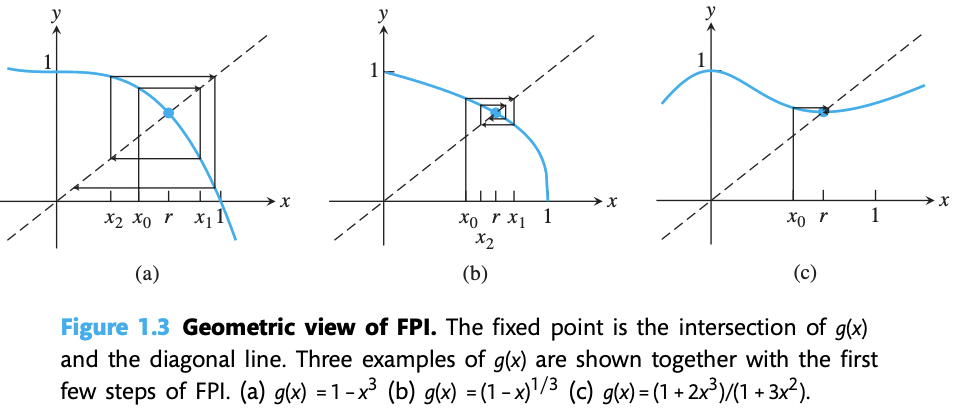
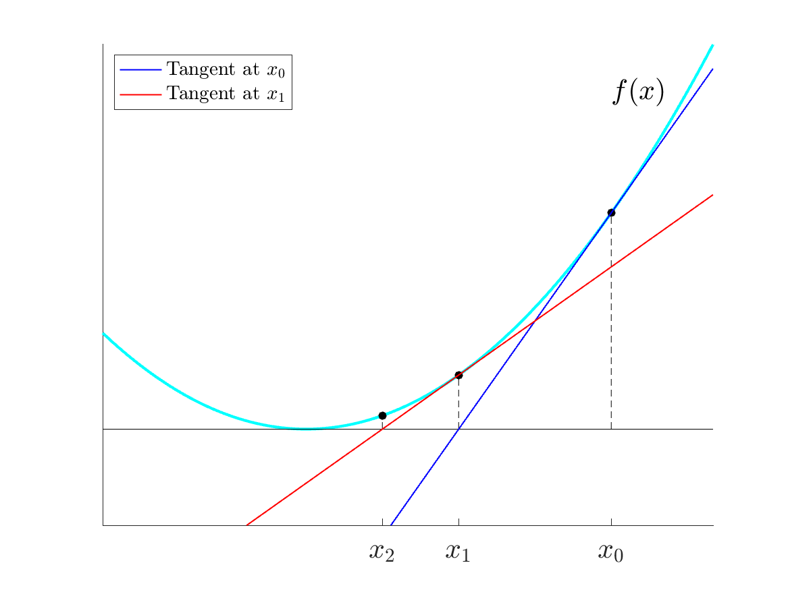

# Lecture 1: 函数求根，牛顿法

## Intro: 浮点数误差

IEEE 754 浮点数在参与计算时存在误差，以欧氏长度计算为例：

```c++
for (int i = 0; i < n; i++) sum += x[i] * x[i];
return sqrt(sum);
```

存在两种情形使得误差逐渐增大：参与计算的浮点数 `x[i]` 很多，误差累积；两个较大的浮点数 `x[i]` 参与乘法计算，误差放大。

第一种方案是对 `x[i]` 比例缩放，在得出最终计算结果之前还原比例。虽然浮点数计算量不变，但因为缩放后的浮点数较小（数值范围归一化），累加的精度损失更小

大模型架构中这种做法非常常见，比如缩放点积注意力计算中用 $\sqrt{d_k}$ 归一化

```c++
maxElement = max(x[i]);
for (int i = 0; i < n; i++) y[i] = x[i] / maxElement;
for (int i = 0; i < n; i++) sum += y[i] * y[i];
return sqrt(sum) * maxElement;
```

第二种方案称为 [Kahan 求和](https://oi-wiki.org/misc/kahan-summation)，其通过一个补偿变量 `comp` 保留丢失的低位信息（精度损失的累积）并在之后进行补偿

可以举一个“大数吞小数”的例子来验证精度保留

```c++
// comp: 补偿变量；y: 修正后的待加数；t: 临时的累加结果
double comp = 0, y, t;
for (int i = 0; i < n; i++) {
    y = x[i] - comp;		// 待加数减去上一步的补偿值
    t = sum + y;			// 浮点数加法
    comp = (t - sum) - y;	// 保存上一步中丢失的精度
    sum = t;				// 更新累加和
}
return sqrt(sum);
```

Python 的 `math.fsum` 函数采用 [Shewchuk 算法](http://www-2.cs.cmu.edu/afs/cs/project/quake/public/papers/robust-arithmetic.ps)，此处不讨论

---

现在将单变量理想输入 $x$ 的某个浮点数问题记为 $f(x)$，由于绝对浮点误差 $\Delta x$ 实际被计算的值为 $f(x+\Delta x)$

??? success "中值定理"

    $$
    f\in C^1[x, x+\Delta x], \quad\exists ξ \in (x, x+\Delta x),\newline
    f(x + \Delta x) - f(x) = \Delta x \cdot f'(ξ)
    $$

计算误差 $f(x+\Delta x) - f(x) \approx \Delta x f'(x)$，对应绝对误差 $\Delta x$ 的放大比例近似为 $f'(x)$

此外，定义相对误差 $\dfrac{\Delta x}{x}$，相对误差的放大比例 $κ = \dfrac{xf'(x)}{f(x)}$，称之为**条件数**。条件数 $\kappa$ 描述了数值问题 $f$ 对输入误差的敏感程度。当 $\kappa$ 非常大时，称 $f$ 是病态的；当 $\kappa$ 接近 1 时，称 $f$ 是良态的。条件数 $\kappa$ 是数值问题本身的属性，与算法实现基本无关

> 例如 $f(x) = ax$ 的条件数 $\kappa = 1$，相对误差在问题前后不变；$f(x) = x-c$ 的条件数 $\kappa = \dfrac{x}{x-c}$，相对误差在 $x\approx c$ 时变化巨大

如果将单变量函数拓展到线性方程组，可以提出基于矩阵范数的条件数定义。这将在 Lecture 6 中学习

## 根求解问题

规定这样的一个问题：

- 输入：确定的连续函数 $f$
- 求解：任意根 $r$ 使得 $f(r) = 0$
- 访问：”预言机 Oracle“，询问 $x$，只会返回一个和 $f(x)$ 有关的计算结果，完全不会得到函数的细节

对于这种根求解问题，可以通过迭代的方法得到一个近似解，首先下一些定义：

- 假设真实的解为 $x^{\ast}$，第 $i$ 步迭代得到的近似值为 $x_i$，则第 $i$ 步迭代的绝对误差为 $e_i=|x_i-x^{\ast}|$。该误差又叫做前向误差，我们另外定义 $|f(x_i) - 0|$ 为后向误差

- 我们记收敛速度 $\displaystyle S=\lim_{i\to \infty} \dfrac{e_{i+1}}{e_{i}}$。 $S$ 越接近 0 收敛越快，并记 $S < 1$ 的收敛为线性收敛
- 进一步的，如果 $\displaystyle M =\lim_{i\to \infty} \dfrac{e_{i+1}}{e^{2}_{i}} < \infty$，我们记该迭代方法二次收敛

### 二分法

!!! tip "在该方法中，Oracle 对于询问 $x$ 只会返回 $f(x)$ 的正负性，信息量最少"

可以通过介值定理，借助二分法求方程的根

??? success "介值定理"

    连续函数 $f$ 满足 $f(a)f(b)<0$，则 $f$ 在 $(a,b)$ 中间有一个根 $r$ 使得 $f(r) = 0$
    
    如果 $f$ 不连续，介值定理不成立，即使 $f(a)f(b)<0$，也不能保证 $(a,b)$ 内存在根，此时二分法的完备性不成立

```python
# init (a, b) that f(a)f(b) < 0
# TOL = 1e-6, a.k.a. Tolerance
while (b-a)/2 > TOL:
    c = (a+b)/2
    if f(c) == 0:
        return c
    if f(a)f(c) < 0:
        b = c
    else:
        a = c
return (a+b)/2
```

记初始的左右区间为 $(a_0, b_0)$，$n$ 次二分操作后的区间 $(a_n, b_n)$，$b_n - a_n = \dfrac{b_0 - a_0}{2^n}$，求解误差 $e_n < \dfrac{b_0 - a_0}{2^{n+1}}$

区间长度不断减半，二分法收敛速度 $S = \dfrac{1}{2}$，属于线性收敛

已知如果误差 $e$ 小于 $0.5\times10^{-p}$，则解一定精确到小数点后 $p$ 位。因此可以通过计算 $\dfrac{b_0 - a_0}{2^{n+1}} < 0.5\times 10^{-p}$ 来确定最多需要多少次迭代可以保证精度

---

二分法是全局收敛的，给定任意合适的起始区间，总能收敛到 $r$

### 不动点迭代法

!!! tip "在该方法中，Oracle 对于询问 $x$ 会返回 $f(x)$ 的确定值，信息量中等"

将 $f(x) = 0$ 改写为 $x=g(x) = f(x)+x$，定义 $g$ 的不动点 $r$ 为满足 $g(r) = r$ 的一个值，在坐标图上体现为 $g(x)$ 与 $l:y=x$ 的交点

不动点迭代法的操作如下：

- 初始估计 $x_0$
- 反复计算 $x_{i+1} = g(x_{i})$
- 如果 $\lbrace x_n \rbrace$ 逐渐收敛到某值，则迭代法可行，收敛值即为近似解

??? question "证明：如果 $g$ 是连续函数，并且迭代序列 $\lbrace x_i \rbrace$ 收敛，那么它一定收敛到 $g$ 的某个不动点"

    根据连续函数的性质，$g(\lim x_i) = \lim g(x_i)$
    
    $g(\lim x_i) = \lim x_{i+1}$，在迭代序列收敛时，有 $\lim x_{i+1} = \lim x_{i}$
    
    因此 $g(\lim x_i) = \lim x_i$，记这个极限为 $r$，则 $g(r) = r$，得到不动点

可以直观地用图像表示这一过程，并称该图像为蛛网图 Cobweb



根据蛛网图能够看出，迭代不一定收敛：

- 对于 $0 < g'(x) < 1$ 的部分，迭代轨迹单调趋于交点
- 对于 $-1 < g'(x) < 0$ 的部分，迭代轨迹螺旋震荡趋于交点
- 否则迭代轨迹不会靠近交点，$|g'(x)| > 1$ 时迭代发散

因此选定一个起始迭代点 $x_0$，反复计算 $x_{i+1} = g(x_{i})$ 的过程中，需要始终确保 $|g'(x_i)| < 1$

> 同等表述：如果 $\forall x_i \in [a, b]$，则必须有 $g(x_i) \in [a, b]$，即 $g$ 的映射域是定义域的子集

??? question "证明：对于连续可导 $g$，不动点 $r$，$|g'(r)|<1$，则对于任意足够接近 $r$ 的猜测，$g$ 的不动点迭代线性收敛到不动点 $r$，并且收敛速度 $S=|g'(r)|$"

    - 得到递推关系
    
    由中值定理，$x_{i+1} - r = g(x_{i}) - g(r) = g'(ξ_i)(x_i-r)$
    
    取绝对值后得到 $e_{i+1} = |g'(ξ_i)|e_i$
    
    - 证明迭代点始终在 $r$ 的邻域，且 $x_i$ 收敛至 $r$
    
    *<以下是更加严格的证明>*
    
    取 $L = (1 + |g'(r)|)/2 < 1$，因为 $g'$ 连续，所以 $\exists \delta > 0$，当 $|x-r|< \delta$ 时有 $|g'(x)| \leq L$
    
    我们取 $r$ 邻域上一点 $x_0\in (r-\delta, r+\delta)$，假设 $x_i \in (r-\delta, r+\delta)$，则 $e_{i+1} = |g'(ξ_i)|e_i \leq Le_i < L\delta < \delta$
    
    数学归纳得到 $x_i \in (r-\delta, r+\delta)$ 对所有 $i$ 成立，且 $e_i \leq L^{i}e_0 \to 0$
    
    因此 $x_i \to r$，由夹逼定理得 $ξ_i \to r$
    
    *<以下是更为简略的证明>*
    
    在 $r$ 附近有一个较小的区间满足 $|g'(x)| < \dfrac{1 + |g'(r)|}{2}$，右式的值比 $S$ 略大，但是仍然小于 $1$。如果 $x_i$ 恰好出现在该区间，则 $ξ \text{ between }(x_i, r)$ 也在该区间，从而有：$e_{i+1} \leq \dfrac{1 + |g'(r)|}{2}$
    
    所以误差至少以 $\dfrac{1 + |g'(r)|}{2}$ 的速度下降，在后面的各步中只可能会更优于该速度。因此 $x_i \to r$，$ξ_i \to r$
    
    - 计算收敛速度
    
    $\lim_{i \to \infty}\dfrac{e_{i+1}}{e_i} = \lim_{i \to \infty}|g'(ξ_i)| = |g'(r)| = S$
    
    所以迭代线性收敛，收敛速度 $S=|g'(r)|$

 以上我们得到，当不动点迭代收敛成立时，不动点迭代法收敛速度 $S = |g'(r)|$

---

不动点迭代法是局部收敛的，需要确保迭代区间内的所有 $x_i$ 满足 $|g'(x_i)| < 1$ 才能收敛到 $r$。因此不动点迭代法是不稳定的

### 牛顿法

!!! tip "在该方法中，Oracle 对于询问 $x$ 会返回 $f(x)$ 和 $f'(x)$ 的确定值，信息量最丰富"

牛顿迭代法的操作如下：

- 初始估计 $x_0$
- 反复计算 $x_{i+1} = x_i - \dfrac{f(x_i)}{f'(x_i)}$
- 如果 $\lbrace x_n \rbrace$ 逐渐收敛到某值，收敛值即为近似解

可以直观地用图像表示这一过程，发现对于 $x_{i+1} = x_i - \dfrac{f(x_i)}{f'(x_i)}$ 这一步，相当于取 $f(x_i)$ 切线交 $x$ 轴于 $x_{i+1}$



牛顿法本质上也是一种不动点迭代的方法，但是其迭代速度快于不动点迭代法：

??? question "证明：$f$ 是二阶连续可微函数，$f(r) = 0$，$f'(r) \ne 0$，则牛顿法满足二次收敛，并且有 <br> $\displaystyle M = \lim_{i\to \infty} \dfrac{e_{i+1}}{e^{2}_{i}} = \dfrac{f''(r)}{2f'(r)}$"

    我们记 $g(x) = x - \dfrac{f(x)}{f'(x)}$，$g'(x) = \dfrac{f(x)f''(x)}{f'(x)^2}$。容易得出 $g$ 的不动点对应 $f$ 的根
    
    $g'(r) = 0$ 成立（满足 $|g'(r)| < 1$），采用和不动点迭代相同的方式可以证明牛顿法局部收敛
    
    接下来考虑泰勒公式，展开两项并取余项：$f(r) = f(x_i) + (r-x_i)f'(x_i) + \dfrac{(r-x_i)^2}{2}f''(ξ)$，其中 $ξ\text{ between } (x_i, r)$
    
    带入 $f(r) = 0$，进行等式重整，得到：
    
    $$x_i - \dfrac{f(x_i)}{f'(x_i)} - r = \dfrac{(r-x_i)^2}{2} \dfrac{f''(ξ)}{f'(x_i)}$$
    
    即 $e_{i+1} = e_i^2 \left| \dfrac{f''(r)}{2f'(r)} \right|$
    
    因此 $\displaystyle M = \lim_{i\to \infty} \dfrac{e_{i+1}}{e^{2}_{i}} = \dfrac{f''(r)}{2f'(r)}$

---

注意到 $f'(r) = 0$ 时，上述定理并不成立。最简单的例子就是 $f(x) = x^m\,(m\in N_{+})$，其 $x_{i+1} = x_i - \dfrac{f(x_i)}{f'(x_i)} = \dfrac{m-1}{m}x_i$，待入 $r = 0$ 得到 $S=\dfrac{m-1}{m} \geq \dfrac{1}{2}$。以上计算结果有通用性，与具体的 $f$ 无关

因此我们进行一个总结：如果 $r$ 是 $f$ 的一个单根，则牛顿法满足二次收敛；否则若 $r$ 是 $f$ 的一个多重根（$f'(r) = 0$），则牛顿法退化到线性收敛

---

牛顿迭代法是局部收敛的，考虑 $f(r) = f(x_i) + (r-x_i)f'(x_i) + \dfrac{(r-x_i)^2}{2}f''(ξ)$，我们并不能简单忽略掉高阶项。当 $x_i$ 远离 $r$ 时，$x_{i+1}$ 可能会更加偏移

*现实中，往往结合二分法的全局收敛特性和牛顿法的快速局部收敛特性完成根求解问题*

### 割线法

割线法采用和牛顿法相似的操作，将“对 $x_i$ 取切线”的操作替换为了“对 $x_{i-1}, x_{i}$ 取割线”

- 初始估计 $x_0, x_1$
- 反复计算 $x_{i+1} = x_i - \dfrac{f(x_i)(x_i - x_{i-1})}{f(x_i)-f(x_{i-1})}$
- 如果 $\lbrace x_n \rbrace$ 逐渐收敛到某值，收敛值即为近似解

同理我们得到 $e_{i+1} \approx \left| \dfrac{f''(r)}{2f'(r)}\right| e_{i}e_{i-1}$，进一步得到 $e_{i+1} \approx \left| \dfrac{f''(r)}{2f'(r)}\right|^{\alpha - 1} e_{i}^{\alpha}$

此处 $\alpha = \dfrac{1+\sqrt{5}}{2}$，发现这一迭代速度介于线性收敛与二次收敛之间，我们记为超线性收敛。

割线法的优势在于：相对于牛顿迭代法有更少的计算量（考虑到 $f'(x_i)$ 的数值计算量），并且和牛顿法的收敛阶数相近

---

割线法是局部收敛的

## 根的敏感性分析

考虑原问题为 $f(x) = 0$，精确根为 $r$；在实际的数值计算时，$f$ 存在一定的误差，实际用于计算的函数为 $\hat{f}(x) = f(x) + \varepsilon g(x)$，其中 $\varepsilon g(x)$ 是误差函数

现在需要分析误差函数对根的计算影响，记实际得到的计算根 $\hat{r} = r + \Delta r$，满足

$$
f(r + \Delta r) + \varepsilon g(r + \Delta r) = 0
$$

考虑两种推导方法：

**1-高阶展开** 将 $f$ 与 $g$ 进行泰勒展开，得到

$$
f(r) + f'(r) \Delta r +\varepsilon g(r) + \varepsilon g'(r)\Delta r + O((\Delta r)^2) = 0
$$

代入 $f(r) = 0$，忽略 $O((\Delta r)^2)$ 高阶项，得到

$$
f'(r) \Delta r +\varepsilon g(r) + \varepsilon g'(r)\Delta r \approx 0
$$

当 $\varepsilon$ 很小，使得 $\varepsilon g'(r)$ 相对 $f'(r)$ 可以被忽略时，有

$$
\Delta r \approx - \varepsilon \dfrac{g(r)}{f'(r)}
$$

将其记为根对函数误差的敏感度，发现 $f'(r)$ 越小，根对误差更加敏感，使得 $\Delta r$ 可能很大

**2- 隐函数求导**，考虑 $f(x(\varepsilon)) + \varepsilon g(x(\varepsilon)) = 0$，其中 $x(\varepsilon)$ 是依赖于 $\varepsilon$ 的根

当 $\varepsilon = 0$ 时，方程退化为 $f(x(0)) = 0$，因此记 $x(0) = x^{\ast}$，得到 $f(x^{\ast}) = 0$

我们假定 $f'(x^{\ast}) \ne 0$，在 $x^{\ast}$ 附近的根唯一且光滑依赖于 $\varepsilon$

将整个方程对 $\varepsilon$ 求导，之后代入 $\varepsilon = 0$ 得到：

$$
f'(x^{\ast}) \cdot x'(0) + g(x^{\ast}) =0
$$

移项得到

$$
x'(0) = \dfrac{\mathrm{d}x}{\mathrm{d}\varepsilon}\biggr| _{\varepsilon=0} = -\dfrac{g(x^{\ast})}{f'(x^{\ast})}
$$

这和第一种方法得到的结果是一样的：$f'(r)$ 越小，根对误差更加敏感，使得误差可能很大
