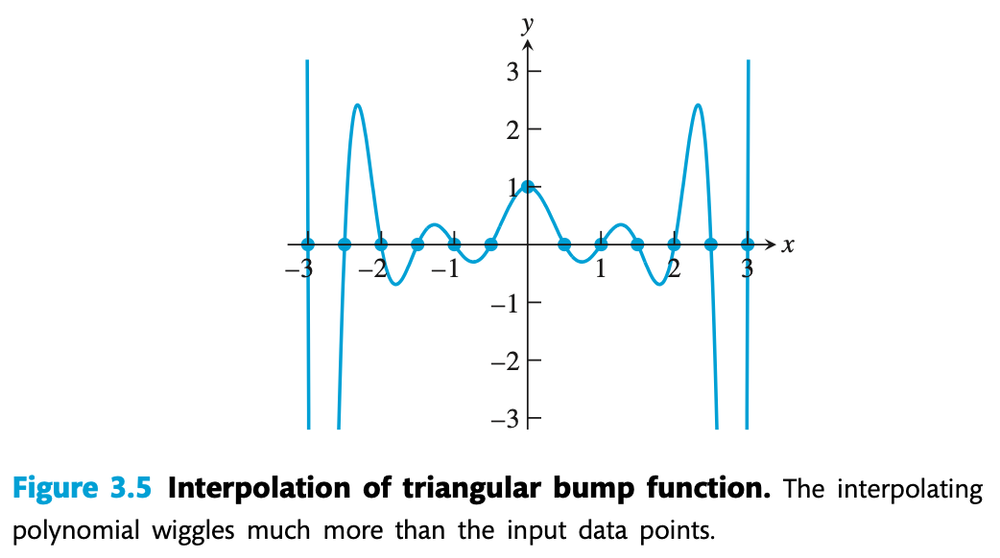

# Lecture 2: 插值，秘密分享，自纠错码

## 插值

考虑对连续函数 $f$ 的求值过程：给定一个 $x_0$，计算得到 $f(x_0)$ 的值

插值可以简单视作求值的逆过程：给定一些 $(x_i, f(x_i))$ 的已知点，构造连续函数 $p$，使得 $p(x_i) = y_i$ 对所有 $i$ 成立。

得到 $p(x)$ 后，可以进行一些连续函数上的平滑计算，或者预测不在初始点集上的 $(x_?, f(x_?))$

> **插值**和**拟合**不是一个概念，前者要求插值函数必须经过每一个已知点，后者追求所有已知点到拟合曲线的距离和最短
>
> 插值在已知数据点上误差严格为 0，但是会出现龙格现象
>
> 拟合在大多数已知数据点上误差尽可能小，抗干扰能力强
>
> 下一节会提到函数逼近（拟合）与插值的区别

## 多项式插值

插值函数 $p(x)$ 的最常见的构造为一个多项式，优点体现在：多项式方程的数学性质非常直观，并且在硬件计算上存在优化。并且多项式有下面的性质：

??? success "根据代数基本定理，多项式总可以被如下因式分解"

    $$
        p(x) = a_{n}(x-r_1)(x-r_2)\cdots (x-r_n)
    $$
    其中 $r_i$ 可能是复数，对于 $n$ 次多项式，复平面上零点一定有 $n$ 个

??? success "Weierstrass 定理: 对于连续函数，多项式可以任意地逼近"

    通过概率论构造伯恩斯坦多项式可以给出构造性证明，不用学证明

??? question "证明：通过 $n$ 个已知点，次数不超过 $n-1$ 的多项式有且仅有一个"

    存在性参考之后的多项式插值函数构造法，以下证明唯一性：
    
    假设两个多项式 $P$ 和 $Q$ 都满足条件，则它们的差 $H(x) = P(x) - Q(x)$ 一定有 $n$ 个零点，并且次数也不超过 $n-1$。根据代数基本定理：$n − 1$ 次多项式（考虑复数域）有且仅有 $n − 1$ 个零点，除非 $H$ 是零多项式
    
    因此 $H$ 必须为 $0$，$P(x) \equiv Q(x)$，这就是多项式插值的唯一性定理

以下给出一种常见的插值方法

## 拉格朗日插值

已知 $n$ 对不同的数据点 $(x_i, y_i)$，满足 $\forall i,p(x_i) = y_i$

现在指定一个特定的 $k$，求一个多项式函数 $L_k$，使得 $L_k(x_k) = 1$，且 $\forall j \ne k, L_k(x_j) = 0$（把它看作一个指示函数）

可以构造出下面的 $L_{k}$：
$$
L_k(x) = \prod_{j=1, j \ne k}^{n} \dfrac{x-x_j}{x_k - x_j}=\dfrac{(x-x_1)\cdots(x-x_{k-1})(x-x_{k+1})\cdots(x-x_n)}{(x_k-x_1)\cdots(x_k-x_{k-1})(x_k-x_{k+1})\cdots(x_k-x_n)}
$$
对于所有的 $k = 1, \cdots, n$，计算 $P_{n-1}(x) = \sum_{i=1}^{n} y_i \cdot L_i(x)$，就得到一个 $n-1$ 次多项式

$P_{n-1}(x)$ 的次数也有可能是小于 $n-1$ 次的

> 根据多项式插值的唯一性定理，如果我预先设定一个小于 $n-1$ 次多项式 $p$，在上面选取了 $n$ 对数据点，那么通过插值法得到的 $P_{n-1}(x)$ 也应该是相同的小于 $n-1$ 次的多项式

拉格朗日插值的计算复杂度为 $O(n^2)$（$O(n)$ 个 $L_k(x)$ 的计算）。拉格朗日插值法的计算缺陷在于：每添加一个数据点，整个插值函数都要重新计算。牛顿插值法可以以 $O(n)$ 的复杂度追加数据点（因为上课不讲所以略）

### 误差分析

设函数 $f(x)$ 在 $[a,b]$ 上有 $n$ 阶连续导数，并且有 $n$ 对不同的数据点 $(x_i, y_i)$，满足 $\forall i,f(x_i) = y_i$

记 $P(x)$ 是满足 $P(x_i) = y_i$ 的 Lagrange 插值多项式，直接给出一个结论：对任意 $x\in [a,b],x\ne x_i$，存在 $c$ 在包含 $x, x_1, \cdots, x_n$ 的最小闭区间内，有：
$$
f(x) - P(x) = \dfrac{(x-x_1)(x-x_2)\cdots(x-x_n)}{n!} f^{(n)}(c)
$$
??? question "（选讲）证明"

    固定 $x$ 的值，考虑在 $f$ 上再取一个点 $x_{n+1} = x$，$q(t)$ 为 $x_1, \cdots, x_n, x$ 上的插值多项式，$q(t)$ 的多项式次数不超过 $n$，并且 $\forall i \in \{1, \cdots n\},\; q(x_i) = f(x_i)$，且 $q(x) = f(x)$
    
    因此 $q(t) - P(t)$ 在 $x_1, \cdots, x_n$ 上值为 0，同时 $q(t) - P(t)$ 的次数不超过 $n$（由 $q$ 决定的），根据代数基本定理，一定有下面的式子成立（其中 $\lambda$ 是一个待求的常量）：
    $$
    q(t) - P(t) = \lambda \prod_{j=1}^{n}(t-x_j)
    $$
    
    令 $t = x$，代入 $q(x) = f(x)$，得到：
    $$
    \lambda = \dfrac{f(x) - P(x)}{\prod_{j=1}^{n}(x-x_j)}
    $$
    因此：
    $$
    q(t) = P(t) + \dfrac{f(x) - P(x)}{\prod_{j=1}^{n}(x-x_j)} \cdot \prod_{j=1}^{n}(t-x_j)
    $$
    引入辅助函数 $\phi(t) = f(t) - q(t)$，容易得到 $\phi(t)$ 在 $x_1, \cdots, x_n, x$ 上得到 $n+1$ 个零点
    
    反复使用 $n$ 次 Rolle 定理，得到结论：存在介于 $x_i$ （包含 $x$）的最小、最大值之间的 $c$，使得 $\phi^{(n)}(c) = 0$
    
    也就是说 $f^{(n)} (c) = q^{(n)}(c)$，注意到 $q(t) = P(t) +  \lambda \prod_{j=1}^{n}(t-x_j)$，进行 $n$ 次求导后有：
    
    - $P^{(n)}(t) = 0$（因为 $P$ 的次数小于 $n$）
    - $(\prod_{j=1}^{n}(t-x_j))^{(n)} = n!$（因为是首项系数为 1 的 $n$ 次多项式） 
    
    因此 $\lambda = \dfrac{f^{n}(c)}{n!}$，回代 $\lambda$ 的值即得到本结论

### Runge 现象

当使用等距节点构造高次插值多项式时，插值函数在区间端点附近会出现明显震荡，使得整体误差增大，而非随多项式阶数增加而减小。我们称之为 Runge 现象（龙格现象）

Runge 现象是过拟合下（强制插值函数经过所有点）的副作用，解决方法包括两种：对采样点进行分段的低次插值，或者用切比雪夫节点（参考下一节）代替等距节点

## 有限域多项式

定义有限域是一个包含有限个元素的集合，并且定义加法和乘法运算，满足域的所有性质

最常见的有限域为素数域 $\mathbb{F}_q = \{0, 1, \cdots, q-1\}$，其中 $q$ 是素数，要求运算结果都要模 $q$，使得运算结果始终在 $\mathbb{F}_q$ 范围内

定义有限域多项式 $p(x) = a_0 + a_1 x + \cdots a_{k} x^{k}$，满足：

- 定义域和值域都为 $\mathbb{F}_q$
- $\forall a_{i} \in \mathbb{F}_q$

在密码学等领域，有限域上的多项式被广泛使用

## 应用：秘密分享

基于插值的不可预测性，我们给出一种现实应用

Shamir 的秘密共享方案是一种密码学算法，用多项式插值代替了常规的组合问题解法

> RSA 加密算法中的 "RSA" 是三个人名的缩写，"S" = Shamir

定义以下概念：

- Secret，需要保护的原始信息
- n，保密者的总人数。每个人分到的 Secret 片段之间毫无相关
- k，恢复 Secret 所需的最少在场的保密者人数

如果考虑常规的排列组合方案（至少配备 $a=C_{n}^{k-1}$ 把锁，每个保密者至少携带 $b=C_{n-1}^{k-1}$ 把不同钥匙），虽然这是物理安全的，但是灵活性太差，成本也非常高

回顾一下多项式插值的唯一性定理：通过 $n$ 个已知点，次数不超过 $n-1$ 的多项式有且仅有一个。因此可以这样约定：

- 内部约定<u>有限域</u> $\mathbb{F}_{q}$ 上的 $k-1$ 次多项式 $f(x)$，定义密文为 $f(x_0)$，另外随机挑出 $k$ 个不同的点 $x_1, \cdots, x_k$
- 每个保密者得到不同的点值对 $(x_i, f(x_i))$
- 任意 $k$ 个人到场，给出自己的点值对 $(x_i, f(x_i))$，就能根据拉格朗日插值法还原唯一的多项式 $f$，从而计算 $f(x_0)$ 的值（Secret）

根据信息论，算法必须建立在有限域上，否则可以通过少于 $k$ 的 Secret 片段暴力破解出部分 Secret 信息

## 应用：自纠错码

基于多项式插值的唯一性，我们给出一种现实应用

基站 A 向基站 B 发送 $k$ 个数据包，可能会出现下面两种错误情况

- 包擦除（erasure），对方基站<u>能够意识到</u>该包信息无效
- 包污染（corruption），对方基站<u>无法意识到</u>该包信息无效

考虑一种方案，通过发送多于 $k$ 个包，实现对上述错误情况的自纠错，让对方基站保证获得正确的数据包

这里引入 Reed-Solomon codes 的编码方法：将待发送的 $k$ 个信息 $a_0, \cdots, a_{k-1}$ 编码为一个<u>有限域</u> $\mathbb{F}_{q}$ （$q$ 大于字符集）上的 $k-1$ 次多项式 $p$ 的系数，实际传递信息时发送 $p(1), \cdots, p(n)$ 共 $n$ 个值。接下来考虑如何判断需要发送多少个点的数据，才能保证还原出 $a_0 \sim a_{k-1}$：

- 最多接受 $t$ 个包擦除（erasure）
    - 发送 $k+t$ 个点 $p(1) \sim p(k+t)$，容易进行证明：$k+t$ 个点中至少有 $k$ 个有效点，能够还原出 $a_{0} \sim a_{k-1}$ 的值
- 最多接受 $t$ 个包污染（corruption）
    - 发送 $k+2t$ 个点 $p(1) \sim p(k+2t)$，证明参考下文

这个结论**不具有普适性**（证明之后再说），先介绍针对于 Reed-Solomon codes 的证明方式

### Reed-Solomon codes

具体解释最多接受 $t$ 个包污染（corruption）的情境，理解为什么 $k + 2t$ 个点可以确保还原唯一的多项式

??? question "存在性证明（构造法）：Berlekamp-Welch 算法"

    最多接受 $t$ 个包损坏，发送 $k+2t$ 个点，则至少有 $k + t$ 个点是数值正确的
    
    定义错误定位多项式：
    $$
    E(x) = (x-e_1)(x-e_2)\cdots(x-e_{t})
    $$
    其中 $e_1 \sim e_t$ 表示对特定的 $t$ 个包进行了污染，得到一个重要的等式：
    $$
    \forall i \in [1 ,k+2t],\;p(i)E(i) = r_iE(i)
    $$
    其中 $r_i$ 表示接收方收到的第 $i$ 个点的值，容易证明这是正确的：
    
    - 如果 $i$ 不是错误点，那么 $p(i) = r_i$
    - 如果 $i$ 是错误点，那么 $E(i) = 0$
    
    定义 $Q(x) = p(x)E(x)$，注意到，$p(x)$ 是 $k-1$ 次多项式，$E(x)$ 是首项为 1 的 $t$ 次多项式（有 $t$ 个未知系数），因此 $Q(x)$ 是一个 $k+t-1$ 次多项式（有 $k+t$ 个未知系数）
    
    回到刚刚那个等式：$Q(i)=r_{i}E(i)$，发现该等式左右两边共有 $(k+t) + t = k + 2t$ 个未知参数。考虑线性方程组的求解，给出 $i = 1, \cdots, k+2t$ 个等式（也就是接收方收到的 $k+2t$ 个或正确或错误的点信息），满足了求解线性方程组的最低条件
    
    在完成了线性方程组的求解（比如用高斯消元法）后，就可以得到原多项式 $p(x) = \dfrac{Q(x)}{E(x)}$，进而还原出原信息
    
    参考文献：[The Berlekamp-Welch Algorithm: A Guide](https://gfeng2001.github.io/assets/pdfs/cs70/BWGuide.pdf)

??? question "唯一性证明"

    和多项式插值的唯一性定理矛盾了

## 拓展：ECCs

ECC (Error-Correcting Codes) 即纠错码，是一种在数据中添加冗余信息，使得即使传输或存储过程中出现错误，也能恢复原始数据的技术。Reed-Solomon codes 就是一种基于多项式插值的纠错码实现

在有限域 $\mathbb{F}_{q}$ 内，定义原始数据（消息）长度为 $k$（总信息个数为 $q^k$），通过编码函数 $C:\sum ^{k} \to \sum ^{n}$ 进行编码，编码后的数据（码字）长度为 $n$（$n>k$），冗余为 $n-k$

> RS 码的消息为 $a_0, \cdots, a_{k-1}$，编码函数 $C(x) = a_{k-1}x^{k-1} +\cdots + a_0$，码字为 $p(1), \cdots, p(n)$，码率为 $R=k/n$
>
> 如果要求恰好纠正 $t$ 个错误，则 $n = k + 2t$，注意该结论不具有普适性，在“Hamming 界”部分会具体说明

ECC 的设计考虑两个方面：

- 纠错能力 $t$（给定 $k$ 和 $C$，其可检测 / 纠正错误点位的理论上限是多少）
- 编码效率 $R$（给定 $k$ 和 $t$，设计 $C$ 使得需要的 $n$ 更短，此时编码效率更高）

这两个参数是制约关系的

### Hamming 距离

两个码字 $a$ 和 $b$ 之间的 Hamming 距离定义为它们不同位置的个数
$$
d(a, b) = \sum_{i=1, a_i \ne b_i}^{n} 1
$$
一个码 $C$ 的最小距离定义为所有不同码字之间的最小 Hamming 距离
$$
d_{\min} = \min_{m \ne m'} d(C(m), C(m'))
$$
最小距离决定码的纠错能力，先不加证明给出性质：

- 检测 $t$ 个错误：需要 $d_{\min}⁡≥t+1$
- 纠正 $t$ 个错误：需要 $d_{\min}⁡≥2t+1$

??? question "证明：RS 码的最小距离为 $2t+1$，因此正好能实现纠正 $t$ 个错误"

    - 证明最小距离 $d_{\min} \le 2t + 1$
    
    取两个不同的信息 $m \ne m'$，只在最后一个系数不同
    
    对应的多项式 $p_1(x)$ 和 $p_2(x)$ 在至少 $k-1$ 个点上相等，即码字在至少 $k-1$ 个位置处相同，因此：
    $$
    d(C(m), C(m')) \leq (k + 2t) - (k-1) = 2t+1
    $$
    
    - 证明最小距离 $d_{\min} \ge 2t + 1$
    
    反设存在两个不同码字距离 $\le 2t$，则至少在 $(k+2t) - (2t) = k$ 个位置上相同
    
    也就是说两个不同的 $k-1$ 次多项式在至少 $k$ 个点上相等，不满足多项式插值的唯一性定理
    
    综上，$d_{\min} = 2t + 1$

### Hamming 界

对于任意的码（不仅仅是 RS 码），在给定码字长度 $n$ 和纠错能力 $t$ 的条件下，一个码最多能生成多少个码字（而确保其纠错能力）？

引入有限域 $\mathbb{F}_{q}$ 内的 Hamming 界（考虑一个三维空间，容纳所有的码字以及对应的错误模式，其大小决定了一个码最多有多少码字），定义以每个码字 $c$ 为中心，存在一个半径为 $t$ 的 Hamming 球：
$$
B_{t}(c) = \{x \in \sum^{n} | d(x, c) \le t\}
$$
这个球内部的向量表示了码字 $c$ 的所有可能错误模式，半径 $t$ 代表纠错能力

在有限域 $\mathbb{F}_{q}$ 内，半径为 $t$ 的 Hamming 球的大小为
$$
V_{q}(n,t) = \sum_{i=0}^{t} C_{n}^{i} (q-1)^{i}
$$
球的大小就是所有可能错误模式的个数

（考虑所有的错误个数 $0 \sim t$，可以选择 $C_{n}^{i}$ 个错误位置，每个错误位置有 $q-1$ 种错误值）

设计 ECC 时，希望所有的 Hamming 球互不重叠（否则给定一个错误模式，不一定能找到唯一对应的码字），并且让 Hamming 球尽可能地覆盖整个 Hamming 界

---

有了以上基础后，分别给出有关纠错能力与编码效率的定理。首先是纠错能力：

??? question "对于纠错码 $C: \mathbb{F}_{q}^{k} \to \mathbb{F}_{q}^{n}$，如果能确保发现到 $t$ 个错误（但无法纠正），**充要条件**是 $d_{\min}⁡≥t+1$"

    任意两个球保证一个球不包含另一个球的中心（即码字），否则从码字 $c_1$ 出发的错误可能成为 $c_2$ 的正确结果，导致错误无法被发现。此时 $d_{min} > t$

??? question "对于纠错码 $C: \mathbb{F}_{q}^{k} \to \mathbb{F}_{q}^{n}$，如果能确保检测并纠正出 $t$ 个错误，**充要条件**是 $d_{\min}⁡≥2t+1$"

    任意两个球保证互不相交，否则存在某个错误模式可能指向 $c_1,c_2$ 等错误结果，可能能够发现出错误（$t < d < 2t$），但一定无法被纠正。此时 $d_{min} > 2t$

现在考虑关于编码效率的证明：

??? question "对于纠错码 $C: \mathbb{F}_{q}^{k} \to \mathbb{F}_{q}^{n}$，如果要处理 $t$ 个字符的擦除（erasure），$n$ 的值**至少要** $\ge k + t$"

    考虑所有码字的集合 $\{C(x):x\in \mathbb{F}_q^k\}$，去掉码字的后 $t$ 位，只保留前 $n - t$ 位
    
    反设 $n \le k + t - 1$，即 $n - t \le k -1$
    
    在有限域 $\mathbb{F}_{q}$ 内，原始数据的空间为 $q^{k}$，投影后的可能结果个数 $q^{n-t} \leq q^{k-1}$
    
    根据鸽笼原理，对于大空间到小空间的映射，必然存在两个不同的信息 $x_1, x_2 \in \mathbb{F}_{q}^k$，使得 $C(x_1)$ 与 $C(x_2)$ 的前 $n-t$ 位完全相同
    
    如果擦除（erasure）操作出现在码字的后 $t$ 位，那么仅凭前 $n-t$ 位无法唯一对应正确的码字，无法实现对 $t$ 个字符擦除的纠错
    
    因此至少有 $n \ge k + t$

??? question "对于纠错码 $C: \mathbb{F}_{q}^{k} \to \mathbb{F}_{q}^{n}$，如果要处理 $t$ 个字符的污染（corruption），$n$ 的值**至少要** $\ge k + 2t$"

    考虑所有码字的集合 $\{C(x):x\in \mathbb{F}_q^k\}$，去掉码字的后 $2t$ 位，只保留前 $n - 2t$ 位
    
    反设 $n \le k + 2t - 1$，即 $n - 2t \le k -1$
    
    在有限域 $\mathbb{F}_{q}$ 内，原始数据的空间为 $q^{k}$，投影后的可能结果个数 $q^{n-2t} \leq q^{k-1}$
    
    根据鸽笼原理，对于大空间到小空间的映射，必然存在两个不同的信息 $x_1, x_2 \in \mathbb{F}_{q}^k$，使得 $C(x_1)$ 与 $C(x_2)$ 的前 $n-2t$ 位完全相同
    
    现在构造混淆向量 $r$，前 $n-2t$ 位与 $C(x_1), C(x_2)$ 都相同，后 $2t$ 位中，前 $t$ 位取自 $C(x_1)$ 的相同位置，后 $t$ 位取自 $C(x_2)$ 的相同位置
    
    这样构造的 $r$ 满足 $d(r, C(x_1)) \le t$ 且 $d(r, C(x_2)) \le t$
    
    当接收方得到 $r$ 后，无法区分 $r$ 来自 $C(x_1)$ 还是 $C(x_2)$
    
    因此至少有 $n \ge k + 2t$

---

上文提到：如果要处理 $t$ 个字符的擦除（erasure），$n$ 的值**至少要** $\ge k + t$；如果要处理 $t$ 个字符的污染（corruption），$n$ 的值**至少要** $\ge k + 2t$。在什么情况下可以对不等号取等？

Singleton 界指出：对于任何码都有 $d_{\min} \le n - k + 1$。而当 $d_{\min} = n - k + 1$ 时，我们称对应的纠错码为 MDS 码（极大距离可分码）。这类纠错码允许在 $n = k + 2t$ 的情况下保证能够处理 $t$ 个字符的污染（当然也可以在 $n = k + t$ 的情况下保证能够处理 $t$ 个字符的擦除），并且可以保证纠正出 $t$ 个随机错误

??? question "证明 Singleton 界成立"

    组合计数法：取所有码字的最后 $d-1$ 位，这些截断后的码字一定两两不同（否则不满足最小距离）。因此原始数据的总个数 $q^{k} \le q^{n-d+1}$

Reed-Solomon codes 属于 MDS 码

---

Hamming 码什么的还是留到下学期密码学原理再写吧，这个 Note 后半部分已经是密码学了

不过面向 CSer 的数值分析课程讲这些也挺好的
