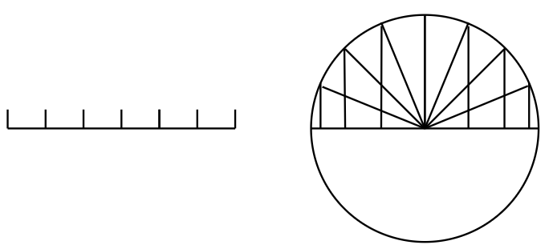
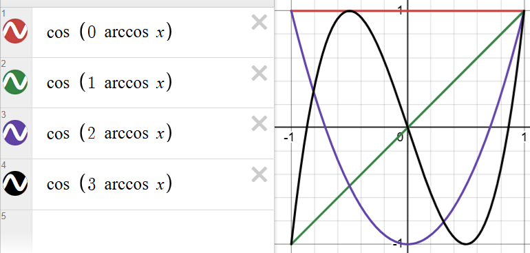
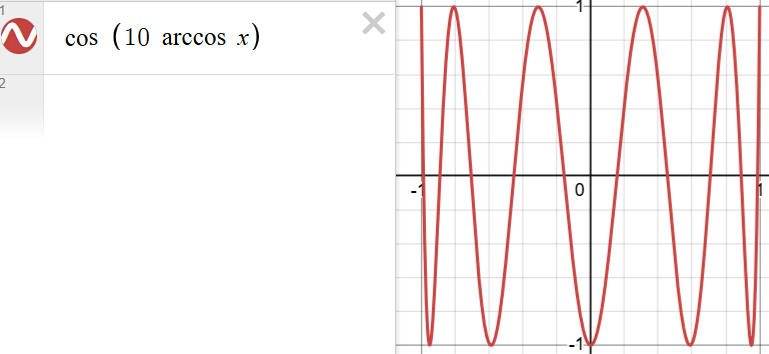
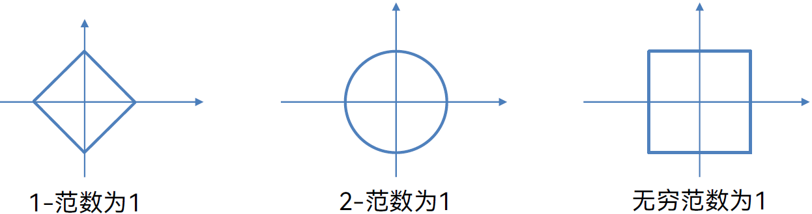

# Lecture 3: Chebyshev 插值与 Chebyshev 多项式，范数

??? quote "回顾：Runge 现象"

    
    
    当使用等距节点构造高次插值多项式时，插值函数在区间端点附近会出现明显震荡，使得整体误差增大，而非随多项式阶数增加而减小
    
    因为多项式函数是全局的，函数为了经过等距的所有点，会产生非常大的振荡（尤其是 $|x|$ 很大时）

为了避免 Runge 现象发生，一种方法是在采用 Lagrange 插值的基础上，不采用等距节点插值，而是采用 Chebyshev 插值来代替

（左图表示等距插值，右图大致表示切比雪夫插值，注意到后者插值间隔随 $|x|$ 增大而减小）

## 插值误差

记 $P(x)$ 是满足 $P(x_i) = y_i$ 的 Lagrange 插值多项式，对任意 $x\in [a,b],x\ne x_i$，存在 $c$ 在包含 $x, x_1, \cdots, x_n$ 的最小闭区间内，我们定义多项式插值误差为（在上一节已经提出）：

$$
f(x) - P(x) = \dfrac{(x-x_1)(x-x_2)\cdots(x-x_n)}{n!} f^{(n)}(c)
$$

不失一般性，现在我们假设 $f$ 是定义在 $[-1, 1]$ 上的函数，为了从插值点选择上最小化误差，我们需要给出目标：选择 $x_1, \cdots, x_n$，使得下面的式子最小化

$$
\max_{x\in [-1, 1]} |(x-x_1)(x-x_2)\cdots(x-x_n)| \qquad (*)
$$

我们先给出结论，在之后给出证明：令 $x_{i} = \cos \dfrac{(2i-1)\pi}{2n}$，使 $(*)$ 得到最小值 $\dfrac{1}{2^{n-1}}$

这些节点 $x_1, \cdots, x_n$ 正是切比雪夫节点，也即第一类切比雪夫多项式 $T_n(x)$ 的全部根

## 切比雪夫多项式

切比雪夫多项式有两类，我们给出最常用的第一类：

???+ success "第一类切比雪夫不等式"

    对于 $n \ge 0, x\in [-1, 1]$，我们定义：
    
    $$
    T_{n}(x) = \cos (n \arccos x)
    $$
    
    为第一类切比雪夫多项式
    
    ???+ question "如何证明这是一个多项式？"
    
        令 $x = \cos \theta$，则 $T_{n}(x) = \cos (n \theta)$
    
        我们知道 $\cos (n \theta)$ 总可以通过多倍角公式拆解为关于 $\cos \theta$ 的多项式，对应的，$\cos (n \arccos x)$ 总可以拆解为关于 $x$ 的多项式
        
    令 $x = \cos \theta$，则 $T_{n}(x) = \cos (n \theta)$
    
    首先 $T_{0}(x) = 1, \; T_{1}(x) = x$，接下来应用倍角公式：
    
    - $T_{n+1}(x) = \cos (n \theta + \theta) = \cos n\theta \cos \theta - \sin n \theta \sin \theta$
    - $T_{n-1}(x) = \cos (n \theta - \theta) = \cos n\theta \cos \theta + \sin n \theta \sin \theta$
    
    两式相加得到 $T_{n+1}(x) = 2xT_{n}(x) - T_{n-1}(x)$，这就是切比雪夫多项式的递推版本。可以通过切比雪夫多项式的递推式计算出 $T_{n}(x)$ 的多项式写法

给出切比雪夫多项式的图像

观察图像，并且结合递推式，可以得到一些 $T_{n}(x)$ 有关的结论：

- $T_{n}$ 是 $n$ 次多项式，最高次项的系数为 $2^{n-1}$
- $|T_{n}(x)| \leq 1, \quad T_{n}(1) = 1, \quad T_{n}(-1) = (-1)^{n}$
- $T_{n}(x)$ 的 $n$ 个零点均在实数域上：$x_{i} = \cos \dfrac{(2i-1)\pi}{2n}, \; i = 1, \cdots , n$
    - 对应 $\cos(n\theta) = 0$ 的解满足 $n\theta = (2i-1) \dfrac{\pi}{2}, \; i = 1, \cdots, n$
- $T_{n}(x)$ 的 $n+1$ 的极值点满足 $\cos(\dfrac{k\pi}{n}), \; k = 0, \cdots, n$
    - 在这些点上 $T_{n}(x) = (-1)^{k}$

---

现在我们证明之前留下的结论，我们称之为 Chebyshev 定理：

???+ question "证明：第一类切比雪夫多项式 $T_n(x)$ 的全部根 $x_1 \sim x_n$ 使得 $\max_{x\in [-1, 1]} |(x-x_1)(x-x_2)\cdots(x-x_n)|$ 的值最小化"

    首先，$T_{n}$ 是 $n$ 次多项式，最高次项的系数为 $2^{n-1}$，因此 $\dfrac{T_{n}}{2^{n-1}}$ 的首项为 $1$

    $|T_{n}(x)| \leq 1 \to \left|\dfrac{T_{n}(x)}{2^{n-1}}\right| \leq \dfrac{1}{2^{n-1}}$

    我们不妨直接证明下面的内容，即这个最优多项式为缩放后的切比雪夫多项式：
    
    $$
    \min_{[x_i]}\max_{x\in [-1, 1]} |(x-x_1)(x-x_2)\cdots(x-x_n)| = \max_{x\in [-1, 1]} \dfrac{T_{n}(x)}{2^{n-1}} = \dfrac{1}{2^{n-1}}
    $$
    
    我们记 $\hat{T_{n}}(x)= \dfrac{T_{n}(x)}{2^{n-1}}$，现在反设还存在另一个首项为 1 的多项式 $Q_{n}(x)$ 比 $\hat{T_{n}}(x)$ 更优
    
    构造差值函数 $R_{n}(x) = \hat{T_{n}}(x) - Q_{n}(x)$，注意到 $\hat{T_{n}}(x)$ 在 $n+1$ 个极值点处是正负交替的，$Q_{n}(x)$ 因为最值始终小于 $\hat{T_{n}}(x)$ 不改变整体 $R_{n}(x)$ 的正负性，因此 $R_n(x)$ 一定有 $n$ 个零点
    
    $\hat{T_{n}}(x)$ 和 $Q_{n}(x)$ 都是首项为 1 的多项式，因此 $R_{n}(x)$ 的次数最多为 $n-1$ 次
    
    “ $R_n(x)$ 一定有 $n$ 个零点” 和 “$R_{n}(x)$ 的次数最多为 $n-1$ 次” 是矛盾的，因此反设不成立
    
    即：$\hat{T_{n}}(x)$ 为最优多项式

---

现在我们将线性代数的内容代入到多项式空间中，容易得到 Chebyshev 多项式 $T_{n}(x)$ 始终张成同一个空间（也就是全体实多项式集合的空间），并且可以作为实系数多项式 $\mathbb{R}(x)$ 的一组基

???+ question "证明上面的结论"

    首先证明：存在 $A\in \mathbb{R}^{(n+1)\times(n+1)}$ 使得单项式基 $\mathbf{x}$ 可以线性变换为切比雪夫基 $\mathbf{t}$（$A\mathbf{x} = \mathbf{t}$）
    
    我们这样构造：
    
    已知 $T_{n+1}(x) = 2xT_{n}(x) - T_{n-1}(x)$，首先初始化 $A$ 的前两行，假设矩阵是 0-index 的：
    
    第 0 行：$A_{0, 0} = 1$，其余 $A_{0, i} = 0$；

    第 1 行：$A_{1, 1} = 1$，其余 $A_{1, i} = 0$；

    接下来，对于第 $k+1$ 行，代入 $T_{n+1}(x) = 2xT_{n}(x) - T_{n-1}(x)$ 的递推式得到：
    
    $$
    \begin{cases}
    \quad A_{k+1, i} = -A_{k-1, 0}, \quad & i = 0\newline
    \quad A_{k+1, i} = 2A_{k, i-1} - A_{k-1, i}, \quad &\forall i \in [1, k]\newline
    \quad A_{k+1, i} = 2A_{k, k}, \quad & i = k+1\newline
    \quad  A_{k+1, i} = 0 ,\quad &\forall i \in (k+1, n]
    \end{cases}
    $$
    
    最终可以构造出一个下三角矩阵 $A$
    
    根据 $A$ 是一个对角线元素非零的下三角矩阵，可以得到 $|A| \ne 0$，因此 $A$ <u>是可逆矩阵</u>
    
    因此单项式基 $\mathbf{x}$ 和切比雪夫基 $\mathbf{t}$ 可以互相线性表示，它们张成的空间完全相同，即
    
    $$
    \text{span}\{T_i(x)\}_{i=0}^n = \text{span}\{x^i\}_{i=0}^n
    $$

## 函数逼近

之前提到过，插值需要经过所有的给定的点，插值点的选择对误差值有很大的影响；相对应的，函数逼近不要求经过给定的点，但要求尽可能地减少误差

首先再次给出 Weierstrass 定理：

???+ success " Weierstrass 定理"

    对于连续函数 $f$，多项式可以任意地逼近。换句话说，无论一个连续函数有多么复杂，总能找到一个多项式 $p$，使得误差任意小。误差定义为无穷范数：
    
    $$
    \lVert f-p \rVert_{\infty} := \sup_{x}|f(x)-p(x)|
    $$
    
    该情境下，整个区间上差值最大的点的绝对值即误差

一般来说，要找最佳一致逼近的多项式是比较困难的，但是通过 Chebyshev 点得到的 $n$ 次多项式，与最佳一致逼近的 $n$ 次多项式之间，在<u>无穷范数</u>上只相差 $O(\log n)$

因此我们记 Chebyshev 逼近为拟最佳逼近

## 向量范数

???+ success "Definition：向量范数"

    对于向量 $\mathbf{x}$，我们定义：
    
    $$
    \lVert \mathbf{x} \rVert_{p} = (|x_1|^{p} + |x_2|^{p} + \cdots + |x_d|^{p})^{1/p}
    $$
    
    为向量的 $p$-范数，其中：
    
    - $ℓ_1$-范数 $\lVert \mathbf{x} \rVert_{1} = |x_1| + |x_2| + \cdots + |x_d|$，又称之为曼哈顿范数，表示向量各分量绝对值的和
    - $ℓ_2$-范数 $\lVert \mathbf{x} \rVert_{2} = \sqrt{x_1^2 + x_2^2 + \cdots + x_d^2}$，又称之为欧几里得范数，表示向量长度
    - $ℓ_{\infty}$-范数 $\lVert \mathbf{x} \rVert_{\infty} = \max\lbrace|x_1|, |x_2|, \cdots , |x_d|\rbrace$，又称之为无穷范数，表示向量在所有维度中的最大偏差

范数具有正定性（不为零），可以表示一个向量的“大小”；内积可以表示两个向量的几何对齐程度

上述提到的最佳一致逼近就是在无穷范数上的
