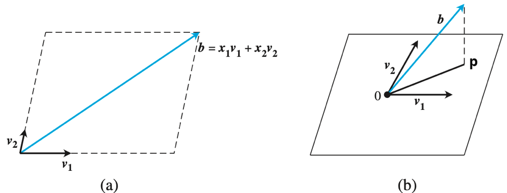

# Lecture 4: 最小二乘法，Gram-Schmidt 正交化与 QR 分解

## 最小二乘法

上文在对 $f$ 进行逼近时，期望得到的是最佳无穷范数逼近

如果我们要找到 $f$ 的最佳 2-范数逼近（最佳平方逼近）：

$$
\lVert f \rVert_{2} = \sqrt{\int |f(x)|^{2} \text{d}x}
$$

可以使用最小二乘法

### 离散线性情形下的最佳平方逼近

> 线性代数相关的符号懒得写粗体了

已知矩阵 $A \in \mathbb{R}^{m\times n}$，向量 $b\in \mathbb{R}^{m}$，求 $x\in \mathbb{R}^{n}$ 使得 $Ax=b$

根据线代基础不难得出，线性方程组的解只有三种可能性：

- 对任意 $b$ 有唯一解（此时 $A$ 是满秩方阵）
    - $b \in \text{Col}(A),\; \text{Nul}(A) = \lbrace 0 \rbrace$
- 至少存在两个不同的解，从而通过线性组合存在无穷多的解
    - $b \in \text{Col}(A),\; \text{Nul}(A) \ne \lbrace 0 \rbrace$
- 无解（方程不一致）
    - $b\not\in \text{Col}(A)$


对于方程不一致的情况，我们依旧要找出一个近似解，使得方程两边的差异值在 2-范数上最小。最经典的方法是最小二乘法，其核心是将求解问题转化为一个优化问题。对于 $Ax$，可以表示为：

$$
\begin{pmatrix}
\vdots & \vdots & \vdots &  & \vdots \newline
A_1 & A_2 & A_3 & \cdots & A_n \newline
\vdots & \vdots & \vdots &  & \vdots
\end{pmatrix}
\begin{pmatrix}
x_1 \newline
x_2 \newline
\vdots \newline
x_n
\end{pmatrix}
= x_1 A_1 + x_2 A_2 + \cdots + x_n A_n
$$


其中 $A_{i}$ 是列向量，$b$ 为目标向量，这生成了列空间中的任意向量。而我们追求的是最佳 2-范数逼近。算式表示为：

$$
\hat{\mathbf{x}} = \arg\min_{\mathbf{x} \in \mathbb{R}^n} \left\| \mathbf{b} - \begin{pmatrix} \vdots & \vdots & \vdots &  & \vdots \newline A_1 & A_2 & A_3 & \cdots & A_n \newline \vdots & \vdots & \vdots &  & \vdots \end{pmatrix} \begin{pmatrix} x_1 \newline x_2 \newline \vdots \newline x_n \end{pmatrix} \right\|_2^2
$$

换句话说，我们想要找出 $A$ 的列空间中的某一个向量，使其与目标向量 $b$ 的距离最接近。注意到 $b$ 不一定在 $A$ 的列空间中

下图以三维空间 $\mathbb{R}^{3}$为例，其中 $A$ 的列空间是二维的，$b$ 是 $\mathbb{R}$ 上不在 $A$ 列空间上的一个向量




观察上图可以注意到，指定一个所有向量的出发点（零点），当 $p$ 是 $b$ 在 $\text{Col}(A)$ 上的正交投影时，列空间上过 $p$ 点的向量（不妨直接称之为 $p$）是对 $b$ 的最佳平方逼近

换言之：记最接近的点为 $A\hat{x}$，则 $(A\hat{x} - b) \perp \text{Col} (A)$，等价于：

$$
\forall x \in \mathbb{R}^{n},\; (Ax)^{T}(A \hat{x} - b) = 0
$$

进一步的，将 $(Ax)^{T}$ 写作 $x^{T}A^{T}$，并带入 $\forall x \in \mathbb{R}^{n}$，得到等价式：

$$
A^{T}(A \hat{x} - b) = 0
$$


由此，我们定义法线方程

???+ success "Definition：法线方程"

    在最小二乘问题中，定义法线方程：
    
    $$
    A^{T}A\hat{x} = A^{T}b
    $$
    
    法线方程的解表示对应最小二乘问题的最优平方逼近

> 法线方程 $A^{T}A\hat{x} = A^{T}b$ 相比原方程 $A\hat{x} = b$ 只相差了一个左乘的 $A^{T}$
>
> 由于 $A^{T}A$ 是对称半正定方阵，这一系列优秀性质使得法线方程一定是可解的。进一步的，如果 $A^{T}A$ 是正定的，则法线方程具有唯一解

这个式子还可以从微积分角度进行解释：

??? question "法线方程的微积分表示"

    注意到最小化 $\Vert x \Vert_2$ 和最小化 $\Vert x \Vert_2^2$ 是等价的，记 $\hat{x} = \arg\min_{\mathbf{x}} \Vert Ax-b \Vert_{2}^{2}$，则求梯度：
    
    $$
    \begin{align*}
    \nabla \|Ax - b\|_2^2 
    &= \left( \frac{\partial}{\partial x_1}, \frac{\partial}{\partial x_2}, \dots, \frac{\partial}{\partial x_n} \right) \|Ax - b\|_2^2 \newline
    &= \left( \frac{\partial}{\partial x_1}, \frac{\partial}{\partial x_2}, \dots, \frac{\partial}{\partial x_n} \right) (x^\top A^\top Ax + b^\top b - b^\top Ax - x^\top A^\top b) \newline
    &= 2A^\top A x - 2A^\top b
    \end{align*}
    $$
    
    令梯度为 0，则得到法线方程

我们还可以从变分法的角度考虑法线方程：

??? question "法线方程的变分法表示"


    记误差函数为 $E(x) := \|Ax - b\|_2^2$  
    则 $\hat{x}$ 满足法线方程 $A^\top A\hat{x} = A^\top b$ 当且仅当  
    
    $$
    \forall y, E(\hat{x}) \leq E(\hat{x} + y)
    
    $$
    
    证明:  
    
    $$
    
    E(\hat{x} + y) = E(x) + (Ay)^\top (Ay) + 2y^\top A^\top (A\hat{x} - b)
    $$
    
    注意到  
    
    $$
    (\forall y, y^\top A^\top (A\hat{x} - b) = 0) \iff A^\top (A\hat{x} - b) = 0
    $$
    
    考虑逆反命题:  
    
    $$
    (\exists y, y^\top A^\top (A\hat{x} - b) \neq 0) \iff (\exists y, y^\top A^\top (A\hat{x} - b) < 0)
    $$
    
    进而，通过取足够短的向量 $y$，可以令  
    
    $$
    (Ay)^\top (Ay) + 2y^\top A^\top (A\hat{x} - b) < 0
    $$
    
    进而得到 $E(\hat{x}) > E(\hat{x} + y)$
    
    简单来说，法线方程是凸二次函数全局最小点的充要条件：$\hat{x}$ 是极值点，则一定满足法线方程


通过法线方程，我们可以得到 $\hat{x} = (A^{T}A)^{-1}A^{T}b$

但是在数值计算中，我们既不会去解法线方程，也不会尝试直接求 $(A^{T}A)^{-1}$

> 还记得之前说过条件数的定义：
>
> - 条件数 $\kappa$ 描述了数值问题 $f$ 对输入误差的敏感程度。当 $\kappa$ 非常大时，称 $f$ 是病态的；当 $\kappa$ 接近 1 时，称 $f$ 是良态的。条件数 $\kappa$ 是数值问题本身的属性，与算法实现基本无关
>
> 注意到：$\kappa(A^{T}A) = \kappa^{2}(A)$，在直接对 $A^{T}A$ 进行计算时，输入扰动会被平方级别放大，这导致数值稳定性显著下降

有没有什么方法可以避免构造 $A^{T}A$ 的方法呢？设想一下，如果 $A$ 的每一列都是正规化的：

$$
A_i^\top A_j =
\begin{cases}
1, & i = j \newline
0, & i \neq j
\end{cases}
$$

也就是说 $A^{T}A$ 此时恰好为单位矩阵 $I$，这时我们可以得到 $\hat{x} = A^{T}b$

可惜大多数情况下上述情况不成立。那么，我们能否对列空间进行基的转换，得到一组正交基，从而绕过对 $A^{T}A$ 的构造？

### Gram-Schmidt 正交化

Gram-Schmidt 正交化是一种将一组线性无关的向量，转换为一组两两正交（垂直）的向量的算法

#### Classic Gram-Schmidt (CGS)

假设原向量是 $ \mathbf{v}_1, \mathbf{v}_2, \dots, \mathbf{v}_n $，要得到正交向量 $ \mathbf{u}_1, \mathbf{u}_2, \dots, \mathbf{u}_n $：

- $ \mathbf{u}_1 = \mathbf{v}_1 $
- $\mathbf{u}_2 = \mathbf{v}_2 - \frac{\mathbf{v}_2 \cdot \mathbf{u}_1}{\mathbf{u}_1 \cdot \mathbf{u}_1} \mathbf{u}_1 $
- $ \mathbf{u}_3 = \mathbf{v}_3 - \frac{\mathbf{v}_3 \cdot \mathbf{u}_1}{\mathbf{u}_1 \cdot \mathbf{u}_1} \mathbf{u}_1 - \frac{\mathbf{v}_3 \cdot \mathbf{u}_2}{\mathbf{u}_2 \cdot \mathbf{u}_2} \mathbf{u}_2 $
- ... ...

就得到一组正交基。如果想得到标准正交基，就将每个 $\mathbf{u}_{i}$ 除以其长度，对应得到的标准正交向量记为 $\mathbf{q}_{i}$

> 口头描述以下上述算法的流程：
>
> - 第一个向量保留
> - 第二个向量减去在第一个向量上的投影，得到和第一个向量垂直的向量
> - 第三个向量减去在前两个向量上的投影，得到和前两个向量垂直的向量
> - 以此类推

#### Modified Gram-Schmidt (MGS)

CGS 在一次性地减去所有前面的投影时，如果向量组接近线性相关，则减法会产生明显的抵消误差，数值计算不稳定

MGS 的最终数学结果与 CGS 完全一样，但计算顺序不同：相比 CGS 逐个计算 $\mathbf{u}_{2}, \cdots, \mathbf{u}_{n}$，即一次性减去所有投影向量，MGS 初始化 $\mathbf{u}_{i} = \mathbf{v}_{i}$，在每次算出一个 $\mathbf{u}_{i}$ 后，立刻用这个 $\mathbf{u}_{i}$ 去对它后面的 $\mathbf{u}_{i+}$ 进行投影向量的减法操作，而不是攒到一起再减

这种计算方法减小了累计误差

### QR 分解

我们给出<u>包含归一化（标准化）</u>操作下，MGS 的伪代码

其中 $A_{j}$ 表示矩阵 $A$ 的第 $j$ 列向量， `r[i][j]` 表示 $\mathbf{q}_{i}^{T}A_{j}$ 的值（其中 $\mathbf{q}_{i}$ 已经归一化，否则应该写为 $\frac{\mathbf{A}_j \cdot \mathbf{q}_i}{\mathbf{q}_i \cdot \mathbf{q}_i}$）

```python
for j = 1, 2, .... n
    y = A[j]
    for i = 1, 2, ..., j-1
        r[i][j] = q[i]^T · y
        y = y - r[i][j] · q[i]
    end
    r[j][j] = ||y||				# 2-范数
    q[j] = y / r[j][j]			# 归一化
end
```

在此基础上，我们可以通过 Gram-Schmidt 正交化，将一个矩阵分解为正交阵与上三角阵的乘积：

$$
\begin{pmatrix}
\vdots & \vdots & \vdots & & \vdots \newline
A_1 & A_2 & A_3 & \dots & A_n \newline
\vdots & \vdots & \vdots & & \vdots
\end{pmatrix}
=
\begin{pmatrix}
\vdots & \vdots & \vdots & & \vdots \newline
q_1 & q_2 & q_3 & \dots & q_n \newline
\vdots & \vdots & \vdots & & \vdots
\end{pmatrix}
\begin{pmatrix}
r_{11} & \dots & r_{1n} \newline
0 & \ddots & \vdots \newline
0 & 0 & r_{nn}
\end{pmatrix}
$$

> Tip：这里的符号使用和上面的伪代码是对应的
>
> 以及，这里的 MGS 需要进行归一化，否则不再是 QR 分解


这就是一种 QR 分解的方法。通过 QR 分解，我们可以规避法线方程中，$A^{T}A$ 的计算：

$$
A^{T}A \hat{x} = A^{T}b \implies \hat{x} = R^{-1}Q^{T}b
$$

虽然现在更常用的数值计算方法是利用 Householder 反射子，但是这一分解方法足够经典

## 正交函数族与正交多项式


> 内积空间略去，隔壁机器学习导论的数学前置课有讲解

考虑函数空间，如果函数族 $\phi_{1}(x), \phi_{2}(x)\cdots$ 是正交化的，则

$$
\langle \phi_{i}, \phi_{j} \rangle =
\begin{cases}
\lVert \phi_{i}\rVert^{2}, & i = j \newline
0, & i \neq j
\end{cases}
$$

特别的，如果 $\phi_{1}(x), \phi_{2}(x)\cdots$ 是多项式，则也称之为正交多项式


现在，对于一个函数逼近问题：给定函数 $ f $ 和一组基函数 $ \phi_i $，能否找到系数 $ \{c_i\} $ 使得  

$$
f(x) \approx \sum_i c_i \phi_i(x)
$$

如果能找到一组正交基 $ \phi_i $，那么系数可以通过投影直接求出，不需要解大型方程组

### Chebyshev 基

之前我们得到，Chebyshev 基和 $\lbrace 1, x, x^{2}, \cdots\rbrace$ 张成相同的空间。此外我们还能证明：Chebyshev 多项式关于 $w(x) = \dfrac{1}{\sqrt{1-x^{2}}}$ 定义的内积正交

???+ question "证明：对于切比雪夫基 $T_{i}$，定义内积运算 $\langle f, g \rangle_w := \int_{-1}^{1} f(x) g(x) \dfrac{dx}{\sqrt{1 - x^2}}$，则 $\langle T_{i}, T_{j} \rangle_{w} = 0$"

    考虑内积式：
    
    $$
    I = \int_{-1}^{1} T_{i}(x)T_{j}(x) \dfrac{\text{d}x}{\sqrt{1-x^{2}}}
    $$

    换元 $x = \cos\theta$，得到
    
    $$
    \begin{aligned}
    I &= \int_{\pi}^{0}\cos (i \theta)\cos (j \theta) \dfrac{\text{d}\cos\theta}{\sqrt{1-\cos^{2}\theta}} \newline
    &= \int^{\pi}_{0}\cos (i \theta)\cos (j \theta) \text{d}\theta \newline
    &=  \dfrac{1}{2} \int^{\pi}_{0} \cos ((i+j)\theta) + \cos ((i-j)\theta) \text{d} \theta
    \end{aligned}
    $$

    当 $i \ne j$ 时，$I = 0$，也就是 $⟨T_{i}, T_{j}⟩ = 0$，这说明对于 $i \ne j$，$T_i(x)$ 与 $T_j(x)$ 是正交的 $\Box$

### 傅里叶级数基

接下来，我们需要定义 $[-\pi,\pi]$ 上的内积：

$$
\langle f, g \rangle = \int_{-\pi}^{\pi} f(x) g(x) \, dx
$$

结合刚才对 Chebyshev 基的内积式计算，我们可以总结出一系列结论：

对于任意常值 $a\ne b$，有

$$
\int_{-\pi}^{\pi} k \sin (ax) \text{d}x = \int_{-\pi}^{\pi} k \cos (ax) \text{d}x = 0
$$

这一性质由周期性决定。进一步的，利用积化和差公式，有

$$
\int_{-\pi}^{\pi} \cos(ax) \cos (bx) \text{d}x = \int_{-\pi}^{\pi} \cos(ax) \sin (bx) \text{d}x = \int_{-\pi}^{\pi} \sin(ax) \sin (bx) \text{d}x = 0
$$

根据以上性质，我们构造这样的基函数：

$$
\begin{align*}
\phi_0(x) &= \frac{1}{2} \newline
\phi_k(x) &= \cos(kx), \quad k = 1, 2, \dots, n \newline
\phi_{n+k}(x) &= \sin(kx), \quad k = 1, 2, \dots, n-1
\end{align*}
$$

共计 $2n$ 个函数，可以证明其关于上述内积正交，因此这是一组正交基

我们可以用这个基来逼近一个函数：

$$
f(x) \approx a_0 \cdot \frac{1}{2} + \sum_{k=1}^n a_k \cos(kx) + \sum_{k=1}^{n-1} b_k \sin(kx)
$$

如何让左右两式之差最小？这又回到了最小二乘法。我们记误差函数 $E(x)$ 为两式之差，考虑 $\lVert E(x) \rVert_{2}^{2} = \int_{-\pi}^{\pi} E(x)^{2} \text{d} x$，对这个式子关于 $\lbrace a_{i}, b_{i} \rbrace$ 求偏导取 0，能够得到法线方程

根据正交性，直接给出计算结果：

$$
a_k = \frac{\langle f, \cos(kx) \rangle}{\langle \cos(kx), \cos(kx) \rangle} \newline
b_k = \frac{\langle f, \sin(kx) \rangle}{\langle \sin(kx), \sin(kx) \rangle}
$$

这样，就得到了傅里叶级数基，以及其描述的函数。有哪些函数可以写成上述形式？我们给出条件：

- $f$ 是一个值域在 $[-\pi, \pi]$ 上的周期函数
- $\displaystyle \int_{-\pi}^{\pi} |f(x)| \text{d} x < \infty$（狄利克雷条件，指出傅里叶级数是存在的）
