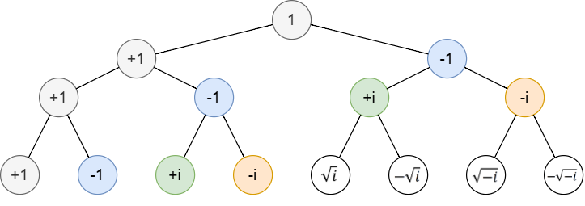
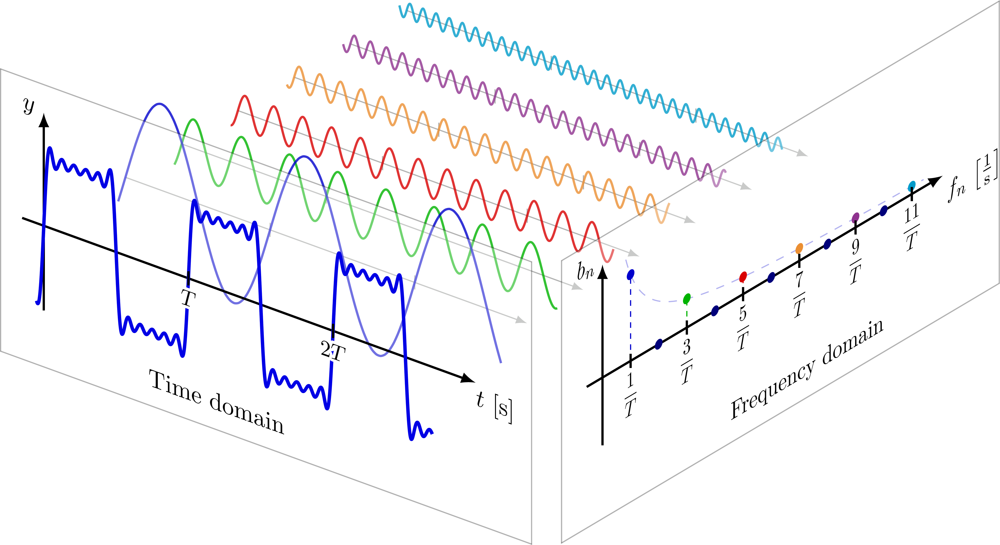

# Lecture 5: FFT，高斯消元与LU分解

## 多项式乘法

考虑一个多项式乘法任务：给定两个系数最多为 $n$ 次的多项式 $p(x), q(x)$，求 $r(x) = p(x) \cdot q(x)$

通常，我们已知的是两个多项式的系数，对系数进行乘积计算，朴素的时间复杂度为 $O(n^{2})$

如果，我们得到的是两个多项式在 $n+1$ 个 $x$ 取值对应的点对 $(x_{i}, p(x_i), q(x_i))$，那么利用多项式插值的唯一性，我们可以计算出最多 $2n+1$ 个 $r(x)$ 上的点，从而唯一确定 $r(x)$，时间复杂度为 $O(n)$

可见，多项式的系数表示法和点值表示法对于多项式乘法的时间复杂度不同。我们希望借助点值表示法加速系数表示法下的多项式乘法，但朴素情况下，系数表示与点值表示之间的转换非常耗时（点值表示 → 系数表示需要解线性方程组，时间复杂度达到 $O(n^{3})$）

注意到点值选择是任意的 $n+1$ 个不同点，我们是否可以精心选择一些特殊的点，使得计算过程可以被压缩？

---

我们的想法是，已知 $p(x),q(x)$ 的系数不超过 $n$

- 令 $m \geq 2n+1$，选定 $x_{0}, \cdots, x_{m}$，计算 $p(x_{0}),\cdots, p(x_{m})$ 和 $q(x_{0}), \cdots, q(x_{m})$
    - 时间复杂度 $O((m+1)n) = O(n^2)$
- 计算这 $m$ 对 $r(x_{j}) = p(x_{j}) \cdot q(x_{j})$
    - 时间复杂度 $O(m) = O(n)$
- 对 $\lbrace r(x_{j}) \rbrace$ 插值，得到 $r(x) = p(x)q(x)$ 的系数
    - 拉格朗日插值时间复杂度 $O(m^{3}) = O(n^{3})$，牛顿法为 $O(m^{2}) = O(n^{2})$

看来时间瓶颈出现在第一步和第三步，有没有什么方法能够将这两步的时间复杂度下降到 $O(n\log n)$ 呢？

## 复数与单位根

一个复数在代数形式和极坐标形式下分别表示为 $z = a+bi = re^{i\theta}$

指定 $n$，我们定义关于 $z$ 的方程 $z^{n} = 1$ 的解集合为 $n$ 次单位根，比如：

- 2 次单位根为 $±1$
- 4 次单位根为 $±1,±i$

$n$ 个单位根在复平面单位圆上呈等距分布，更具体的，可以通过欧拉公式求解：

$$
e^{\frac{2\pi l}{n}i} = \cos\frac{2\pi l}{n} + i\sin\frac{2\pi l}{n}
$$

我们需要关注 $n=2^{k}$ 的情况，此时可以得出一个性质：

从上往下为 $2^{k}$ 次单位根的树形表示，注意到 $k>0$ 时：

- **如果 $x$ 是一个 $2^{k}$ 次单位根，则 $-x$ 也是一个 $2^{k}$ 次单位根（并且 $x, -x$ 是 $2^{k+1}$ 次单位根）**

## 傅里叶变换

我们需要从不同的视角理解傅里叶变换

### 离散傅里叶变换

我们先从最朴素的，多项式求值的定义理解：

???+ success "Definition: 离散傅里叶变换（Discrete Fourier Transform, DFT）"

    给定输入：多项式 $p(x)$ 的系数 $a_{0}, \cdots, a_{n-1}$（共 $n$ 项）
    
    输出：选定 $n$ 次单位根 $\omega = e^{2\pi i/n}$，计算 $p(\omega^0), p(\omega^1), \cdots, p(\omega^{n-1})$ 作为输出：$\lbrace(\omega^j, p(\omega^j))\rbrace_{j=0}^{n-1}$
    
    （这里给出的定义没有进行归一化，否则会将计算结果 $p(\omega^j)$ 除以 $\sqrt{n}$ 进行归一化）

我们用一个式子表示 DFT 的计算：

$$
p(\omega^{l}) = \sum_{j=0}^{n-1} a_{j} \omega^{lj}
$$

以及逆运算：

$$
a_{l} = \frac{1}{n} \sum_{j=0}^{n-1} p(\omega^{j}) \omega^{-lj}
$$

注意到，离散傅里叶变换及其逆变换，对应了多项式求值时的两步计算瓶颈过程。如果我们能结合 $2^{k}$ 次单位根的树形性质，写出更快的傅里叶变换，就能降低多项式求值的计算量。

### 快速傅里叶变换

首先，我们改写 $p(x)$。令：

- $E(x) = a_{0} + a_{2}x + a_{4}x^{2} + \cdots + a_{n-2}x^{\frac{n}{2}-1}$
- $O(x) = a_{1} + a_{3}x + a_{5}x^{2} + \cdots + a_{n-1}x^{\frac{n}{2}-1}$
    - 它们的系数都是确定的

得到 $p(x) = E(x^{2}) + xO(x^{2})$，同理，$p(-x) = E(x^{2}) - xO(x^{2})$

可见，只要计算 $E(x^{2}),O(x^{2})$，就可以通过一次加法、减法分别计算出 $p(x), p(-x)$ 的值。我们已经发现，如果 $x$ 是 $2^{k}$ 次单位根，则 $-x$ 也是 $2^{k}$ 次单位根，因此在这里对 $p(-x)$ 的计算也是必要的。

现在我们将对 $p(x)$ 与 $p(-x)$ 的计算转换成了两个新的问题：如何计算 $E(x^{2}), O(x^{2})$？比较显然的，如果 $x$ 是 $2^{k}$ 次单位根，则 $x^{2}$ 是 $2^{k-1}$ 次单位根。因此，我们可以继续分解问题，这个计算过程最终成为了一个递归的树结构（或者说，分治操作）。

我们直接给出 FFT 的伪代码：

???+ success "快速傅里叶变换"

    $$
    \begin{array}{l}
    \textbf{The fast Fourier transform (polynomial formulation)} \newline
    \hline
    \texttt{function FFT}(A, \omega) \newline
    \textbf{Input: } \text{Coefficient representation of a polynomial } A(x) \text{ of degree } \le n-1, \newline
    \phantom{\textbf{Input:}} \text{where } n \text{ is a power of 2; } \omega \text{, an } n\text{th root of unity} \newline
    \textbf{Output: } \text{Value representation } A(\omega^0), \dots, A(\omega^{n-1}) \newline
    \newline
    \textbf{if } \omega = 1 \textbf{: return } A(1) \newline
    \text{express } A(x) \text{ in the form } A_e(x^2) + x A_o(x^2) \newline
    \textbf{call } \text{FFT}(A_e, \omega^2) \text{ to evaluate } A_e \text{ at even powers of } \omega \newline
    \textbf{call } \text{FFT}(A_o, \omega^2) \text{ to evaluate } A_o \text{ at even powers of } \omega \newline
    \textbf{for } j = 0 \textbf{ to } n-1 \textbf{:} \newline
    \quad \text{compute } A(\omega^j) = A_e(\omega^{2j}) + \omega^j A_o(\omega^{2j}) \newline \newline
    \textbf{return } A(\omega^0), \dots, A(\omega^{n-1})
    \end{array}
    $$

简单来说，我们递归分解多项式计算出各个 $E(x^k), O(x^k)$ 的值，然后借助 $p(x) = E(x^{2}) + xO(x^{2})$ 合并计算出 $p(x_{i})$ 的值。

能够证明，记 $T(n)$ 为 $n$ 阶 FFT 需要的操作次数，则 $T(n) = 2T\left( \dfrac{n}{2} \right) + C_n$（其中 $C_n$ 是与阶数相关的常数），最终可以计算证明：$T(n) = O (n\log n)$。

---

我们记 DFT 的计算结果 $p(\omega^{l}) = \sum_{j=0}^{n-1} a_{j} \omega^{lj}$，对应的逆运算 $a_{l} = \frac{1}{n} \sum_{j=0}^{n-1} p(\omega^{j}) \omega^{-lj}$，

区别在于把 $\omega \to \omega^{-1}$，且系数多了 $\frac{1}{n}$。

逆 FFT 只要在 FFT 的基础上，修改上述两处内容即可。

### 矩阵表达形式

傅里叶变换的意义不局限于多项式求值

离散傅里叶变换（DFT）的本质是一个矩阵 × 向量的乘法：给定系数向量 $\mathbf{a} = (a_{0}, \cdots, a_{n-1})^{T}$，有

$$
\begin{pmatrix}
\omega^{0\cdot 0} & \omega^{0\cdot 1} & \cdots & \omega^{0\cdot (n-1)} \newline
\omega^{1\cdot 0} & \omega^{1\cdot 1} & \cdots & \omega^{1\cdot (n-1)} \newline
\vdots & \vdots & \ddots & \vdots \newline
\omega^{(n-1)\cdot 0} & \omega^{(n-1)\cdot 1} & \cdots & \omega^{(n-1)\cdot (n-1)}
\end{pmatrix}
\begin{pmatrix}
a_0 \newline
a_1 \newline
\vdots \newline
a_{n-1}
\end{pmatrix}
=
\begin{pmatrix}
p(\omega^0) \newline
p(\omega^1) \newline
\vdots \newline
p(\omega^{n-1})
\end{pmatrix}
$$

我们记最左侧的单位根矩阵为 $\mathbf{F}_n$

对应的逆变换：

$$
\frac{1}{n}
\begin{pmatrix}
\omega^{-0\cdot 0} & \omega^{-0\cdot 1} & \cdots & \omega^{-0\cdot (n-1)} \newline
\omega^{-1\cdot 0} & \omega^{-1\cdot 1} & \cdots & \omega^{-1\cdot (n-1)} \newline
\vdots & \vdots & \ddots & \vdots \newline
\omega^{-(n-1)\cdot 0} & \omega^{-(n-1)\cdot 1} & \cdots & \omega^{-(n-1)\cdot (n-1)}
\end{pmatrix}
\begin{pmatrix}
p(\omega^0) \newline
p(\omega^1) \newline
\vdots \newline
p(\omega^{n-1})
\end{pmatrix}
=
\begin{pmatrix}
a_0 \newline
a_1 \newline
\vdots \newline
a_{n-1}
\end{pmatrix}
$$

可能现在看着还是有点晕，我们从应用的角度观察傅里叶变换

### 信号的傅里叶变换

注意到一个空间直角坐标系，我们可以将任意向量按照三个正交基向量进行唯一分解，分解方式为基向量点积投影

> 课本采用的是实形式基底，这里采用复数形式基底，基函数使用 $e^{ikx} = \cos(kx) + i \sin (kx)$，而不是单独的 $\cos(kx)$ 与 $\sin (kx)$

对于 $n$ 维复数空间，我们也可以找出这样的正交基向量：

$$
\phi_{k} = (1, w^{k}, \cdots, w^{(n-1)k})
$$

???+ question "证明 $\phi_{k}$ 构成 $\mathbb{C}^{n}$ 的一组正交基"

    定义复数空间的标准内积计算为 $\langle \mathbf{u}, \mathbf{v} \rangle = \sum_{j=0}^{n-1} u_{i}\overline{v_{j}}$，注意对 $v_{j}$ 取共轭

    计算任意两个不同的 $\phi_{k}, \phi_{m}$ 的内积（$k \ne m$）：
    
    $$
    \langle \phi_{k}, \phi_{m} \rangle = \sum_{j=0}^{n-1} w^{kj}\overline{w^{mj}}
    $$

    根据 $w = e^{2\pi i/n}$ 的定义，容易得到 $\overline{w} = w^{-1}$，代入得
    
    $$
    \langle \phi_{k}, \phi_{m} \rangle = \sum_{j=0}^{n-1} w^{(k-m)j}
    $$
    
    我们对该式进行等比数列求和：
    
    $$
    \sum_{j=0}^{n-1} w^{(k-m)j} = \dfrac{1-(w^{k-m})^{n}}{1-w^{k-m}} = \dfrac{1-(w^{n})^{k-m}}{1-w^{k-m}} = \dfrac{1-1}{1-w^{k-m}} = 0
    $$

    因此
    
    $$
    \langle \phi_{k}, \phi_{m} \rangle = 0
    $$
    
    因此正交性成立。在此基础上，证明线性无关性
    
    反设存在系数 $c_{0}, \cdots , c_{n-1}$ 使得 $\sum_{i=0}^{n-1} c_{i}\phi_{i} = \mathbf{0}$，则对任意 $m$：
    
    $$
    \left \langle \sum_{i=0}^{n-1} c_{i}\phi_{i}, \phi_{m} \right \rangle = \left \langle \mathbf{0}, \phi_{m} \right \rangle = 0
    $$
    
    根据正交性
    
    $$
    \left \langle \sum_{i=0}^{n-1} c_{i}\phi_{i}, \phi_{m} \right \rangle = c_{m} \cdot n
    $$
    
    也等于零，因此 $c_{m} = 0$
    
    因此 $c_{0}, \cdots , c_{n-1}$ 都只能为零，这 $n$ 个向量线性无关
    
    因此 $\phi_{k}$ 构成 $\mathbb{C}^{n}$ 的一组正交基

在此基础上，我们重写单位根矩阵 $\mathbf{F}_n$

$$
\mathbf{F}_n =
\begin{pmatrix}
\phi_0 \newline
\phi_1 \newline
\phi_2 \newline
\vdots \newline
\phi_{n-1}
\end{pmatrix}
$$

原 DFT 可以重新写为

$$
\begin{pmatrix}
\phi_0 \newline
\phi_1 \newline
\vdots \newline
\phi_{n-1}
\end{pmatrix}
\mathbf{a}
=
\begin{pmatrix}
p(\omega^0) \newline
p(\omega^1) \newline
\vdots \newline
p(\omega^{n-1})
\end{pmatrix}
$$

再结合这种写法：

$$
p(\omega^{l}) = \sum_{j=0}^{n-1} a_{j} \omega^{lj}
$$

我们发现，DFT 操作相当于把原始的向量 $\mathbf{a}$，同时向 $\lbrace \overline{\phi_{k} }\rbrace$ 这 $n$ 个正交基向量做投影，得到 $p(w^{k})$ 这样的分量坐标

这样做有什么作用？注意到

- $\lbrace \overline{\phi_{k} }\rbrace$ 是正交的
- FFT 算法可逆（IFFT）

因此我们可以将一个复杂的 $\mathbf{a}$，**唯一，可逆性地**投影到 $n$ 个成分已知的基向量上。这就是信号的傅里叶变换的基础：

> $\phi_k$ 的一个本质是频率为 $k$ 的复正弦波在 $n$ 个等分点的采样值
>
> $\mathbf{F}_n$ 相当于对 $\mathbf{a}$ 进行不同频率上的分量探测
>
> 对于一个复杂的信号 $\mathbf{a}$，我们需要将其分解为不同频率的常见波形相叠加，而 FFT 算法就在进行这样的一个操作：
>
> 

### 正交基与最小二乘拟合

之前我们提到过最小二乘法，现在我们有近似的问题：

> 已知 $2m$ 个数据点 $(x_j, y_j)$，其中 $x_j$ 等距分布在 $[-\pi, \pi]$ 上，想用一组**<u>三角函数的线性组合</u>**去逼近这些数据：
>
> $$
> y_j \approx \frac{a_0}{2} + a_n \cos(n x_j) + \sum_{k=1}^{n-1} \big( a_k \cos(k x_j) + b_k \sin(k x_j) \big)
> $$
>
> 找最优的系数 $\{a_k, b_k\}$，使得误差的平方和最小。

一般的最小二乘法，求系数需要解一个法线方程，通常是一个难以求算的稠密方程组。但这里的基函数在给定的 $2m$ 个采样点上两两正交，导致法方程矩阵变成了对角矩阵——每个系数可以直接用一个显式公式算出来，不需要解联立方程组

我们显式给出解：

$$
a_k = \frac{1}{m} \sum_{j=0}^{2m-1} y_j \cos(k x_j)
\newline
b_k = \frac{1}{m} \sum_{j=0}^{2m-1} y_j \sin(k x_j)
$$

回忆一下 DFT 的第 $k$ 个分量：$\displaystyle \sum_{j=0}^{n-1} y_j \cdot e^{i k x_j} = \sum y_j \cos(k x_j) + i \sum y_j \sin(k x_j)$

$a_k$ 和 $b_k$ 的计算结果，对应 DFT 结果的实部和虚部，只相差常数因子 $1/m$

我们利用正交基的性质简化了这一运算，同时你会发现这个问题就是信号傅里叶变换本身在做的事情

---

## 求解线性方程组与 LU 分解

考虑经典的解线性方程组问题

$$
A\mathbf{x} = \mathbf{b}
$$

现在假定 $\mathbf{b}$ 是定值，常见的手算方法是高斯消元法：通过（本质上）两种初等行变换，把增广矩阵 $(A|\mathbf{b})$ 变成上三角矩阵：

- 交换某两行
- 某行变为自身的非零倍数加上另一行的（可为 0）倍数

得到的上三角矩阵进行回代求解

注意到我们把增广矩阵 $(A|\mathbf{b})$ 变成上三角矩阵，这意味着不同的 $\mathbf{b}$ 会直接影响整个计算过程，导致对于相同的 $A$，不同的 $\mathbf{b}$，高斯消元计算只能重复进行

因此，我们引入 LU 分解：

$$
A = LU
$$

满足 $L$ 为单位下三角矩阵（对角线元素为 1），$U$ 为上三角矩阵

事实上，高斯变换的过程本身就是 LU 分解的一种：

- 变换的最终结果为 $U$
- 变换的过程（某行的常数倍数加上另一行的倍数）可以看做一系列左乘矩阵，这些矩阵都是单位下三角矩阵（记为 $E_{i}$），而多个单位下三角矩阵的乘积依旧是单位下三角矩阵
- 因此 $A = (E_{k} \cdots E_{1})^{-1} U$
- 我们记 $L = (E_{k} \cdots E_{1})^{-1}$，$L$ 依旧是单位下三角矩阵

注意到，单纯的 LU 分解有一定限制，其存在且唯一的充要条件是：$A$ 的所有顺序主子式不为零。否则，消元过程中的主元 $a_{kk}^{(k-1)}$（等价为第 $k$ 个顺序主子式与第 $k-1$ 个顺序主子式的比值）会出现 0，导致无法继续消元，比如：

$$
\begin{pmatrix}
0 & 1 \newline
1 & 1
\end{pmatrix}
$$

此时我们需要引入行交换，使得：

$$
PA=LU
$$

为我们实际计算的分解
