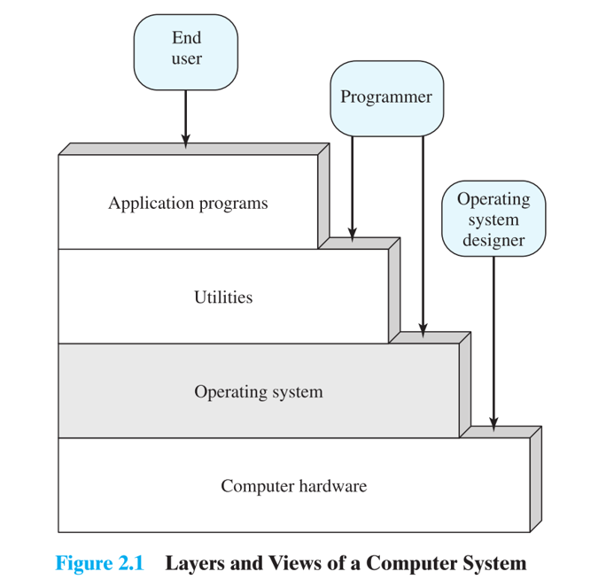
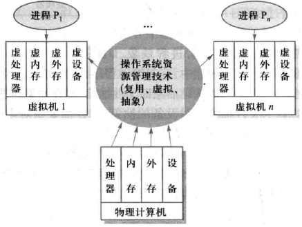
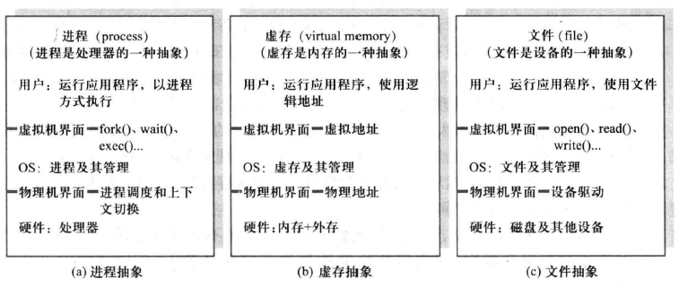
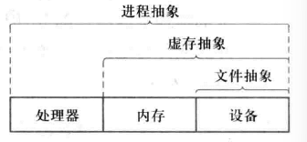
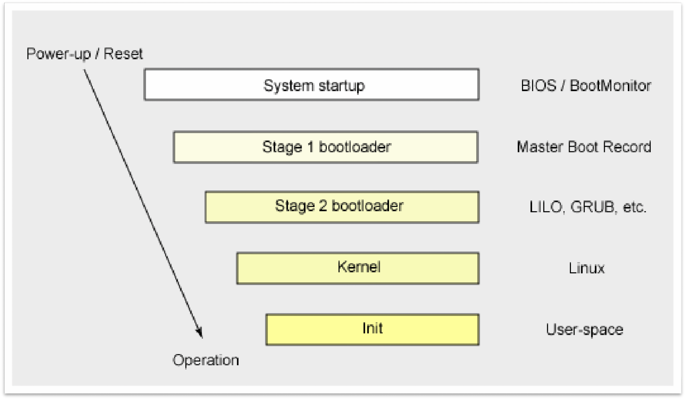
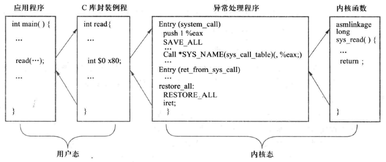
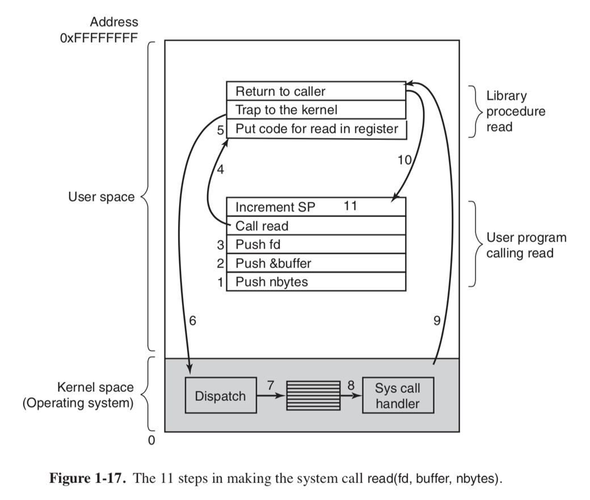

# Ch1. 概论

> 其实计算机系统基础全部学过？

## 操作系统概述

计算机系统通常自底向上包括：

- 硬件层（CPU、存储、I/O 设备）
- 操作系统层（操作系统软件）
- 支撑程序层（开发用软件）
- 用户层（终端用户使用的软件）

操作系统是介于用户界面和硬件层之间的，处于内核态下的程序

- <u>一方面，操作系统自顶向下为应用开发人员提供简洁易用的资源抽象（系统调用服务）</u>
- <u>另一方面，自底向上管理种类繁多、纷繁复杂的硬件资源（资源管理能力）</u>

从更具体的角度来说，资源管理、进程调度、接口提供，是操作系统的主要功能

## 操作系统特征

- **并发性**：指两个或两个以上的事件或活动在<u>同一时间间隔内</u>发生
    - 微观层面上，在这个时间间隔内，事件/活动是轮转进行的
    - （并行性指两个或两个以上事件或活动在<u>同一时刻</u>发生）
- **共享性**：指系统中的资源可被多个并发执行的任务（作业）所使用
    - 互斥访问 or 同时访问
- **异步性**：多道程序执行时，每个任务的推进速度和被中断时机是随机的、不可预测的，但操作系统必须通过同步机制保证最终结果的正确性
- **虚拟性**：指操作系统中的一种管理技术，将物理上的一个实体变成逻辑上的多个对应物，或把物理上的多个实体变成逻辑上的一个对应物的技术（比如虚拟内存）

## 资源分配

计算机系统的物理资源可以分为两类：计算/存储类、接口类。操作系统通过一些管理技术控制软硬件资源的分配，最终体现为“应用程序的虚拟机”：

- 复用

操作系统让多个进程共享物理资源，通过两种方式进行复用：

1- 空分复用共享：把物理资源切成多份，让每个进程有独立的（虚拟）空间（因此说操作系统具有共享性）

2- 时分复用共享：CPU 将物理资源轮流给不同进程使用，分时共享（因此说操作系统具有并发性）

- 虚拟

虚拟化的本质是对资源的调用，把物理上的单个资源转变为计算机逻辑上的多个对应物（或者反过来），为上层的应用提供虚拟资源的“假象”。上层应用只需要自由地调用自己所被分配的虚拟资源即可，而调度虚拟资源对应的实际物理资源是操作系统需要调控的

- 抽象

鉴于 ICS 课上都学过了，这里丢两张图即可

基于上面的技术，我们开发出多道程序设计技术（将多个作业放入内存，同时启动运行，从微观上看其实是轮转进行），进而开发出分时交互系统

## BIOS + MBR 计算机引导过程（⭐）

直接交给 LLM 解释：

1. **Power-up / Reset（上电/复位）**
   计算机通电或复位后，CPU 从固定地址开始执行，进入固件阶段。
2. **System startup（系统启动）—— BIOS / BootMonitor**
   <u>最先运行的程序称为 BIOS（Basic Input/Output System）</u>，其首先进行硬件初始化和 POST（加电开机自检），然后扫描可引导设备（如硬盘），按照用户设定的启动顺序 ，依次尝试每个可引导设备的<u>第 0 扇区（主引导记录，MBR，512 字节）</u>，直到找到第一个有效的 MBR 为止。
3. **Stage 1 bootloader（第一阶段引导程序）—— Master Boot Record**
   BIOS 将 MBR 加载到内存并执行。<u>MBR 包含分区表和极小的 Stage 1 引导代码</u>，其唯一任务是定位并加载位于磁盘其他位置的 Stage 2 bootloader（包含操作系统的活动分区）。
4. **Stage 2 bootloader（第二阶段引导程序）—— LILO、GRUB 等**
   Stage 2 引导程序（如 GRUB、LILO）被加载到内存。它能识别文件系统，读取配置文件（例如 `/boot/grub/grub.cfg`），然后<u>加载操作系统内核镜像</u>。
5. **Kernel（内核）—— Linux**
   Stage 2 将内核解压并加载到内存，传递启动参数，随后将控制权交给内核。内核初始化硬件、挂载根文件系统。（<u>内核初始化工作</u>）
6. **Init（初始化进程）—— User-space（用户空间）**
   内核启动第一个用户态进程（通常是 `/sbin/init` 或 systemd，即初始化用户空间），进入用户空间，开始运行系统服务、启动图形界面等，最终系统进入可用状态（Operation）。

## Linux 系统调用（⭐）

??? abstract "稍微具体一点的，系统调用的执行过程，以 `read()` 系统函数为例"

    1. 用户程序调用 `read()`，实际上调用的是 glibc 库提供的包装函数
    2. `read()` 函数构造相关参数，调用 `int 0x80` 触发软中断，进入内核态
        1. 系统调用号存入 `%eax` 寄存器
        2. 最多6个参数依次存入 `%ebx`, `%ecx`, `%edx`, `%esi`, `%edi`, `%ebp`（IA-32）
        3. 此时进行权限检查，要求 CPL ≤ DPL
    3. 内核模式中，保存用户态上下文（如 SS, ESP, EFLAGS, CS, EIP）到内核栈，然后 CPU 跳转到中断向量 `0x80` 对应的 `system_call` 入口，根据 `%eax` 中的调用号，在 `sys_call_table` 中查找对应内核函数并执行（`sys_read`）
    4. 内核函数完成后，将返回值放入 `%eax`，执行 `iret` 恢复用户态上下文，返回用户程序继续执行

简单来说就是：

- 执行到相关用户语句
    - 转入库函数执行
    - 库函数调用系统调用封装函数
        - 封装函数将参数送入指定寄存器，自陷指令进入内核态
            - 调用 `system_call`，该函数根据系统调用号转到系统调用服务例程
            - `system_call` 运行结束后将返回值放在 `%eax` 后，`iret` 逐步返回

---

库函数的优点包括：

- 增强可移植性（对不同操作系统的接口与实现机型差异化封装，提供统一编程接口）
- 提高安全性稳定性（在系统调用前可以做额外检查）
- 可读性更高

直接进行系统调用的优点包括：

- 提高程序的执行效率（减少函数调用的开销）

## 操作系统分类（⭐）

操作系统按照功能与使用方式分为三类：

- 批处理操作系统：将一批作业集中输入，由系统自动依次处理，运行期间用户无法干预。主要用于早期大型计算机，特点是吞吐量大、资源利用率高，但无交互性（脱机工作）
- 分时操作系统：将 CPU 时间划分为很短的时间片，轮流分配给多个用户的任务，使每个用户都能通过终端与系统交互。特点是：
    - 同时性（多个用户同时工作）【系统资源分配】
    - 独立性（每个用户相对独立）【系统隔离保护】
    - 及时性（快速响应用户的请求）【系统调度策略】
        - 交互性（最终实现联机工作，像对话一样工作）【用户工作模式】

    其核心机制是时钟中断 + 时间片轮转

- 实时操作系统：必须在一个事先定义好的时间限制内，对外部或内部的事件进行响应和处理。特点是高可靠性和确定性，强调及时响应而非高吞吐量。

??? abstract "批处理操作系统与分时操作系统的核心区别"

    | 对比维度       | 批处理操作系统                                         | 分时操作系统                                                 |
    | :------------- | :----------------------------------------------------- | :----------------------------------------------------------- |
    | **工作方式**   | 作业成批输入，系统依次自动处理，**脱机**运行           | 多个用户通过终端同时联机，CPU时间片轮流分配，**联机**交互    |
    | **交互性**     | **无交互**，用户提交后无法干预作业执行                 | **强交互**，用户能与系统实时对话、调试、修改程序             |
    | **响应时间**   | 无严格响应要求，作业周转时间长（可能数小时甚至数天）   | **及时性**要求高，通常在秒级或毫秒级内响应用户请求           |
    | **用户干预**   | 用户**完全无法干预**，作业执行期间不可暂停、修改或终止 | 用户可随时通过终端发出命令，系统立即响应，**可控制任务状态** |
    | **资源利用率** | **高**，CPU空闲时间少，适合大批量计算任务              | 相对**较低**，频繁的上下文切换和终端I/O会引入额外开销        |
    | **关键机制**   | 作业控制语言 + 批处理监控程序                          | 时钟中断 + 时间片轮转调度                                    |

如果按照运行的硬件平台分类，常见的操作系统都是微机操作系统，此外还有并行操作系统（如 MACH），嵌入式操作系统，网络操作系统（如 Unix，Windows NT），分布式操作系统

## 多道批处理系统 CPU 利用率计算（⭐）

假如一道程序在任意时刻，要么在使用 CPU 计算，要么在等待 I/O 操作完成，其中等待 I/O 操作的时间占其运行时间的比例为 $p$

**当内存中有 $n$ 道程序时，所有程序都等待 I/O 的概率是 $p^n$（即 CPU 空闲），那么 CPU 利用率 $=1-p^n$**

这就是为什么对于早期的多道批处理系统，多道程序能提高 CPU 利用率
