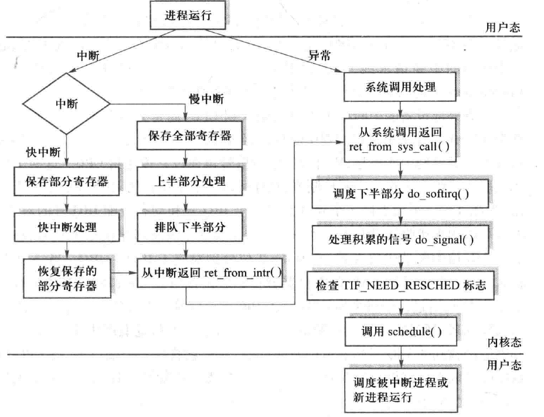
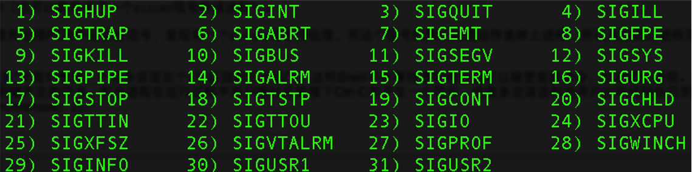
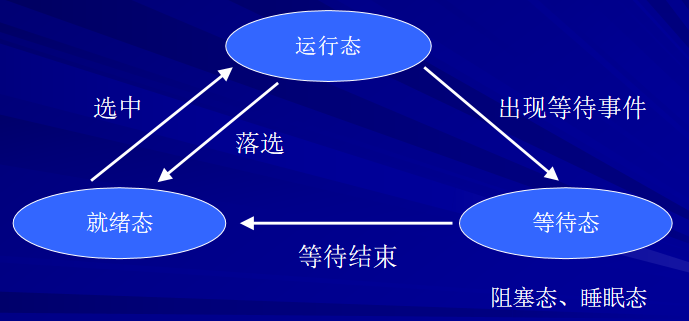
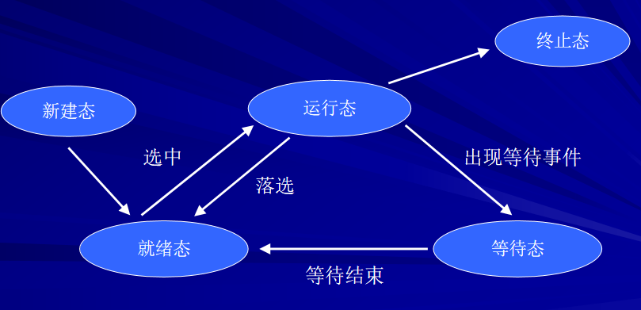
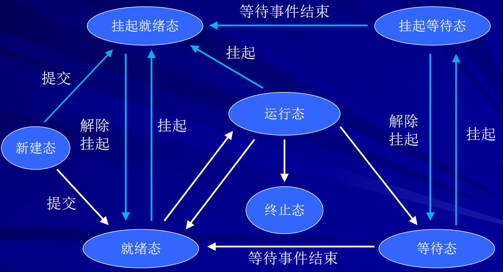
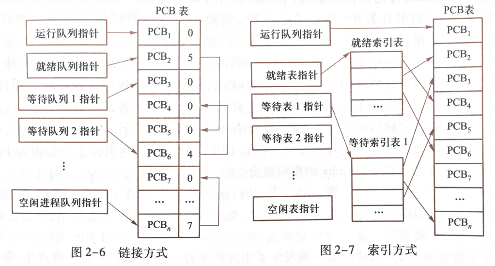
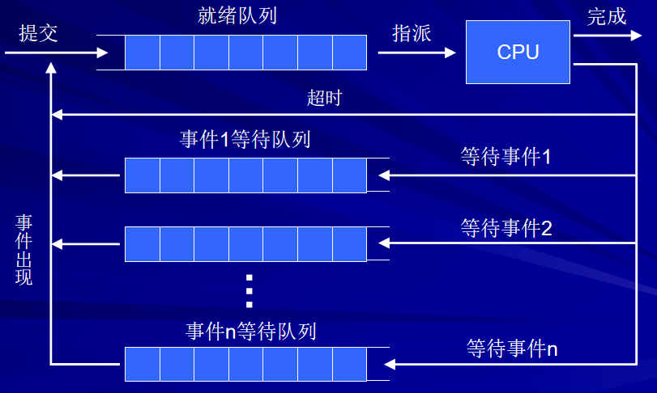

# Ch2. 处理器管理

## 程序状态字

操作系统将程序运行时的动态信息汇集在一起，称之为程序状态字（Program Status Word, PSW），通常存放在处理器中的特殊寄存器中

### 纯硬件视角

先从更熟悉的（但不严谨的）硬件角度来解释：以 Intel x86 机器为例，PSW 的硬件实现为状态标志寄存器 EFLAGS 与指令指针寄存器 EIP 的组合，并将 EFLAGS 的低 16 位称为 FLAGS。EIP 就不需要解释了，其存储下一条将要执行的指令在内存中的地址

EFLAGS 内容略，去看《计算机系统基础》

### 操作系统视角

PSW 通常包含这些信息：

- 程序计数器（PC，在 x86 架构中就是 EIP / RIP）
- 标志位（对应了标志寄存器的状态标志位）
- 中断屏蔽位（对应了 IF）
- 特权级（对应了 IOPL）
- 以及一些其他的奇奇怪怪的信息，大多数的硬件实现都是标志寄存器

多数计算机的处理器现场可能找不到一个具体的 PSW 寄存器，但是总会有一组控制寄存器和状态寄存器起实际的作用

## 中断（⭐）

> 《计算机系统基础》课程中，异常和中断是区分开的；而这门课程中，两者统称为中断，其中异常称之为内中断，与之相对的（更狭义的中断）称为外中断

中断的定义就略过了

### 分类

- 外部中断（时钟中断，I/O 中断，电源故障中断）
    - 都是和外部设备相关的
- 内部中断 / 异常（缺页、地址越界、除零）
    - 内部问题

- 主动性中断（系统调用，执行访管指令）
    - “系统调用”是功能接口（逻辑概念），“访管指令”是实现这个接口的硬件机制（物理指令）


### 过程

迄今为止，所有计算机系统都采用硬件中断装置+软件中断处理程序，分为四个步骤：

- 硬件发现中断源
- 硬件保护现场
- 软件执行处理程序（进一步保护现场，执行处理代码，可能涉及调度，最后恢复一部分现场）
- 硬件恢复现场

### 多中断处理

同时有多个中断事件发生时，中断装置按一定顺序对其作出响应。我们给出多个中断的处理逻辑：

首先，需要满足一个基本原则：

- 在响应高优先级的中断响应过程中，屏蔽低优先级的中断
    - 一个典型顺序是：机器故障中断 > 程序性中断 > 时钟中断 > 高速设备中断 > 低速设备中断
    - 特例：“自愿访管中断”这种优先级低，但是不可被屏蔽的中断，CPU 会始终优先处理

据此，<u>针对不同的具体场景</u>，操作系统会采取不同策略：

- 串行处理（关中断）：即在当前中断处理程序尚未执行完毕时，屏蔽绝大多数中断
- 嵌套处理（开中断）：即在当前中断处理程序尚未执行完毕时，允许（更高优先级）中断打断过程，保存现场后嵌套执行新的中断
- 即时处理：主要针对中断处理程序执行过程中发生的程序性中断，这意味着中断处理程序本身很可能有 Bug，或者需要额外服务调用

### 快中断与慢中断

由操作系统开发者根据中断处理程序的执行时间和响应要求进行的软件层面的中断划分

| 对比维度       | 快中断                       | 慢中断                                               |
| :------------- | :--------------------------- | :--------------------------------------------------- |
| 寄存器保存范围 | 仅保存会被内核使用的寄存器   | 保存所有寄存器的值                                   |
| 中断处理       | 串行处理                     | 嵌套处理                                             |
| 返回行为       | 通常返回被中断的进程继续执行 | 通常不直接返回，而是转而执行调度程序（可能切换进程） |

时钟中断，键鼠外设中断，电源故障中断一般是快中断

硬盘中断，串口中断一般是慢中断

网卡中断可能分过程被拆分为上半部的快中断和下半部的慢中断

### Linux 中断处理



??? abstract "给一个 DeepSeek 的简述"

    按照图表从上到下的顺序，可以从以下三个核心阶段来详细讲解 Linux 中断处理过程：
    
    1. 中断的入口与分流（图表左半部分）
    
    当 CPU 处于 **用户态** 运行时，硬件产生中断，CPU 会立即陷入 **内核态**。根据中断类型的紧急程度，流程被分为了两支：
    
    - **快中断（左路）：** 这种中断处理要求极快的响应速度。内核**仅保存部分寄存器**，立即执行“快中断处理”以最快速度回应硬件。完成后直接恢复部分寄存器，准备返回。
    - **慢中断/常规中断（中路）：** 这是绝大多数外设（如网卡、硬盘）中断的处理方式。
      - **保存全部寄存器**：因为这里要做比较复杂的工作，必须完整保存当前进程的上下文。
      - **上半部分处理**：直接封锁当前中断，快速完成非常必要、与硬件紧密相关的操作（比如确认中断、清除中断标志、拷贝数据到内存等）。
      - **排队下半部分**：将耗时的、不紧急的工作（比如数据包协议栈处理）挂载到“下半部分”队列中，**以便尽快释放 CPU 资源**，让系统能响应新的中断。处理完后，进入统一的“从中断返回”。
    
    2. 异常/系统调用的路径（图表右半部分）
    
    除了硬件中断，图中右侧的 **异常** 路径（包含**系统调用**）也会触发内核态操作。这与中断一样，系统调用处理完成后，会从“系统调用返回” (`ret_from_sys_call()`) 开始退出内核。
    
    3. 通用的“返回用户态”处理路径（图表下半部分）
    
    这是整张图最精彩、最精华的部分。无论是从**中断**返回 (`ret_from_intr`) 还是从**系统调用**返回 (`ret_from_sys_call`) ，内核都**不会立即返回用户态**，而是**切换到一个统一的内核“大扫除”和调度流程**：
    
    - **调度下半部分 (`do_softirq()`)：** 处理之前“慢中断”排队下来的下半部分任务（软中断/SoftIRQ/Tasklet等）。
    - **处理积累的信号 (`do_signal()`)：** 检查当前进程是否收到了信号（例如 `kill -9` 或用户按了 Ctrl+C），进行信号分发和处理。
    - **检查调度标志和进程切换 (`check TIF_NEED_RESCHED` -> `schedule()`)：**
      - **TIF_NEED_RESCHED** 是一个标志位。当定时器中断发现当前进程时间片用完，或者其他高优先级进程被唤醒时，就会设置这个标志。
      - 一旦这个标志被设置，内核就会调用 **`schedule()`**函数。这里将**真正发生进程切换**：当前进程被挂起，CPU 会执行另一个被选中的进程。
    
    4. 返回用户态（图表最底部）
    
    当 `schedule()` 返回，或者不需要调度时，CPU 才会最终带着上下文，返回到用户态，恢复**调度被中断进程或新进程运行**。
    
    ------
    
    💡 总结（核心理解）：
    
    这张图揭示了 Linux 高性能中断处理的秘诀：**“先快速处理硬件，再慢慢处理软件；返回到用户态之前，顺便把调度和信号处理干了。”**
    它通过“上半部分+下半部分”的分离机制，保证了系统可以瞬间响应密集的硬件中断，同时把慢速的数据处理留到软中断中完成，最后在返回用户态的路口统一检查是否需要切换进程，极大地提升了系统的并发能力和响应速度。

### 信号机制

一种模拟硬件的软件中断，用于内核向进程通知异常，或进程间通信发送某个事件（比如：`Ctrl+C` 触发SIGINT，执行段越界的程序触发 SIGSEGV）

中断 / 异常是信号产生的源头之一

图中是 POSIX 定义的信号类型



## 进程（⭐）

如果一个程序只有代码部分（代码段是纯代码，不包含任何变量或数据区），调用方自己提供工作区，可以同时被多个程序调用，那么这个程序就是可再入（reentrant）程序。对于可再入程序的多次运行，难以用程序本身来标识“多次运行”

因此引入进程的概念

> 进程（process）是一个可并发执行的具有独立功能的程序关于某个数据集合的一次执行过程，也是操作系统进行资源分配和保护的基本单位

### 状态模型

我们给出操作系统进程状态的最基础的模型



- **运行态**：进程当前占有 CPU，正在执行指令
- **就绪态**：进程已经准备好运行（所需资源都已分配），排队等待被操作系统调度选中
- **等待态**：进程因自身主动请求而暂停（比如正在等待用户输入），即使有空闲的 CPU 也无法运行

更具体地，考虑进程的新建与终止，可以进一步扩充模型



现代操作系统因为内存受限，需要把暂时不运行的进程 Swap out 到外存上，腾出内存空间。我们将被挂起的进程的状态称为**挂起态**，相应地将其分为**挂起就绪态**和**挂起等待态**

> “挂起”代表进程所在位置是外存，而不是内存；挂起进程在进入运行态之前，必须先解除挂起进入就绪态；或者，从挂起等待态回到等待态

具体的逻辑可以参考下面的完整七态模型图



我们用这张图进行一定的总结：

- 当某个进程的时间片用尽时 / 被抢占时，进程从运行态进入就绪态
- 当某个进程需要等待 I/O 任务 / 信号等时，进程从运行态进入等待态
- 为了提高资源利用率，当内存资源不能满足进程的运行需求时，进程会进入对应的挂起态（特别的，运行态的程序只会进入挂起就绪态）

### 静态组成

一个进程由**代码块、数据块和进程控制块（PCB）** 组成

- 代码块：完全静态的，可重入的程序代码
- 数据块：进程私有的数据空间，也包含用户栈
- 进程控制块：进程存在的唯一标志，包含管理进程所需要的全部信息，包含了：
    - 标识信息（进程的 PID 等）
    - 现场信息（进程暂停时，CPU 中的所有寄存器的值，包括 PSW）
    - 控制信息（进程的当前状态，优先级，调度信息，资源清单）

- 内核栈是进程进入内核态时使用的栈。用来保存中断/异常现场。可以单独归类，也可以不严格地归类为 PCB 的现场信息

**每个进程都有唯一的 PCB，并捆绑唯一的内核栈（属于 PCB），一一对应，生命周期同步**

我们给出一个简化实现

```c
struct TrapFrame {
    uint32_t edi, esi, ebp, esp, ebx, edx, ecx, eax;
    uint32_t eip;
    uint16_t cs, ds, es, fs, gs;
    uint32_t eflags;
};

enum ProcessState {
    STATE_UNUSED,
    STATE_READY,
    STATE_RUNNING,
    STATE_BLOCKED
};

struct PCB {
    // ===== 1. 标识信息 =====
    int pid;           	            // 进程标识符
    int ppid;                       // 父进程标识符

    // ===== 2. 现场信息 =====
    struct TrapFrame *tf;           // 指向内核栈中保存的 CPU 寄存器现场

    // ===== 3. 控制信息 =====
    enum ProcessState state;        // 进程当前状态
    int priority;                   // 进程优先级 (通常数值越大优先级越高)
    int time_slice;                 // 剩余时间片（用于时间片轮转）

    // ... ...
};
```

??? quote "以及一个真实的 Linux PCB 块"

    [去看源码罢](https://github.com/torvalds/linux/blob/70390501d1944d4e5b8f7352be180fceb3a44132/include/linux/sched.h#L820)

### 进程切换

进程切换只能在内核态完成，所以第一步一定是从用户态切换到内核态（即模式切换）

> 进程切换一定是先产生模式切换，而模式切换不一定导致进程切换
>
> 模式切换是由中断驱动的，在用户态和核心态之间切换的，通常更加频繁的操作

当发生进程切换时，操作系统要<u>保存当前进程的上下文到当前进程的 PCB</u> 中。接下来，操作系统通过某种调度算法，从就绪队列<u>中选择新的进程准备执行</u>，最后操作系统<u>从新进程的 PCB 中读取其上下文信息</u>，并将这些信息恢复到 CPU 的寄存器和相关的系统数据结构。新进程<u>从上次暂停的位置继续执行</u>

因此，我们可以将一个进程分解为两个侧面：

- 用户进程：在用户态执行的进程
- 系统进程：在内核态执行的进程

同一进程下的“用户进程”和“系统进程”并不是两个不同的进程，而是同一个进程在不同 CPU 状态下呈现出的两种身份。他们始终对应一个进程实体（共享 PCB）

### 进程队列

为了便于对进程进行管理，操作系统将处于同一状态的所有 PCB 链接在一起，这一数据结构称为进程队列。



如何调度这些进程？参考之后的调度算法部分，此处先放一个示意图



### 进程操作

进程操作是操作系统内核对进程生命周期进行控制的一套原语
