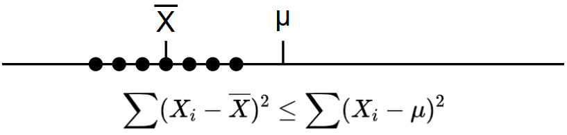

# 第七章 参数估计

利用样本构造合理的统计量对未知参数进行估计，这就是参数估计的主要任务

参数估计包含点估计与区间估计：

??? abstract "点估计"

    设总体的分布为 $F(x;\theta)$，其中 $\theta = (\theta_1, \theta_2, \cdots, \theta_{k})'$ 为 $k$ 维向量。我们根据样本 $X_1, X_2, \cdots, X_n$ 构造一个统计量 $\hat{\theta}(X_1, X_2, \cdots, X_n)$ 作为 $\theta$ 的估计，则称 $\hat{\theta}(X_1, X_2, \cdots, X_n)$ 为 $\theta$ 的估计量。如果 $x_1, x_2, \cdots, x_n$ 是一组样本观察值，代入 $\hat{\theta}$ 后得到的具体值 $\hat{\theta}(x_1, x_2, \cdots, x_n)$ 称为 $\theta$ 的估计值。这样的估计称为点估计。

??? abstract "区间估计"

    设总体的分布为 $F(x;\theta)$，其中 $\theta = (\theta_1, \theta_2, \cdots, \theta_{k})'$ 为 $k$ 维向量。我们根据样本 $X_1, X_2, \cdots, X_n$ 构造两个统计量 $\hat{\theta}_L(X_1, X_2, \cdots, X_n)$ 和 $\hat{\theta}_U(X_1, X_2, \cdots, X_n)$（$\hat{\theta}_L < \hat{\theta}_U$），并称随机区间 $[\hat{\theta}_L(X_1, X_2, \cdots, X_n), \hat{\theta}_U(X_1, X_2, \cdots, X_n)]$ 为 $\theta$ 的区间估计量（或置信区间），其中下标 $L$ 和 $U$ 分别表示“下界”和“上界”。
    
    如果事先给定一个较大的概率值 $1-\alpha$（称为置信水平或置信系数），使得
    
    $$
    P\left(\hat{\theta}_L \leq \theta \leq \hat{\theta}_U\right) = 1-\alpha
    $$
    
    对任意的 $\theta$ 都成立，则称 $[\hat{\theta}_L, \hat{\theta}_U]$ 为 $\theta$ 的 $1-\alpha$ 置信区间。
    
    当取得一组具体样本观察值 $x_1, x_2, \cdots, x_n$ 后，代入计算得到的具体数值区间 $[\hat{\theta}_L, \hat{\theta}_U]$ 称为 $\theta$ 的区间估计值（或具体的置信区间）。这时我们说：“在 $1-\alpha$ 置信水平下，参数 $\theta$ 落在区间 $[\hat{\theta}_L, \hat{\theta}_U]$ 内”。
    
    与点估计只给出一个数值不同，区间估计给出了一个范围，同时明确指出了这个范围覆盖真实参数值的可信程度（概率为 $1-\alpha$）。这种估计方法称为区间估计或置信区间估计。

首先我们给出两种点估计：

## 矩估计

矩估计的恩想方法是用样本矩去作为总体矩的估计。设参数 $\theta = (\theta_1, \theta_2, \cdots, \theta_{k})'$ 可表示为总体矩 $\mu_1, \mu_2 ,\cdots, \mu_k$ 的函数 $\theta_i = h_i(\mu_1, \mu_2 ,\cdots, \mu_k)$，以样本矩 $A_1, A_2 ,\cdots, A_k$ 代替总体矩 $\mu_1, \mu_2 ,\cdots, \mu_k$ 所得的估计量就是矩估计量

具体来说，我们先求出总体的各阶原点矩：

$$
\mu_i = E(X^i) = g_i(\theta_1,\cdots,\theta_k),\quad i = 1,2,\cdots,k
$$

解方程组得到：

$$
\theta_i = h_i(\mu_1,\cdots,\mu_k),\quad i = 1,2,\cdots,k
$$

样本矩替换总体矩得到矩估计：

$$
\theta_i = h_i(A_1,\cdots,A_k),\quad i = 1,2,\cdots,k
$$

根据大数定律，$A_j = \dfrac{1}{n} \displaystyle \sum _{i=1} ^{n} X_i^j \stackrel{P}{\longrightarrow} \mu_j,\quad j = 1,2,\cdots$

若 $h$ 为已知的连续函数，则 $h(A_1,A_2, \cdots, A_k) \stackrel{P}{\longrightarrow} h(\mu_1, \mu_2, \cdots , \mu_k)$，称之为**矩估计的相合性**

一个矩估计的例子：对于总体 $X \sim N (\mu, \sigma^2)$，$X_1, X_2, \cdots, X_n$ 是总体 $X$ 的一个样本，我们得到：

$$
EX = \mu = \mu_1 \\
DX = \sigma^2 = \mu_2 - \mu_1^2
$$

（$\sigma^2 = \mu_2 - \mu_1^2$ 对应的是 $DX=E(X^2) - (EX)^2$）

将样本矩 $A_1, A_2$ 代入得

$$
\hat{\mu} = A_1 = \overline{X} \\
\hat{\sigma^2} = A_2 - A_1^2 = \frac{1}{n} \left(\sum_{i=1}^{n} X_i^2 - n\overline{X}^2\right) = \frac{1}{n} \sum_{i=1}^{n} (X_i - \overline{X})^2
$$

也就是说：总体均值 $\mu$ 的矩估计是样本均值 $\overline{X}$；总体方差 $\sigma^2$ 的矩估计是样本二阶中心矩 $S^{\ast 2}$（不是样本方差 $S^2$）。注意上面的结论与总体分布无关，只要总体的一阶矩和二阶矩存在，上述结论就满足

!!! abstract ""

    总体均值 $\mu$ 的矩估计是样本均值 $\overline{X}$
    
    总体方差 $\sigma^2$ 的矩估计是样本二阶中心矩 $S^{\ast 2} = \frac{1}{n} \sum_{i=1}^{n} (X_i - \overline{X})^2$
    
    二维总体 $(X,Y)$ 相关系数 $\rho$ 的矩估计是样本相关系数 $r=\dfrac{S_{XY}}{S_{X}^{\ast}\cdot S_{Y}^{\ast}}$ 

在实际运用时，我们更倾向于使用阶数更低的样本矩，比如：$X_1, X_2, \cdots, X_n$ 是总体 $X \sim P(\lambda)$ 的一个样本，那么 $\lambda$ 的矩估计选用一阶矩对应的 $\overline{X}$，而不是样本二阶中心矩 $S^{\ast 2}$ （泊松分布的 $EX = DX = \lambda$）

 

## 极大似然估计

如果说矩估计是利用部分分布信息进行数字特征匹配，满足相合性，那么极大似然估计就是利用完整分布形式进行概率最大化的估计：在已有样本的基础上，要选择参数的一个合理的估计值，就是要使得参数在取该估计值时样本发生的可能性达到最大，这就是极大似然估计的思想方法。

设总体分布的密度函数为 $p(x;\theta)$，其中 $\theta$ 是未知参数。对于独立同分布样本 $(x_1,x_2,\cdots,x_n)$，定义似然函数：

$$
L(\theta) = \prod_{i=1}^n p(x_i;\theta)
$$

表示在参数 $\theta$ 下观测到当前样本的概率（概率密度乘积）

极大似然估计 $\hat{\theta}$ 就是使似然函数 $L(\theta)$ 达到最大值的参数：$\displaystyle \hat{\theta} = \arg \max_{\theta \in \Theta} L(\theta)$，记最大值点 $\hat{\theta}(x_1,x_2,\cdots,x_n)$ 为 $\theta$ 的极大似然估计值，$\hat{\theta}(X_1,X_2,\cdots,X_n)$ 为极大似然估计量

虽然可以直接求导计算 $L'(\theta) = 0$ 的解，但为了计算方便，通常取 $\ell (\theta) = \ln L(\theta)$，然后计算 $\ell '(\theta) = 0$ 的解，称

$$
\frac{\partial}{\partial\theta_j} \ell(\theta) = 0, \quad j = 1, 2, \dots, k
$$

为似然方程组（$k=1$ 时为似然方程）

由于考虑到总体的分布，极大似然估计通常比矩估计优良。但极大似然估计的计算较复杂，往往需要计算机才能得到近似解。另外，极大似然估计还具有一个优良的性质：**不变性原则**。设 $\hat{\theta}$ 是参数 $\theta$ 的极大似然估计，$\varphi(\theta)$ 有单值反函数（每个 $\varphi(\theta)$ 唯一对应一个 $\theta$），则 $\varphi(\hat{\theta})$ 是 $\varphi(\theta)$ 的极大似然估计，即：

$$
\widehat{\varphi(\theta)} = \varphi(\hat{\theta})
$$

!!! abstract ""

    如果 $\hat{\theta}$ 使 $L(\theta)$ 值最大，那么对于参数 $\eta = \varphi(\theta)$，由于一一对应关系，同样的 $\varphi(\hat{\theta})$ 也会使关于 $\eta$ 的似然函数最大

比如 $\sigma^2$ 的极大似然估计为 $S^{\ast 2}$，因为 $\varphi(\sigma) = \sigma^2(\sigma \geq 0)$ 有单值反函数，则 $\sigma$ 的极大似然估计为 $S^{\ast}$

 

## 估计量的评价标准

由不同的方法可以得到不同的参数估计，这里引入常用的三种标准，用于对估计量进行评价

### 无偏性

无偏性的实际意义是，用估计量 $\hat{\theta}$ 对未知参数 ${\theta}$ 进行估计，有时会高于 ${\theta}$，有时会低于 $\theta$，但平均来说它等于未知参数 $\theta$，也就是说没有系统误差。

设 $\hat{\theta}(X_1,X_2,\cdots,X_n)$ 为参数 $\theta$ 的一个估计量，如果：

$$
\forall \theta \in \Theta,\; E[\hat{\theta} (X_1,X_2,\cdots,X_n)] = \theta
$$

则 $\hat{\theta}$ 是 $\theta$ 的无偏估计量

!!! abstract ""

    比如 $k$ 阶样本原点矩 $A_k$ 是总体 $k$ 阶原点矩的无偏估计，样本方差 $S^2$ 是总体方差 $\sigma^2$ 的无偏估计
    
    样本二阶中心矩 $\displaystyle S^{\ast 2} = \frac{1}{n} \sum_{i=1}^{n} (X_i - \overline{X})^2$ 不是 $\sigma^2$ 的无偏估计，但是 $E(S^{\ast 2}) = \dfrac{n-1}{n} \sigma^2$ 在 $n \to \infty$ 时满足 $\dfrac{n-1}{n} \sigma^2 \to \sigma^2$，此时我们称 $S^{\ast 2}$ 为 $\sigma^2$ 的渐进无偏估计

!!! warning ""

    当 $\hat{\theta}$ 是 $\theta$ 的无偏估计，未必有 $g(\hat{\theta})$ 是 $g(\theta)$ 的无偏估计
    
    一个可能反直觉的例子：样本方差 $S^2$ 是总体方差 $\sigma^2$ 的无偏估计，但是样本标准差 $S$ 并不是总体标准差 $\sigma$ 的无偏估计：
    
    $$
    E[S] = E[\sqrt{S^2}] \leq \sqrt{E[S^2]} = \sigma
    $$
    
    $S$ 低估了 $\sigma$

 

### 均方误差准则

我们希望 $\hat{\theta} - \theta$ 差值越小越好，用 $E(\hat{\theta} - \theta)^2$ 衡量估计量 $\hat\theta$ 的好坏，称 $M(\hat{\theta},\theta) = E(\hat{\theta} - \theta)^2$ 为均方误差

根据均方误差准则，我们希望 $M(\hat{\theta},\theta)$ 越小越好。注意到：

$$
\begin{aligned}
M(\hat{\theta},\theta) &= E(\hat{\theta} - E\hat{\theta} + E\hat{\theta} - {\theta})^2 \\
&= D(\hat{\theta}) + (E\hat{\theta} - \theta)^2
\end{aligned}
$$

均方误差 $M(\hat{\theta},\theta)$ 被分为两部分： $\hat{\theta}$ 的方差与估计量偏差 $E\hat{\theta} - \theta$ 的平方。对于无偏估计，均方误差就是方差

 

### 一致性

无偏性与均方误差都是在样本量 $n$ 固定的前提下对估计量进行研究，有时我们也可以考虑当样本量 $n \to \infty$ 时估计量的性质。从直观上，当样本量越来越多时，样本中含有的关于未知参数的信息也越来越多，因此估计也应该越准确。也就是说，估计量应越来越接近于真实参数，这就是一致性的概念

设 $\hat{\theta}_n(X_1,X_2,\cdots,X_n)$ 为参数 $\theta$ 的一个估计量，如果：

$$
\forall \theta \in \Theta,\; \hat{\theta}_n\stackrel{P}{\longrightarrow} \theta
$$

则 $\hat{\theta}_n$ 是 $\theta$ 的已知估计量。

一致性是估计量的大样本性质，也称为相合性。矩估计往往具有相合性

 

## 区间估计

设 $\theta$ 是总体 $X$ 的未知参数，$X_1, X_2, \cdots, X_n$ 是来自总体 $X$ 的样本，如果事先给定一个概率常值 $1-\alpha$，存在两个统计量 $\hat{\theta}_1(X_1, X_2, \cdots, X_n)$ 和 $\hat{\theta}_2(X_1, X_2, \cdots, X_n)$（$\hat{\theta}_1 < \hat{\theta}_2)$，使得：

$$
P\left(\hat{\theta}_1 < \theta < \hat{\theta}_2\right) = 1-\alpha
$$

对任意的 $\theta$ 都成立，则称区间 $(\hat{\theta}_1, \hat{\theta}_2)$ 为 $\theta$ 的 $1-\alpha$ 置信区间，$\hat{\theta}_1, \hat{\theta}_2$ 分别称为置信下限和置信上限，$1-\alpha$ 称为置信度或置信系数

!!! abstract ""

    $P\left(\hat{\theta}_1 < \theta < \hat{\theta}_2\right) = 1-\alpha$ 指的是：在重复取得多组样本的情况下，得到的多个区间 $(\hat{\theta}_1, \hat{\theta}_2)$ 大约有 $100(1-\alpha)\%$ 的区间包含 $\theta$。
    
    不能说某一组样本 $(\hat{\theta}_1', \hat{\theta}_2')$ 包含 $\theta$ 的概率为 $1-\alpha$，因为样本是确定的，要么确认包含，要么确认不包含

置信区间的长度可以看作区间估计的精度。不难发现区间精度和置信度是矛盾的。随机区间的长度越长，置信度就越高，但精度下降；反之，随机区间的长度越短，精度提高，但置信度下降。在实际问题中，我们总是在保证置信度的条件下，尽可能地提高精度

置信区间包含上限与下限，有时我们只关注某一侧的限制，因此对于 $P\left(\hat{\theta}_1 < \theta < \hat{\theta}_2\right) = 1-\alpha$，我们进一步引出单侧置信区间：

$$
P(\hat{\theta}_1 < \theta) = 1-\alpha
$$

此时 $(\hat{\theta}_1, +\infty)$ 是置信度为 $1-\alpha$ 的单侧置信区间， $\hat{\theta}_1$ 称为置信度为 $1-\alpha$ 的单侧置信下限

$$
P(\theta < \hat{\theta}_2) = 1-\alpha
$$

此时 $(-\infty , \hat{\theta}_2)$ 是置信度为 $1-\alpha$ 的单侧置信区间， $\hat{\theta}_2$ 称为置信度为 $1-\alpha$ 的单侧置信上限

 

### 如何求区间估计

采用枢轴变量法，以双侧置信区间为例：

1- 先找一个样本函数 $U(X_1,X_2,\cdots,X_n;\theta)$。它包含待估参数 $\theta$，而不包含其他未知参数，且 $U$ 的分布己知，不依赖于任何未知参数。这样的函数称为枢轴变量（注意枢轴变量不是统计量，因为它含有未知参数）。

构造枢轴变量往往采用点估计

2- 对事先给定的置信度为 $1-\alpha$，根据 $U$ 的分布找到两个常数 $a,b$ 使得

$$
P(a<U<b) = 1-\alpha
$$

3- 由 $a < U < b$ 解出 $\hat{\theta}_1 < \theta < \hat{\theta}_2$，$(\hat{\theta}_1, \hat{\theta}_2)$ 为 $\theta$ 的 $1-\alpha$ 置信区间

 

### 一些常见的区间估计

关键就是寻找枢轴变量，现给出一些例子：

--> **正态总体 $N(\mu, \sigma^2)$ 中均值 $\mu$ 的置信区间**

(1) $\sigma^2$ 已知

使用已知的方差 $\sigma$

取枢轴变量 $U = \dfrac{\overline{X} - \mu}{\sigma / \sqrt{n}} \sim N(0,1)$，由 $P(|U| < u_{\alpha/2}) = 1 - \alpha$ ，化简为 $P(a < \mu< b)$ 的形式，得置信区间：

$$
\left( \overline{X} - u_{\alpha/2} \frac{\sigma}{\sqrt{n}}, \overline{X} + u_{\alpha/2} \frac{\sigma}{\sqrt{n}} \right)
$$

(2) $\sigma^2$ 未知

使用无偏估计的样本标准差 $\displaystyle S =\sqrt{ \dfrac{1}{n-1} \sum_{i=1}^{n}(X_i-\overline{X})^2}$

取枢轴变量 $T = \dfrac{\overline{X} - \mu}{S/\sqrt{n}} \sim t(n-1)$，由 $P(|T| < t_{\alpha/2}(n-1)) = 1 - \alpha$ 得置信区间：

$$
\left( \overline{X} - t_{\alpha/2}(n-1) \frac{S}{\sqrt{n}}, \overline{X} + t_{\alpha/2}(n-1) \frac{S}{\sqrt{n}} \right)
$$

!!! abstract ""

    唯一的区别是一个采用了 $u_{\frac{\alpha}{2}}$，一个采用了 $t_{\frac{\alpha}{2}}(n-1)$

 

--> **正态总体 $N(\mu, \sigma^2)$ 中方差 $\sigma^2$ 的置信区间**

(1) $\mu$ 已知

使用**已知均值的**样本二阶中心距 $\displaystyle S^{\ast 2} = \dfrac{1}{n} \sum_{i=1}^{n}(X_i-\mu)^2$

取枢轴变量 $U = \dfrac{nS^{\ast 2}}{\sigma ^2}\sim \chi^2(n)$，由$P(\chi^2_{1-\alpha/2}(n) < U < \chi^2_{\alpha/2}(n)) = 1 - \alpha$ 得置信区间：

$$
\left( \dfrac{nS^{\ast 2}}{\chi^2_{\alpha /2}(n)}, \dfrac{nS^{\ast 2}}{\chi^2_{1-\alpha /2}(n)} \right)
$$

??? question "为什么这里使用的是分母为 $n$ 的方差？我应该如何使用不同分母的方差？"

    我们知道总体方差的定义如下，其分母为 $n$：
    
    $$
    \sigma^2 = \dfrac{\sum_{i=1}^{n}(x_i - \mu)^2}{n}
    $$
    
    当我们使用样本均值对总体均值进行估计时，不难意识到，因为样本数据的均值会受到样本数据本身的影响，所以在进行方差计算时，始终有 $\sum(X_i - \overline{X})^2 \leq \sum(X_i - \mu)^2$，换言之：样本均值对样本的集中程度一定高于总体均值
    
    
    
    因此如果直接用样本均值估计总体均值，从而估计总体方差，那么总体方差一定是偏小的，我们称之为有偏估计
    
    接下来，我们从数学上证明，$E\left[ \sum(X_i - \overline{X})^2\right] = (n-1)\sigma^2$
    
    ??? success "具体证明"
    
        $$
        \begin{aligned}
        E\left[ \sum_{i=1}^n (X_i - \overline{X})^2 \right] 
        &= E\left[ \sum_{i=1}^n X_i^2 - n\overline{X}^2 \right] \\
        &= E\left( \sum_{i=1}^n X_i^2 \right) - nE\left( \overline{X}^2 \right) \\
        &= n(\sigma^2 + \mu^2) - n\left( \frac{\sigma^2}{n} + \mu^2 \right) \\
        &= (n-1) \sigma^2
        \end{aligned}
        $$
    
    当分母为 $n-1$ 而不是 $n$ 时，可以抵消掉样本均值带来的偏差，因此我们定义无偏方差：
    
    $$
    S^2 = \dfrac{\sum_{i=1}^{n}(X_i - \overline{X})^2}{n-1}
    $$
    
    其满足 $E(S^2) = \sigma^2$，因此分母为 $n-1$ 的这一估计为无偏估计，对于区间估计，我们通常使用无偏估计
    
    但是当我们分别用矩估计和极大似然估计进行计算时，得到的都是分母为 $n$ 的结果，这是基于各自的计算公式得到的结果
    
    回到最开始：此处 $\mu$ 已知，因此我们使用 $\sum(X_i - \mu)^2$ 而不是 $\sum(X_i - \overline{X})^2$，这样不会存在样本均值带来的偏差，那么分母为 $n$ 在这里就是无偏估计

(2) $\mu$ 未知

使用无偏估计的样本方差 $\displaystyle S^{2} = \dfrac{1}{n-1} \sum_{i=1}^{n}(X_i-\overline{X})^2$

取枢轴变量 $U = \dfrac{(n-1)S^2}{\sigma^2} \sim \chi^2(n-1)$，由$P(\chi^2_{1-\alpha/2}(n-1) < U < \chi^2_{\alpha/2}(n-1)) = 1 - \alpha$ 得置信区间：

$$
\left( \dfrac{(n-1)S^2}{\chi^2_{\alpha /2}(n-1)}, \dfrac{(n-1)S^2}{\chi^2_{1- \alpha /2}(n-1)} \right)
$$

!!! warning ""

    注意卡方分布是右偏的非对称分布，因此如果想让左右两侧尾部的概率为 $\alpha / 2$，上临界值 $\chi^2_{\alpha / 2}$ 对应的下临界值是 $\chi^2_{1 - \alpha / 2}$ 而不是对称情况下的 $-\chi^2_{\alpha / 2}$
    
    对非对称分布使用对称的分位点确定的置信区间不一定是最短的，但是计算足够方便

 

--> **两个正态总体 $N(\mu_1, \sigma^2_1),\;N(\mu_2, \sigma^2_2)$ 中均值 $\mu_1 - \mu_2$ 的置信区间**

(1) $\sigma^2_1,\;\sigma^2_2$ 均已知

使用各自已知的方差 $\sigma^2_1,\;\sigma^2_2$

取枢轴变量 $U = \dfrac{(\overline{X} - \overline{Y}) - (\mu_1 - \mu_2)}{\sqrt{\dfrac{\sigma^2_1}{n_1}+\dfrac{\sigma^2_2}{n_2}}} \sim N(0,1)$，由 $P(|U| < u_{\alpha/2}) = 1 - \alpha$ 得置信区间：

$$
\left( \overline{X} - \overline{Y} - u_{\alpha/2}  \sqrt{\dfrac{\sigma^2_1}{n_1}+\dfrac{\sigma^2_2}{n_2}}, \overline{X} - \overline{Y} + u_{\alpha/2}  \sqrt{\dfrac{\sigma^2_1}{n_1}+\dfrac{\sigma^2_2}{n_2}} \right)
$$

!!! abstract ""

    根据正态分布的可加性，有 $\overline{aX}-\overline{bY} \sim N\left(a\mu_1-b\mu_2, \dfrac{a^2 \sigma_1^2}{n_1}+\dfrac{b^2 \sigma_2^2}{n_2}\right)$

(2) $\sigma^2_1=\sigma^2_2=\sigma^2$，但 $\sigma^2$ 未知

使用合并标准差 $S_w = \sqrt{\dfrac{(n_1-1)S_1^2 + (n_2-1)S_2^2}{(n_1 - 1) + (n_2 - 1)}}$

取枢轴变量 $T = \dfrac{(\overline{X} - \overline{Y}) - (\mu_1 - \mu_2)}{S_w \sqrt{\left( \dfrac{1}{n_1} + \dfrac{1}{n_2} \right)}} \sim t(n_1 + n_2 - 2)$，由 $P(|T| < t_{\alpha/2}(n_1 + n_2 - 2)) = 1 - \alpha$ 得置信区间：

$$
\left( \overline{X} - \overline{Y} - t_{\alpha/2}(n_1+n_2-2) S_w\sqrt{\dfrac{1}{n_1}+\dfrac{1}{n_2}}, \overline{X} - \overline{Y} + t_{\alpha/2}(n_1+n_2-2) S_w\sqrt{\dfrac{1}{n_1}+\dfrac{1}{n_2}} \right)
$$

 

--> **两个正态总体 $N(\mu_1, \sigma^2_1),\;N(\mu_2, \sigma^2_2)$ 中方差比 $\sigma_1^2 / \sigma_2^2$ 的置信区间**

只考虑 $\mu_1, \mu_2$ 未知，使用各自的样本标准差 $S_1,S_2$

取枢轴变量 $F = \left(\dfrac{S_1}{\sigma_1}\right)^2 / \left(\dfrac{S_2}{\sigma_2}\right)^2$，由 $P(F_{1-\alpha/2}(n_1-1, n_2-1) <F< F_{\alpha/2}(n_1-1, n_2-1))$ 得置信区间：

$$
\left( \left(\dfrac{S_1}{S_2}\right)^2 \cdot \dfrac{1}{F_{\alpha/2}(n_1-1, n_2-1)} , \left(\dfrac{S_1}{S_2}\right)^2 \cdot \dfrac{1}{F_{1-\alpha/2}(n_1-1, n_2-1)}\right)
$$

 

--> **非正态的大样本总体的均值 $\mu$ 的区间估计**

当样本足够大时（$n > 50$ 即可），根据中心极限定理，$\overline{X} \sim N\left(\mu,\dfrac{\sigma^2}{n}\right)$，因此套用上述提到的内容，取枢轴变量 $U = \dfrac{\overline{X} - \mu}{\sigma / \sqrt{n}} \sim N(0,1)$，由 $P(|U| < u_{\alpha/2}) = 1 - \alpha$ 得置信区间：

$$
\left( \overline{X} - u_{\alpha/2} \frac{\sigma}{\sqrt{n}}, \overline{X} + u_{\alpha/2} \frac{\sigma}{\sqrt{n}} \right)
$$

$\sigma$ 未知时，用样本标准差 $S$ 代替 $\sigma$：

$$
\left( \overline{X} - u_{\alpha/2} \frac{S}{\sqrt{n}}, \overline{X} + u_{\alpha/2} \frac{S}{\sqrt{n}} \right)
$$

比如：对于二项分布 $B(n,p)$ 的比例 $p$，我们近似为正态分布，使用 Wald 区间作为置信区间：

$$
\left(\hat{p} - u_{\alpha / 2}\sqrt{\dfrac{\hat{p}(1-\hat{p})}{n}}, \hat{p} + u_{\alpha / 2}\sqrt{\dfrac{\hat{p}(1-\hat{p})}{n}}\right)
$$

!!! abstract ""

    $\hat{p}$ 和 $\overline{X}$ 是数值相等的，因为二项分布的样本均值 = 样本为 1 的比例
    
    注意到 $S^{\ast 2} = \dfrac{1}{n} \sum_{i=1}^{n}(X_i-\overline{X})^2 = \overline{X}(1-\overline{X})$，
    
    因此只要将 $\left( \overline{X} - u_{\alpha/2} \dfrac{S}{\sqrt{n}}, \overline{X} + u_{\alpha/2} \dfrac{S}{\sqrt{n}} \right)$ 中的 $S$ 替换为 $S^{\ast}$，就可以得到 Wald 区间 
