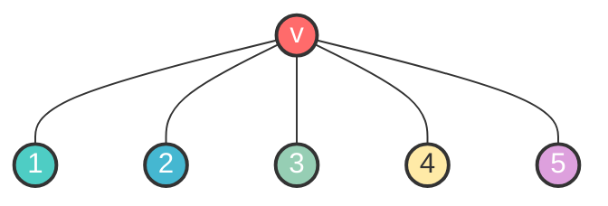

# 图染色算法

给出一些与图染色算法相关的话题

## Planar 5-coloring

首先，我们考虑证明并给出**平面图**的 5-着色方案

???+ success "Definition: Planar Graph"

    一个图被称为平面图，当且仅当它可以被画在欧氏平面 $\mathbb{R}^2$ 上，或者说，同构于某个平面上的平面嵌入

???+ warning "Check planar graph is NP-Hard"

    一个图是否为平面图的判断是 NP-Hard 问题
    
    Kuratowski’s Theorem 指出：一个图是平面图，当且仅当它不包含 $K_5$ 或 $K_{3,3}$ 的结构（可以对度数为 $2$ 的点进行缩点）
    
    该定理常用于快速的否定性证明

### Greedy 6-coloring

对于一个简单的平面图 $n \geq 3$，根据欧拉定理（$n-m+f=2$），$m \leq 3n-6$ （一个图不会很稠密）

因此它的平均度 $\dfrac{1}{n}\sum_{v\in V} deg(v) = \dfrac{2m}{n} < 6$

任意顶点的度一定不超过 5，我们可以给出一个贪心思路下的 6-染色方案

???+ success "Algorithm: Greedy 6-coloring"

    找到任意一个顶点度不超过 5 的点 $v$，递归处理 $G-v$ 这张图
    
    递归处理后，将 $v$ 染色为它的至多五个邻居以外的颜色

### Kempe Chain

现在考虑一个度数为 5 的点 $v$，在基于贪心的 6-coloring 构造过程中，可能会出现 5-coloring 的最小反例：$v$ 的五个邻居分别用了五种不同的颜色，使得 $v$ 需要用第六种颜色染色

我们希望这五个邻居总有至少两个顶点可以使用同一种颜色，使得 $v$ 不需要额外的第六种颜色。换句话说，我们希望进行重染色，使得可以省出一个颜色

我们考虑 a-b 交替子图，并给出 Kempe 链的定义

???+ success "Definition: Kempe Chain"

    只考虑 6-染色方案下的某两种颜色 ${a, b}$，提取出 $G$ 的所有染色为 $a, b$ 的顶点对应的诱导子图记为 $G[a, b]$，则 $a, b$ 在图上游走时一定是交替出现的
    
    **我们记 $G[a,b]$ 的任意连通分量为 Kempe 链**

现在我们回到最小反例，容易得到这是唯一的

我们考虑两个不相邻邻居（比如 $v_1, v_3$），尝试将这两种颜色统一为一种颜色，从而消除反例。我们考虑 $v_1, v_3$ 对应的交替子图：

- Case A: $v_1$ 和 $v_3$ 不在一条 Kempe 链上

     - 这意味着可以直接通过将某一条 Kempe 链上的两种颜色互换，使得 $v_1, v_3$ 同色的同时不会产生冲突

- Case B: $v_1$ 和 $v_3$ 在一条 Kempe 链上

     - 此时无法对这一条 Kempe 链转化，注意到 $v_1, v_3$ 的中间邻居 $v_2$，我们继续考虑 $v_2, v_4$ 对应的交替子图：

          - Case B1: $v_2$ 和 $v_4$ 不在一条 Kempe 链上

               - 同 Case A，反例可消除

          - Case B2: $v_2$ 和 $v_4$ 在一条 Kempe 链上

               - 这意味着 $v_1 \sim v_3$，$v_2\sim v_{4}$ 是两条链，这两条链在平面图上必定交叉，映射到平面上是不可能的（在平面上不可能出现两个环的交叉，而平面图也满足对应同构约束）

以上，反例一定可以被消除，我们得到了 5-coloring 的正确性

 

## Brooks' Therorem

现在将结论扩展到一般的简单连通图，容易得到：对于最大度为 $\Delta$ 的简单连通图 $G$，使用类似的贪心算法可以得到 $\Delta + 1$ 染色方案

那么，在什么时候我们可以再省出一种颜色，得到 $\Delta$ 为上界的染色方案呢？

???+ success "Theorem: Brooks' Theorem"

    一个最大度为 $\Delta$ 的简单连通图 $G$，它的染色上界 $χ(G) \leq \Delta(G)$，当且仅当：
    
    - $G$ 不是完全图 $K_{\Delta+1}$
    
    - $G$ 不是奇环 $C_{2k+1}$

我们给出完全的证明：

> 课上的证明思路是完全的分类讨论，借助 block-cut tree 等工具进行证明

● Low_degree-Case: $\Delta \leq 2$

此时图要么是路径，要么是环。其中不考虑奇环

- 对于路径，一定可以 2-coloring 交替染色（只有完全图 $K_{2}$ 的情况不满足，即只存在一条边）

- 对于偶环，一定可以 2-coloring 交替染色（奇数环 $C_{2k+1}$ 的情况不满足）

因此 Brooks' Therorem 对小的规模图成立，我们向上归纳：

---

● Easier-Case: $\exists v\in G, d(v) < \Delta$

约定 $\Delta \geq 3$

此时 $G$ 不是正则图。我们删除 $v$，此时 $\Delta(G-v) \leq \Delta(G)$，对 $G-v$ 作上述归纳，最终归纳到 Low_degree-Case 可以完成 $\Delta$ 染色

现在我们将这个点加回去，因为 $d(v)< \Delta$，所以 $v$ 的邻居最多使用 $\Delta -1$ 种颜色，让 $v$ 染色为未被使用的颜色即可

此时 $\chi(G) \leq \Delta$

---

● Harder-Case: $\forall v\in G, d(v) = \Delta$

约定 $\Delta \geq 3$

此时 $G$ 是 $\Delta$-正则图，我们假设它不是完全图

此时总可以取得两个不相邻顶点 $v_0, v_k$，取最短路径 $v_0, v_1, \cdots, v_k$

路径上 $v_1$ 有两个不相邻的邻居 $v_0,v_2$，现在删除 $v_1$，根据归纳假设，$G-v_1$ 可以 $\Delta$ 染色

现在要将 $v_1$ 加回去，我们记 $v_0, v_2$ 的颜色为 $a, b$。容易得到 $a=b$ 时，另一个剩余的颜色可以给 $v_1$ 使用，完成 $\Delta$ 染色

如果 $a\ne b$ 呢（我们并不知道这一情况是否存在）？我们考虑诱导子图 $G[a,b]$：

- 若 $v_0, v_2$ 不在一条 Kempe 链上

     - 这意味着可以直接通过将某一条 Kempe 链上的两种颜色互换，使得 $v_0, v_2$ 同色的同时不会产生冲突。将 $v_1$ 染色为剩下的颜色可完成 $\Delta$ 染色

- 若 $v_0, v_2$ 在一条 Kempe 链上

     - 那么可以找到一条 Kempe 链，起点是 $v_0$，终点是 $v_2$，并且这条链加上共同邻居 $v_1$ 可以合成一个环

     - 同时，由于 $G$ 是正则图，每个顶点的 $\Delta$ 个邻居必须覆盖所有用于阻塞的颜色，否则交换颜色导出矛盾

     - 因此这条 Kempe 链包含了除了 $v_1$ 以外的所有点，这意味着每个顶点只有两个邻居，所有顶点度数为 $2$，也就是说，此时图是一个环，$\Delta = 2$

     - 出现矛盾，因此上述情况 $a \ne b$ 不会发生

因此我们证明了 Brooks 定理

 

边染色问题参考 [图的着色 - OI Wiki](https://oi-wiki.org/graph/color/#%E8%BE%B9%E7%9D%80%E8%89%B2)，没有记笔记
