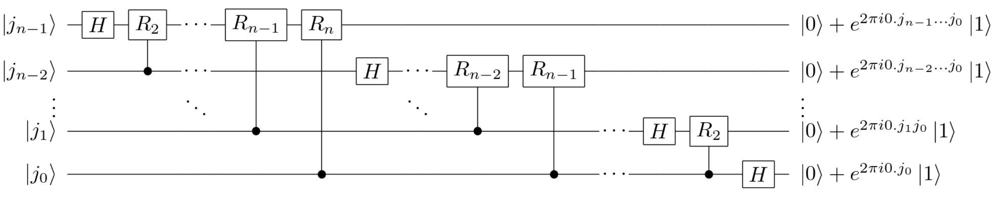

# 量子计算导论

经典计算机上 1bit = 0 or 1

离子计算机上的一个 bit（称之为 qubit），被形容为一个叠加态（superposition）

$$
|\phi \rangle = \alpha |0 \rangle + \beta |1 \rangle
$$

> $|\cdot \rangle$ 为右矢（Ket），代表一个量子态，数学表示为 $\mathcal{H}$ 的一个列向量；$\langle \cdot |$ 为左矢（Bra），为右矢的共轭转置 $\ast$，数学表示为 $\mathcal{H}$ 的一个行向量
>
> 比如薛定谔的猫的状态是
>
> $$
> \dfrac{|live \rangle + |death \rangle}{\sqrt{2}}
> $$
>
> 换句话说，$\dfrac{1}{\sqrt{2}} (0, 1)^{T}$

## 希尔伯特空间

一个量子系统被描述为希尔伯特空间 $\mathcal{H}$，后者是一个向量空间 + 复数域内积（内积的运算结果是一个复数），即度量空间。

首先 $\mathcal{H}$ 是向量空间：满足一些较为显然的线性代数性质（略），并且对于复数域的内积，我们用 $(|u\rangle, |v\rangle)$ 表示内积，并简写为 $\langle u | v\rangle$

如果

$$
|u\rangle = \sum_{j=0}^{d-1} u_j |j\rangle, \quad |v\rangle = \sum_{j=0}^{d-1} v_j |j\rangle
$$

那么内积为：

$$
\langle u | v \rangle = \sum_{j=0}^{d-1} u_j^* v_j
$$

它满足

- 共轭对称性：$(|u\rangle, |v\rangle) = (|v\rangle, |u\rangle)^\ast$

- 线性性：$(|w\rangle,\alpha|u\rangle+\beta|v\rangle) = \alpha(|w\rangle, |u\rangle) + \beta(|w\rangle, |v\rangle)$

     - 注意**线性体现在第二项**；对于第一项，它是共轭线性的

- 非负性：$(|u\rangle, |v\rangle) \geq 0$

其次它是可度量的：距离 $d(|u\rangle, |v\rangle)$ 满足非负性、正性、对称性、三角不等式，使用欧几里得范数

$$
d(|u\rangle, |v\rangle) = \| |u\rangle - |v\rangle\|_{2}
$$

最后它是完备的：空间中的所有柯西序列都会收敛到空间内的某个元素

---

Hilbert 空间也有基空间，我们称下面的集合为一个标准正交基（特称为计算基）

$$
\{ |0\rangle, |1\rangle, \cdots, |n-1\rangle \}
$$

## 算符

现在考虑量子门，它是量子计算中用于操作一个或多个量子比特的基本量子线路单元，通过酉矩阵表示

我们考虑线性算符 $A$，它是 $\mathcal{H} \to \mathcal{H}$ 的，满足线性性

$$
A(α|u⟩+β|v⟩)=αA|u⟩+βA|v⟩
$$

（算符作用在态的线性组合上，等于分别作用后再线性组合）

算符 $A$ 在计算基下的矩阵元 $a_{jk}$​ 由下式定义

$$
A|k\rangle = \sum_{j=0}^{d-1} a_{jk} |j\rangle
$$

我们记 $\dagger$ 为共轭转置（厄米共轭），把一个矩阵或算符先转置，再对每个元素取复共轭

$$
(A^\dagger)_{ij} = A_{ji}^\ast
$$

对于一个算符 $U$，如果

$$
U^†U=UU^†=I
$$

则这个算符为酉算符。在有限维空间中，算符都是酉算符（量子门都是酉算符）

---

一个算符 $A$ 如果满足 $A^†A=AA^†$，则它是正规的

对任意正规算子 $A \in \mathbb{C}^{d\times d}$（即 $A^\dagger A = A A^\dagger$），存在一组标准正交基 $\{|u_j\rangle\}$ 和复数 $\lambda_j$，使得

$$
A = \sum_{j=0}^{d-1} \lambda_j |u_j\rangle\langle u_j|
$$

即正规算子可酉对角化（谱分解）

---

两个 Hilbert 空间如何交互？使用张量积（Tensor Product）：

$$
V \otimes W := \text{span}\{ |v\rangle \otimes |w\rangle : |v\rangle\in V,\ |w\rangle\in W \}
$$

简记 $|v⟩⊗|w⟩=|v⟩|w⟩=|v,w⟩$

简单来说，复合系统的基就是所有配对，这使得我们可以描述复合系统的状态，我们把两个系统的所有可能组合都作为新空间的基

它满足双线性条件（形式上类似于分配律）

## 量子力学

量子力学的数学骨架包括四个基本公设：

### 态空间（State Space）

> 一个孤立物理系统的状态，由希尔伯特空间中的一个单位矢量完全描述

我们使用 $|\psi\rangle$ 完全描述，满足 $\langle \psi, \psi \rangle =1$

### 演化（Evolution）

> 封闭量子系统的时间演化由酉算子描述

若系统在 $t_1$ 时刻状态为 $|ψ_1⟩$，则在 $t_2$ 时刻

$$
|\psi_2\rangle = U |\psi_1\rangle, \quad U^\dagger U = U U^\dagger = I
$$

满足概率守恒

$$
\langle \psi_2|\psi_2\rangle = \langle \psi_1|\psi_1\rangle
$$

连续时间演化由薛定谔方程给出

$$
i\hbar \frac{d}{dt}|\psi(t)\rangle = H |\psi(t)\rangle
$$

### 测量（Measurement）

> 量子测量由一组测量算子 $\{M_m\}$ 描述，满足完备性条件 $\sum_m M_m^\dagger M_m = I$

- 对状态 $|\psi\rangle$ 进行测量，得到结果 $m$ 的概率：

$$
p(m) = \langle \psi | M_m^\dagger M_m | \psi \rangle = \| M_m |\psi\rangle \|^2
$$

- 测量后系统的状态（波函数坍缩）：

$$
|\psi_m\rangle = \frac{M_m |\psi\rangle}{\sqrt{p(m)}}
$$

### 复合系统（Composite Systems）

> 复合量子系统的态空间，是其子系统态空间的张量积

- 若系统由 $A$ 和 $B$ 组成，则

$$
\mathcal{H}_{AB} = \mathcal{H}_A \otimes \mathcal{H}_B
$$

- 若 $A$ 处于 $|\psi_A\rangle$，$B$ 处于 $|\psi_B\rangle$，则复合系统状态为：

$$
|\psi_{AB}\rangle = |\psi_A\rangle \otimes |\psi_B\rangle
$$

- 若不能写成上述张量积形式，则称为纠缠态（entangled state）

## 量子门

量子门是酉算符，作用在 qubit 上，$n$ 个量子比特的门维度为 $2^{n}\times 2^n$

四个最基本的单量子比特门统称为泡利门：

- Identity 门

$$
I = \begin{bmatrix} 1 & 0 \\ 0 & 1 \end{bmatrix} = |0\rangle\langle 0| + |1\rangle\langle 1|
$$

作用是保持量子态不变

$$
I|\psi\rangle = |\psi\rangle
$$

- Pauli-X 门

$$
X = \begin{bmatrix} 0 & 1 \\ 1 & 0 \end{bmatrix} = |0\rangle\langle 1| + |1\rangle\langle 0|
$$

作用是翻转量子比特

$$
X|0\rangle = |1\rangle, \quad X|1\rangle = |0\rangle
$$

- Pauli-Y 门

$$
Y = \begin{bmatrix} 0 & -i \\ i & 0 \end{bmatrix} = -i|0\rangle\langle 1| + i|1\rangle\langle 0|
$$

作用是翻转并引入相位

$$
Y|0\rangle = i|1\rangle, \quad Y|1\rangle = -i|0\rangle
$$

- Pauli-Z 门

$$
Z = \begin{bmatrix} 1 & 0 \\ 0 & -1 \end{bmatrix} = |0\rangle\langle 0| - |1\rangle\langle 1|
$$

作用是保持 $|0\rangle$ 不变，给 $ |1\rangle $ 加一个负号（相位 $ \pi $）

$$
Z|0\rangle = |0\rangle, \quad Z|1\rangle = -|1\rangle
$$

- Hadamard 门

$$
H = \dfrac{1}{\sqrt{2}} \begin{bmatrix} 1 & 1 \\ 1 & -1 \end{bmatrix}
$$

满足 $H |0\rangle = |+\rangle,\quad H|1\rangle = |-\rangle$（根据 $H$ 的自逆性，反过来写也对）

其中

$$
|±\rangle =\dfrac{|0\rangle ± |1\rangle}{\sqrt{2}}
$$

以上，我们给出量子电路，它由以下四个核心部分组成：

- qubit

- 量子门

- 测量：将量子比特投影到经典 bit 状态

- 经典 bit：存储测量结果

类似于经典布尔电路，但是在量子态上进行，并通过测量进行经典 bit 转化

## 量子算法

给出一些量子算法

### 量子傅里叶变换

类似离散傅里叶变换：

$$
\text{QFT}: |j\rangle \;\mapsto\; \frac{1}{\sqrt{N}} \sum_{k=0}^{N-1} e^{i2\pi jk/N} |k\rangle
$$

其中 $N$ 是 $\mathcal{H}$ 的维度

QFT 的矩阵元素为

$$
F_{k j} = \frac{1}{\sqrt{N}} \omega^{jk}, \quad \omega = e^{i2\pi/N}
$$

比如，QFT 在单量子比特上退化为 Hadamard 门

量子傅里叶变换可以转化为对每一个 qubit 的级联操作，这意味着可以使用基本的量子电路构建出 QFT 的量子电路，具体的证明过程略

$$
|j_{n-1} \dots j_1 j_0\rangle \mapsto \frac{1}{2^{n/2}} \bigotimes_{\ell=0}^{n-1} \left( |0\rangle + e^{i2\pi 0.j_{n-\ell-1}\dots j_1 j_0} |1\rangle \right)
$$

### 量子相位估计

给定可以对一个酉算子 $U$ 进行查询访问，并且已知 $U$ 的一个本征态 $|u\rangle$ 满足 $A|u⟩=λ|u⟩$，且满足本征方程 $U|u\rangle = e^{i2\pi\varphi}|u\rangle$。目标是在加性误差 $\varepsilon$ 的范围内估算出相位 $\varphi$

第一步是对相位信息进行编码

$$
\frac{1}{2^{n/2}} \sum_{k=0}^{2^n-1} |k\rangle U^k|u\rangle = \frac{1}{2^{n/2}} \sum_{k=0}^{2^n-1} e^{i2\pi k\varphi} |k\rangle |u\rangle
$$

注意到右式和 QFT 格式类似，这意味着采用逆 QFT 就可以求出 $\varphi$

### 量子计算求阶

给定两个互质的正整数 $x$ 和 $N$（即 $\gcd(x,N)=1$），要找到一个最小的正整数 $r$，使得 $x^r≡1 \pmod N$

常规计算下的算法是指数级的，现在给出量子计算机下的一种算法

定义 $U|y⟩=|xy \bmod N⟩$（当 $0≤y<N$ 时，否则值不变），注意到 $U$ 算符具有周期性

我们找到 $U$ 的特征态（对应线性代数的特征向量）

$$
|u_s\rangle = \frac{1}{\sqrt{r}} \sum_{k=0}^{r-1} e^{-i2\pi sk/r} |x^k \bmod N\rangle
$$

这是一组所有可能状态的量子叠加态 + 相位因子，进一步的，结合上述量子相位估计的内容，可以使用 QFT 求解

在量子相位估计算法中，如果我们能让量子系统处于 $|u_s⟩$ 叠加态，并运行 $U$ 算符，就可以测量出特征值 $e^{i2πs/r}$ 里面的相位 $s/r$，通过连分数算法提取 $r$

### 量子质因数分解

给定可分解的 $N\geq 4$，找出所有的质因数

我们先用经典计算机算法，计算 $N$ 为奇数 / $N=a^b$ / 随机找一个 $x$ 求 $\gcd(x,N)$ 判断是否互质的结果

否则，我们找出 $x$ 与 $N$ 互质，使用量子求解算法找出最小的正整数 $r$，使得 $x^r≡1 \pmod N$

量子计算求出 $r$ 后，利用数论知识从 $r$ 提取因数

以上即 Shor 算法

### 量子搜索

给定输入 $|x\rangle$，由 $n$ 个量子 bit 组成（可能性 $N=2^n$ 种），输出 $f(x)=0 \text{ or } 1$

只有少数 $x$ 使得 $f(x)=1$，这是我们需要寻找的正确答案

给定一个神谕机 $U: |x \rangle |y \rangle ↦ |x \rangle |y\oplus f(x) \rangle$，如果猜测 $x$ 正确，会将辅助位 $|y \rangle$ 翻转，否则不变

经典计算机模型下，每个 $x$ 都需要被尝试

在量子计算机模型下，我们定义 Grover 算子

$$
G = ((2|\psi\rangle\langle\psi| - I) \otimes I)U
$$

重复操作 $\sqrt{N}$ 次后，目标答案的概率振幅达到最大，此时测量量子 bit 就能以极高的概率读取到 $x$

 

量子图灵机没坚持住
