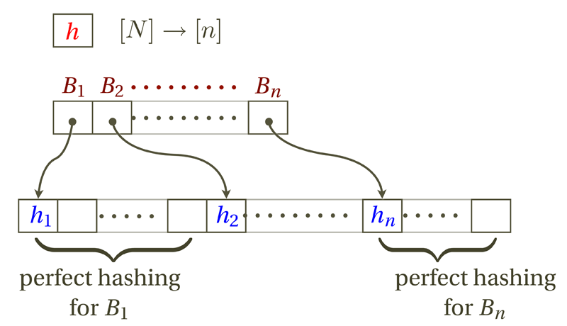

# 现代哈希表设计

考虑 set 数据结构，在全集 $U=[N]$ 中，所有可能的元素为 $N$ 个。给定集合 $S$ 大小为 $n$，需要查询输入 $x$ 是否在 $S$ 中

考虑熵 $\log \binom{N}{n} = O(n\log N)$，也就是说，要想存储 $n$ 个数据，最少需要 $n\log N$ 级别的比特，这和普通存储差不多，说明普通的存储方式已经接近下界

此外我们还需要访问速度（因为读取很慢）。一个好的数据结构的设计目标就是用更少的内存访问完成查询

## Perfect Hashing

完美哈希的关键特征在于“无冲突性”，保证每个元素的哈希不同

在简单均匀哈希假设的前提下，随机选择哈希函数 $h$，对于当前集合 $S$，没有任何冲突的概率为

$$
P(perfect) \approx e^{-n^2/2m}
$$

推导这一结论需要引入生日悖论

???+ success "Definition: Birthday Paradox"

    这一悖论属于“数学正确，违反直觉”类型的。比如：在一个超过 57 人的集合内，两个人的生日在同一天的概率超过 $99\%$（只考虑非闰年）
    
    我们假设生日均匀独立分布，不妨计算 $n$ 个人在 $m$ 天范围内，生日各不相同的概率：
    
    $$
     \text{Pr}[\mathscr{E}] = \frac{\left| [n] \xrightarrow{1-1} [m] \right|}{\left| [n] \rightarrow [m] \right|} = \frac{m(m-1)...(m-n+1)}{m^n} 
    $$
    
    这个值的下降速度非常快

也就是说：完美哈希（无碰撞）的概率 = $\dfrac{m(m-1)...(m-n+1)}{m^n}$

取对数后用 $\ln (1-x) \approx -x$ 放缩，可以得到刚刚提到的结论

## Universal Hashing

现实中的哈希函数很难做到完美随机，但我们可以构建一组哈希函数，让它们从统计上拥有极强的随机性

考虑普通 k-全域哈希：

- 对于任意 $≤k$ 个不同的输入元素，它们的哈希全部相同的概率为 $\dfrac{1}{m^{k-1}}$

如果哈希族 $\mathscr{H}$ 具有该性质，则保证普通哈希表（用拉链法处理冲突）能在 $O(1)$ 的期望时间内运行

进一步的，给出强 k-全域哈希：

- 对于任意 $≤k$ 个不同的输入元素，以及任意指定的哈希值 $\in [m]$，所有元素被精确映射到指定目标的概率为 $\dfrac{1}{m^k}$

这是完美哈希的基础，它的构造难度也很大

### Linear Congruential Hashing

我们希望将 $U \to [m]$，选取足够大的质数 $p > |U|$，在 $\mathbb{Z}_p$ 中进行计算，然后采用公式：

$$
h_{a,b}(x) = ((ax+b)\bmod p) \bmod m
$$

依次对 $p$ 和 $m$ 取模，进一步的，哈希函数族 $\mathscr{H}$ 的组成

$$
\mathscr{H} = \{ h_{a,b} \mid a \in \mathbb{Z}_p \setminus \{0\}, b \in \mathbb{Z}_p  \}
$$

可以证明它是强 2-全域哈希

然而，计算 $\% p$ 很麻烦，寻找 $p$ 可能也很麻烦，因此我们改为使用有限域 $GF(2^w),GF(2^l)$，其中 $GF(2^w)$ 表示 $w$ 位二进制的空间，$vGF(2^l)$ 表示目标空间

给出哈希公式：

$$
h_{a,b}(x) = (a*x+b) >> (w-l)
$$

这避免了除法和大质数的开销

---

为什么 2-全域哈希可以以高概率构建 Perfect Hashing？

我们记第 $i$ 个元素最终落在第 $j$ 个哈希桶中，$\sum_{i<j} I[X_i=X_j]$ 为碰撞次数 $Y$，有

$$
E[Y] = \sum_{i<j} P[X_i=X_j] \le \binom{n}{2} \cdot \frac{1}{m} = \frac{n(n-1)}{2m}
$$

根据**马尔可夫不等式**，对于一个非负随机变量 $Y$，它大于等于 $1$ 的概率，绝对不会超过它的平均值

可以得到这样的结论：哈希表的大小设计成元素数量的平方，从 2-全域哈希族里随机挑一个哈希函数，有一半以上的概率可以得到完美哈希

## FKS Perfect Hashing

如何在总空间复杂度为 $O(n)$ 的前提下，实现 $O(1)$ 的最坏情况查询？对于静态数据，我们给出 FKS Perfect H紧凑字典的目标是ashing

FKS 的核心思想是两级哈希

1. 首先，使用一个2-全域哈希函数 $h:[N] \to [n]$，将 $n$ 个元素映射到 $m$ 个桶中，其中 $m=n$

2. 对于每个桶 $B_i$，分别使用二级哈希函数 $h_i$，将 $b_i$​ 个键映射到 $b_i^2$​ 个槽中，可以证明出现冲突的概率小于 $1/2$

查询时，先计算 $i=h(key)$，再计算 $j=h_i(key)$，然后检查二级表第 $j$ 个槽是否含有 $key$

简单讲解一下空间线性性的证明，关键在于证明所有桶的二级表总空间与 $n$ 是线性相关的

1. 桶 $ i $ 内的冲突对数为 $ \binom{Y_i}{2} $。总冲突数 $ X $ 为所有桶内冲突数之和：

$$
X = \sum_{i=1}^n \binom{Y_i}{2} = \frac{1}{2} \left( \sum_{i=1}^n Y_i^2 - \sum_{i=1}^n Y_i \right) = \frac{1}{2} \left( \sum_{i=1}^n Y_i^2 - n \right)
$$

   因为 $ \sum_{i=1}^n Y_i = n $。由此得到：

$$
\sum_{i=1}^n Y_i^2 = 2X + n
$$

2. 由第一部分的结论，当 $ M = n $ 时，期望冲突数 $ \mathbf{E}[X] < n/2 $。
   因此，总空间的期望为：

$$
\mathbf{E}\left[\sum_{i=1}^n Y_i^2\right] = \mathbf{E}[2X + n] < 2 \cdot \frac{n}{2} + n = 2n
$$

3. 根据马尔可夫不等式，总空间 $ \sum_{i=1}^n Y_i^2 = O(n) $ 的概率是常数（至少为1/2）。这意味着我们可以通过期望常数次的随机尝试，找到第一层哈希函数 $ h $，使得总空间达到线性

这种方案非常适合**静态词典**场景，换句话说，FKS 完美哈希不支持动态数据（普通哈希表支持拉链法等动态插入）

## Succinct Dictionaries

经典的哈希表（拉链法等，也包括 FKS）需要存储大量的指针（Pointer）或者额外的桶等，开销通常为 $O(n \log n)$ 及以上

紧凑字典的目标是保持 $O(1)$ 的查询速度的前提下，让总空间逼近理论下界 $Z = n \log |U|$，换句话说，冗余空间为 $o(Z)$

---

第一种尝试基于 $O(\log^3 n)$ 的分桶，试图通过增大分桶的大小，来保证每个桶的负载不会太多

将 $n$ 个元素随机分配到 $n/\log^3 n$ 的分桶中，每个桶的平均负载 $\mu = \log^3 n$

根据 Chernoff 界，负载超过 $n' = (1+2/\log n) \log^3 n$ 的概率是 $n^{-2}$，因此当 $n$ 很大时，所有桶的负载几乎肯定（w.h.p.）都不会超过这个 $n'$

每个桶被视为一个小字典，其冗余开销（存储索引等元数据的额外空间）是 $n'\log n'$ 比特；总开销 = 桶数量 × 每个桶的开销，冗余满足 $o(Z)$

---

然而，虽然空间效率极高，但每个桶的大小是 $Θ(\log_3 n)$ 级别，使得维护这样的集合操作时间达不到常数级别（或者使用空间开销大的结构维护）

第二种尝试把桶变得更小，让桶的负载 $m = \log n / \log n\log n$

注意到桶过小会导致出现溢出，这一尝试的思想在于允许溢出，无需强调每个桶的均匀性。可以确定，溢出桶的个数大约只有 $n/\text{poly}\log n$ 个，特殊处理后，总空间依旧紧凑

如何维护每个小桶呢？使用前缀树 Trie，可以满足在 $O(n^{1/3})$ 预计算查表的前提下，以 $O(1)$ 时间完成查询，同时额外空间只需要 $O(\log n)$

> Trie 的节点数在 $m$ 的负载下足够小，使得可以进行二进制位串压缩，扁平化 Trie，从而实现整个树的拓扑结构为 $O(\log n)$ 级别

进一步的，我们使用压缩 Trie（将单链部分路径压缩为单节点），只保留分叉点和叶子。假设放进这个桶里的键是随机的位串，当我们插入一个新的键时，它从根节点往下走。如果走到叶子节点，发现它和叶子里现有的键不一样，它就会发生分裂

一次插入导致树生长 $k$ 次的概率服从几何分布，概率 $\leq 2^{-k}$（非常小）

如果把这个桶里所有的 $n'$ 个元素都插入一遍，总的生长次数服从负二项分布，可以计算：树生长了 $Ω(\log n)$ 次的概率为 $e^{-\Omega(\log n)}$

换句话说，只需要 $O(\log n)$ 的空间就能以极大概率存储这个二叉 Trie 树

## <del>Overflowing</del>

鸽了

## <del>Cuckoo</del>

咕了
