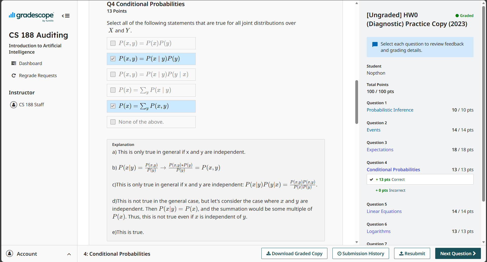

# Homework 0

课程前置基础题，不会写说明需要补基础课，还是写了

---

## Q1 Probabilistic Inference

已知有若干的盒子，中奖的盒子一定有响声，盒子有响声的概率为 $\dfrac{1}{100}$，盒子中奖的概率为 $\dfrac{1}{1000000}$，求有响声的盒子中奖的概率（答案格式为不保留小数点前的 0 的小数）

### Answer

记事件 $A$ 为中奖，事件 $B$ 为盒子有响声，$P(A) = \dfrac{1}{1000000}$，$P(B) = \dfrac{1}{100}$， $P(B|A) = 1$

则根据贝叶斯公式，$P(A|B) = \dfrac{P(A)P(B|A)}{P(B)} = .0001$

## Q2 Events

从 1~10 的卡牌中不放回抽三张牌，如果有一张是10，或者抽到的所有牌都是奇数，判定为获胜。求有多少种获胜的手牌组合（不同的顺序被视为不同的手牌），以及获胜概率（答案格式为不保留小数点前的 0 的三位小数，四舍五入）

### Answer

容易发现“抽到 10”和“抽到全奇数牌”是矛盾的，因此两种手牌组合不重合

抽到 10 的手牌组合数为 $C_{9}^{2}$，抽到全奇数牌的组合数为 $C_{5}^{3}$，因此获胜的手牌组合数 $C_{9}^{2}+C_{5}^{3} = 46$，排列数 $A_{3}^{3}(C_{9}^{2}+C_{5}^{3}) = 276$

总组合数 $C_{10}^{3}$，因此获胜概率 $\dfrac{C_{9}^{2}+C_{5}^{3}}{C_{10}^{3}} = \dfrac{23}{60}=.383$

## Q3 Expectations

掷骰子，单次得分 = 骰子点数，得分进行累加

求掷 1 次 / 2 次 / 100 次骰子后的得分期望值

### Answer

单次得分期望值 $E_1 = \dfrac{1+2+3+4+5+6}{6} = 3.5$

每次掷骰子独立同分布，掷 2 次骰子得分期望值 $E_2 = 2\times E_1 = 7$，掷 100 次骰子得分期望值 $E_2 = 100\times E_1 = 350$

## Q4 Conditional Probabilities

对于联合分布 $(X, Y)$，下列说法正确的有：

- A. $P(x, y)=P(x)P(y)$
- B. $P(x, y) = P(x|y)P(y)$
- C. $P(x, y) = P(x|y)P(y|x)$
- D. $P(x) = \sum_{y}P(x|y)$
- E. $P(x) = \sum_{y}P(x,y)$
- F. 以上皆非

### Answer

A 成立的额外（充要）条件是 $X,Y$ 独立，错误

B 正确，这是条件概率的定义

C 成立的额外（充要）条件也是 $X,Y$ 独立，错误

D 错误，参考 E

E 正确，这是边缘概率的定义

因此选 BE

## Q5 Linear Equations

已知

$$
\begin{cases}
x = \dfrac{1}{2}y + \dfrac{1}{2}(x+1)\\
y = \dfrac{1}{3}y + \dfrac{1}{3}(x+2)
\end{cases}
$$

求解 $x, y$

### Answer

瞪眼法可知 $\begin{cases}x =4\\y = 3\end{cases}$

## Q6 Logarithms

对于实数 $x,y$，下列说法正确的有：

- A. $2^{xy} = 2^{x}2^{y}$
- B. $2^{x+y} = 2^{x}2^{y}$
- C. $2^{x+y} = 2^{x}+2^{y}$
- D. $\log(3^x) = \log{3}\log(x)$
- E. $\log(3^x) = x\log{3}$
- F. $\log(3^x) = 3x$
- G. 以上皆非

### Answer

BE 正确

## Q7 Hashing

下列哪个操作，在哈希表中的实现比在链表中快：

- A. 将元素插入数据结构中
- B. 判断一个元素是否在该数据结构中

在哈希表中，这个操作的平均速度有多快？

- A. $O(1)$
- B. $O(n)$
- C. $O(\log{n})$
- D. $O(n^{2})$
- E. 以上皆非

在链表中，这个操作的平均速度有多快？

- A. $O(1)$
- B. $O(n)$
- C. $O(\log{n})$
- D. $O(n^{2})$
- E. 以上皆非

### Answer

B A B

哈希表查询平均复杂度 $O(1)$，链表查询平均复杂度 $O(n)$；对于插入操作，哈希表平均 $O(1)$，链表平均 $O(1)$（存在尾指针）

---

有个线上测评网站还挺方便

