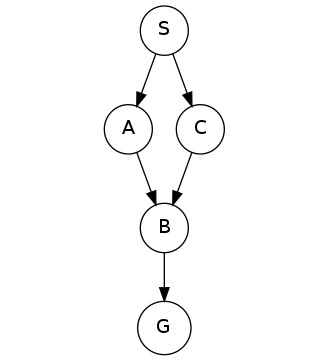
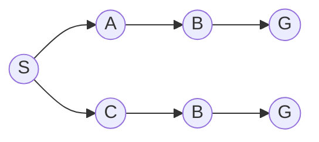
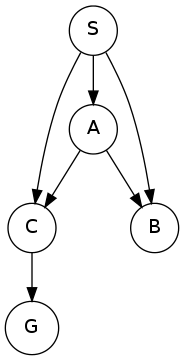
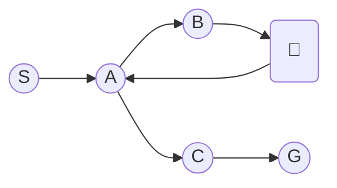
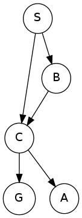
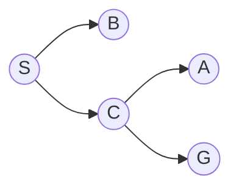
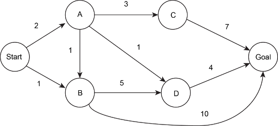
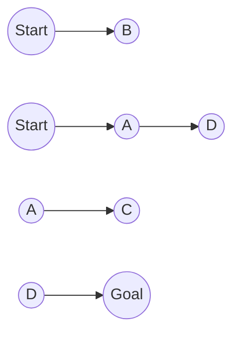
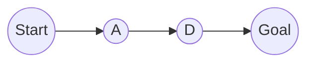
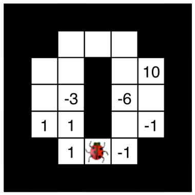

# Homework 1

Search 练习（其实是 Mermaid 使用练习），以后不会写这么详细了

从 HW 1 开始，所有的作业包含 Part A && Part B 两部分

Part A 可线上提交，Part B 不可线上提交，这里只会完成 Part A 的部分

---

## Q1 Search Trees

给出下面的状态搜索图，求完整搜索树的节点个数：

### Answer

总共两条路：

搜索树有 7 个节点

## Q2 Depth-First Graph Search

以 S 为起点，G 为终点，求 DFS 下寻得的路径（提交时不要包含箭头或空格）

从同一节点出发的所有节点，按照字母序进行 DFS

### Answer

SACG

搜索顺序

## Q3 Breadth-First Graph Search

以 S 为起点，G 为终点，求 BFS 下寻得的路径（提交时不要包含箭头或空格）

从同一节点出发的所有节点，按照字母序进行 BFS

### Answer

SCG

搜索顺序（从左到右，从上到下）

## Q4 Uniform-Cost Graph Search

以 S 为起点，G 为终点，进行 UCS 寻路

从同一节点出发的所有节点，按照字母序进行 UCS

给出扩展节点的顺序：

- A. Start, A, B, C, D, Goal
- B. Start, A, C, Goal
- C. Start, B, A, D, C, Goal
- D. Start, A, D, Goal
- E. Start, A, B, Goal
- F. Start, B, A, D, B, C, Goal

给出最终返回的路径：

- A. Start-A-C-Goal
- B. Start-B-Goal
- C. Start-A-D-Goal
- D. Start-A-B-Goal
- E. Start-A-B-D-Goal

### Answer

C C

搜索顺序（从上到下，从左到右）

最终得到

## Q5 Hive Minds: Jumping Bug

在 $M \times N$ 的矩形迷宫中，有一只瓢虫，每一步可直线向前移动任意距离，转向需要单独花费一步（多格移动和转向移动的成本都是 1 时间单位）。瓢虫如果向前移动 $x$ 格，则瓢虫向前 $x$ 格范围内都不能有阻挡

以下哪项是最小状态表示：

- A. 瓢虫的位置 $(x, y)$
- B. 瓢虫的位置 $(x, y)$ 以及朝向
- C. 瓢虫的位置 $(x, y)$ 以及一个记录从昆虫到目标的最优路径上所需的转向次数的整数
- D. 瓢虫的位置 $(x, y)$ 以及一个记录当前步数的整数

状态空间的大小是多少：

- A. $M\times N$
- B. $\max(M, N)$
- C. $\min(M, N)$
- D. $4(M\times N)$
- E. $(M\times N)^2$
- F. $(M\times N)^{4}$
- G. $4^{M\times N}$

### Answer

B D

状态转移只需要瓢虫的坐标与朝向即可

瓢虫坐标有 $M\times N$ 种状态，瓢虫有 $4$ 种朝向，因此状态空间大小 $4(M\times N)$

###Q6 Hive Minds: Time Limit

在 $M \times N$ 的矩形迷宫中，有一只瓢虫，在每个时间步，瓢虫必须移动到它**尚未访问的**相邻方格。瓢虫会根据方格中写下的数字得分或失分

给出最多行动 2 / 5 / 8 / 11 步下，瓢虫的最大得分

### Answer

最多行动 2 步，获得两次 +1，得分 2

最多行动 5 步，获得两次 -1 和一次 +10，得分 8

最多行动 8 步，获得两次 -1 和一次 +10，得分 8

最多行动 11 步，获得三次 +1 和一次 +10，得分 13
