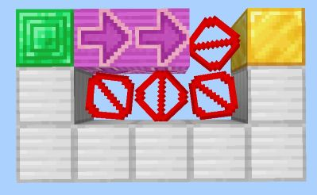
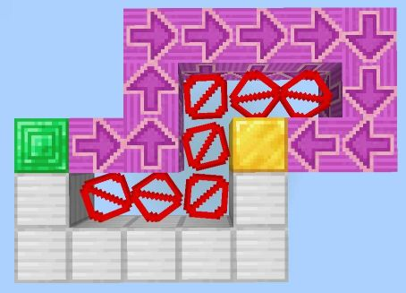

# Lecture 3. A* Search and Heuristics

对于 Uninformed Search，程序始终在所有方向上同等努力地探索，也就是说，不会因为某个分支路径更接近终点而优先探索该分支，这是因为搜索过程中并不会利用和目标状态有关的任何信息（比如终点坐标，除了判断是否到达终点），是“盲目”的

为了更高效地找到终点，我们需要引入“目标清晰”的搜索策略，这样的策略能够根据目标远近情况进行启发式的搜索

## Heuristics

启发式方法是一个函数 $h(n)$，估计从当前节点 $n$ 到最近目标节点的代价：简单来说，是接收一个状态作为输入，并输出相应估计值的函数。我们通常希望启发式函数是到目标剩余距离的下界，因此启发式通常是松弛问题（即原问题中的某些约束已被移除）的解

$h(n)$ 根据具体的问题情境设计，比如曼哈顿距离 $h(n) = |x-x_0| + |y-y_0|$，欧几里得距离 $h(n) = \sqrt{(x-x_0)^2 + (y-y_0)^2}$，利用这些距离作为启发式函数来估计路径规划情境下的代价

???+ question "如何理解“启发式通常是松弛问题”？"

    我们以走迷宫情境为例，采用曼哈顿距离作为 $h(n)$，发现它计算的是<u>假设迷宫中不存在墙壁的情况下</u>，从当前位置到目标位置的距离。这个距离就是松弛搜索问题中的精确目标距离，相应地，它也是实际搜索问题中估计的目标距离
    
    这个距离并不是实际上的目标距离（可能会被墙阻挡，从而增大实际距离的值），但是具有一定的“偏好”作用，让程序有偏向性地选择路线

借助启发式，我们引入 Greedy Search 和 A* Search 两种 Informed Search

##Informed Search

简单来说，Informed Search（启发式搜索）会根据基于当前问题情境构造的 $h(n)$ 进行节点扩展的选择，相比较盲目搜索，额外获得的 $h(n)$ 可以指示当前状态与目标的某种量化关联

### Greedy Search

贪婪搜索类似于 UCS，都使用优先队列来表示 fringe，区别在于 UCS 按照当前“代价越小”作为高优先级的标志，贪婪搜索按照当前“$h(n)$ 最小”作为高优先级的标志

考虑 $h(n)$ 是和目的状态的接近程度，边缘表示为优先队列，则 UCS 是基于“过去的代价”（后向代价）进行排序，贪婪搜索基于“未来的代价”（前向代价）进行排序

贪婪搜索不具有完备性和最优性，因为贪婪算法不会考虑后向代价，一旦走向离终点更近的思路就无法回头（除非借助 DFS 的思想允许回头），并且 $h(n)$ 只能提供松弛问题的最优数据，局部贪心策略本身不能达到最优

??? example "给出一对例子"

    完备性不成立（其实我也不知道这个例子对不对）
    
    
    
    最优性不成立
    
    
    
    截图自 Minecraft 1.21，因为我正在玩

注意到贪婪搜索的缺陷核心在于完全不考虑后向代价，因此我们结合 UCS 与贪婪搜索，得到下面的 A* Search

### A* Search

A* 搜索通过将 UCS 使用的总后向代价和贪婪搜索使用的估计前向代价相加得到新的估计代价

A* 的边缘表示也是一种优先队列，优先级选择的评估函数 $f(n) = g(n) + h(n)$，即：从起点到当前节点的实际代价 + 从当前节点到目标的估计代价 = 节点 $n$ 的估计总代价

A* 在 $h(n)$ 足够合适的情况下，满足完备性与最优性，这点之后再说

## Admissibility && Dominance

A* 一定具有完备性，这是因为 $f(n) = g(n) + h(n)$ 中包含 $g(n)$，后者（UCS）是完备的（即使 $h(n)$ 不满足可接受性条件）

我们用可接受性（Admissibility）来评估启发式函数是否满足最优性

用支配性（Dominance）来评估启发式函数是否“足够好”

> 比如 $h(n) = 1 - g(n)$，此时 $f(n) = 1$ 退化为 BFS
>
> 比如 $h(n) = 0$，此时 $f(n) = 1$ 退化为 UCS

我们定义可接受性条件：一个启发式函数 $h(n)$，对任意目标状态 $G$ 满足 $h(G) = 0$，且

$$
\forall n:0 \leq h(n) \leq h^{*}(n)
$$

- 其中 $h^{*}(n)$ 为真实（非松弛）最优成本

不难证明，如果 $h(n)$ 满足可接受性条件，那么 A* 总能找到最优解：A* 优先扩展具有最小的估算总成本的节点，也通常是离目标最近的节点，因为目标状态 $h(G)$ 最小，总路径一定最短。严格证明可以考虑反证法，构造最优目标和次优目标进行讨论

> $h(n) = 1 - g(n)$ 不满足可接受性条件，因此 BFS 不能保证找到最优解
>
> $h(n) = 0$ 满足可接受性条件，因此 UCS 保证找到最优解

我们定义支配性的衡量标准：如果启发式函数 $h_a$ 支配 $h_b$，则意味着在状态空间中的每个节点，$a$ 的估算目标距离总是比 $b$ 的估算距离更大或相等，即：

$$
\forall n:h_{a}(n) \geq h_{b}(n)
$$

这直观地表明一个启发式函数比另一个更好，因为它始终更精确地估算到目标的距离

UCS 相当于 $h(n) =  0$ 的 A* Search，我们定义 $h(n) =  0$ 为平凡启发式，所有的可接受启发式函数都支配平凡启发式

对于任何给定的搜索问题，生成多个可接受的启发式函数并取它们的最大值，通常会产生一个比它们各自单独使用时更好的启发式函数

## Graph Search

搜索时，陷入一个死循环；反复扩展同一个状态；多条路径可能到达同一个节点，会导致重复扩展节点，增加计算工作量。因此我们引出图搜索优化：记录已经被扩展过的节点，对于被扩展过的节点不再扩展（简单来说是一种剪枝）

通常采用一个集合（或者更常见的，`bool vis[SIZE]`）来维护已访问的节点集合，非常典型的优化
