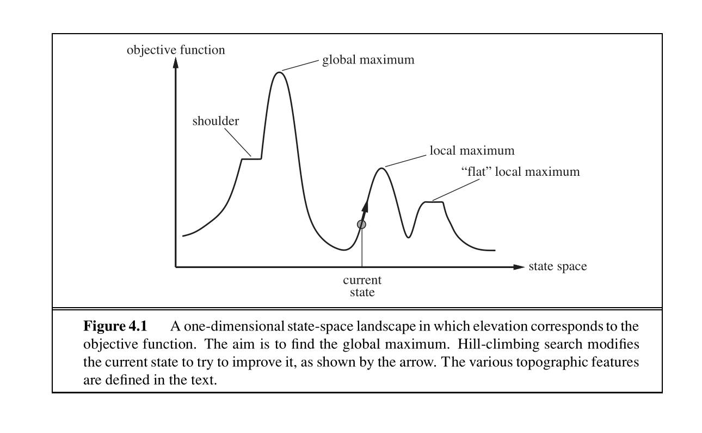
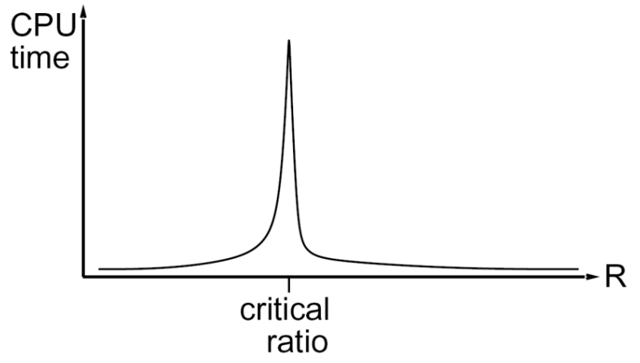
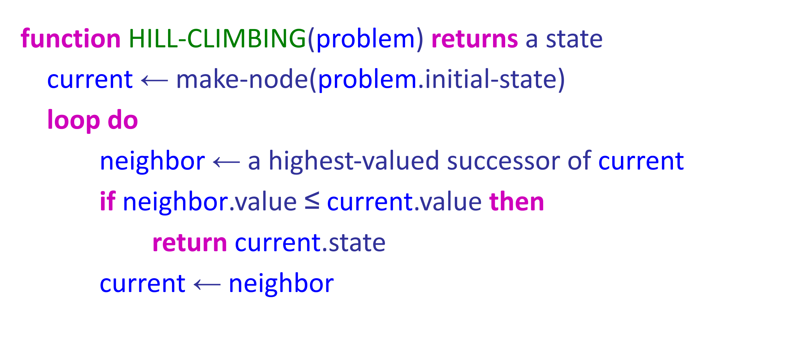
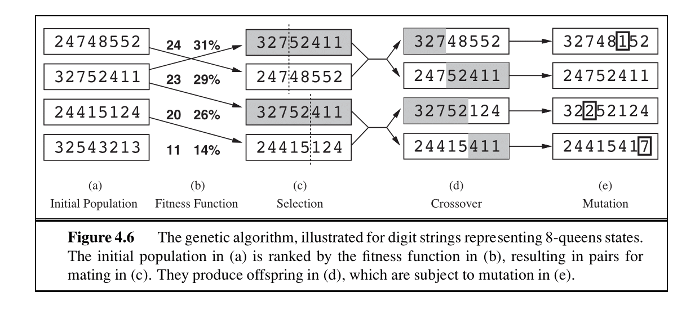
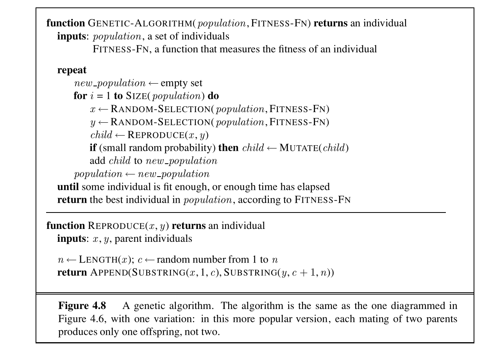

# Lecture 5. CSPs II

之前提到解决 CSP 问题的一种典型方法是回溯搜索，这里讲解另一种广泛使用的算法：**局部搜索（Local Search）**

## Local Search

局部搜索通过迭代改进实现——首先随机为变量赋值，然后反复选取随机冲突变量，将其重新赋值为违反约束最少的取值，直到不存在任何约束违反（这种策略称为最小冲突启发式）

这里给出状态空间景观图，其中横轴表示所有的状态，纵轴表示目标函数（局部搜索的目标是找到目标函数最大的状态）：

图中标记了算法在搜索最优解时会遇到的几种典型地形：

- 全局最大值（Global maximum）
- 局部最大值 （Local maximum），也就是次优解。局部搜索很可能会止步于这些次优解
- “平坦”局部最大值（"Flat" local maximum），也就是涉及状态范围更广的次优解，局部搜索可能会受到影响（详见爬山算法）
- 肩部（Shoulder），和平坦局部最大值相似

---

局部搜索既不完备也非最优解，但是对随机生成的 CSP 问题往往具有近乎常数时间的运行效率和高成功率，前提是问题的约束密度不在临界比率附近：

###Critical ratio

CSP 问题中的一个常见参数是 $R$，表示为变量数量与约束条件数量的比值，我们记为**约束密度**

局部搜索算法的用时可以描述为下面的图像：

当约束密度很小时，约束条件相对变量数量足够小，这说明解的数量更多，容易找出一个正确解；当约束密度过大时，约束条件相对变量数量足够大，导致算法能够更快发现约束矛盾，判断出无解

我们可以找出一个**临界比率（critical ratio）**，使得计算量达到最高

---

接下来，我们给出最典型的局部搜索算法，以及一些优化算法：

## Hill-Climbing Search

爬山搜索是非常朴素的局部搜索策略，它完全不维护搜索树，只关心当前状态及目标函数值。对于当前状态，该算法只选择附近上升幅度最高的邻居状态进行转移

算法实现如下

爬山搜索容易因为只发现局部最大值而失去最优解，因此其不具有最优性；同时在平台区（平坦局部最大值、肩部）无法进行有效的状态转移（附近找不到更优状态），因此也不具有完备性

爬山搜索的一种简单优化是，每次不会完全贪心选择附近上升幅度最高的邻居，而是在较高的邻居中随机选择，这样做的代价是迭代次数会变多

另一种保证完备性的方法是：多次随机选择起点并执行爬山搜索，属于力大砖飞很看脸的算法实现

### Simulated Annealing Search

和爬山算法的贪心思路不同，模拟退火搜索是随机游走和爬山搜索的结合，前者可以避免受限于局部最优解和平台区，后者可以尝试收敛到最优解，因此具有完备性，且理论具有最优性

具体地说，我们设定一个参数 $T$，这个值初始比较高。然后我们进行状态转移：

- 随机选择一个邻居
    - 如果邻居的目标函数值更大，直接接受
    - 否则有 $P = e^{\frac{\Delta E}{T}}$ 的概率接受，其中 $\Delta E$ 是状态转移前后目标函数的变化值，是一个负数
- $T$ 随着迭代次数增大逐渐降低
    - $T$ 较大时，$P$ 接近于 $1$，算法更接近随机游走
    - $T$ 较小时，$P$ 接近于 $0$，算法更接近爬山搜索
    - 把 $T$ 理解为 $\text{Temperture}$，降低 $T$ 的过程称之为退火（降温），温度越低算法的活跃度越低，对后继状态的选择更加谨慎

如果降温速度足够慢，模拟退火算法以 $P=1$ 收敛到全局最优解，但是为了实际运行效率，会加快降温速度，在短时间内得到较优解

??? quote "在这里丢一道模拟退火的模板题"

    [P4044 \[AHOI2014/JSOI2014\] 保龄球 - 洛谷](https://www.luogu.com.cn/problem/P4044)

### Genetic Algorithms

最后介绍一种基于生物遗传机制的算法（遗传算法）：

先从朴素的束搜索（Beam Search）开始介绍：常规的 BFS 搜索会保留所有可能的中间状态，导致待处理状态数巨大。束搜索指定一个参数 $k$，在 BFS 时只保留最好的 $k$ 个状态，确保候选解不唯一且普遍较优

束搜索让 $k$ 个较优状态分别进行后继搜索，互不影响；而遗传算法让这 $k$ 个较优状态之间存在交互。我们记这 $k$ 个随机初始化的状态为种群，并且以 8 皇后问题为具体的例子介绍：

- 我们记单个状态为长度为 8 的数字串，每个数字表示当前列皇后的位置。此处取 $k = 4$ 作为种群大小
- 定义一个适应度函数 $g(n)$ 与解好坏成正比：值为非冲突皇后对的个数

然后对该种群（$k$ 个 8 位数字串）进行遗传演化：

- 选择：对大小 $k$ 的种群进行 $k$ 次放回抽取，每个状态被抽中的概率正比于 $g(n)$ 的值。因此 $g(n)$ 低的状态更有可能被完全淘汰，而 $g(n)$ 高的状态可能会被多次抽取
- 交叉：随机选择交叉点，将状态数字串两两交叉，生成新的数字串
- 变异：随机挑选少数的数字进行随机数值的修改（以极低的概率对每个数位进行独立的变异判定）

得到的种群继续迭代进化，直到得到满足预设的目标适应度，或者迭代次数达到预设上限

该算法通过将多个较优状态进行交互，趋向于得到更优解

