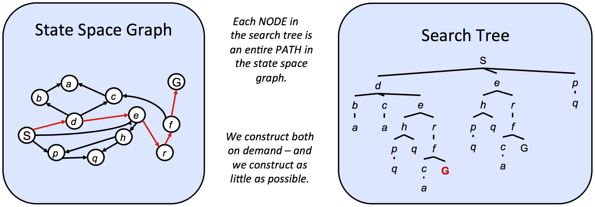

# Lecture 2. Uninformed Search

## State spaces && search problems

为了创建一个理性的规划智能体，我们需要一种方法来数学化地表达智能体所处的环境。为此，我们必须形式化地定义一个**搜索问题**：

> 给定智能体的当前**状态**（即它在环境中的配置），我们如何以最佳方式到达一个满足其目标的新状态？

一个搜索问题包含以下要素：

- **状态空间**：在特定情境中，所有可能状态的集合
- 每个状态下可用的**动作集合**
- **转移模型**：在当前状态执行特定动作后，输出下一个状态
- **动作代价**：在执行一个动作、从一个状态转移到另一个状态时产生的成本
- **起始状态**：智能体最初所处的状态
- **目标测试**：一个以状态为输入，并判断它是否为目标状态的函数

从起始状态到目标状态的一条可行路径被称为一个规划，通过某种预先确定的策略去安排对中间状态的考察顺序

---

状态空间的规模即所有可能状态的集合。状态空间模型应只包含对当前解决的问题所必要的变量，忽略无关细节，从而减小规模

为了描述状态转移，可以用状态空间图或搜索树去描述状态空间：

**状态空间图**以状态作为节点来构建，存在从某个状态到其子节点的**有向边**。边代表状态转移的操作，权重代表执行相应操作的成本。在状态空间图中，**每个状态只表示一次**（即一个节点）

状态空间图通常无法完全构建（过大）

**搜索树**对状态出现的次数没有限制，每个状态/节点不仅编码了状态本身，还编码了从状态空间图中的起始状态到给定状态的**整个路径**（因此不剪枝的搜索树往往比状态空间图更加庞大，对于存在环的状态空间图，对应的搜索树会是无限深的）

搜索树的底层结构是状态空间图，为了展示搜索路径会产生大量重复结构

即使是简单的问题，状态空间图本身也可能非常巨大，因此我们往往维护由搜索树衍生出的部分规划集合，用某种策略扩展该集合，在不遍历整棵搜索树的情况下得到可行路线

## Search

找到从起始状态到目标状态规划的标准流程是维护一个由搜索树衍生的**边缘**（**fringe**，待扩展的部分规划集合）。我们通过<u>从边缘移除一个节点，并用它的所有子节点替换它</u>来持续扩展边缘

搜索的核心流程是：初始化 -> 选择边缘节点扩展 -> 检查目标，进行上述重复过程直到搜索结束。搜索的核心问题是采取什么策略选择下一个要扩展的节点，这对应不同的搜索算法

由此我们先引出**盲目搜索（Uninformed Search）**，也可以理解为“无信息搜索算法”

---

## Uninformed Search

在搜索过程中，除了问题本身的定义之外，没有提供任何额外的信息。算法不知道哪个节点离目标更近，只能按照预先定好的策略机械地探索（简单来说：在抵达目标状态之前，程序始终不知道当前状态与终点状态的远近）

盲目搜索包含下面的属性：

- 搜索策略的完备性（是否能保证找到有效解）
- 搜索策略的最优性（是否能找到最优解）
- 分支因子 $b$（每次“从边缘移除一个节点，并用它的所有子节点替换它”时，边缘节点数量增加的数量级为 $O(b)$；对于搜索树的深度 $k$，存在 $O(b^k)$ 个节点）
- 最大深度 $m$
- 最浅解的深度 $s$

### Examples

简单给出一些盲目搜索的例子：

- 深度优先搜索 DFS：可以简单理解为“始终贴着左墙壁走迷宫”，其边缘表示为“移除最深节点并用其子节点替换它”，使用 LIFO 的栈作为边缘
    - DFS 不具有完备性，对于环路，DFS 搜索树的 $m$ 将达到无限
    - DFS 不具有最优性，因为其边缘表示没有考虑路径成本
    - DFS 的最坏情况是探索整棵搜索树，对应时间复杂度为 $O(b^m)$；根据“移除最深节点”的策略，最坏空间复杂度为 $O(bm)$
- 广度优先搜索 BFS：可以简单理解为“一圈圈扩展路线”，其边缘表示为“移除离起点最近节点并用其子节点替换它”，使用 FIFO 的队列作为边缘
    - BFS 具有完备性，只要 $b$ 有限，则 BFS 一定能找到解
    - BFS 保证找到最浅解（搜索树上边数最少的路径），在每一步的路径成本相同时具有最优性
    - BFS 的最坏情况是探索整棵搜索树，对应时间复杂度为 $O(b^m)$；同理最坏情况下解的深度 $d = m$，最坏空间复杂度 $O(b^d)$

---

- 迭代深入搜索 IDS：BFS 与 DFS 的结合，对深度大小 BFS，依次进行深度限制为 $1, 2, ..., d_{\max}$ 的 DFS，结合 DFS 的空间优势和 BFS 的时间优势，队列和栈都使用
    - IDS 具有完备性，因为 IDS 在 DFS 的基础上有深度限制，不会因为环路无限搜索
    - IDS 的最优性情况和 BFS 的情况完全相同，找到的一定是最浅解（但不一定是最优解）
    - IDS 的最坏情况和 DFS 的情况相似（因为每轮搜索本质上执行的是 DFS），最坏情况是探索整棵搜索树，对应时间复杂度为 $O(b^m)$；最坏空间复杂度为 $O(bd_{\max})$，其中 $d_{\max}$ 是最浅解深度

---

- 代价一致搜索 UCS：类似于 Dijkstra 策略的搜索，其边缘表示为 “移除累计代价最小的节点，并用其子节点替换”，使用代价大小的优先队列作为边缘
    - UCS 具有完备性，前提是所有边代价为正（比 Dijkstra 更严格，后者可出现 0 代价边）
    - UCS 具有最优性，因为其进行代价最小扩展
    - UCS 的最坏时间复杂度与空间复杂度都是 $O(b^{C^{\ast}/ϵ})$，具体地说：
        - 我们记最优解代价 $C^{\ast}$，每条边的最小代价为 $ϵ$，算法在最坏情况下，搜索树的最大深度大致为 $C^{\ast}/ϵ$，因此扩展的节点个数的数量级为 $O(b^{C^{\ast}/ϵ})$，对应时空复杂度
        - 考虑图中存在大量接近 $ϵ$ 的小代价边，而 $C^{\ast}$ 较大；存在许多总代价接近 $C^{\ast}$ 的错误分支路径；分支因子 $b$ 极大
        - UCS 算法会缓慢向外扩散，在到达目标前遍历几乎所有的节点，包括所有的近似最低代价的错误分支路径，再加上路径本身分支众多，因此会造成几乎遍历整个搜索树，这就是最坏情况

### Fringe

本质上，DFS、BFS、UCS 是同一类型的算法，通过维护边缘进行扩展边的选择，对边缘节点集合采取不同的排序策略

> Conceptually, all fringes are priority queues

边缘本质上是一个优先队列，每个节点都有优先级，分别以“越晚加入” / “越早加入” / “代价越小” 作为高优先级的标志

